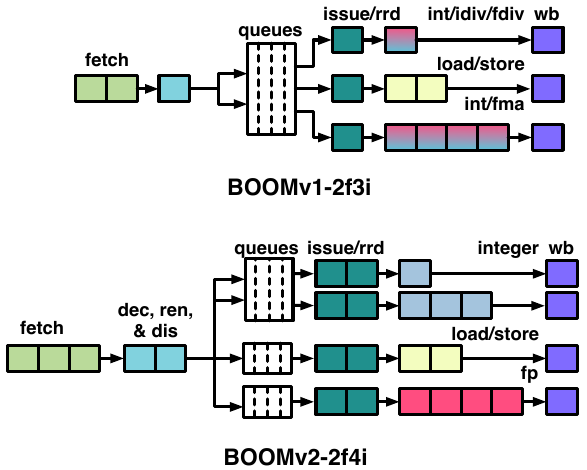
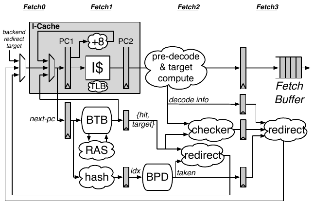

# Abstract

BOOMv2：超标量（同一周期执行多条指令）以及乱序（根据指令之间数据依赖关系，不严格的依照程序顺序执行指令）处理器。受MIPS R10K以及Alpha 21264的启发而设计。

相比BOOM的改进：

- 更大的组相联（4路）BTB（Branch Target Buffer）
- 流水线化寄存器重命名阶段（register rename stage）
- 将浮点数寄存器以及整数寄存器分离
- 浮点数运算专用的流水线
- 将浮点数、整数以及存储器微操作使用的发射窗口（issue windows）分离
- 将发射选择（issue-select）以及寄存器读取（register read）作为单独的两个阶段

数据通路长度：综合（synthesis）后37 FO4，place-and-route后50 FO4，比BOOMv1（64 FO4）减少24%。但是IPC表现比BOOMv1要降低20%。

- BOOMv1 - 2f3i - fetch 2 instructions per cycle, 3-issue

- BOOMv2 - 2f4i

# BOOMv1

6级流水线（参照MIPS R10K）：

1. fetch

2. decode/rename ：指令解码为微指令（uops）并将逻辑寄存器名映射到物理寄存器名。

3. issue/register-read：所有的微指令都会放在同一个发射的窗口中。所有的物理寄存器（整数以及浮点数寄存器）都放在同一个寄存器组当中。

4. execute：执行单元混合整数执行单元以及浮点数执行单元，简化了浮点数访存指令以及浮点数-整数类型转换指令（可以从同一个物理寄存器组中读取浮点数以及整数操作数）。

5. memory

6. writeback

前端2级流水，条件分支预测发生在指令译码后。分支预测表、prediction snapshots以及BTB使用多个小的SRAM阵列。

# BOOMv2

设计过程中所使用的存储器是TSMC 28nm工艺提供的标准单端口以及双端口的存储器以及自制的基于标准块的多端口寄存器组。

### FrontEnd (Instruction Fetch)

前端主要负责的是取指，而后端则是指执行。当前端提供非中断的指令流的时候，性能是最好的。分支预测器需要在以下几个因素之间做出平衡：准确度、面积、关键路径开销以及预测错误代价。

**Branch Target Buffer (BTB)**： 保存着最近指令地址 - 分支目标地址的映射。PC输出的每一条指令地址，如果在BTB中能够找到映射，那么就会预测跳转到目标地址。一些*hysteresis*位会帮助BTB来决定是否执行跳转。

**Return Address Stack (RAS)**：预测函数返回。虽然寄存器跳转比较难以预测（依赖于寄存器数值），但是函数调用后返回的地址一般来说就是函数调用指令的下一个指令的地址。RAS可以检测到函数调用，并且计算返回的地址并将其压入到RAS当中，在之后遇到函数调用返回指令时以RAS栈顶预测的地址执行。

**Conditional Branch Predictor (BPD)**：由prediction table以及hysteresis table组成，根据当前的PC地址来预测是否执行跳转。需要注意的是BPD**只预测条件分支是否执行跳转**。BPD需要一个代理（agent）来提供一些预测所需要的信息，BPD也可以利用BTB来提供预测所需要的信息，也可以在指令从指令缓存中取出后立刻译码来获取信息。由于BPD不会存储分支目标，因此相比BTB它可以利用更多的预测信息来做出更为准确的预测。常见的实现方式是基于全局历史的预测器，通过跟踪最近N个分支指令并将其分支的情况与分支指令地址哈希得到一个BPD预测表中的索引。BOOM当中的预测表使用单端口的SRAM组成。

