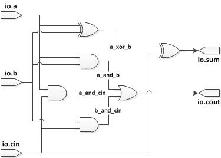

# Chisel的使用

## Chisel安装

### Chisel安装前的准备

在安装/使用Chisel之前，需要确保已经安装以下环境。

1. JDK。建议JDK 8以上版本。
2. Scala based Simple Build tool，SBT。
3. 安装Verilator：

	安装前的准备：

	```
	sudo apt-get install git make autoconf g++ flex bison
	```

	克隆Verilator的仓库：

	```
	git clone http://git.veripool.org/git/verilator
	```

	进入Verilator的根目录，检查是否有更好的版本：

	```
	git pull
	git checkout verilator_3_922
	```

	在Verilator的根目录，build并且安装：

	```
	unset VERILATOR_ROOT # For bash, unsetenv for csh
	autoconf # Create ./configure script
	./configure
	make
	sudo make install
	```

### 安装Chisel

Chisel是一种嵌入在高级程序语言Scala上的硬件描述语言。

#### 开发工具安装

参照：Chisel安装前的准备。

#### 设置Tutorial项目

在本引导系列中，使用的不是Chisel主项目，而是使用Chisel Tutorial来进行学习：

```git
git clone https://github.com/ucb-bar/chisel-tutorial.git
```

## 基础

#### Chisel文件结构

```
chisel-tutorial/  
  build.sbt # project description
  run-examples.sh   # shell script to execute one or more examples
  run-problem.sh    # shell script to execute one or more problems
  run-solution.sh   # shell script to execute one or more solutions
  src/
    main/
      scala/
        examples/   # chisel examples
          Accumulator.scala ...
        problems/   # skeletal files for tutorial problems
          Counter.scala ...
        solutions/  # solutions to problems
          Counter.scala ...
    test/
      resources/
        in.im24
        in.wav
     scala/
        examples/   # examples testers
          Adder.scala ...
        problems/   # problems testers
          Accumulator.scala ...
        solutions/  # solutions testers
          Accumulator.scala ...
        util/
          TutorialRunner.scala
```

Chisel的源代码文件分布在examples，problems和solutions这三个文件夹中。引导教程包含的将要编辑的文件在problems以及solutions这两个文件夹下，这两个文件夹包含有每个问题的实现。examples文件夹下包含引导教程中每个例子的完整实现。

最后是build.sbt文件包含build的相关设置用于指定使用哪个Chisel版本来build项目。

### 运行你的第一个Chisel Build项目

在这一节当中，将会解释如何运行第一个Chisel项目，以及通过GCD例子来熟悉与Chisel源代码、仿真以及Verilog生成相关的知识。

#### Chisel源代码

进入项目中的src/main/scala/examples文件夹，打开GCD.scala。

```Scala
// See LICENSE.txt for license details.
package examples

import chisel3._

/**
 * Compute the GCD of 'a' and 'b' using Euclid's algorithm.
 * To start a computation, load the values into 'a' and 'b' and toggle 'load'
 * high.
 * The GCD will be returned in 'out' when 'valid' is high.
 */
class GCD extends Module {
  val io = IO(new Bundle {
    val a     = Input(UInt(16.W))
    val b     = Input(UInt(16.W))
    val load  = Input(Bool())
    val out   = Output(UInt(16.W))
    val valid = Output(Bool())
  })
  val x = Reg(UInt())
  val y = Reg(UInt())

  when (io.load) {
    x := io.a; y := io.b
  } .otherwise {
    when (x > y) {
      x := x - y
    } .elsewhen (x <= y) {
      y := y - x
    }
  }

  io.out := x
  io.valid := y === 0.U
}
```

import chisel3._的声明，表示导入了Chisel库文件，来将Scala作为硬件描述语言来看待。接下来是一个Scala class的声明，这里定义了一个Chisel的组件并且实现了它（class GCD extends Module）。这和Verilog的module声明相似。

接下来是一个I/O组建的声明：val io = IO(new Bundle{...})，bundle当中有数个参数作为构造bundle的成员，它们的类型也各异（UInt，Bool等），还有带宽以及数据流方向（输入还是输出）。如果带宽没有特别声明，那么Chisel会自己设定一个合适的带宽。一个io Bundle本质上是一个组件接口的构造器。

接下来是两个寄存器的定义。将x和y定义为存储UInt()类型的寄存器。

when语句告诉Chisel当条件为真的时候执行相关操作。在硬件上这实际上是一个多路选择器，当when语句的条件为真时，则选择when语句块中的值。否则选择默认的值或者保持一个寄存器的值。当条件为真的时候，该语句在每个上升沿时执行。

最后是将x和y的值赋予给输出值io.out以及io.valid。可以发现代码中没有给x以及y声明带宽，这是因为Chisel会在执行时自动设定合适的带宽大小给x以及y。

#### 使用Chisel进行仿真

在src/test/scala/examples/GCDTests.scala中，包含一个Chisel对PeekPokeTester的实现以及一个测试器的驱动用来仿真电路、将需要仿真的模块连接到测试器电路上，然后运行测试器来进行仿真。

在根目录执行下面的命令来进行仿真：

```
./run-examples.sh GCD
```

执行该命令后会生成firrtl电路描述，然后使用firrtl解释器来进行仿真。具体来说，是将定义在src/main/scala/examples/GCD.scala转换成firrtl电路描述，然后在使用firrtl解释器来进行仿真，使用的是定义在src/test/scala/examples/GCDTests.scala。

生成的结果如下：

```
[info] [0.006] RAN 24 CYCLES PASSED
Tutorials passing: 1
[success] Total time: 3 s, completed Nov 27, 2018, 2:44:12 PM
```

同时创建了文件test_run_dir/examples/GCD/GCD.fir，里面包含有对上述chisel代码的firrtl翻译结果。

#### 生成Verilog代码

Chisel最强大的功能莫过于其能生成FPGA和ASIC Verilog代码。使用下列命令就可以将GCD.scala转换为Verilog代码：

```
./run-examples.sh GCD --backend-name verilator
```

执行该命令后，会指示测试器驱动生成Verilog并且使用Verilator根据生成的Verilog生成一个基于C++的仿真程序。如果命令执行成功，则可以在test_run_dir/examples/GCD文件夹中找到下列文件：

- GCD.v   - Verilog描述的Chisel电路
- GCD.vcd - 仿真过程中生成的波形图

其中Verilog源文件可以大致分为以下三个部分：

- 模块的定义，包含有输入和输出。
- 临时的wire以及寄存器定义用于保存中间值。
- 寄存器的赋值，在always@(posedge clk)中进行。

在Ubuntu中可以使用gtkwave来查看vcd文件。

#### 组合逻辑电路

##### Scala节点

在Chisel中构建组合逻辑电路的模块是非常直接的：当你在Scala中定义一个val类型的数据时，它会创建一个节点来表示这个数据用来被赋值，如果该数据没有被赋值为寄存器类型，那么Chisel编译器就会将它作为wire类型来看待。因此任何数量的这些值都能够被连接不过并且操作以产生我们所需要的数值。

假设我们想构造一个全加器，一个全加器需要两个输入a以及b，以及一个进位cin。全加器产生一个结果输出sum以及一个进位输出cout。

在examples文件夹中的FullAdder.scala包含有Chisel对全加器的实现：

```Scala
// See LICENSE.txt for license details.
package examples

import chisel3._

class FullAdder extends Module {
  val io = IO(new Bundle {
    val a    = Input(UInt(1.W))
    val b    = Input(UInt(1.W))
    val cin  = Input(UInt(1.W))
    val sum  = Output(UInt(1.W))
    val cout = Output(UInt(1.W))
  })

  // Generate the sum
  val a_xor_b = io.a ^ io.b
  io.sum := a_xor_b ^ io.cin
  // Generate the carry
  val a_and_b = io.a & io.b
  val b_and_cin = io.b & io.cin
  val a_and_cin = io.a & io.cin
  io.cout := a_and_b | b_and_cin | a_and_cin
}
```

sum以及cout被定义为组合逻辑函数输出的结果，输入为a、b以及cin。

可以发现，输入以及输出的管脚在io bundle中进行定义。而在Chisel当中，运算符|，&以及^分别代表或，与以及异或。

下面给出Chisel源码中定义的全加器FullAdder.scala的电路图：



##### 对带宽大小的推导

如果在书写Chisel代码的时候没有对一个值的带宽进行声明，那么Chisel的编译器会推导出一个合适的带宽来定义这个值。注意到在FullAdder的实现当中，值a_xor_b，a_and_b，b_and_cin以及a_and_cin都没有说明它们的带宽大小。但是基于输入的值的带宽，Chisel会正确推导出这几个中间值的带宽大小：

```Verilog
module FullAdder(
  input   clock,
  input   reset,
  input   io_a,
  input   io_b,
  input   io_cin,
  output  io_sum,
  output  io_cout
);
  wire  a_xor_b;
  wire  a_and_b;
  wire  b_and_cin;
  wire  a_and_cin;
  wire  _T_16;
  assign a_xor_b = io_a ^ io_b;
  assign a_and_b = io_a & io_b;
  assign b_and_cin = io_b & io_cin;
  assign a_and_cin = io_a & io_cin;
  assign _T_16 = a_and_b | b_and_cin;
  assign io_sum = a_xor_b ^ io_cin;
  assign io_cout = _T_16 | a_and_cin;
endmodule
```

可以发现生成的Verilog代码中，这些值的带宽大小都为1。如果改变了FullAdder.scala中输入输出管脚的带宽大小：

```Scala
class FullAdder extends Module {
  val io = IO(new Bundle {
    val a    = Input(UInt(2.W))
    val b    = Input(UInt(2.W))
    val cin  = Input(UInt(2.W))
    val sum  = Output(UInt(2.W))
    val cout = Output(UInt(2.W))
  })

  // Generate the sum
  val a_xor_b = io.a ^ io.b
  io.sum := a_xor_b ^ io.cin
  // Generate the carry
  val a_and_b = io.a & io.b
  val b_and_cin = io.b & io.cin
  val a_and_cin = io.a & io.cin
  io.cout := a_and_b | b_and_cin | a_and_cin
}
```

那么所生成的Verilog代码中，中间值的带宽也会自动设置为带宽大小为2：

```Verilog
module FullAdder(
  input        clock,
  input        reset,
  input  [1:0] io_a,
  input  [1:0] io_b,
  input  [1:0] io_cin,
  output [1:0] io_sum,
  output [1:0] io_cout
);
  wire [1:0] a_xor_b; // @[FullAdder.scala 16:22]
  wire [1:0] a_and_b; // @[FullAdder.scala 19:22]
  wire [1:0] b_and_cin; // @[FullAdder.scala 20:24]
  wire [1:0] a_and_cin; // @[FullAdder.scala 21:24]
  wire [1:0] _T_16; // @[FullAdder.scala 22:22]
  assign a_xor_b = io_a ^ io_b; // @[FullAdder.scala 16:22]
  assign a_and_b = io_a & io_b; // @[FullAdder.scala 19:22]
  assign b_and_cin = io_b & io_cin; // @[FullAdder.scala 20:24]
  assign a_and_cin = io_a & io_cin; // @[FullAdder.scala 21:24]
  assign _T_16 = a_and_b | b_and_cin; // @[FullAdder.scala 22:22]
  assign io_sum = a_xor_b ^ io_cin; // @[FullAdder.scala 17:10]
  assign io_cout = _T_16 | a_and_cin; // @[FullAdder.scala 22:11]
endmodule
```

#### 使用寄存器

与Verilog不同，在Chisel中，声明一个register实际上构造了一个上升沿触发的寄存器。在Chisel当中，当你声明一个寄存器的时候，有多种方法来表示寄存器的输入。在GCD例子当中，可以生命一个寄存器并且在when语句块中将其赋值。

如果使用RegNext()的寄存器赋值方式，那么被赋值的寄存器值会在

当我们只想在给定的条件满足时更新寄存器的值，只需要使用when语句块来指定该寄存器只在条件满足时更新即可：

```Scala
// 当满足条件a > b时，上升沿触发后更新寄存器x的值
val x = Teg(UInt());
when (a > b) { x := y }
.elsewhen ( b > a) { x := z }
.otherwise { x := w }
```

需要注意的一点是，当使用条件方法的时候，要注意赋予寄存器的输入值需要匹配寄存器的类型以及带宽大小。在无条件赋值的时候，不需要注意这一点，因为Chisel编译器会自动推导出合适的类型以及带宽大小。

下面的小节将会展示如何使用寄存器来构建一个移位寄存器。

##### 无条件的寄存器更新

假设我们想要构建一个4位的移位寄存器，该移位寄存器接收连续的输入并且连续的输出。在第一个例子当中，我们先不关心并行读取信号的问题并且假设移位寄存器永远使能，与此同时我们也不关心寄存器的reset信号。

Chisel代码如下：

```Scala
class ShiftRegister extends Module {
  	  	val io = IO(new Bundle {
    	val in  = Input(UInt(1.W))
    	val out = Output(UInt(1.W))
  	})
	val r0 = RegNext(io.in)
	val r1 = RegNext(r0)
	val r2 = RegNext(r1)
	val r3 = RegNext(r2)
	io.out := r3
}
```

将上述代码转换为Verilog，将会发现Chisel匹配我们对移位寄存器的设计。我们可以发现在转换得到的Verilog代码当中，clock以及reset的信号已经由编译器自己补充上去了：

```Verilog
module ShiftRegister(
  input   clock,
  input   reset,
  input   io_in,
  output  io_out
);
  reg  r0; // @[ShiftRegister.scala 11:19]
  reg [31:0] _RAND_0;
  reg  r1; // @[ShiftRegister.scala 12:19]
  reg [31:0] _RAND_1;
  reg  r2; // @[ShiftRegister.scala 13:19]
  reg [31:0] _RAND_2;
  reg  r3; // @[ShiftRegister.scala 14:19]
  reg [31:0] _RAND_3;
  assign io_out = r3; // @[ShiftRegister.scala 15:10]

  always @(posedge clock) begin
    r0 <= io_in;
    r1 <= r0;
    r2 <= r1;
    r3 <= r2;
  end
endmodule
```

##### 有条件的寄存器更新

就如同前面所提到的，Chisel允许使用有条件的寄存器更新，利用when，.elsewhen以及.otherwise语句块。假设我们增加一个使能的信号给我们的移位寄存器，它允许我们控制是否进行移位：

```Scala
// See LICENSE.txt for license details.
package examples

import chisel3._

class ShiftRegister extends Module {
  	val io = IO(new Bundle {
    	val in  	= Input(UInt(1.W))
    	val out 	= Output(UInt(1.W))
		val enable 	= Input(Bool())
  	})
	
	val r0 = Reg(UInt())
	val r1 = Reg(UInt())
	val r2 = Reg(UInt())
	val r3 = Reg(UInt())

	when(io.enable) {
		r0 := io.in
		r1 := r0;
		r2 := r1;
		r3 := r2;
	}
	io.out := r3;
}
```

可以留意到在上述例子中没有使用.otherwise的条件。

##### 重置寄存器

Chisel允许你在声明一个特定的值的时候，通过声明一个附加的参数来使得特定的值被同步重置。在上面的移位寄存器当中，添加一个重置的功能来使得这些寄存器值同步的置为0。为此我们需要为我们的寄存器的声明添加更多的信息，使用init参数或者使用特定的构造器RegInit：

```Scala
class ShiftRegister extends Module {
  	val io = IO(new Bundle {
    	val in  	= Input(UInt(1.W))
    	val out 	= Output(UInt(1.W))
		val enable 	= Input(Bool())
  	})
	
	val r0 = RegInit(0.U(1.W))
	val r1 = RegInit(0.U(1.W))
	val r2 = RegInit(0.U(1.W))
	val r3 = RegInit(0.U(1.W))

	when(io.enable) {
		r0 := io.in
		r1 := r0;
		r2 := r1;
		r3 := r2;
	}
	io.out := r3;
}
```

可以发现重置的值可以是任何值，可以改变重置的值（0）以及带宽大小来适应不同的情况。

Chisel还提供一种全局的reset信号，可以用在when语句块当中。这个重置的信号就叫做reset同时不需要声明，但是必须将其视为Bool类型来对待，因此使用它的时候需要加上toBool来进行转换：

```Scala
class ShiftRegister extends Module {
  	val io = IO(new Bundle {
    	val in  	= Input(UInt(1.W))
    	val out 	= Output(UInt(1.W))
		val enable 	= Input(Bool())
  	})
	
	val r0 = Reg(UInt())
	val r1 = Reg(UInt())
	val r2 = Reg(UInt())
	val r3 = Reg(UInt())

	when(reset.toBool) {
		r0 := 0.U
		r1 := 0.U
		r2 := 0.U
		r3 := 0.U
	} .elsewhen(io.enable) {
		r0 := io.in
		r1 := r0
		r2 := r1
		r3 := r2
	}
	io.out := r3
}
```

这样会生成与之前稍微不同的Verilog代码，但是它们的功能是相同的。

#### 时序电路练习

下列的练习可以在src/main/scala/problems文件夹中找到，答案可以在src/main/scala/solutions当中找到。

第一个问题是写一段Chisel代码，设计一个时序电路来将输入的值求和。
