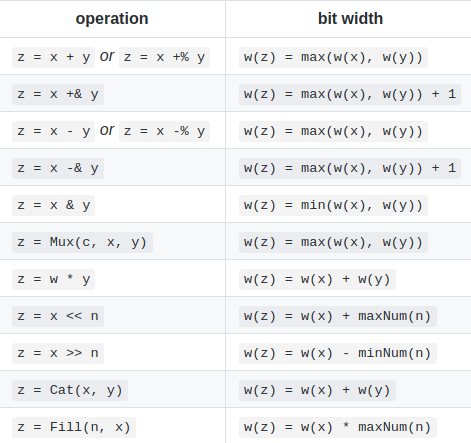

# 位宽推断

Chisel提供有位宽推断的功能来降低设计的难度。用户可以显式的声明每个端口的位宽，如果对应的位宽没有声明，那么位宽将会由Firrtl的编译器来进行推断。

在所有没有显式声明位宽的电路组件当中，FIRRTL编译器会对所有没有声明的位宽的连接提供一个最小的可能的位宽来保证它们之间连接的合法性。这里隐含的推断是按照从右到左的顺序来进行的。如果一个组件没有连接任何东西，并且没有声明它的文宽，那么将会抛出一个错误。

对于一个模块的输入端口来说，如果它没有显式声明位宽，那么它会根据所有输入的连接选择一个最小的位宽来使得所有的输入都是合法的。

硬件操作符的位宽推断表如下所示：

如果在一整个连接路径当中开头的组件没有声明位宽那么就会抛出一个错误。

一个常见的问题就是在使用一般的“+”和“-”操作符的操作中，数据是有可能被截断的。为了使结果完整并且可扩展，应该使用可扩展的运算符“+&”以及“-&”。
