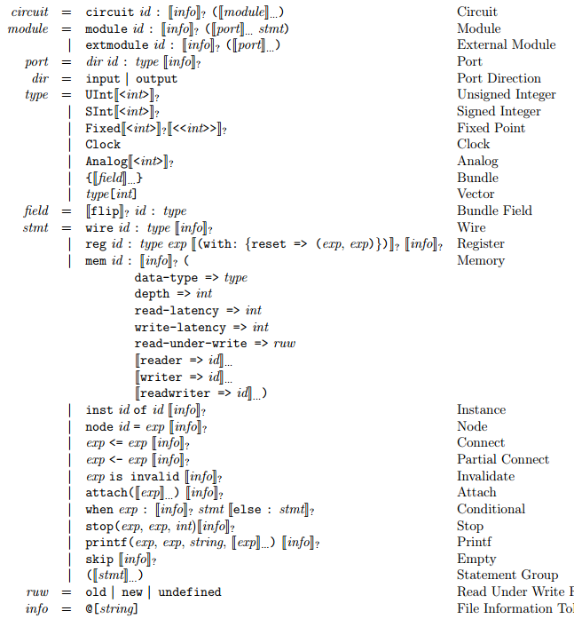
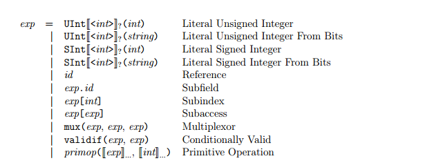
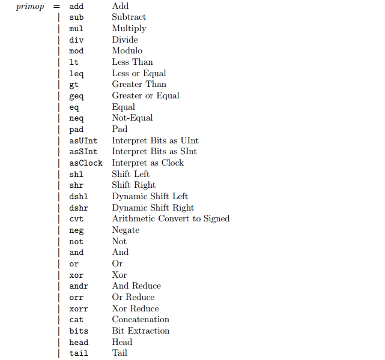

# FIRRTL Specification

基于FIRRTL标准文档的相关笔记记录。https://github.com/freechipsproject/firrtl/blob/master/spec/spec.pdf

Firrtl是一种专门用于数字电路的高层次灵活的中间代码形式RTL（Flexible Internal Representation for RTL）。

Firrtl将数字电路表示成一个AST（abstract syntax tree）的形式。

# Circuit以及Modules

## Circuits

所有的FIRRTL的circuits都包含一个模块的列表。circuits是AST的根结点，所有的FIRRTL表示的数字电路都只有一个circuit结点。同时，circuit的名字一般来说就是最顶层模块的名字。

```
circuit MyTop : 
    module MyTop :
    ...
    module MyModule :
    ...
```

## Modules

每个模块都有一个给定的名字，一个端口的列表以及语句（块）来表示模块内的电路连接。端口带有方向、名字以及该端口的数据类型。下面这个简单的模块表示一个模块只有一个输入和输出端口，并且模块内直接将输入输出端口相连：

```
module MyModule :
    input foo : UInt
    output bar : UInt
    bar <= foo
```

端口声明的一般格式为：

<方向> <名字> : <类型>

需要注意的是，一个模块的定义并不代表这个模块一定会在最终的电路上物理生成。

## Externally Defined Modules

外部定义的模块必须包含一个名字以及一个端口的列表，这些端口的名字和类型需要和外部定义一致。

# Types

FIRRTL中所有的类型要不是基本类型或者是由基本类型聚合而成的组合类型。

## Ground Types

### Integer Types

无符号以及有符号的整数类型，都可以选择带有一个指定的位宽：

```
UInt<10>
SInt<32>
```

如果没有指定位宽，那么会在FIRRTL的位宽推断中自动生成：

```
UInt
SInt
```

这部分的细节将在后文阐述。

### Clock Type

时钟类型用来描述传递时钟信号的wires或者ports。时钟信号不适用于大多数的操作，并且时钟信号连接到已经声明为时钟类型的部件上。

时钟类型的声明如下：

```
Clock
```

## Vector Types

向量类型用来表示一个给定类型的元素序列。序列的长度必须是非负且声明已知的。

下面是一个声明为10个单位长度的16位无符号整数的序列：

```
UInt<16>[10]
```

下面的例子是一个声明为10个单位长度的，但没有指定位数的无符号整数的序列：

```
UInt[10]
```

当然，聚合的类型同样可以作为向量中的元素。下面表示的是一个长度为20个单位的向量，其中每个元素是一个长度为10个单位的16位无符号整数的序列。

```
UInt<16>[10][20]
```

## Bundle Types

一个bundle类型的数据用来表示一系列嵌套的以及命名了的类型。比如下面是一个用bundle描述一个复数的例子。它含有两个域：real以及imag，都是10位的有符号整数。

```
{real:SInt<10>, imag:SInt<10>}
```

此外，bundle中某些字段可以声明为 filp ：

```
{word:UInt<32>, valid:UInt<1>, filp ready:UInt<1>}
```

电路模块之间，如果连接的对象是bundle，那么bundle中声明为flip的端口可以反向传输数据，下面举一个例子来说明。

考虑一个模块的输出定义为：

```
output a: {word:UInt<32>, valid:UInt<1>, flip ready:UInt<1>}
```

如果a端口和另外一个模块的相同端口相连，那么word以及valid的数据流方向是从端口内传输到端口外，但是ready的数据流方向则相反，**从端口外传输到端口内**。如果是 filp 声明的域当中内嵌了另一个 flip 声明的域，那么直接做翻转运算即可。（类似负负得正）

## Passive Types

对于一些电路中的模块来说，声明一个类型的端口允许数据流双向流动，是不太合适的。直观上来说，一个被动类型是指一种类型的对象，其所有的数据流动都是单向的。如果一个对象是被动类型的，则其包含的所有基本类型的对象都是被动类型。如果向量中的元素是被动类型，则这个向量也是被动类型。

## Type Equivalence

类型之间等价的问题用于决定两个部件之间的连接是否合法。一个无符号数类型和另一个无符号数的连接永远合法，无论它们之间的位宽是多少，且和其他类型的连接永远不合法。有符号数与此相似。

时钟类型只与时钟类型等价，和其他类型都是不等价的。

两个向量类型之间等价的条件是，它们的长度相等，并且它们元素的类型是等价的。

两个bundle类型等价的条件是，它们字段的数量相同，并且对应每个字段的名字、类型以及方向相同。如：{a:UInt, b:UInt}和{b:UInt, a:UInt}是不等价的。

## Weak Type Equivalence

**（这一节尚未能完全理解）**

弱类型等价是用来衡量两个部件之间的部分连接是否合法。两个类型是弱等价的条件是，如果它们相应的方向类型是等价的。

### Oriented Types

### Conversion to Oriented Types

### Oriented Type Equivalence

# Statements

语句用来描述模块中的部件以及它们之间怎么交互。

## Connects

连接语句用来描述两个电路器件之间的物理连接。下面的例子表示模块的输入端口与输出端口的连接：

```
module MyModule :
    input myinput: UInt
    output myoutput: UInt
    myoutput <= myinput
```

为了保证连接是合法的，下列的条件必须要满足：

1. 左表达式以及右表达式的类型必须是等价的。
2. 两个表达式的位宽，必须遵从数据流由小的位宽流向到同等或者更大的位宽。
3. 左表达式的性别必须是女性或者双性的（后面将会阐述什么是表达式的性别）。
4. 右表达式的性别必须是男性或者是双性的，或者是一个被动类型。

如果是一个小的位宽连接到一个更大位宽的部件，那么它的值会自动进行符号扩展。

### The Connection Algorithm

基本类型之间的连接不能再进行扩展。向量之间的连接相当于右表达式的子元素依次与左表达式相应的元素相连接，bundle类型同上，如果一个域被翻转连接，那么就是左表达式的该域连接到右表达式的该域。

## Partial Connects

部分连接语句也是用来声明一个物理上两个电路部件相连接。然而，它在类型以及位宽的限制条件要少。一个部分连接合法的条件是：

1. 左表达式和右表达式的类型必须是弱等价的。
2. 左表达式的性别必须是女性或者双性的。
3. 右表达式的性别必须是男性或者双性的，或者是被动类型。

同样，如果是一个小的位宽连接到一个更大位宽的部件，那么它的值会自动进行符号扩展。而如果部分连接是将一个更大位宽的部件连接到一个小的位宽部件，那么它的值会自动截断。

直观上来说，如果两个bundle域进行部分连接，那么不匹配的域就会忽略。相似的，如果两个长度不匹配的向量类型相连接，那么它们会将短的长度相连接起来。

下面是部分连接的例子：

```
module MyModule :
    input myinput : { flip a:UInt , b: UInt [2]}
    output myoutput : { flip a:UInt , b: UInt [3] , c: UInt }
    myoutput <- myinput
```

上面的例子等同于：

```
module MyModule :
    input myinput : { flip a:UInt , b: UInt [2]}
    output myoutput : { flip a:UInt , b: UInt [3] , c: UInt }
    myinput .a <- myoutput .a
    myoutput .b[0] <- myinput .b [0]
    myoutput .b[1] <- myinput .b [1]
```

### 部分连接的算法

一个部分连接的语句连接右表达式到左表达式。反过来来说，一个反转的部分连接语句将连接左表达式到右表达式。

一个连接两个向量类型部件的部分连接语句，会将右表达式的前n个元素连接到左表达式的前n个元素，其中n是更短的向量的长度。

## Statement Groups

一系列的语句可以作为一个语句块。下面的例子表示了一个具有3个语句的语句块：

```
module MyModule :
    input a: UInt
    input b: UInt
    output myport1 : UInt
    output myport2 : UInt
    myport1 <= a
    myport1 <= b
    myport2 <= a
```

### Last Connect Semantics

在语句块当中，语句的顺序是非常重要的。直观上来说，在电路elaboration（综合？阐述？）的过程中，语句会以顺序的方式执行，后面的语句会覆盖前面的语句所带来的影响。比如在上述的例子当中，端口b会连接到端口myport1，端口a会连接到端口myport2。

考虑到连接以及部分连接语句的优先级是相同的，因此后续的连接或者部分连接总是会覆盖先前的连接或者部分连接。条件语句同样会受最近连接语义的影响。

如果聚合类型的电路连接中的子元素被之后的连接语句覆盖，那么聚合类型中只有这些元素收到影响。如下：

```
module MyModule :
    input portx : {b:UInt , c: UInt }
    input porty : UInt
    output myport : {b:UInt , c: UInt }
    myport <= portx
    myport .b <= porty
```

等同于

```
module MyModule :
    input portx : {b:UInt , c: UInt }
    input porty : UInt
    output myport : {b:UInt , c: UInt }
    myport .b <= porty
    myport .c <= portx .c
```

当然，如果是后续一个聚合类型的电路的连接则会覆盖整个聚合类型：

```
module MyModule :
    input portx : {b:UInt , c: UInt }
    input porty : UInt
    output myport : {b:UInt , c: UInt }
    myport .b <= porty
    myport <= portx
```

等同于

```
module MyModule :
    input portx : {b:UInt , c: UInt }
    input porty : UInt
    output myport : {b:UInt , c: UInt }
    myport <= portx
```

## Empty

空的语句什么都不做，一般来说当作占位符使用。比如 skip 关键字：

```
a <= b
skip
c <= d
```

等同于

```
a <= b
c <= d
```

空的语句在条件语句中的else分支（没有else分支，但是为了结构的完整性而在else分支中加入一个空的语句）或者在转化流程中被删除的部件作为占位符使用。

## Wires

wire是一个命名的组合电路部件，可以使用连接或者部分连接语句来被连接或者连接到其他部件。

下面的例子声明一个UInt类型的wire：

```
wire mywire : UInt
```

## Registers

一个寄存器是一个命名的储存状态的电路部件。下面的例子表示一个SInt类型的寄存器，并且被时钟信号myclock驱动：

```
wire myclock : Clock
reg myreg : Sint, myclock
```

此外，一个寄存器还可以定义reset的信号。下面的例子表示一个寄存器会在myreset信号为高电平的时候赋值为myinit：

```
wire myclock : Clock
wire myreset : UInt <1>
wire myinit : SInt
reg myreg : SInt , myclock with : ( reset => ( myreset , myinit ))
```

可以注意到的是，寄存器的时钟信号必须是clock类型，reset信号必须是1位的UInt类型，而初始化的值必须和寄存器的类型相匹配。

## Invalidates

无效信号语句用来表示一个电路的部件包含一个不确定的值。可以如下声明：

```
wire w:UInt
w is invalid
```

无效信号语句可以赋给任何类型的电路部件。然而，如果一个电路部件不能被连接，那么无效信号语句也不能在该部件上产生任何的影响。因此这可以允许任何部件都可以声明为不确定的（无效信号），来显式的忽略一些初始化的错误。

下面给出一个例子说明，当声明聚合类型为无效类型的时候会发生什么。详细的算法声明在后文会提到：

**（下面这个例子有疑问）**

```
module MyModule : 
    input in : {flip a:UInt, b:UInt}
    output out : {flip a:UInt, b:UInt}
    wire w: {flip a:UInt, b:UInt}
    in is invalid
    out is invalid
    w is invalid
```

等同于

```
module MyModule :
    input in: { flip a:UInt , b: UInt }
    output out : { flip a:UInt , b: UInt }
    wire w: { flip a:UInt , b: UInt }
    in.a is invalid
    out.b is invalid
    w.a is invalid
    w.b is invalid
```

对于仿真的需求来说，声明为无效信号（不定）的电路部件会初始化为随机数值，并且对其的所有操作都是未定义的。

### The Invalidate Algorithm

声明一个基本类型的部件是无效信号，表示这个部件中的值是不定的（未定义的），前提是这个部件是女性或者双性的。此外，这个部件不会受任何操作的影响。

声明一个向量类型的部件是无效信号，表示这个向量中所有的子元素的值都是不定的。

声明一个bundle类型的部件是无效信号，表示bundle中的每个子元素的值都是不定的。

## Nodes

一个结点是一个简单的命名的电路中的中间值。一个结点必须初始化为一个值，并且这个值是被动类型，且不能被连接。结点通常用来将一个复杂的复合的表达式分解成多个命名的子表达式。

下面的例子说明了将一个结点初始化为一个多路选择器的输出：

```
wire pred: UInt<1>
wire a: SInt
wire b: SInt
node mynode = mux(pred, a, b)
```

## Conditionals

在条件语句当中的连接语句，只有在条件语句为高电平的时候才能生效。条件语句中的条件必须是1位的无符号整数类型。

```
module MyModule :
    input a: UInt
    input b: UInt
    input en: UInt <1>
    wire x: UInt
    when en :
        x <= a
    else :
        x <= b
```

### Syntactic Shorthands

条件语句中的else语句可以被忽略，此时else分支中默认包含一条空语句。

```
module MyModule :
    input a: UInt
    input b: UInt
    input en: UInt <1>
    wire x: UInt
    when en :
        x <= a
```

等同于

```
module MyModule :
    input a: UInt
    input b: UInt
    input en: UInt <1>
    wire x: UInt
    when en :
        x <= a
    else :
        skip
```

为了保证条件语句中比较长的条件链的可阅读性，如果else分支只有一个语句，则else后的换行可以省略，如下：

```
module MyModule :
    input a: UInt
    input b: UInt
    input c: UInt
    input d: UInt
    input c1: UInt <1>
    input c2: UInt <1>
    input c3: UInt <1>
    wire x: UInt
    when c1 :
        x <= a
    else :
        when c2 :
            x <= b
        else :
            when c3 :
                x <= c
            else :
                x <= d
```

等同于

```
module MyModule :
    input a: UInt
    input b: UInt
    input c: UInt
    input d: UInt
    input c1: UInt <1>
    input c2: UInt <1>
    input c3: UInt <1>
    wire x: UInt
    when c1 :
        x <= a
    else when c2 :
        x <= b
    else when c3 :
        x <= c
    else :
        x <= d
```

### Nested Declarations

如果一个部件在条件语句当中声明，那么在条件语句中对该部件的连接不受条件的影响。如下面的例子所示，a永远连接到myreg1，b永远连接到myreg2：

```
module MyModule :
    input a: UInt
    input b: UInt
    input en: UInt <1>
    input clk : Clock
    when en :
        reg myreg1 : UInt , clk
        myreg1 <= a
    else :
        reg myreg2 : UInt , clk
        myreg2 <= b
```

### Initialization Coverage

由于条件语句的存在，可能会存在电路部件在某些条件下没有被连接的情况，如下面例子中的a：

```
module MyModule : 
    input en: UInt<1>
    input a: UInt
    wire w:UInt
    when en :
        w <= a
```

这是一个非法的FIRRTL电路，并且会在编译的时候产生一个错误。所有的wires、存储端口、实例端口以及模块的端口都必须在所有条件下都被连接上。寄存器则不必要，如果在某种条件下没有被连接，则可以保持它之前的状态。

### Scoping

条件语句会在when以及else语句中创建新的作用域。在条件语句外引用条件语句内声明的对象都会发生错误。

### Conditional Last Connect Semantics

如果在条件语句中的一条连接语句，与条件语句前的连接语句中所连接的部件相同，那么只有当条件为真的时候才会被重写。这种情况下，可以使用一个多路选择器来实现：

```
wire a: UInt
wire b: UInt
wire c: UInt <1>
wire w: UInt
w <= a
when c :
    w <= b
```

等同于

```
wire a: UInt
wire b: UInt
wire c: UInt<1>
wire w: UInt
w <= Mux(c, b, a)
```

如果在w声明语句后有一条无效信号的声明语句，那么可以使用一个 validif 表达式来实现：

```
wire a: UInt
wire c: UInt<1>
wire w: UInt
w is invalid
when c :
    w <= a
```

等同于

```
wire a: UInt
wire c: UInt<1>
wire w: UInt
w <= validif(c, a)
```

条件语句中，聚合类型部件的连接的行为可以使用如下模型来表示：首先，展开每个连接称为独立的连接语句，然后再实现条件语句中的最近连接语义规则：

```
wire x: {a:UInt, b:UInt}
wire y: {a:UInt, b:UInt}
wire c: UInt<1>
wire w: {a:UInt, b:UInt}
w <= x
when c :
    w <= y
```

等同于

```
wire x: {a:UInt, b:UInt}
wire y: {a:UInt, b:UInt}
wire c: UInt<1>
wire w: {a:UInt, b:UInt}
w.a <= mux(c, y.a, x.a)
w.b <= mux(c, y.b, x.b)
```

当然，如果条件语句中并不是对整个聚合类型都进行连接，那么就不需要为部件中的每个port实现一个mux：

```
wire x: {a:UInt , b: UInt }
wire y: UInt
wire c: UInt <1>
wire w: {a:UInt , b: UInt }
w <= x
when c :
    w.a <= y
```

等同于

```
wire x: {a:UInt , b: UInt }
wire y: UInt
wire c: UInt <1>
wire w: {a:UInt , b: UInt }
w.a <= mux(c, y, x.a)
w.b <= x.b
```

## Memories

memory是对硬件存储的抽象表达。它由以下的参数表征：

1. memory中的元素类型使用被动类型。
2. 一个正整数表示memroy中的元素数量。
3. 若干命名的端口，其中一个是读端口，一个是写端口，或者一个读写端口。
4. 一个非负的整数表示读延迟，表示当读地址到来后需要多少的时钟周期可以从读端口读取相应地址的数据。
5. 一个非负的整数表示写延迟，表示当写地址以及写如的数据到来后需要多少的时钟周期将数据写入到相应地址当中。
6. 一个 read-under-write 标志表示当存储器同时读写同一个地址数据时的行为。

下面的例子表示一个存储包含256个复数，每个复数有一个16位的有符号数表示它的实数部分和虚数部分。它带有两个读端口，r1和r2，以及一个写端口，w。它的读是组合逻辑的（读延迟为0个时钟周期），写延迟为1个时钟周期。read-under-write的行为未定义：

```
mem mymem:
    data-type => {real:SInt<16>, imag:SInt<16>}
    depth => 256
    reader => r1
    reader => r2
    writer => w
    read-latency => 0
    write-latency => 1
    read-under-write => undefined
```

上面例子中 mymem 的类型则为：

```
{ flip r1: { flip data : { real :SInt <16 >, imag :SInt <16 >} ,
             addr : UInt <8>,
             en: UInt <1>,
             clk : Clock }
  flip r2: { flip data : { real :SInt <16>, imag :SInt <16 >} ,
             addr : UInt <8>,
             en: UInt <1>,
             clk : Clock }
  flip w: { data : { real :SInt <16>, imag :SInt <16 >} ,
            mask : { real :UInt <1>, imag :UInt <1 >},
            addr : UInt <8>,
            en: UInt <1>,
            clk: Clock }}
```

### Read Ports

如果一个memory声明为其元素的类型为T，内存元素个数小于或者等于2^N，那么它的读端口的类型为：

```
{flip data:T, addr:UInt<N>, en:UInt<1>, clk:Clock}
```

当en为高电平时，在addr数据有效后，经过读延迟时间即可在data中获取内存该地址的数据。如果en为低电平，则在data中的数据是未定义的。

### Write Ports

如果一个memory声明为其元素的类型为T，内存元素个数小于或者等于2^N，那么它的写端口的类型为：

```
{data:T, mask:M, addr:UInt<N>, en:UInt<1>, clk:Clock}
```

一般来说，写的掩码类型是memory内元素类型的镜像，只不过聚合类型中的每个基本类型只有1个大小的位宽。

### Readwrite Ports

```
{wmode:UInt<1>, flip rdata:T, wdata:T, wmask:M, addr:UInt<N>, en:UInt<1>, clk:Clock}
```

wmode用于决定该端口用作读还是写。

### Read Under Write Behaviour

read-under-write 标志用于表示当memory中同一个地址同时读写的行为。有三种：old、new以及undefined。

如果为old，那么此时会读同一个周期的数据（组合逻辑读）。

如果为new，那么此时会读写入后新的数据，会有延迟存在。

如果为undefined，那么此时读出的数据是未定义的。

对于所有情况来说，如果memory中同一个地址数据同一个周期被多个写入端口写入，那么写入的值是未定义的。

## Instances

FIRRTL的模块通过实例语句来实例化模块。下面的例子说明了如何在顶层的模块Top当中创建一个MyModule的实例：

```
circuit Top :
    module MyModule :
        input a: UInt
        output b: UInt
        b <= a
    module Top :
        inst myinstance of MyModule
```

实例化的模块带有一个bundle类型，该bundle当中含有模块的输入输出端口。输入的端口会声明为 flip 。如上面的例子所示，myinstance拥有一个bundle类型：{flip a: UInt, b: UInt}。

模块的实例总是会内联在其实例化的模块当中。为了防止无限递归的硬件结构，不能在模块定义中实例化自身，或者间接的通过实例化其他定义中有实例化该模块的模块。

## Stops

stop语句用于停止电路的仿真。在后端的代码中可以生成调试使用的相关代码。一个stop语句需要一个时钟信号，一个停机条件信号以及一个整数的退出码：

```
wire clk:Clock
wire halt:UInt<1>
stop(clk, halt, 42)
```

## Formatted Prints

格式化的输出语句是用于在仿真的时候输出格式化的字符串。

printf语句需要一个时钟信号，一个输出条件信号以及一个格式化的字符串，以及一个变量参数列表。条件信号必须是一位的无符号整数，并且变量参数必须全都是基本类型：

```
wire clk:Clock
wire condition:UInt<1>
wire a:UInt
wire b:UInt
printf(clk, condition, "a in hex: %x, b in decimal:%d.\n", a, b)
```

在每个时钟上升沿，当条件信号为高电平的时候，printf语句就会输出格式化的字符串。

### Format Strings

格式化的字符串支持下列参数的占位符：

- %b: 参数以二进制的方式输出
- %d: 参数以十进制的方式输出
- %x: 参数以十六进制的方式输出
- %%: 输出%字符

同时还支持转义字符：'\n'，'\t'，'\\'，'\"'，'\''。

# Expressions

FIRRTL的表达式用于创建字面上的无符号以及有符号整数。

## Unsigned Integers

一个字面的无符号整数可以基于一个非负的整数值以及一个可选的正的位宽。下面的例子创建一个10位的无符号整数42：

```
UInt<10>(42)
```

如果省略了位宽大小，那么将会使用能容纳数值的最小位宽：

```
// 此时位宽为6
UInt(42)
```

## Unsigned Integers from Literal Bits

一个字面上的无符号整数也可以通过给定一个位表示字符串以及一个可选的位宽来创建。下面的基数是可选的：

1. b：表示二进制数。
2. o：表示八进制数。
3. h：表示十六进制数。

如果一个位宽没有给出，那么字符串中表示的数字有多少位，该无符号数就有多少位：

```
// 8位的无符号整数13
UInt("b00001101")
UInt("h0D")
```

如果提供的位宽比字符串中的位数要大，那么会自动进行零扩展。如果提供的位宽比字符串中的位数要小，那么会进行截断，且截断的位都必须是0。下面的例子中展示了创建一个7位的无符号整数13：

```
UInt<7>("b00001101")
UInt<7>("o015")
UInt<7>("hD")
```

## Signed Integers

和无符号整数相似，字面上的有符号整数可以使用给定的整数值以及一个可选的位宽来创建：

```
SInt<10>(-42)
```

需要注意的是，当给定的位宽不足以使用补码的形式表示有符号数的时候，就会发生错误。如果忽略了位宽，那么会自动选择适合该有符号数的最小的位宽大小:

```
SInt(-42)
```

## Signed Integers from Literal Bits

和无符号整数相似，这里不太赘述：

```
SInt("b-1101")
SInt("h-d")
```

需要注意的有，如果提供的位宽大小不足以表示数值，那么就会产生一个错误。

## References

一个引用是一个简单引用之前声明的电路部件的名字。可以引用的部件包括：模块端口、结点、wire、寄存器、模块实例或者memory。

下面就是引用in连接到引用out的例子：

```
module MyModule :
    input in: UInt
    output out : UInt
    out <= in
```

## Subfields

子域的表达式用于引用bundle中的一个字段：

```
module MyModule :
    input in: UInt
    output out: {a:UInt, b:UInt}
    out.a <= in
```

## Subindices

子索引用于引用向量中的其中一个元素，索引必须是非负的整数：

```
moduole MyModule :
    input in: UInt
    output out: UInt[10]
    out[4] <= in
```

## Subaccesses

subaccess表达式用于动态的引用向量类型表达式中的一个子元素，这个索引是需要经过计算的。最后计算的结果必须是一个无符号的整数：

```
module MyModule :
    input in: UInt [3]
    input n: UInt <2>
    output out : UInt
    out <= in[n]
```

有关subaccess表达式的连接可以使用条件连接的模型来实现：

```
module MyModule :
    input in: UInt[3]
    input n: UInt<2>
    output out: UInt
    when eq(n, UInt(0)) :
        out <= in[0]
    else when eq(n, UInt(1)):
        out <= in[1]
    else when eq(n, UInt(2)):
        out <= in[2]
    else :
        out is invalid
```

下面的例子中，in连接到输出端口out的第n个元素，out的其他元素被连接到default当中：

```
module MyModule :
    input in: UInt
    input default : UInt [3]
    input n: UInt <2>
    output out : UInt [3]
    out <= default
    out[n] <= in
```

可以利用重写的原理来通过条件语句实现：

```
module MyModule :
    input in: UInt
    input default : UInt [3]
    input n: UInt <2>
    output out : UInt [3]
    out <= default
    when eq(n, UInt (0) ) :
        out [0] <= in
    else when eq(n, UInt (1) ) :
        out [1] <= in
    else when eq(n, UInt (2) ) :
        out [2] <= in
```

如果向量是二维的情况下：

```
module MyModule :
    input in: UInt
    input default: UInt[2][2]
    input n: UInt<1>
    input m: UInt<1>
    output out: UInt[2][2]
    out <= default
    out[n][m] <= in
```

等用于：

```
module MyModule :
    input in: UInt
    input default : UInt [2][2]
    input n: UInt <1>
    input m: UInt <1>
    output out : UInt [2][2]
    out <= default
    when and (eq(n, UInt (0) ), eq(m, UInt (0) )) :
        out [0][0] <= in
    else when and (eq(n, UInt (0) ), eq(m, UInt (1) )) :
        out [0][1] <= in
    else when and (eq(n, UInt (1) ), eq(m, UInt (0) )) :
        out [1][0] <= in
    else when and (eq(n, UInt (1) ), eq(m, UInt (1) )) :
        out [1][1] <= in
```

## Multiplexors

一个多路选择器会根据条件信号的真假，从两个输入的表达式中选择输出一个。下面的例子中，若sel为高电平，则连接a到c，否则连接b到c：

```
module MyModule :
    input a: UInt
    input b: UInt
    input sel: UInt<1>
    output c: UInt
    c <= mux(sel, a, b)
```

其中，多路选择器的表达式合法的条件是：

1. 条件信号必须是一位的无符号整数。
2. 两个输入的表达式的类型是等价的。
3. 两个输入的表达式都是被动类型。

## Conditionally Valids

一个条件有效的表达式将一个条件信号以及一个表达式作为输入。当条件信号为真的时候，则会输出表达式，否则输出的结果是未定义的。下面的例子中，当valid为高电平的时候，a连接到c，否则c是未定义的。

```
module MyModule :
    input a: UInt
    input valid: UInt<1>
    output c: UInt
    c <= validif(valid, a)
```

条件有效表达式合法的条件是：

1. 条件信号必须是一位的无符号整数。
2. 输入的表达式必须是被动的。

## Primitive Operations

所有在基本类型上的基本操作都是FIRRTL中的原始操作。一般来说，所有的操作都会使用若干个表达式作为参数，同时也会有一些静态的字面上的整数数字作为参数。一般的原始操作的表达式如下：

```
op(arg0, arg1, ..., argn, int0, int1, ..., intm)
```

# Primitive Operations

# Genders

表达式的性别会和连接的合法性相关。所有的表达式都拥有一个性别，可以是男性、女性或者是双性。

表达式的性别取决于其引用的电路部件的类型：

- 引用输入端口、模块实例、memory、结点：男性
- 引用输出端口：女性
- 引用wire或者寄存器：双性

向量中元素的性别取决于该向量中存放的元素的类型。

bundle中元素的类型则有：如果没有被翻转，那么它的性别取决于该域的类型。如果翻转了，那么其性别与该域的类型反转。男性则翻转为女性，反之亦然。双性翻转仍然是双性。

其它没有提到的表达式的性别一律为男性。

# Width Inference

位宽推导的规则：

- 模块输入：取最小的位宽使得所有该模块的实例连接都合法。
- 多路选择器：如果是基本类型，取位宽最大的输入作为输出的位数。如果是聚合类型，每个字段取位宽最大的输入作为输出的该字段的位数。
- 条件有效表达式：取输入的表达式的位宽。

# Namespaces

每个模块都有一个独立的命名空间。所有在同一个模块中的电路部件的命名以及声明都必须是唯一的名字。bundle类型中的声明，所有的字段的名字也必须是唯一的。memory中所有端口的名字都必须是唯一的。

## Name Expansion Algorithm

输入一个基本类型，该算法输出该类型的名字。

输入一个向量类型，该算法会在每个子元素的名字后追加一个'$i'的记号，其中i是向量中的第i个元素。

输入一个bundle类型，该算法会在每个字段的名字后追加一个'$f'的记号，其中f是字段的名字。

## Prefix Uniqueness

# Details about Syntax

# Concrete Syntax Tree






