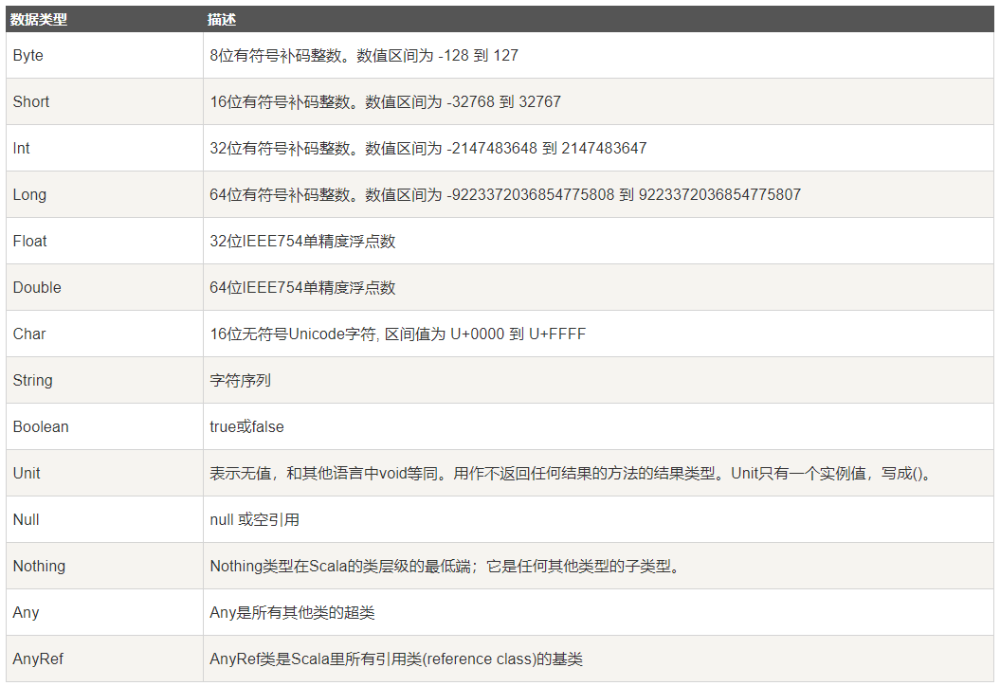

# Scala数据类型



# Scala变量

## 变量声明

在Scala中，使用关键词“var”声明变量，使用关键词“val”声明常量。

格式为：

var <变量名称> [: 变量类型] = 初始值

注意，变量声明一定需要初始值，否则会报错。但是声明变量和常量时不一定需要指明数据类型，在没有指明数据类型的情况下，其数据类型是通过变量或者常量的初始值推断出来的。

声明变量的实例如下：

```Scala
var myVar : String = "Foo"
```

### Scala多个变量声明

Scala支持多个变量的声明：

```Scala
val xmax, ymax = 100    // xmax, ymax都声明为100
```
