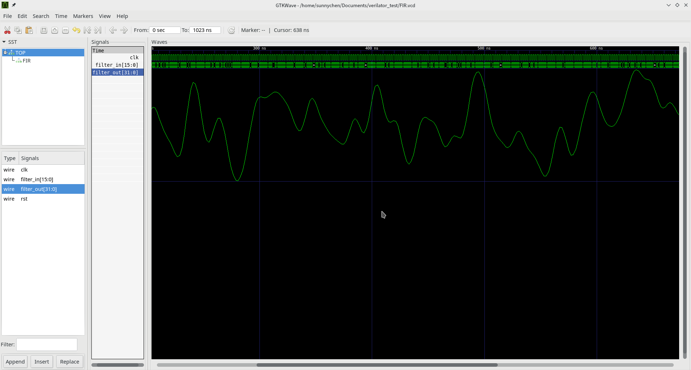

# Verilator的使用

由于使用Chisel的时候，对Verilator使用都已经在框架中自动完成，因此在这里学习一下这个工具具体来说是怎么使用的。

## Verilog源文件以及Verilator测试工具模块编写

实际上，在使用Verilator工具时并不需要Verilog的测试样例，而是直接使用C++代码的形式来描述测试样例。实际上，Verilator将模块的.v源文件编译为一个头文件：

```bash
# 假设源文件模块名为Decoder.v
$ verilator -Wall --cc Decoder.v
```

就能够生成对应的头文件VDecoder.h。如果在使用一些开发工具（带有intellisence之类的），可以先使用上述的命令来生成相应的头文件，以便补全工具能够识别。

调试最主要的工具就是使用gtkwave来查看生成的.vcd文件，要支持这个功能，首先要加上--trace参数：

```bash
$ verilator -Wall --cc Decoder.v --trace
```

接下来是编写测试模块，下面是一个简单的例子：

```C++
#include <verilated.h>          // verilator基本头文件
#include <verilated_vcd_c.h>    // 要支持.vcd波形文件生成的头文件
#include "VDecoder.h"           // verilator将模块源代码编译成的头文件
using namespace std;

VDecoder* top;                  // 顶层模块对象
VerilatedVcdC* tfp;             // vcd波形生成对象

vluint64_t main_time = 0;
const vluint64_t sim_time = 1024;

int main(int argc, char **argv)
{
    Verilated::commandArgs(argc, argv);     // 相关命令
    Verilated::traceEverOn(true);           // 开启波形生成
    top = new VDecoder;
    tfp = new VerilatedVcdC;
    top->trace(tfp, 99);                    // 最大深入到99层模块
    tfp->open("Decoder.vcd");               // .vcd文件输出

    while(!Verilated::gotFinish() && main_time < sim_time)
    {
        top->reset = 0;         // 激励赋予
        if(main_time > 1)
            top->S = 1;
        else
            top->S = 0;
        // cout << top->out << endl;
        top->eval();            // 每次输入激励改变时都要调用eval()
        tfp->dump(main_time);   // dump必须要在eval后调用
        main_time++;
    }

    tfp->close();               // 关闭输出对象流
    delete top;
    delete tfp;
    exit(0);
    return 0;
}
```

然后make，执行即可：

```bash
make -j -C ./obj_dir -f VDecoder.mk VDecoder
./obj_dir/VDecoder
```

就可以在根目录生成对应的.vcd文件，使用gtkwave打开即可。

显然这样的方法很原始，并且当输入是多组数据的时候（比如做滤波器什么的），你也不可能手打在程序里面，因此使用文件io：

```C++
#include <verilated.h>
#include <verilated_vcd_c.h>
#include <iostream>
#include <fstream>
#include "VDecoder.h"
using namespace std;

VDecoder* top;
VerilatedVcdC* tfp;

vluint64_t main_time = 0;
const vluint64_t sim_time = 1024;
int input_array[sim_time];

int main(int argc, char **argv)
{
    Verilated::commandArgs(argc, argv);
    Verilated::traceEverOn(true);
    top = new VDecoder;
    tfp = new VerilatedVcdC;
    top->trace(tfp, 99);
    tfp->open("Decoder.vcd");

    int i;
    fstream input_file;
    input_file.open("input.txt");
    for(i = 0;i < sim_time;i++)
        input_file >> input_array[i];

    while(!Verilated::gotFinish() && main_time < sim_time)
    {
        top->reset = 0;
        cout << input_array[main_time];
        if(main_time > 1)
            top->S = input_array[main_time];
        else
            top->S = 0;
        // cout << top->out << endl;
        top->eval();
        tfp->dump(main_time);
        main_time++;
    }

    input_file.close();
    tfp->close();
    delete top;
    delete tfp;
    exit(0);
    return 0;
}
```

下面再给出一个FIR滤波器的例子：

源码FIR.v：

```verilog
`timescale 1ns / 1ps
//////////////////////////////////////////////////////////////////////////////////
// Company:  
// Engineer: anxu chan
// 
// Create Date:    16:17:14 08/02/2017 
// Design Name:    FIR filter
// Module Name:    fir 
// Project Name:   FirDesign
// Target Devices: Xilinix V5
// Description: fir res file
// Revision: 1.0
// Revision 0.01 - File Created
// Additional Comments: 
//
//////////////////////////////////////////////////////////////////////////////////
module FIR(
    input clk,
    input rst,
    input wire signed [15:0] filter_in,
    output reg signed [31:0] filter_out
    );
    
    parameter word_width = 16;
    parameter order = 16;

    // define delay unit , input width is 16  , filter order is 16
    reg signed [word_width-1:0] delay_pipeline[order:0];
    
    // define coef
    wire signed [word_width-1:0]  coef[order:0];
    assign coef[0] = -17;
    assign coef[1] = 62;
    assign coef[2] = 456;
    assign coef[3] = 1482;
    assign coef[4] = 3367;
    assign coef[5] = 6013;
    assign coef[6] = 8880;
    assign coef[7] = 11129;
    assign coef[8] = 11983;
    assign coef[9] = 11129;
    assign coef[10] = 8880;
    assign coef[11] = 6013;
    assign coef[12] = 3367;
    assign coef[13] = 1482;
    assign coef[14] = 456;
    assign coef[15] = 62;
    assign coef[16] = -17;

    // define multipler
    reg signed [31:0]  product[16:0];

    // define sum buffer
    reg signed [31:0]  sum_buf; 

    // define input data buffer
    reg signed [15:0] data_in_buf;

    // data buffer
    always @(posedge clk or negedge rst) begin
        if (!rst) begin
            data_in_buf <= 0;
        end
        else begin
            data_in_buf <= filter_in;
        end
    end

    // delay units pipeline
    always @(posedge clk or negedge rst) begin
        if (!rst) begin
            delay_pipeline[0] <= 0 ;
            delay_pipeline[1] <= 0 ;
            delay_pipeline[2] <= 0 ;
            delay_pipeline[3] <= 0 ;
            delay_pipeline[4] <= 0 ;
            delay_pipeline[5] <= 0 ;
            delay_pipeline[6] <= 0 ;
            delay_pipeline[7] <= 0 ;
            delay_pipeline[8] <= 0 ;
            delay_pipeline[9] <= 0 ;
            delay_pipeline[10] <= 0 ;
            delay_pipeline[11] <= 0 ;
            delay_pipeline[12] <= 0 ;
            delay_pipeline[13] <= 0 ;
            delay_pipeline[14] <= 0 ;
            delay_pipeline[15] <= 0 ;
            delay_pipeline[16] <= 0 ;
        end 
        else begin
            delay_pipeline[0] <= data_in_buf ;
            delay_pipeline[1] <= delay_pipeline[0] ;
            delay_pipeline[2] <= delay_pipeline[1] ;
            delay_pipeline[3] <= delay_pipeline[2] ;
            delay_pipeline[4] <= delay_pipeline[3] ;
            delay_pipeline[5] <= delay_pipeline[4] ;
            delay_pipeline[6] <= delay_pipeline[5] ;
            delay_pipeline[7] <= delay_pipeline[6] ;
            delay_pipeline[8] <= delay_pipeline[7] ;
            delay_pipeline[9] <= delay_pipeline[8] ;
            delay_pipeline[10] <= delay_pipeline[9] ;
            delay_pipeline[11] <= delay_pipeline[10] ;
            delay_pipeline[12] <= delay_pipeline[11] ;
            delay_pipeline[13] <= delay_pipeline[12] ;
            delay_pipeline[14] <= delay_pipeline[13] ;
            delay_pipeline[15] <= delay_pipeline[14] ;
            delay_pipeline[16] <= delay_pipeline[15] ;
        end
    end

    // implement product with coef 
    always @(posedge clk or negedge rst) begin
        if (!rst) begin
            product[0] <= 0;
            product[1] <= 0;
            product[2] <= 0;
            product[3] <= 0;
            product[4] <= 0;
            product[5] <= 0;
            product[6] <= 0;
            product[7] <= 0;
            product[8] <= 0;
            product[9] <= 0;
            product[10] <= 0;
            product[11] <= 0;
            product[12] <= 0;
            product[13] <= 0;
            product[14] <= 0;
            product[15] <= 0;
            product[16] <= 0;
        end
        else begin
            product[0] <= coef[0] * delay_pipeline[0];
            product[1] <= coef[1] * delay_pipeline[1];
            product[2] <= coef[2] * delay_pipeline[2];
            product[3] <= coef[3] * delay_pipeline[3];
            product[4] <= coef[4] * delay_pipeline[4];
            product[5] <= coef[5] * delay_pipeline[5];
            product[6] <= coef[6] * delay_pipeline[6];
            product[7] <= coef[7] * delay_pipeline[7];
            product[8] <= coef[8] * delay_pipeline[8];
            product[9] <= coef[9] * delay_pipeline[9];
            product[10] <= coef[10] * delay_pipeline[10];
            product[11] <= coef[11] * delay_pipeline[11];
            product[12] <= coef[12] * delay_pipeline[12];
            product[13] <= coef[13] * delay_pipeline[13];
            product[14] <= coef[14] * delay_pipeline[14];
            product[15] <= coef[15] * delay_pipeline[15];
            product[16] <= coef[16] * delay_pipeline[16];
        end
    end

    // accumulation
    always @(posedge clk or negedge rst) begin
        if (!rst) begin
            sum_buf <= 0;
        end
        else begin
            sum_buf <= product[0] + product[1]+ product[2]+ product[3]+ product[4]
            + product[5]+ product[6]+ product[7]+ product[8]+ product[9]+ product[10]
            + product[11]+ product[12]+ product[13]+ product[14]+ product[15]+ product[16];
        end
    end

    always @(sum_buf) begin
        if (!rst) begin
            filter_out = 0;
        end
        else begin
            filter_out = sum_buf;
        end
    end

endmodule
```

测试模块代码：

```C++
#include <verilated.h>
#include <verilated_vcd_c.h>
#include <fstream>
#include "VFIR.h"
using namespace std;

VFIR *top;
VerilatedVcdC *tfp;

vluint64_t main_time = 0;
const vluint64_t sim_time = 1024;
int input_array[sim_time];

int main(int argc, char **argv)
{
    Verilated::commandArgs(argc, argv);
    Verilated::traceEverOn(true);
    top = new VFIR;
    tfp = new VerilatedVcdC;
    top->trace(tfp, 99);
    tfp->open("FIR.vcd");

    int i;
    fstream input_file;
    input_file.open("input.txt");
    for(i = 0;i < sim_time;i++)
        input_file >> input_array[i];

    while(!Verilated::gotFinish() && main_time < sim_time)
    {
        if(main_time % 2)
            top->clk = 1;
        else
            top->clk = 0;
        
        top->rst = 1;
        top->filter_in = input_array[main_time];
        top->eval();
        tfp->dump(main_time);
        main_time++;
    }

    input_file.close();
    tfp->close();
    delete top;
    delete tfp;
    exit(0);
    return 0;
}
```

波形查看：


