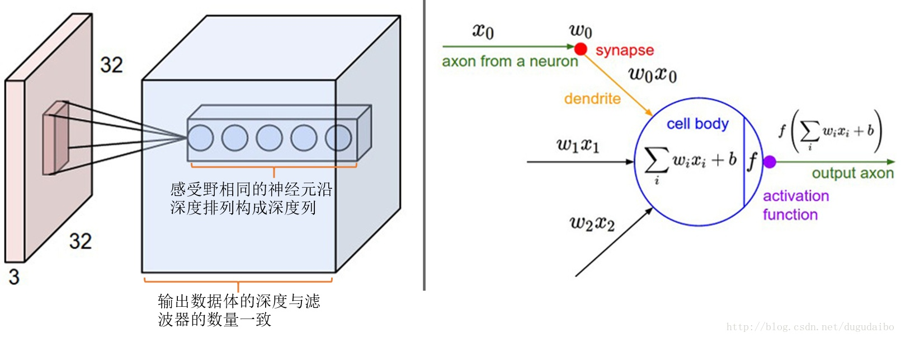
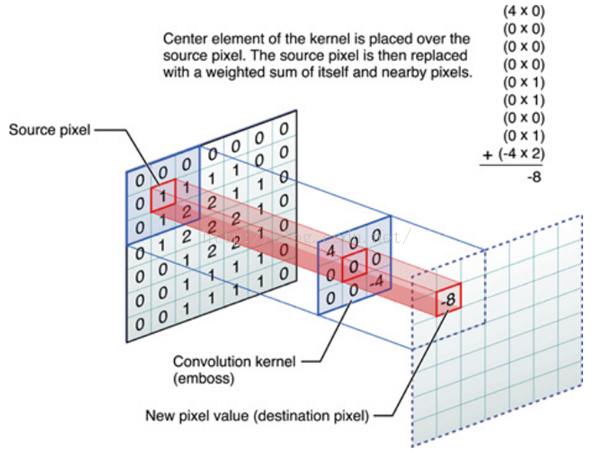
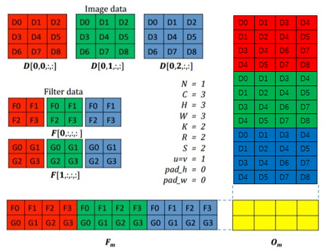
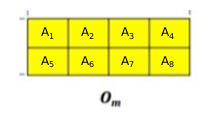
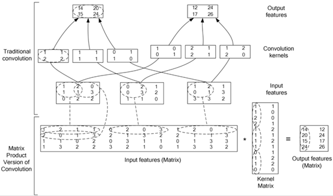

# CNN Basic

Convolutional Neural Networks（CNN，卷积神经网络）在很多领域（CV等等）都已经有很不错的成果。而传统的GPU加速CNN运算方法虽然广泛，但是其功耗比较大，在一些低功耗设备中是行不通的。将CNN部署到FPGA上，也就是在FPGA上实现CNN加速器已经有相当的研究成果，在了解CNN加速器的实现前，当然要先对CNN进行一定的了解。

本文参考于：

1. https://zhuanlan.zhihu.com/p/47184529
2. https://blog.csdn.net/v_july_v/article/details/51812459
3. https://www.cnblogs.com/hejunlin1992/p/8686838.html

## CNN的主要构造

CNN也是神经网络，其本质还是由一个个layer构成的。CNN主要由这几个层构成：输入层、卷积层、ReLU层、池化层和全连接层构成。一般会将卷积层和ReLU层合并为一个卷积层。全连接层和常规的神经网络一样。

### 卷积层

#### 作用

1. 卷积核（滤波器）通常在空间上比较小（宽度高度比较小），但是深度和输入的数据一致，并且其参数是可以学习的，用于挖掘输入中的某些特征。
2. 可以被看做是神经元的一个输出。
3. 降低参数的数量

#### 感受野

由于图像的输入维度非常高，因此将每个神经元和前一层中的所有神经元全连接是非常不现实的，因此，我们可以让神经元只与输入数据中的一部分进行连接，这个连接的空间大小为神经元的感受野（receptive field），它的尺寸称为超参数。实际上感受野的尺寸就是滤波器/卷积核的尺寸。一般来说，感受野的宽和高比输入数据体的尺寸小，但是深度与其一致。

感受野的尺寸以及连接示意

卷积操作

#### 神经元的空间排列

输出数据体的尺寸通过输入数据体的尺寸、感受野的尺寸以及三个超参数控制，这三个超参数分别为：深度（depth）、步长（stride）和零填充（zero-padding）。

1. 输出数据体的深度：等于卷积核的数量，每种卷积核提取图片中不同的信息。
2. 步长：也就是滑动卷积核的步长。步长为1，滤波器每次滑动1个像素。步长为2则每次滑动2个像素。
3. 零填充：在输入数据体的边缘填充0很方便，这个零填充的尺寸也是一个超参数。可以通过零填充来控制输出数据体的尺寸。

输出数据体在空间上的尺寸$W_2 \times H_2 \times D_2$可以通过输入数据体的尺寸$W_1 \times H_1 \times D_1$，以及卷积层中神经元的感受野尺寸$F$、步长$S$，滤波器的数量$K$以及零填充的数量$P$计算得到。
$$
W_2 = (W_1-F+2P)/S+1\\
H_2 = (H_1-F+2P)/S+1\\
D_2=K
$$

#### 权值共享

如同上面所说，如果对于输入数据体中每个感受野都是采用不同的权重值，那么这样的网络中参数的数量是非常巨大的。我们可以把输出数据体中深度维度上一个单独的2维切片看做是深度切片（depth slice），比如一个55x55x96的数据体就有96个深度切片，而每个深度切片上的结果都是使用相同的权重和偏差获得的。也就是说，每种卷积核都在输入数据体上进行滑动卷积，并累加输入数据体各个深度切片卷积得到的数据。

#### 卷积层演示

下面是一个gif图演示卷积运算的过程，其中输入数据体的尺寸为7x7x3，卷积核的尺寸为3x3x3x2，因此输出数据体的尺寸为3x3x2（零填充尺寸为1，步长为2）。

可以看到，数据窗口滑动，导致输入在变化，但中间滤波器Filter w0的权重（即每个神经元连接数据窗口的权重）是固定不变的，这个权重不变即所谓的CNN中的**参数（权重）共享**机制。

#### 使用矩阵乘法来实现卷积

可以发现，卷积的操作实际上做的是内积，但是可以通过一定的方法来将其变换为矩阵乘法，以享受到一些优化过的算法的优势。最典型的方法就是caffe中的[im2col](https://github.com/BVLC/caffe/blob/master/src/caffe/util/im2col.cpp)的实现。

下图就是im2col的实现。首先，将输入数据体各个深度切片对应的感受野排列成一个竖状的向量，并从左到右堆叠。不同的深度切片则从上到下堆叠。对卷积核的操作相似，不过卷积核是排列为一个横向的向量。输入数据体变换得到的矩阵称为$X_{col}$，卷积核变换得到的矩阵称为$W_{row}$。通过将这两个矩阵相乘：$np.dot(W_{row}, X_{col})$，可以得到一个结果矩阵，对该矩阵进行整理后即可得到输出数据体。在下面的例子中，输出数据体的尺寸应该是2x2x2。

im2col的实现示意图1

结果产生的矩阵$O_m$如下：

输出数据体的两个深度切片则为：
$$
O_{f1} = \begin{bmatrix}
A_1 & A_2\\
A_3 & A_4\\
\end{bmatrix}
\quad
O_{f2} = \begin{bmatrix}
A_5 & A_6\\
A_7 & A_8\\
\end{bmatrix}
$$
另一个im2col实现的示意图：

### 激励层

CNN中常用的激活函数是ReLU，是一个很简单的函数：$y=Max(0, x)$。ReLU的优点是收敛快，求梯度简单。

### 池化层

 池化层通常会在连续的卷积层之间周期性的插入，作用是为了逐渐降低数据体的空间尺寸，这样可以减少网络中参数的数量，使得计算资源耗费的更少。池化层最常见的形式就是使用一个2x2的滤波器，以步长为2来对每个深度切片做降采样的工作，一般操作就是使用MAX操作，从4个数字中取最大值，深度保持不变。

### 归一化层

在卷积神经网络的结构中，提出了很多不同类型的归一化层，有时候是为了实现在生物大脑中观测到的抑制机制。但是这些层渐渐都不再流行，因为实践证明它们的效果即使存在，也是极其有限的。

### 全连接层

全连接层实际上就是经典神经网络中的结构，用于分类的目的。对输入进行卷积以及池化之后，就要对这些数据进行拍平（flatten），然后放到全连接层里，使用softmax进行分类。

