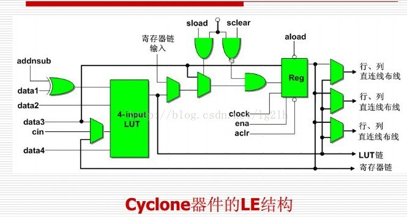
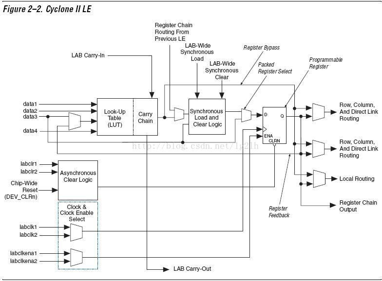
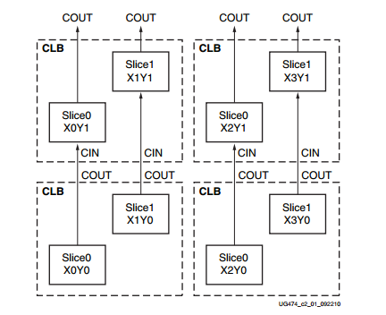
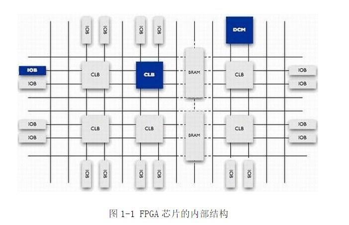

# FPGA逻辑单元基本结构

逻辑单元在FPGA器件内部，用于完成用户逻辑的最小单元。

逻辑单元在ALTERA叫做LE（Logic Element），在XILINX中叫做LC（Logic Cell）。

## 逻辑单元和逻辑阵列

逻辑单元（Logic Element，LE）在FPGA器件内部，用于完成用户逻辑的最小单元。一个逻辑阵列包含16个逻辑单元以及一些其他资源， 在一个逻辑阵列内部的16个逻辑单元有更为紧密的联系，可以实现特有的功能。

一个逻辑单元主要由以下部件组成：一个四输入的查询表（Look Up Table，LUT），一个可编程的寄存器，一条进位链，一条寄存器级联链。

1. 查询表：用于完成用户需要的逻辑功能，如CYCLONE II系列的查询表是4输入1输出的，可以完成任意4输入1输出的组合逻辑。
2. 可编程寄存器：可以配置成D、T、JK、SR触发器。每个寄存器包含4个输入信号，数据输入、时钟输入、时钟使能、复位输入。

一个逻辑单元包含3个输出，两个用于驱动行连接、列连接、直接连接，另外一个用于驱动本地互联。 这三个输出是相互独立的。输出信号可以来自于查询表也可以来自于寄存器。,一个LE主要由两部分组成：查找表LUT+可编程寄存器。

## 本地互连通路

本地互连通路是逻辑阵列的重要组成部分。本地互联通路提供了一种逻辑阵列内部的连接方式，逻辑阵列内部还包含一种对外的高速连接通路，称之为直接连接通路。直接连接通路连接的是相邻的逻辑阵列，或者与逻辑阵列相邻的M4K存储器块、乘法器、锁相环等。

CYCLONE II系列的FPGA逻辑单元有两种工作模式：普通模式和算术模式。普通模式是用于一般的逻辑运算。算术模式适用于实现加法器、计数器、累加器、比较器等。

逻辑阵列的主体是16个逻辑单元，另外还有一些逻辑阵列内部的控制信号以及互连通路。前面所讲的互联通路和直接连接通路就是逻辑阵列中的部分。

逻辑阵列还包括一些控制信号：两个时钟信号，两个时钟使能信号，两个异步复位信号，一个同步复位信号，一个同步加载信号。

## 内部连接通路

在FPGA内部存在各种连接通路，连接不同的模块，如逻辑单元之间、逻辑单元与存储器之间。FPGA内部资源是按照行列的形式排列的，所以连接通路也分为行列的。行连接又分为R4连接、R24连接和直接连接。R4连接简单地说就是连接4个模块，R24就是24个模块。列连接是C4，C16，是连接4个模块和16个模块。

## ALTERA的LE内部结构

## xilinx中的CLB

CLB(Configurable Logic Block)是xilinx基本逻辑单元，每个CLB包含两个slices，每个slices由4个（A,B,C,D）6输入LUT和8个寄存器组成。

同一CLB中的两片slices没有直接的线路连接，分属于两个不同的列。每列拥有独立的快速进位链资源。

Xilinx FPGA芯片主要由6部分组成，分别为：**可编程输入输出单元、基本可编程逻辑单元、完整的时钟管理、嵌入块式RAM、丰富的布线资源、内嵌的底层功能单元和内嵌专用硬件模块**，如下图所示

每个模块的功能如下：

1. 可编程输入输出单元（IOB）

    可编程输入/输出单元简称I/O单元，是芯片与外界电路的接口部分，完成不同电气特性下对输入/输出信号的驱动与匹配要求。

2. 可配置逻辑块（CLB）

    CLB是FPGA内的基本逻辑单元。CLB的实际数量和特性会依器件的不同而不同，但是每个CLB都包含一个可配置开关矩阵，此矩阵由4或6个输入、一些选型电路（多路复用器等）和触发器组成。 开关矩阵是高度灵活的，可以对其进行配置以便处理组合逻辑、移位寄存器或RAM。每个CLB模块不仅可以用于实现组合逻辑、时序逻辑，还可以配置为分布式RAM和分布式ROM。

    一个Slice由两个4输入的函数、进位逻辑、算术逻辑、存储逻辑和函数复用器组成。算术逻辑包括一个异或门（XORG）和一个专用与门（MULTAND），一个异或门可以使一个Slice实现 2bit全加操作，专用与门用于提高乘法器的效率；进位逻辑由专用进位信号和函数复用器（MUXC）组成，用于实现快速的算术加减法操作；4输入函数发生 器用于实现4输入LUT、分布式RAM或16比特移位寄存器（Virtex-5系列芯片的Slice中的两个输入函数为6输入，可以实现6输入LUT或 64比特移位寄存器）；进位逻辑包括两条快速进位链，用于提高CLB模块的处理速度。

3. 数字时钟管理模块（DCM）

    业内大多数FPGA均提供数字时钟管理（Xilinx的全部FPGA均具有这种特性）。Xilinx推出最先进的FPGA提供数字时钟管理和相位环路锁定。相位环路锁定能够提供精确的时钟综合，且能够降低抖动，并实现过滤功能。

4. 嵌入式块RAM（BRAM）

    块RAM可被配置为单端口RAM、双端口RAM、内容地址存储器 （CAM）以及FIFO等常用存储结构。CAM存储器在其内部的每个存储单元中都有一个比较逻辑，写入CAM中的数据会和内部的每一个数据进行比较，并返回与端口数据相同的所有数据的地址，因而在路由的地址交换器中有广泛的应用。

5. 丰富的布线资源

    布线资源连通FPGA内部的所有单元，而连线的长度和工艺决定着信号在连线上的驱动能力和传输速度。FPGA芯片内部有着丰富的布线资源，根据工艺、长度、宽度和分布位置的不同而划分为４类不同的类别。第一类是全局布线资源，用于芯片内部全局时钟和全局复位/置位的布线；第二类是长线资源，用以完成芯片 Bank间的高速信号和第二全局时钟信号的布线；第三类是短线资源，用于完成基本逻辑单元之间的逻辑互连和布线；第四类是分布式的布线资源，用于专有时钟、复位等控制信号线。

6. 底层内嵌功能单元

    内嵌功能模块主要指DLL（Delay Locked Loop）、PLL（Phase Locked Loop）、DSP和CPU等软处理核（Soft Core）。现在越来越丰富的内嵌功能单元，使得单片FPGA成为了系统级的设计工具，使其具备了软硬件联合设计的能力，逐步向SOC平台过渡。DLL和PLL具有类似的功能，可以完成时钟高精度、低抖动的倍频和分频，以及占空比调整和移相等功能。Xilinx公司生产的芯片上集成了 DLL，Altera公司的芯片集成了PLL，Lattice公司的新型芯片上同时集成了PLL和DLL。PLL 和DLL可以通过IP核生成的工具方便地进行管理和配置。

7. 内嵌专用硬核

    内嵌专用硬核是相对底层嵌入的软核而言的，指FPGA处理能力强大的硬核（Hard Core），等效于ASIC电路。为了提高FPGA性能，芯片生产商在芯片内部集成了一些专用的硬核。例如：为了提高FPGA的乘法速度，主流的FPGA 中都集成了专用乘法器；为了适用通信总线与接口标准，很多高端的FPGA内部都集成了串并收发器（SERDES），可以达到数十Gbps的收发速度。Xilinx公司的高端产品不仅集成了Power PC系列CPU，还内嵌了DSP Core模块。

    - 软核
    
    软核在EDA设计领域指的是综合之前的寄存器传输级（RTL）模型；具体在FPGA设计中指的是对电路的硬件语言描述，包括逻辑描述、网表和帮助文档等。 软核只经过功能仿真，需要经过综合以及布局布线才能使用。其优点是灵活性高、可移植性强，允许用户自配置；缺点是对模块的预测性较低，在后续设计中存在发 生错误的可能性，有一定的设计风险。软核是IP核应用最广泛的形式。

    - 固核

    固核在EDA设计领域指的是带有平面规划信息的网表；具体在FPGA设计中可以看做带有布局规划的软核，通常以RTL代码和对应具体工艺网表的混合形式提 供。将RTL描述结合具体标准单元库进行综合优化设计，形成门级网表，再通过布局布线工具即可使用。和软核相比，固核的设计灵活性稍差，但在可靠性上有较 大提高。目前，固核也是IP核的主流形式之一。

    - 硬核
    
    硬核在EDA设计领域指经过验证的设计版图；具体在FPGA设计中指布局和工艺固定、经过前端和后端验证的设计，设计人员不能对其修改。不能修改的原因有 两个：首先是系统设计对各个模块的时序要求很严格，不允许打乱已有的物理版图；其次是保护知识产权的要求，不允许设计人员对其有任何改动。IP硬核的不许 修改特点使其复用有一定的困难，因此只能用于某些特定应用，使用范围较窄。