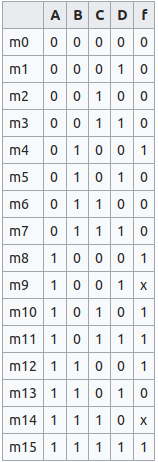
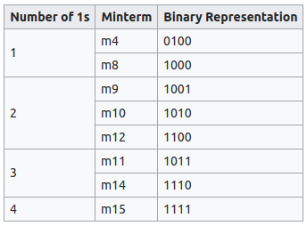
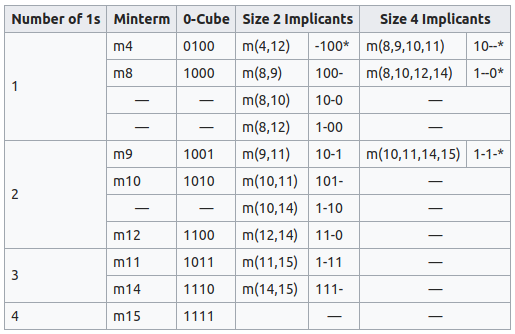
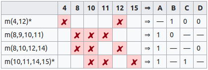

# Quine-McCluskey Algorithm

奎恩——麦克拉斯基算法是对布尔函数最小化的一种方法，由Willard V. Quine提出并由Edward J. McCluskey进行扩展。它在功能上与卡诺图相同，但是它的表格形式使得它能够在计算算法中表现的更有效率。同时它还提出了一种确定性的方法来检查是否是最小化的布尔函数。

该算法包含两步：

1. 找到函数的所有素蕴涵项（乘积项）
2. 使用素蕴涵项图表（包含上一步找到的所有素蕴涵项）来找到函数中本质素蕴涵项，对覆盖这个函数是必须的其他素蕴涵项也同样要使用。

## 复杂度

尽管该算法比卡诺图的最小化要更为实用（4个变量以上的情况下），奎恩——麦克拉斯基算法是NP完全的，该算法的执行时间会随着变量数量的增长而指数上升。对于一个有n个变量的布尔函数来说，它的素蕴含项的个数能达到$3^nln(n)$。有大量变量的函数必须使用潜在的非最优的启发式方法来最小化，如Espresso Logic Minimizer。

## 举例

在这个例子当中，函数的输入是4个变量：$f:{0,1}^4 \to {0,1}$，并且有：

$$ f(A,B,C,D)=\Sigma m(4,8,10,11,12,15)+d(9,14) $$

该函数中，9和14的值不关心。

**第一步：寻找素蕴含项**

首先，我们将函数用真值表的形式表示：

通过真值表可以很容易的写出乘积项的和式：

$$ f_{A,B,C,D} = A'BC'D'+AB'C'D'+AB'CD'+AB'CD+ABC'D'+ABCD $$

显然，这个函数表达式不是最小化的。为了进行最优化，首先将所有的乘积项放进一个最小项表当中，不关心的项同样放进这个表里面：

现在，我们还可以将最小项之间进行合并。如果两个最小项只有一个比特是不同的，那么该比特可以使用一个“-”来表明该比特不需要考虑。不能合并的最小项使用“*”来进行标记。将“-”看作是第3种位值即可：

**第二步：构造素蕴含项表**

此时所有的最小项都不能再合并了，因此构建一个寻找本质素蕴含项的表：

在这个表中，查找只有一个“X”的列，如果有合并的最小项具有这样的列，那么这个最小项就是本质素蕴含项。在上述例子当中，本质素蕴含项就是m(4,12)以及m(10,11,14,15)，其他两个素蕴含项都可以被其他的蕴含项所覆盖。因此，上述的布尔函数可以简化为：

$$ f_{A,B,C,D}=BC'D'+AB'+AC $$

或者

$$ f_{A,B,C,D}=BC'D'+AD'+AC $$
