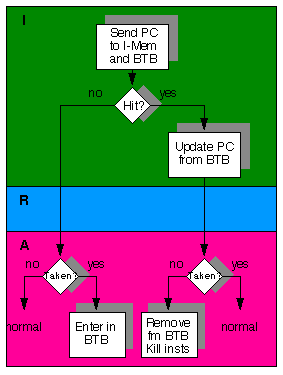

# Branch Target Buffer

Branch Target Buffer，BTB，即分支目标缓冲区，是用于减少分支预测所需时间所使用的功能部件。

使用BTB后分支逻辑

BTB所处的位置是在IF阶段，并且BTB是一个缓存，与数据以及指令的L1缓存一致，挂在流水线上，并且也可以是组相联的。从上图可以看出，BTB的主要作用在于，将以往分支执行目标地址保存起来，如果在取指的过程中发现该指令的跳转目标仍然是这个地址，则直接跳转执行（预测），这是因为大多数代码中的跳转指令来源于循环。