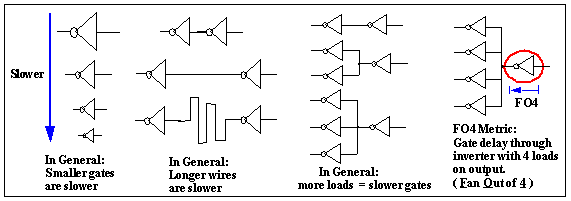
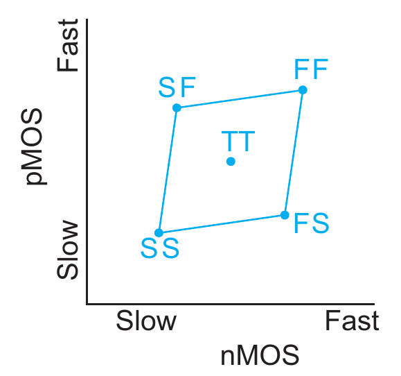

# FO4 and process corners

## Fan-out-four metric

FO4，也就是Fan-out-four，是在计算机体系结构中对数字电路时延的单位。1个单位的FO4，就是指一个反相器，输出驱动4个**同样规格**的反相器所产生的时延。FO4还有一些延伸的一般的概念：

- 一般来说：一个逻辑门输出驱动的逻辑门数量越多，延时越大（more loads = slower gates）。
- 一般来说：更长的线路，延时越大（longer wires are slower）。
- 一般来说：规格越小的逻辑门，延时越大（smaller gates are slower）。

FO4可以用在许多不同的处理器架构下，作为衡量体系结构的一个指标。一些常见的逻辑部件的FO4值(2002)：

- 乘法器：23.3 FO4
- 64位加法器：~7 FO4, 5.5 FO4 (ISSCC96)
- Pentium Willamette's ALU: 12 - 16 FO4

## Process Corners

Process Corners，一般称为工艺角。在设计者的观点来看，CMOS集成电路在工作的过程中由一系列的运行以及环境的变量来决定其nMOS以及pMOS的性能：typical(nominal)、fast以及slow。下图中的蓝色方框所圈住的区域就是Process Corner的范围：

更详细的信息可以参见：*CMOS VLSI Design: A Circuits and Systems Perspective, 4th edition. Section 7.2.4 p244 - p245