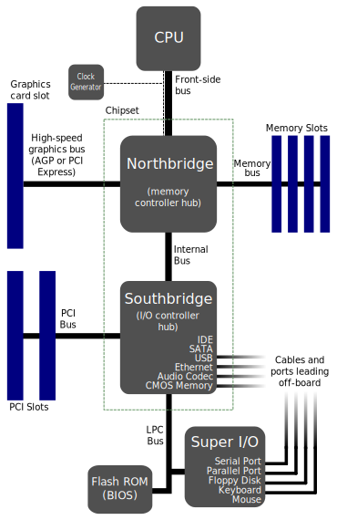
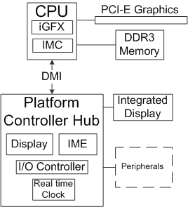
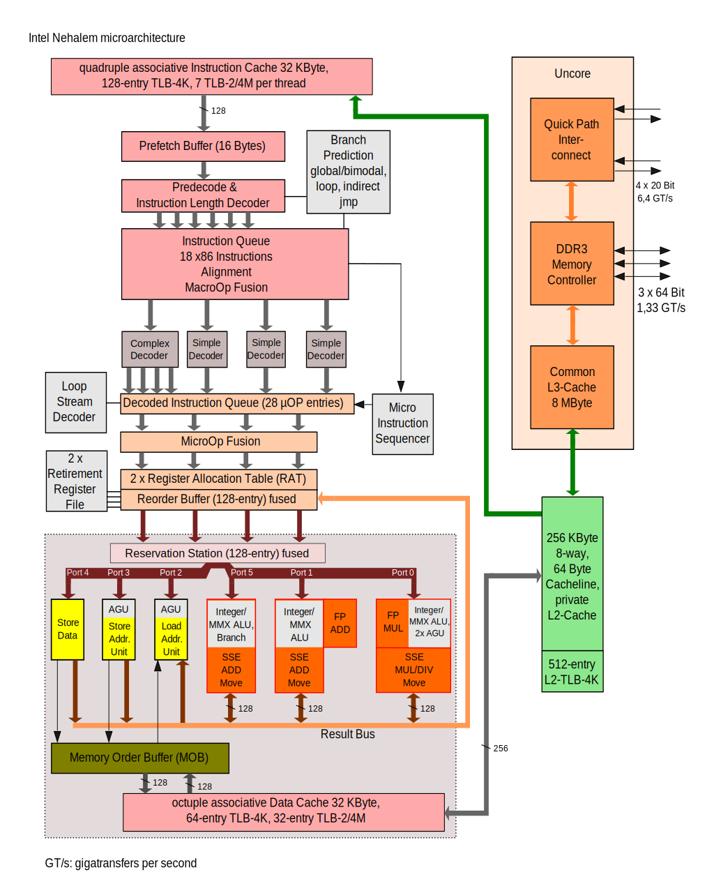

# PCH，IMC，DMI与南北桥

传统的Intel芯片搭配的主板上带有北桥芯片以及南桥芯片，这两枚芯片也称之为主板上的芯片组。其中，北桥芯片（Intel将这一芯片组称为Intel IOH，Intel Controller Hub）被设计为与高速的设备相连接，包括CPU（使用FSB，Front-side Bus，前端总线）、显示卡（PCIe）、内存（内存总线）等等，北桥中还集成有内存控制器。南桥芯片则负责与低速的外设进行连接，包括SATA、USB、以太网等等。

传统的主板南北桥芯片结构

由于CPU的频率不断提高，而FSB的带宽是固定的，Intel使用QPI来替换FSB。这之后，AMD在Athlon 64（2003-2009）的处理器当中集成了存储控制器，称为IMC（Integrated Memory Controller），CPU相当于可以直接访问内存。此时北桥实际上只剩下连接显卡等高速设备的PCIe接口等的功能，此时北桥的重要性不断降低，一些主板产商选择直接将北桥和南桥芯片合并。而AMD则在AMD APU（2011-）上直接在处理器中集成了北桥（包括IMC、高速PCIe以及集成的GPU）。Intel则在第一代的Core i7中将内存控制器集成到了CPU中，Intel IOH的作用只剩下连接显卡的功能。而从LGA 1156（2009）开始Intel集成了北桥，而主板上只剩下了南桥，Intel将其称为PCH（Platform Controller Hub，平台路径控制器），它重新分配各项I/O功能，把内存控制器及PCI-E控制器整合至处理器，PCH负责原来南桥及北桥的一些功能集。处理器和PCH由DMI（Direct Media Interface）连接（部分高阶Intel芯片组还可通过uplink直接连接到CPU，以解决DMI总线的瓶颈问题）即原来北桥和南桥的连接方法。。

基于PCH的芯片组结构

注：
1. DMI（Direct Media Interface，直接媒体接口）是英特尔专用总线。与PCIe总线共享了大量的技术特性。旧时用于南北桥芯片的连接，现今用于CPU与PCH的连接（北桥已经集成到CPU当中）。
2. DIMM（Dual In-line Memory Module），双列直插式存储器模块，指一系列由DRAM组成的模块。DIMM通常是数颗至数十颗DRAM芯片焊接安装于一块已制作好电路的印刷电路板的形式，用于个人计算机、工作站、服务器。

# QPI

Intel开发的一种点对点处理器互联结构，位于处理器芯片中的uncore模块当中。QPI在最简单的结构（单处理器主板）上，QPI用于北桥、南桥芯片、IO Hub以及处理器之间的点对点连接。在更为复杂的架构例子中，则是将一个以上的处理器或者一个以上的IO Hub甚至主板网络上的路由器集线器点对点连接起来。

Intel Nehalem微处理器架构中的QPI，是uncore的组成部分

在无需参与多处理器系统上的CPU当中，处理器的外部连接并没有QPI接口，虽然这些芯片的片上使用QPI来链接处理器与Uncore（IMC、PCIe Controller、内置GPU或整个北桥）的一部分，与CPU直接连接，而不需要使用FSB。这些处理器的外部链接接口则是通过片上的北桥/uncore使用的较慢的DMI或者PCIe连接南桥/PCH或者其他外部设备。在Sandy Bridge（Nehalem继任者）之后开始采用基于QPI派生的环形总线链路连接处理器核以及uncore，同时也保证缓存一致性。