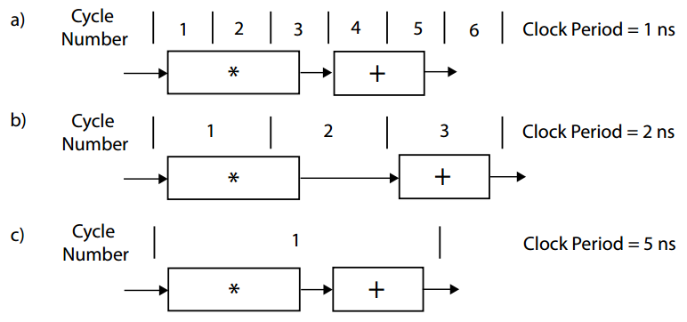

<script type="text/javascript" src="http://cdn.mathjax.org/mathjax/latest/MathJax.js?config=default"></script>

# 有限脉冲响应滤波器

# 概览

有限脉冲响应（Finite Impulse Response，FIR）滤波器在数字信号处理（digital signal processing，DSP）应用领域当中是非常常用的。它非常适合实现为硬件的形式，因为它们的实现可以是高度优化的结构。主要体现在它们是对连续信号元素的线性变换，这对于一些数据结构来说很容易进行映射（比如FIFO或者抽头延迟线），而这些数据结构也可以很容易的在硬件上高效实现。

滤波器的两种基本的使用是用于信号的重建（signal restoration）以及信号的分离（signal separation）。一般来说信号的分离更常使用：对一个输入的信号分离成两个不同的部分，比如，我们可能想用一个低通的滤波器（low pass filter）来除去我们不感兴趣的高频信号。或者我们想使用一个带通滤波器（band pass filter）来得到我们想要的特定频率的信号，在频移键控解调（frequency shift keying dmodulation）过程中隔离频率。信号的重建是指除去可能混入信号中的噪声或者其他失真，比如在无线链路之间的信号传输。信号的重建包括平滑信号以及移除信号的直流部分。

数字FIR滤波器经常用于处理从连续信号中采样到的离散信号。采样的方式有很多种，可以是时间（以固定时间使用AD转化采样天线的电压），也可以是空间（采样由光电二极管组成的图像传感器不同位置的值）。

采样得到的数据的格式根据场景的不同而不同。数字通信一般使用复数来表示一个样本，而在图像处理中一般将一个像素点看作一个样本（RGB值）。

# 背景知识

对给定输入脉冲信号的滤波器的输出信号是称为滤波器的脉冲响应（impulse response）。一个线性时不变的FIR滤波器包含该滤波器所有的信息。顾名思义，FIR滤波器（严格的线性时不变系统）的脉冲响应是有限的。在已知一个FIR滤波器输出相应的前提下，可以通过卷积（convolution）的方法算出该滤波器对于任意输入信号的输出响应。这个运算过程结合脉冲相应的样本（也称为系数或者阶）以及输入信号的样本来计算输出信号。滤波器的输出也可以通过其他方式进行计算(例如，通过频域计算)，在本章中，我们关注时域计算。

在解释FIR的原理之前，首先要简要了解一下有关[卷积](../../../../Mathematics/Convolution.md)的知识。

一个N-阶的FIR滤波器，其输入的信号序列为x，且系数为h，则其输出的可以由x以及h的离散卷积来表示：

$$ y[i] = \sum_{j=0}^{N-1} h[j] \cdot x[i-j] $$

可以注意到，计算N-阶滤波器的输出信号需要N次乘法以及N-1次的加法。

如果使用的是一个N-阶的滑动均值滤波器（moving average filters），那么输出信号可以表示为：

$$ y[i] = \frac{1}{N} \sum_{j=0}^{N} x[i-j] $$

每个输出信号都可以通过上述的方程使用N-1次加法以及最后与1/N相乘的乘法计算得出。显然，滑动均值滤波器要比一般的FIR滤波器的计算要更简单。比如，当N=3时，我们使用下列的公式来计算y[12]：

$$ y[12] = \frac{1}{3} \cdot (x[12]+x[11]+x[10]) $$

这个过滤器是一个因果系统（causal），意味着它的输出只与之前的输入值有关（x[10]、x[11]以及x[12]）。但是这个因果的特性是可以改变的，比如，可以以采样的中间时刻来处理，则有：$ y[12] = \frac{1}{3} \cdot (x[11]+x[12]+x[13]) $。虽然对于系统分析来说，因果是一项很重要的特性，但是在硬件实现上却并不是如此。一个非因果的有限滤波器可以使用缓存以及数据的重排列实现因果的转换。

滑动均值滤波器可以用来平滑信号，比如移除一些随机的噪声（一般来说频率比较高）。阶数N越大，则平均将会基于数量更大的样本，当然此时我们需要做更多的运算工作。对于滑动均值滤波器来说，阶数N越大表示输出信号带宽的减小。本质上来说，它的行为和一个低通滤波器相似（虽然不是最优的）——直觉上确实也是这样，这种平滑的行为也就是在减少高频的信号输出。

滤波器的系数可以改变来实现不同种类的滤波器：低通、高通、带通。更大的阶数则代表着设计滤波器时更大的自由度。以上面滑动均值滤波器的例子来说，滤波器的结构或者特定的系数可以对计算所需要的操作带来很大的影响。比如，一些对称的滤波器会含有多个相同的系数进行分组来降低乘法运算的次数。在其它的情况下，可以将乘法运算转化为移位以及加法运算。在这种情况下，系数的值可以大幅度的改变滤波器实现的性能以及面积需求。

# 基本的FIR架构

考虑下面的11阶FIR滤波器代码：

```C
#define N 11
#include "ap_int.h"  

typedef int coef_t;
typedef int data_t;
typedef int acc_t;

void fir(data_t *y,data_t x){
    coef_t[N] = {
        53,0,-91,0,313,500,313,0,-91,0,53
    };
    /* 静态数据，shift_reg需要反复使用 */
    static
    data_t shift_reg[N];
    acc_t acc;
    int i;
    acc = 0;
    Shift_Accum_Loop:       /* <- 不是必须的，但是可以方便Vivado HLS工具进行调试 */
    for(i = N - 1;i >= 0;i--){
        if(i == 0){
            acc += x * C[0];
            shift_reg[0] = x;
        }else {
            shift_reg[i] = shift_reg[i - 1];
            acc += shift_reg[i] * C[i];
        }
    }
    * y = acc;
}
```

显然，上述的函数需要调用多次才能产生输出信号。上述代码对于构建一个基于流的架构来说很方便，因为我们可以反复调用这个函数很多次来使得更多的数据输出可用。可以发现滤波器的系数是对称的，可以在很多的FIR滤波器中发现这种对称性。我们可以使用这种对称性来减少c数组的存储空间。

typedef的使用虽然是非必要的，但是对于改变数据类型来说很方便。在后面我们将会提到，这种方式对于位操作来说非常的简便。

这种流式函数结构，每次接收样本中的一个值，返回一个输出信号的值。由于阶数为11，因此我们需要存储前10个数据。

上面的实现没有提供任何对FIR滤波器实现更为有效的因素。这是一个高度顺序执行的，以及大量不必要的控制逻辑的代码。

# 计算性能

一些比较常见的性能衡量的单位包括：运算速度为X bits/second；或者执行Y operations/sec。还有就是乘累加操作：MACs/second。

HLS的工具关心的是设计上的时钟周期数以及时钟频率。频率则和时钟周期成反比。时钟周期和时钟频率都同样重要，一个只需要一个时钟周期，但是时钟频率很低的设计，不一定比需要10个时钟周期，但是时钟频率很高的设计要好。你可以使用create_clock命令来给HLS工具指定一个特定的频率，但是需要注意的是，这个频率只是一个目标的频率，主要影响工具优化代码为多少个运算操作。在生成RTL之后，Vivado HLS工具在这个时钟频率进行目标初始时序估计。然而电路性能还有一些不确定性存在，只有当设计在全部布局布线之后电路性能才能确定。

虽然提升频率一般来说会得到更高的性能，但是提高目标时钟频率对于整个系统的优化来说并不是必要的。更低的频率可以使得工具有更多的余地去组合多个相关的操作，这个过程称为操作链接（operation chaining）。在这个过程中有些情况下可以通过提高逻辑综合优化效果和增加适配器件的代码规模来提高性能。改进的操作链接可以提高(或者降低)流水处理数据输入间隔。一般来说提供一个频率约束但是这个值不会超过实际运行时钟的频率，将时钟周期约束在5~10ns一般来说是个不错的选择。

当我们实现了流水线或者其他的优化手段的时候，计算性能变得更加的复杂。在这种情况下，了解任务间隙以及任务延迟的不同是很重要的。

# 操作连接

操作连接在Vivado HLS中是一个很重要的优化步骤，对最终的设计进行优化。考虑FIR滤波器中的乘累加操作，假设加法操作需要2ns完成，而乘法操作需要3ns才能完成。如果将时钟周期设定为1ns（时钟频率为1GHz），那么一个MAC操作需要5个周期才能完成。



上图中的图a表示的就是上述的情况。因此每秒可以完成$ 2 \times 10^8 $次MACs。如果将时钟周期设定位2ns，那么乘法需要2个周期，加法要在第三个周期才能开始，此时一共需要6ns完成一次MAC操作，此时每秒可以完成大概$ 1.67 \times 10^8 $次MACs，如图b所示。如果将时钟周期的长度设定为5ns，那么MAC操作则在1个周期内完成，那么在每秒让然能够完成$ 2 \times 10^8 $次MACs，如图c所示。

显然，在Vivado HLS工具中，时钟周期的长度在优化设计方面起到重要的作用。由于Vivado HLS对不同的时钟频率可以生成不同的硬件结构。因此整体性能的优化和最佳目标时钟周期的确认仍然需要用户的创造力。在大多数情况下，我们建议坚持在小范围时钟周期内进行优化。

# 代码提升

在上述的例程代码当中，for循环中的if/else语句是低效的。对于代码中的任何控制结构，HLS工具都会创建一个逻辑硬件来检查是否满足条件，并且会在每次循环中执行一遍。更糟糕的是，这些条件结构会限制if或者else分支中语句的执行；这些语句只有在条件语句执行后才能得到执行。

if语句中检查当x是否为0，实际上，x等于0的情况只有在最后的循环中才回发生。因此if分支中的语句可以“悬挂”（hoisting）到循环的最后执行，然后，在循环中去除if/else的控制流结构。修改后代码为：

```C
Shift_Accum_Loop:
for(i = N-1;i > 0;i--){
    shift_reg[i] = shift_reg[i-1];
    acc += shift_reg[i] * c[i];
}

acc += x * c[0];
shift_reg[0] = x;
```

优化的结果使得实现更加的紧凑，可以方便为之后对循环的进一步优化，比如循环展开以及流水线。
