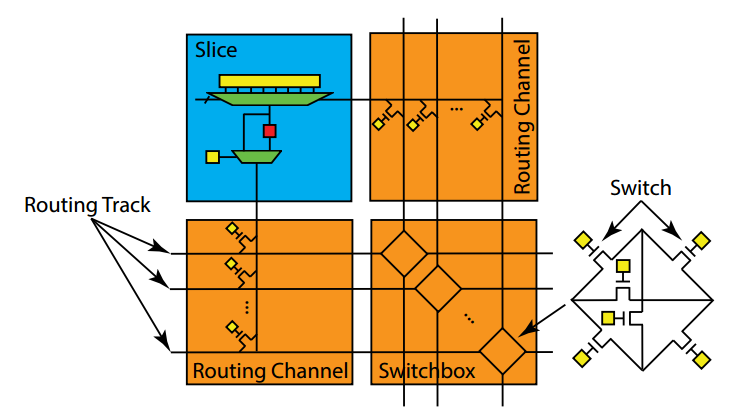
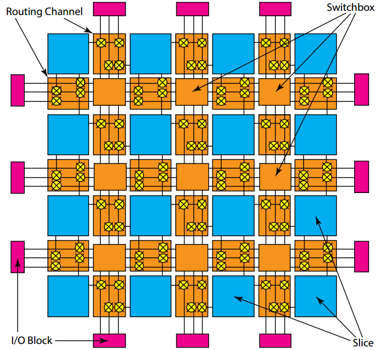
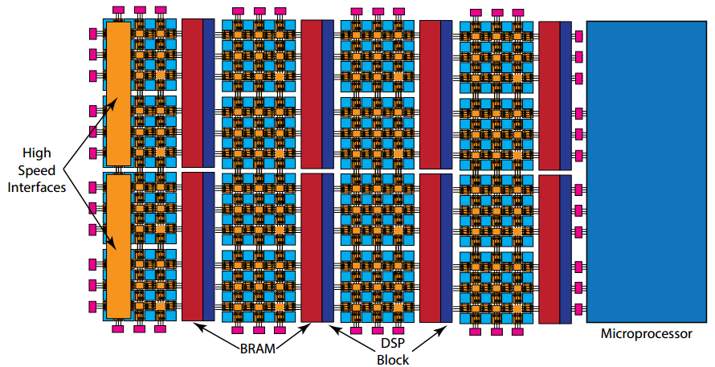
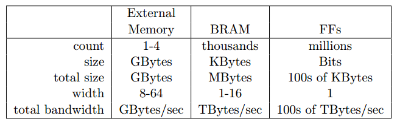
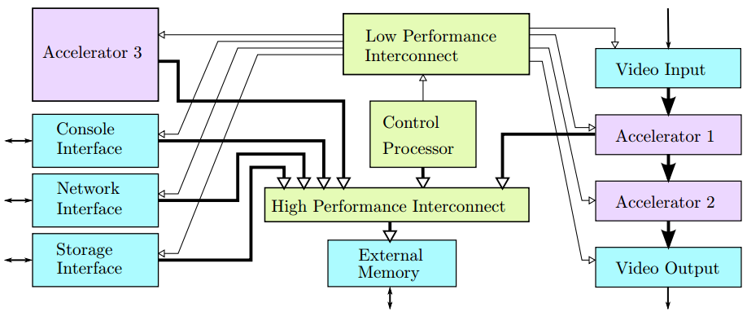
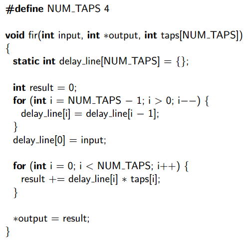
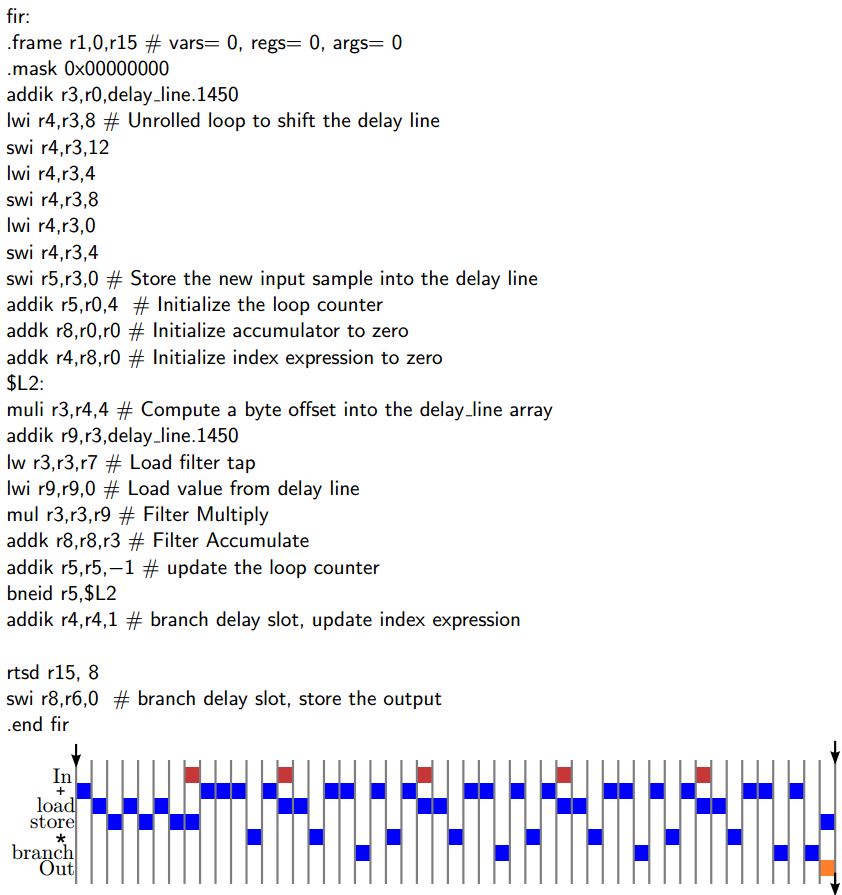
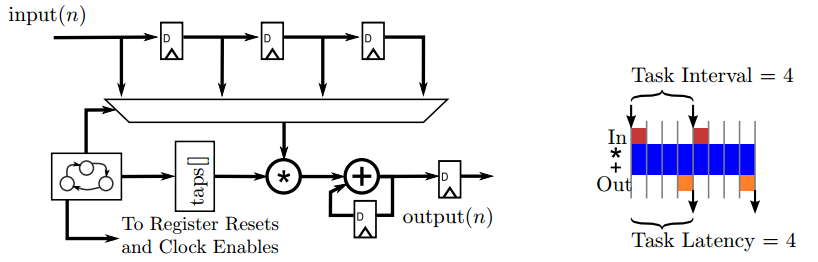
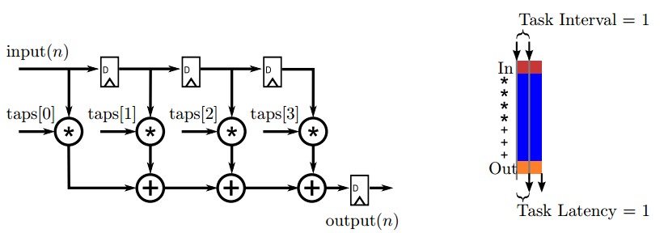
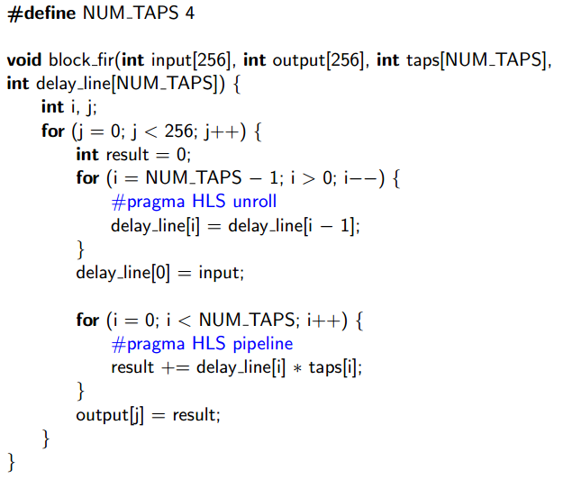

# 简介

这类文章系列是阅读 Parallel Programming for FPGAs 所做的笔记。同时参考了中文的gitbook翻译：https://xupsh.gitbook.io/pp4fpgas-cn

# High-level Synthesis(HLS)

最早期的芯片设计由于其结构简单的特性，设计人员往往可以直接使用半导体来进行手工设计。随着芯片复杂度的提高，设计人员开始往抽象的设计方式进行过渡。上世纪80年代的Verilog/VHDL语言是抽象化的第一步，由此带来的是芯片硬件复杂度的指数级增长。RTL（register-transfer evel）级的描述则是抽象程度的又一次提高，它使得设计者可以只关注寄存器以及在寄存器上的操作，而不需要关心寄存器是如何实现的。EDA工具（electronic design automation tools）可以先把RTL转化成数电模型，再由模型转换成一个设备上的具体电路实施方案。所谓“方案”其实就是编译出的文件，这些文件可以用于规定某个自定义设备，也可以用于编程一些现有的设备，比如FPGA（field-programmable gate array）。

高层次综合（High-level Synthesis，HLS）是抽象程度的又一次提升，它允许设计者着眼于更大的体系结构性的问题而不是单一的寄存器中每个时钟周期的操作。在HLS设计中，设计者所要关心的行为不包括特定的寄存器或者时钟特性，并且一个HLS工具负责产生RTL级的微结构。早期的HLS工具都是基于行为式的Verilog，并且通过Verilog产生RTL。如今很多商用的HLS工具使用C/C++作为前端的语言。

总的来说，现在HLS可以自动完成以前RTL设计师需要手动完成的工作包括：

- HLS自动分析并利用算法中的潜在并发性。
- HLS自动在需要的路径上插入寄存器，并自动选择最适合的时钟。
- HLS自动产生控制数据在一个路径上出入方向的逻辑。
- HLS实现的接口会自动连接到系统的其他部分。
- HLS将数据映射到储存单元来平衡资源的使用以及带宽。
- HLS自动将程序中计算的部分对应到逻辑单位，在实现等效计算的前提下自动选取最有效的实施方式。

一般来说，HLS的目标就是使得设计者所提供的输入以及一些限制条件来替设计者完成很多的决定。

然而，HLS工具还不能强大到能处理任何的软件代码。很多在软件编程中所使用的概念在硬件设计当中是很难实现的。一般来说，HLS需要设计者在代码中添加一些额外的信息（如#pragmas）来使工具能够生成更为高效的设计。HLS一般来说无法处理动态内存分配，对标准库的支持也很少。系统调用在硬件设计中更是禁止使用来降低设计的复杂性。递归一般来说也禁止使用。另一方面，HLS工具所能处理的范围非常广，包括DMA、流、片上内存访问等等，还能使用更为先进的优化技术如流水线、内存分块、位操作等等。

在Vivado HLS工具中定义了如下的规范：

- 不使用动态内存分配，如malloc()、free()、new、以及delete()。
- 减少使用指针来对指针进行操作。
- 不支持系统调用，如abort()、exit()、printf()。它们可以在测试例程中使用，但是在综合的时候会被忽略（移除）。
- 减少对标准库的使用。一般来说math.h是支持的，但是其他的标准库基本不支持。
- 减少使用函数指针以及C++类中的虚拟函数。（函数调用必须在编译时就由编译器完成）
- 不使用递归函数调用。
- 接口必须准确进行定义。

一个HLS工具的主要输出就是RTL级别的硬件设计。此外，HLS工具还可以输出测试的样例来验证设计。最后，工具还会提供对资源使用以及性能的大致估计。Vivado HLS会生成如下的输出：

- 可综合的Verilog和VHDL代码。
- 基于设计所生成的测试平台，可以进行RTL级别的仿真测试。
- 对性能以及资源使用的静态分析。
- 设计边界上的原数据可以使工具将设计更简单的组合成一个系统。

当一个RTL级别的设计生成之后，大多数的HLS工具则会进行标准的RTL设计流。在Xilinx Vivado的设计套件中，首先进行的是逻辑综合，将RTL级的设计转化成FPGA逻辑部件的连线表（netlist）。连线表（包括逻辑部件以及它们之间的连线）与目标设备中可用的资源相关联，这个过程称作布局以及布线（PAR，place and route）。对FPGA中资源最终的配置被写入一个比特流的文件中，可以上传到FPGA中实现。比特流文件实际上用每个位来代表对每个FPGA资源的配置，包括逻辑部、连线以及片上内存的配置。

# FPGA 体系结构

FPGA由一个可编程的逻辑块阵列以及存储部件组成，它们之间的连接使用可编程的内部连接。通常来说这些逻辑块会实现成查找表（lookup table，LUT）的形式——一种存储单元，输入的是地址信号而输出的是存储的内存单元。一个N位查找表可以以一个N位输入真值表的方式来表示。

上图a展示了一个2输入的LUT，也就是一个2-LUT。4个可配置的比特都可以用来编程以改变2-LUT的功能使其成为一个完整的可编程的2输入逻辑门。图b展示如何配置一个2-LUT使其称为一个与门，如上图所示，将Bit0~2配置为0，Bit3配置为1，就可以使得只有在两个输入都是1的时候，输出为1,。图c展示了一个简单的slice，里面含有稍微复杂的3-LUT结构，带有将输出存储到一个触发器（FF）当中的功能。需要配置的一共有9个比特，其中8个比特用于配置3-LUT，另外一个用来决定输出直接来自于3-LUT还是触发器。通常来说，一个slice会定义成一个包含有少量LUT以及触发器，并且在LUT以及触发器带有组合逻辑电路连接。

通过对配置比特的重新编程，FPGA板的功能可以很轻松的改变。大多数的FPGA使用的LUT带有4~6个输入的比特，这些LUT作为它们基本的计算部件。大型的FPGA可以拥有数以百万计的LUT。

触发器是FPGA中基本的存储单元。它们一般会和LUT一起组合成更为复杂的逻辑部件来称为一个可配置的逻辑块（configurable logic block，CLB）或者一个逻辑阵列块（logic array block，LAB）或者slice，这取决于你的设计工具或者供应商。一般来说，一个slice拥有LUT、触发器以及Mux（多路选择器）的数量并不会太多。一个slice也有可能使用更多更为复杂的逻辑功能器件。比如，slice中一般会带有一个全加器，这是因为在设计中全加器的使用太过于广泛，因此将所有的slice都配置有一个全加器带来更好的设计效益。

可重编程的内部互连也是FPGA另一个关键的要素。它提供了slice之间灵活的连接方式。slice的输入输出与连线通道相连。这个连线通道包含一组比特用来配置各个slice的输入输出之间是否相连。而通道本身则与开关盒相连。开关盒由很多传输晶体管充当的开关所组成，它的工作便是连接通道与通道。

上图提供了一个slice与连线通道以及开关盒之间的连线的例子。slice当中的每个输入输出都应该和连线通道的其中一条路线相连。可以将连线通道中的其中一条路线想象成一个单比特的连线。

一个开关盒为相邻的连接通道的连接路线提供了相连的矩阵（以类似矩阵的形式提供）。典型来说，一个FPGA可以看作是一种2D的逻辑表达形式，能够给设计者带来2D的抽象计算模型，这个通常称为岛状结构（island-style），其中slice表示一个“逻辑岛”（logic islands），slice之间通过连线通路以及开关盒来互相连接。

上图是一个2D的FPGA结构。可以看到，输入输出的块会提供一个外部的接口，可以连接到内存、微处理器、传感器等。在一些FPGA结构当中，IO会直接和片上的引脚进行连接。而在其他的一些FPGA当中会使用这些IO口和一些可编程的逻辑构造相连接通到片上的资源（一个微处理器总线或者缓存）。FPGA可编程的逻辑使用IO块来与外部设备进行沟通，可以是一个微控制器（一块片上的使用AXI总线接口的ARM处理器），可以是内存（片上的缓存或者片外的DRAM内存控制器），可以是传感器（AD）或者一个马达等。现今的FPGA片上都会集成有IO控制器，如内存控制器、AD转换、收发器等等。

现代的FPGA一般会在实现效率与灵活性之间做出平衡，并且，变得越来越多异构化，可能拥有大量不同的可编程的逻辑块以及一些预先配置好的体系架构的部件如寄存器组、自定义的数据路径以及高速的内部连接。下图是一个实现了DSP块的FPGA结构（专用于算术逻辑运算，特别是加法与乘法的预定义块）：

一个BRAM（block RAM）也是另一种预先配置好的资源的例子。BRAM是可配置的随机访问存储器模块，支持不同的内存形式以及接口。它们可以存储字节、半字、字或者双字。BRAM还可以把这些数据传输到连接到片上的总线接口（与可编程逻辑交流）或者处理器的总线（与片上处理器交流）上。一般来说，BRAM的作用是在片上资源之间传输数据（FPGA可编程逻辑以及片上微处理器）以及存放大的数据集。也可以在slice上对这些数据进行配置来存储（通过触发器），但是这样会带来额外的性能以及资源利用的开销。

典型的BRAM拥有大概32 Kbit的存储资源。它们可以配置成32K x 1bit，16K x 2bits，8K x 4bits等等。它们也可以相互级联来组成更大的存储。BRAM一般会和DSP48放置在一起。对于HLS来说，将BRAM看作是可配置的寄存器组更有益处。这些BRAM可以直接输出到自定义的数据路径（DSP48），并与片上的微处理器交流，传输数据给实现了可编程逻辑的自定义数据路径。下图是外部内存、BRAM以及触发器之间的比较：

随着片上的半导体变得越来越多，越来越多复杂，目前FPGA上集成的预先配置好的资源也越来越多复杂。现代的高端FPGA上可以集成多个微处理器核。一般来说，现在的小型的FPGA核也会继承一个微处理器核，这使得可以在片上运行操作系统，因此可以带来更多的功能，包括与外设交流、跑大型的软件程序如OpenCV，使用高级变成语言来设置系统以及快速运行相关的程序。微处理器一般会作为系统的控制器。它会控制从片外的内存、传感器到BRAM之间的数据流。并且微处理器还能协调各种IP核，包括HLS自带的IP核以及第三方的IP核与片上资源之间的关系。

# FPGA设计过程

FPGA设计通常由一个个大的部件或者IP核组成，如上图所示，一个假设的嵌入式FPGA设计过程，包括IO接口核、标准核以及特定应用加速器核的设计。注意到加速器核可以有流接口（加速器2）或者内存映射接口（加速器3），或者两者都有（加速器1）：

在靠近IO引脚的地方，会有少量的逻辑块实现一些关键的IO功能以及协议，比如内存控制块、视频接口核或者AD转换等。这个逻辑称为IO接口核（I/O interface core），一般来说会实现成结构化的RTL，经常带有额外的时序限制。时序限制的目的是阐明信号本身与信号变化规则之间的时序关系。IO接口核心在不同的FPGA架构上差别很大，一般由产商来提供。

除了IO引脚，FPGA设计还会包括标准核（standard cores），比如处理器核，片上内存以及内部连接开关。其他的标准和包括通用的、功能固定的处理部件，比如滤波器、FFT、编解码器等。这些核心的参数和接入方式在不同的设计中相差很大，但它们并不是在设计中真正造成差异的部件，相反他们是相对"水平的"技术部分，可以被插入到各类不同的应用领域。FPGA厂商同样也提供这些模块，但设计师其实很少情况下接触到它们。与IO接口核不同的是，标准核心主要是同步电路，它除了时钟时序限制之外不大有限制，因此这种核可以在不同的FPGA家族当中实现，因为它们的电路结构依然是高度优化过的。

近期FPGA的设计会包含自定义的，面向特定应用的加速器核（accelerator cores）。加速器核主要也是由时钟限制的同步电路组成的。HLS的关键也在于，如何快速而高校的设计出加速器核并很快的将其与系统相整合。

在继承上述设计的时候，有两种常用的设计方法。一种是将HLS生成的加速器核看成是其他核。用HLS创造出这种核之后把他们与IO接口核和标准核组合到一起，得到一个完整的设计。这种方法就称为以核为基础的设计方法（core-based design methodology），与不使用HLS进行FPGA设计开发相似。另外一种比较新的设计方法专注于标准的设计模板或者平台，这种方法下设计师先用IO接口核和标准核组合出一个样板，称为以平台为基础的设计方法（platform-based design methodology），可以使使用高级语言的程序员快速将多种不同的算法或者规则集成到提供单一平台或者shell的接口当中。同时它还能很容易的将加速器从一个平台移植到另一个平台。

# 设计优化

## 性能特点

计算的时间通常是一个很重要的设计性能质量的指标。当描述同步电路的时候，一般会使用时钟个数来作为性能衡量的指标。然而这对于有着不同时钟频率的架构来说是不适合的，这种情况在HLS中是很典型的。HLS可以根据时钟的不同来生成不同的架构。秒数则是一个比较恰当的指标，在HLS工具中（比如Vivado HLS）会回报程序执行的时钟周期个数以及时钟频率。

我们使用任务（task）来作为行为的一个基本单位。任务延迟（task latency）就是任务开始到任务完成中间的这段时间。任务间隔（task interval）则是任务开始到下一个任务开始之间的这段时间。所有任务的输入、输出以及计算都计算在任务延迟的时间之内，但是任务的开始不一定是读取输入，同样任务的结束不一定是写输出数据。在很多的设计当中，数据率（data rate）是一个关键的设计目标，依赖于任务间隔以及函数参数的多少。

上图展示了对一写假想应用的两种不同的设计方式。左边的图表示每个周期都执行新任务的结构设计，这是一种完全流水（fully-pipelined）的设计。右边的图表示的则是一个完全不一样的结构，系统每次读取四段输入，处理数据，然后再合成一个4段数据的输出。这种结构的任务延迟和任务间隔是一样的（13个周期），并且每一周期内只有一个任务在执行。这种架构和前者完全不同，前者在任何时刻都会有多个任务在同时执行。HLS中的流水线的思想和微处理器中的流水线很相似。然而，不同于使用简单的5级流水线，最后把结果写入寄存器组的方法，在Vivado HLS工具中，会构造一个只适用于特定板子，完成特定程序的电路。工具可以优化流水线级的数量，初始间隔（流水线连续读取两组数据之间的时间——与任务时间间隔相似），函数单元的数量以及类型和它们之间的互连情况（基于特定的程序以及设备）。

Vivado HLS工具通过计算输入与输出之间最大的寄存器数量来决定周期，因此0周期的情况是存在的（组合逻辑电路）。另一种方法是将输入和/或输入看作是一个寄存器来找到路径上最多的寄存器数量，这种方法一般会导致大量的周期产生。

## 面积与生产力（Throughput）的取舍

考虑一个简单的通用硬件函数——有限脉冲响应（finite impulse response，FIR）滤波器。FIR会对输入做固定系数下的卷积，它可以被用作充当各式滤波器（高通，低通，带通），最简单的FIR可能就是一个移动平均滤波器。这在之后会详细提到，现在只考虑高层次抽象实现的问题。

上图是HLS中对一个功能或者一个任务的描述；上述的代码可以直接作为HLS工具的输入，然后会将其进行分析并产生对应功能的RTL级别的电路描述。可以把这个过程想象成一个编译过程，使用了一个类似于gcc一样的编译器，但是产生的不是汇编代码，HLS的“编译器”会产生RTL级的硬件电路描述。然而，理解HLS编译器的工作原理也是很重要的，因为像内存排布、流水线以及不同的IO接口对于HLS来说是很重要的，但是对于软件编译器来说并不重要。

产生电路的方式有很多种，这取决于你所使用的HLS工具是什么。一种可能的电路会顺序执行你的代码，就像一个简单的RISC处理器一样。此时，你可以想象成上述的代码编译成了能够在片上的微处理器运行的软件代码一样。下图是Xilinx Microblaze处理器对FIR滤波器生成的汇编代码：

假设每个周期发射一条指令，那么这段代码需要大约49个周期才能够输出滤波器的一个结果。显然，在这段代码中，对性能最大的一个障碍就是每个时钟周期能够执行多少条指令。HLS的其中一个特性就是，体系架构方面的取舍，可以脱离指令集架构的约束进行。在HLS的设计中，通常产生的体系架构会在每个时钟周期发射数百个甚至上千条RISC指令，而流水线的深度可以达到数百个周期。

Vivado HLS默认会生成一个优化的，大型的线性体系结构，在这其中，循环以及分支会转换成控制逻辑如控制寄存器以及相关的功能单元。概念上来说，这和RISC处理器的执行是很相似的，除了所要执行的程序转化成RTL级的有限状态机而不是从程序存储中获取指令执行。顺序化结构可以从大多数程序中生成，无需对原代码做太多的修改和优化，所以对HLS初学者非常的简单。但它同样存在一些缺陷。顺序化的结构很难解析码流，主要出于控制逻辑的复杂度。另外，控制逻辑负责规定任务延迟和任务间隔。顺序化结构的性能有时取决于处理的数据。

然而，Vivado HLS还可以生成高性能的流水线以及并行的架构。其中一个很重要的架构称为函数流水线（function pipeline）。一个函数流水线的架构将函数中的所有代码都看作是计算路径的一部分，以及一小部分的控制逻辑。代码中的循环和分支会转化为非条件的结构。结果是，这种架构相对来说比较简单，容易进行分析和理解，并且通常用于简单的、高数据率的设计，其中数据会连续的进行处理。函数流水线在大型的设计中比较有用。其比较明显的缺点是，不是所有的代码都能够有效的并行化处理。

Vivado HLS工具可以通过在函数体中声明 #pragma HLS pipeline 来产生一个函数流水线。这个指令需要一个参数来声明流水线的起始间隔，也就是函数流水线的任务间隔。下图展示了一种潜在的设计模式——一个“每周期一抽头”（one tap per clock）的架构，包括一个乘法器以及一个加法器来计算滤波器：

这个实现的任务间隔为4个时钟周期，任务延迟也是4个时钟周期。这种架构会在每4个时钟周期获取一个新的输入到滤波器中的样本并在输入4个周期后产生一个新的输出。下图是另外一种实现的方式，称为“每周期一样本”（one sample per clock）的体系结构，包括4个乘法器和3个加法器：

这个实现的任务间隔为1个时钟周期，任务延时也为1个时钟周期，表示在这个实现中每个时钟周期都会接受一个新的输入样本。

在实际操作当中，复杂的设计通常包含在顺序架构以及并行架构之间复杂的取舍。而在Vivado HLS当中，这种大量的取舍都会交由用户去完成。

## 处理速率的限制

任何处理的架构当中任务间隔的大小都会有多种不同的基本限制。最重要的限制来源于递归（recurrences）或者设计中的反馈循环（feedback loops）。其他的一些关键的限制因素则来源于资源的限制。

递归（recurrences）的意思是，当前一个部件的计算依赖于现在在同一个部件上的计算结果。一个比较重要的概念是：递归是限制设计生产力的主要因素，即使是在流水线结构中也是如此。因此，对于HLS工具来说，分析算法中的递归并且生成正确的硬件结构是HLS工具的重要功能之一。类似的，理解算法并且尽量避免大量递归的实现也是HLS的重要功能。

递归在很多代码结构中都会出现，比如静态变量，顺序的循环。它存在于很多顺序化结构中，也有很多会随着改编成流水结构而消失。对于顺序化结构递归有时候不影响处理速率，但是在流水结构中是一个很不理想的状况。

另外一个对处理速率的限制就是资源本身的限制。资源限制的其中一种形式是设计边缘的跳线所致，因为一个同步的电路每根跳线每周期只能捕获并且传输一个比特的数据。结果就是，如果一个声明为int32_t f(int32_t x)的函数，实现在单一一个块中，且频率为100MHz，任务间隔为1个时钟周期，那么其最大的处理速率就是3.2GBits/s。另外一种资源限制来自于内存，因为绝大多数的内存每个时钟周期只支持有限次数的访问。还有一些其他的限制来自于用户的限制。

## 代码风格

代码风格虽然是某种风格的表现，但是有时候它确实会限制HLS工具从代码中生成的架构。

举例来说，如下图所示，工具根据下面的代码会产生特别的架构。。这个情况下延迟线被展开，乘积的for循环都被用流水的方式实施，产出的结构会与“每个周期一个样本”的架构类似：

# 重构代码

重构代码（Restructured code），在很多的情况下对于工具链来说都是很难理解的行为，需要对算法以及硬件结构有很深刻的了解。一般来说现成的算法原代码产出的结构比普通的CPU程序还低效，即使使用流水，展开等方法也没起到太大的作用。所以最好的方法还是自己写出一个等效但适合高层次综合的算法。

重构代码与其原先软件的实现区别很大——即使是高度优化过的也是如此。一些研究表明，重构代码是产生高效FPGA设计的必要步骤。因此，为了得到高效的硬件设计，用户需要在重构代码的过程中随时对底层的硬件结构映入脑海当中。

在接下来的章节中，会讨论几个不同的且常用的算法应用，来展示如何重构代码来产生更为高效的硬件设计，包括有限脉冲响应（FIR），离散傅里叶变换（discrete Fourier transform，DFT），快速傅里叶变换（fast Fourier transform，FFT），稀疏矩阵乘向量（sparse matrix vector multiply，SpMV），矩阵相乘（matrix multiplication），排序以及赫夫曼编码（Huffman encoding）。
