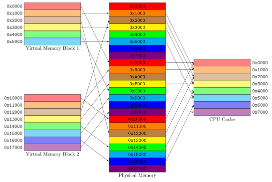
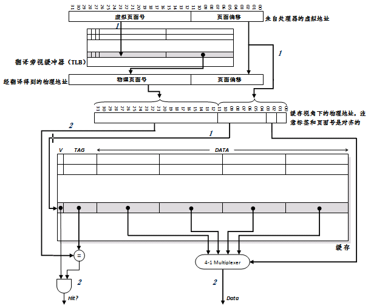

# 分页虚拟内存

现代操作系统一般使用的是分页管理的内存模式，PC机上的操作系统一般来说分页大小是4KB。

通过页表将虚拟地址转换为物理地址，实现这个功能的单元一般称作MMU（Memory Management Uint）。页表一般位于内存当中。页表还会标识该虚拟地址是否映射了相应的物理地址，如果没有，则说明对应的页并不在物理内存当中，由此会引发一个页故障（中断/异常），并调用操作系统中的分页管理单元（Paging Supervisor Component）来进行处理。

不同操作系统页表的形式也不一样，可以是单一页表（整个内存实现一个页表），此时在同一时刻运行的不同的应用会各自在虚拟地址空间中分配不同的一段虚拟地址（可以达到保护的作用）。也可以是每个应用一个页表，也可以是树状的页表等等。

## 分页管理单元

分页管理单元创建并且管理页表。如果硬件产生了一个页故障异常，那么分页管理单元会访问次级的存储器，将所请求的页面换入内存当中。如果此时内存已经满了，那么就需要换出在内存中的某个页面，这需要换页算法，典型的比如LRU（Least Recently Used，最近最少使用）。

## 不可交换的页面

一些页面在一段时间内，或者是永远不可交换的，称为Pinned pages。典型的这类页面如中断向量表（包含IO以及页故障相关的），因为从次级存储交换页面的时间是非常长的，而异常或者中断被延迟是无法忍受的事情。

- 包含与分页管理单元相关的代码以及次级存储相关的驱动代码页面，必须永久不可交换。因为如果这段代码不在内存中，那么换页操作根本无法进行。
- 包含与定时相关的功能代码的页面，也应该尽量保持不可交换，以防因为换页操作带来的延迟。
- 包含使用DMA或者IO通道技术直接访问内存的串口设备正在使用的数据缓存的页面，也不可以交换。因为在传输完成之前，该页面不可以被换入次级存储，也就是说不能够发生页故障。

## Thrashing

如果花费大量的时间在换页操作上，这种情形称为Thrashing。当内存不足以容纳所有正在运行的进程的工作集（Working set，正常运行的最小页面集合）的时候，thrashing情形就会发生。最简单的解决方法当然就是增加内存的大小，改进应用的设计、调度以及内存使用也是解决方法。此外还可以减少在系统中运行的进程数量。

## 分页虚拟内存的内存保护

页表对进程是不可见的，而每个进程分配的虚拟地址范围也不尽相同。进程所访问的虚拟地址，要么已经映射在了物理内存当中，要么触发页故障，当然也无法访问到其他进程的地址空间。此外，可执行空间的保护（executable space protection）也同时存在，页表项也会有NX位来表明这个页面是不可执行的。

# CPU缓存

## 置换策略

最理想的情况：置换未来最晚访问的块，但是这不可能实现，只能尽可能的向这个目标接近。

常见的算法：

- 先进先出（FIFO）：替换掉进入组内时间最长的缓存块。
- 最久未使用（LRU）：会跟踪各个缓存块的使用情况，对于2路以上相联的缓存来说代价很高。
- 非最近使用（NMRU）：和LRU有点相似，但它只会标记哪个块是最近使用过的，其他块则随机选择一个进行置换。

还有纯粹的随机替换算法，实验表明其性能近似与LRU。

## 写操作

### 回写策略

回写策略一般指两种：写回（Write Back）以及写通（Write Through）。

写回：仅当一个缓存块需要被替换回内存时，才将其内容写入到内存，缓存块一般还会有一个脏位（dirty bit）来表示该块是否被写过。由于其节省了内存的带宽，节省了大量写内存的操作，降低了能耗，因此在嵌入式系统中比较适用。然而，其对于维持缓存一致性来说比较复杂，特别是对于多核处理器来说。

写通：当缓存接收到写数据指令，都会直接将数据写回到内存当中。如果此数据也在缓存中，那么必须同时更新缓存。由于这种情况下会带来大量的写内存操作，因此需要设置一个写缓冲器来减少硬件冲突，一般不会超过4个缓存块大小。写通容易实现，并且容易保持数据一致性。

### 按写分配与不按写分配

针对写失效的情况，有两种处理的策略，分别是按写分配（Write Allocate）以及不按写分配（No-write Allocate）。

按写分配：当发生写失效时，现将内存中对应的数据读取到缓存中，然后将数据写入到缓存。

不按写分配：直接将数据写回到内存。

|回写策略|分配策略|失效与否|写到……|
|:---:|:---:|:---:|:---:|
|写回|分配|命中|缓存|
|写回|分配|失效|缓存|
|写回|非分配|命中|缓存|
|写回|非分配|失效|内存|
|写通|分配|命中|缓存和内存|
|写通|分配|失效|缓存和内存|
|写通|非分配|命中|缓存和内存|
|写通|非分配|失效|内存|

## 地址翻译

### 虚缓存

缓存的标签以及索引都是虚地址，这样只有当失效的时候才需要访问页表或者TLB，因此虚缓存的访问速度非常快。然而，虚缓存也有很多的问题：

1. 绕过了页面保护机制。因为操作系统的执行区保护机制就是通过页表以及TLB中的NX位来实现的。
2. 如果不同的进程使用相同的虚地址空间，那么在进程切换的过程中，有可能会造成缓存命中，但是访问的是错误的地址。有两种方法可以解决：一个是在切换进程时清空缓存，代价比较高。二是将进程标识符（PID）作为缓存标签的一部分，以区分不同的地址空间。
3. 别名问题（Alias）。操作系统可能会允许页面别名，也就是多个虚拟页面映射到同一个物理页面，此时可能会在缓存中出现多份拷贝。而当对其中一份拷贝修改时，其他拷贝没有实时更新，那么就会丧失数据整合性。解决方法有两种：一种是硬件级反别名，当缓存载入目标数据时，确认缓存内没有缓存块的标签是此地址的别名。如果有则不载入，而直接返回别名缓存块内的数据。另一种方法是页面着色（Page Coloring）。

#### 页面着色

如上图所示，可以将一组设定好的颜色集合（一般来说颜色的种类个数和缓存块的数量相同）将物理内存中的每个块“上色”，上色需要保证会映射到同一个缓存块的地址都是相同的颜色。缓存当中同一个way不允许出现同样的颜色的缓存块。然后，如何使多个不同的虚地址不会映射到同一个物理地址上？重点需要解决的就是“操作系统对页面别名作出限制，使指向同一页面的别名页面具有相同的低端地址。这样，只要缓存的索引范围足够小，就能保证在缓存中决不会出现来自不同别名页面的数据。”着色如何解决这个问题？为了简便起见，先不考虑2组相联以及以上的情况（直接映射实际上就是组相联的特殊情况，可以扩展到2组以上的相联）。实际上，着色就是对一组低位相同的虚拟地址作出约束，使其只能够**映射到同一个颜色的缓存块**，由于物理内存也是使用相同的颜色集合来上色的，因此，低位相同的虚拟地址（有可能会发生别名的虚拟地址），如果其映射到同一个物理地址，那么它们绝不可能同时出现在缓存当中（同颜色），除此之外就之能够映射到不同的物理地址但上色相同的内存块了。

4. 对于外设的IO来说，通常使用的是物理地址，因此虚缓存里必须也要引入一种逆映射的技术来实现虚拟地址到物理地址的转换。

### 实缓存

缓存的标签以及索引全部使用物理地址。虽然看起来每次访问缓存都要先访问TLB，会带来很大的延迟，但是实际上TLB的访问周期是很短的，甚至可以直接纳入流水线，因此该方案也是可行的。只是这样会是的TLB访问的次数变多，并且可能会存在：查找TLB（计算缓存物理地址） - TLB失效 - 页表更换TLB表项 - 重新访问TLB - 翻译地址 - 数据不在缓存中（miss），这种尴尬的情景。

### 虚索引、实标签缓存

虚索引、实标签的缓存可以解决虚缓存别名引用等的固有问题。其还利用了虚拟地址和物理地址的页内偏移量相同的特性，因此，可以同时并行访问TLB以及缓存，缩短流水线的延迟（当在缓存中发现对应的索引中的数据不在缓存时，就可以立即转去请求内存了）。

## 多级缓存

举例：

AMD Opteron X4的缓存等级：

|级别|大小|相联度|命中时间|
|:---:|:---:|:---:|:---:|
|L1|64KB|双路|3周期|
|L2|512KB|16路|+9周期|
|L3|2MB|32路|~+38周期|

一般来说，L1级缓存和访问寄存器的时间几乎相同，因此可以直接挂载在流水线上。现代处理器的L1、L2以及L3缓存已经集成在处理器片上（旧时L3可能还集成在板载芯片组上）。现今个别处理器可能还设有L4级缓存。

低级缓存的命中率总是低于高级缓存，这是多级缓存的固有特性，因为数据的时空局部性在一级缓存上基本已经利用殆尽。

多级缓存也有一些设计的考虑，比如多级排他性（Multilevel exclusion）。一般而言，在存储体系架构中，低级存储总是包含高级存储的全部数据，但是对于多级缓存来说未必。多级排他性则指高级缓存中的内容和低级缓存的内容完全不相交。如果一个高级缓存请求失效，并在次级缓存中命中的话，次级缓存会将命中数据和高级缓存中的一项进行交换，以保证排他性。多级排他性的好处是在存储预算有限的前提下可以让低级缓存更多地存储数据。否则低级缓存的大量空间将不得不用于覆盖高级缓存中的数据，这无益于提高低级缓存的命中率。当然，也可以做到类似与存储体系架构的形式，这种情况下称为多级包容性（Multilevel inclusion）设计。

## 性能评估

### 性能评估模型

缓存性能的评估通常使用平均内存访问时间（Average Memory Access Time，AMAT）来进行衡量。在简化模型中可以用下式求得：

$$ AMAT = T_{hit}+MR \times MP $$

- $T_{hit}$指命中的时间：从定位缓存块、经标签比较并选中，一直到传回数据所需的时间。
- $MR$为失效率（Miss Rate）：在特定次数的内存访问中，发生缓存失效次数所占的比重。
- $MP$为失效代价（Miss Penalty）：从定位缓存块、经标签比较判定失效，然后再从内存中定位数据并载入缓存，最后直到把目标数据返回所需的时间。

### 失效分析

Mark Hill的3C失效模型：

- 强制失效（Compulsory Miss），也称为冷失效，指地址被第一次引用时的失效。
- 容量失效（Capacity Miss），指某段数据由于缓存已满而被逐出后，当缓存再一次企图访问此数据时造成的失效。
- 冲突失效（Conflict Miss），指内存中不同的块被映射到缓存中相同的组或块，导致访问时产生冲突而失效，这种失效对于全相联缓存来说不存在。

此外还有一个4C失效模型，加入了多处理系统中的一致失效（Coherency Miss），指在多处理器系统中，还存在为保证各处理器缓存之间的数据一致性而进行数据清空/无效化所造成的失效。

## 优化技术

根据$AMAT$的公式，可以从这三个方面来做：减少命中时间、降低失效率、减轻失效代价。 此外，增加缓存访问贷款也能有效降低AMAT。

### 减少命中时间

- VIPT
- 小而简单的缓存
- 路预测：指在组相联缓存中，跟踪同一组内不同缓存块的使用情况，然后在访问到来时，不经比较直接返回预测的缓存块。当然，标签比较仍然会进行，并且如果发现比较结果不同于预测结果，就会重新送出正确的缓存块。适合投机执行（Speculative Execution）的处理器。
- 追踪缓存：分支预测技术在缓存上的应用，存储的是基于执行历史的动态地址序列。

### 增加访问带宽

- 缓存流水线化：L1、TLB并入流水线。
- 非阻塞缓存：在处理缓存失效的同时，继续接受来自处理器的访问请求。

### 降低失效率

- 使用更大的数据块
- 使用更大的缓存
- 高组相联缓存
- 编译器优化：循环交换（Loop interchange）、循环合并（Loop fusion）、循环分块（Blocking）。
- 预取：典型的指令预取：相邻的块一并取入指令流缓冲器（Instruction Stream Buffer）当中。

### 减轻失效代价

- 多级缓存
- 读失效优先策略：当出现读失效时会遇到一个问题：所要读取的数据已经被修改，但是还没有更新到内存。在读缓存的同时检查写缓冲器，确认最新数据是否在已在写缓冲器中。如果有则直接从写缓冲器返回。这种方法的本质是相比于回写操作，赋予读失效处理更高的优先级。
- 关键词优先：令缓存从对应内存块的相应偏移位置，也就是关键词（Critical word），开始读数据，然后一旦第一个数据单元被传回，就立即将其交给处理器。另有一个叫做早重启（Early Restart）的类似技术。这种技术仍然从内存块的起始位置按常序传输数据，但是一旦关键词数据返回，就将其传回处理器。可见，这种方法在减少处理器停滞上逊于关键词优先法。
- 合并写缓冲器

## 特殊的缓存结构

### 指令-数据分离缓存

在L1上应用居多，上流水线的时候，会在取指以及访存阶段都会访问L1，此时可能会发生结构冒险。从处理器的观点来看，这相当与采用了哈佛结构的存储系统。

### 受害者缓存

受害者缓存（Victim Cache），是一个与直接匹配或低相联缓存并用的、容量很小的全相联缓存。当一个数据块被逐出缓存时，并不直接丢弃，而是暂先进入受害者缓存。如果受害者缓存已满，就替换掉其中一项。当进行缓存标签匹配时，在与索引指向标签匹配的同时，并行查看受害者缓存，如果在受害者缓存发现匹配，就将其此数据块与缓存中的不匹配数据块做交换，同时返回给处理器。

受害者缓存的意图是弥补因为低相联度造成的频繁替换所损失的时间局部性。
