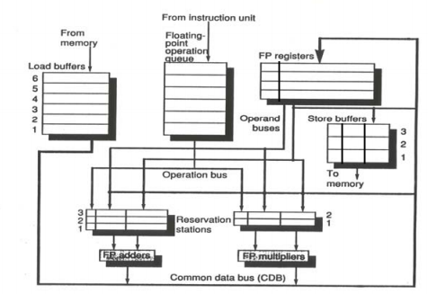
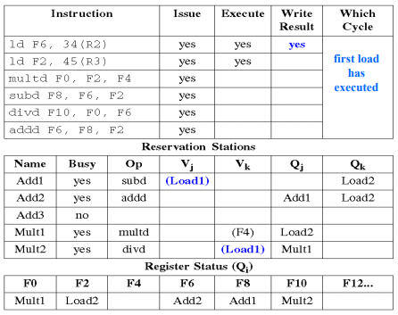
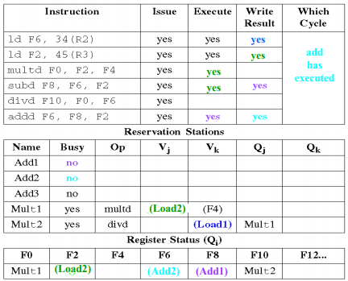

# Tomasulo algorithm

托马苏洛算法（Tomasulo's algorithm）是一种计算机硬件架构的算法，用于动态调度指令的指令，允许乱序执行以及更有效率的使用多个执行单元。它在1967年由罗伯特-托马苏洛在IBM发明，并且在IBM的IBM System/360 Model 91'上的浮点运算单元进行了实现。

托马苏洛算法的主要创新点在于算法包含了硬件上的寄存器重命名（register renaming）、用于所有执行单元的保留站（reservation stations），以及一个公共的数据总线（common data bus，CDB），用于广播给所有的需要计算得到的数据的保留站。该算法使得对指令的并行执行效率得到了提高，但是另一方面会在使用计分板或者其他更早的算法时发生停滞。

罗伯特-托马苏洛在1997年获得了埃克特-莫齐利奖（Eckert–Mauchly Award，授予给对数字系统以及计算机体系结构作出贡献的奖项）

参考资料：

- Computer Architecture: A Quantitative Approach, 3.4 Overcoming Data Hazards with Dynamic Scheduling
- Wikipedia: https://en.wikipedia.org/wiki/Tomasulo_algorithm

## 概览

[数据依赖]: http://www.sunnychen.top/shu-ju-yi-lai-xing.html

托马苏洛算法有以下几点重要的特征：

- 通过保留站实现的寄存器重命名技术，并且保留站的空间比寄存器的数目要多。
- 通用数据总线（Common Data Bus，CDB）的使用，广播到每个保留站、寄存器组以及存储缓冲区。
- 原程序顺序中分支指令后续的指令，只能在分支指令执行完毕后才能继续执行。进入issue状态指令无法退出。

乱序处理器的一个重要课题是，区别于顺序执行的流水线处理器，它对[数据依赖]的处理变得十分重要。数据依赖一共有3种：RAW、WAR以及WAW。在顺序执行的流水线处理器当中，只会有RAW真依赖的发生，可以通过旁路或者stall的方法来解决。但是在乱序处理器当中，还会有WAR以及WAW的依赖。然而，WAR和WAW实际上是一种名字依赖，也就是说，通过重命名寄存器可以使得数据依赖得以消除。可以通过一个例子来说明寄存器重命名是怎么消除名字依赖的：

考虑下面的MIPS64汇编代码：

```
DIV.D   F0, F2, F4
ADD.D   F6, F0, F8
S.D     F6, 0(R1)
SUB.D   F8, F10, F14
MUL.D   F6, F10, F8
```

上述的指令序列当中，存在有3处的名字依赖：

- ADD.D与MUL.D，对于F6存在WAW依赖。
- ADD.D与SUB.D，对于F8存在WAR依赖。
- S.D与MUL.D，对于F6存在WAR依赖。

这些依赖都可以通过寄存器重命名来进行解决：

```
DIV.D   F0, F2, F4
ADD.D   S, F0, F8
S.D     S, 0(R1)
SUB.D   T, F10, F14
MUL.D   F6, F10, T
```

需要注意的是，F8接下来的代码也要使用T来进行代替，同时还需要考虑跳转到这个代码的branch指令的依赖性问题。但是这都是在编译器层面所做的重命名工作，在托马苏洛的算法当中，寄存器的重命名都是在硬件层次上完成的。

托马苏洛算法对寄存器命名的实现机制是使用保留站。每个功能部件都拥有一个保留站，每条指令发射之后会进入保留站。一个基本的概念就是：保留站中的条目比物理寄存器的数目要多，因此可以通过重命名来解决WAR和WAW依赖。

使用保留站会带来两个重要的特性：

- 冒险检测以及执行控制是分布式的，每个保留站将会决定哪条指令可以执行。
- CDB可以广播到任意一个保留站，这是一种旁路的实现方式：如果在一个保留站当中的指令的其中一个源操作数还在等待其他指令的执行结果，那么这个保留站将会监测CDB的状态，当执行结果出现在CDB时，就能写入到保留站对应指令的条目当中。



上图展示的是一个使用托马苏洛算法的基础的MIPS浮点运算单元结构图。指令队列是一个FIFO的队列，从指令单元将程序指令顺序读入到队列当中。两个浮点运算单元：加法器以及乘法器都各有一个保留站，保留站中存放有发射了的指令以及实际的源操作数，以及用于冒险检测和执行控制的信息。存储缓冲区和加载缓冲区中都有保存地址以及数据的条目，加载缓冲区有3个主要的功能：保存等待有效地址计算完成的load指令条目、保存等待内存有效的load指令条目以及保存等待CDB可用的数据。存储缓冲区的功能相似。执行单元的结果全部放到CDB当中，CDB有多个去向（多个广播目标）：存储缓冲区、所有的保留站以及寄存器组。

下面讨论在托马苏洛算法中3个执行阶段的执行过程：

1. 发射（issue）

    在指令队列当中的指令，按照FIFO的顺序出队。如果队首的指令所要使用的执行单元的保留站有空闲的空间，该指令则发射。否则，则会发生结构冒险，此时需要等待目标的执行单元的保留站有空闲的空间为止。发射指令到保留站的时候，会对指令所需要的源操作数进行跟踪。如果源操作数还没准备好，则会在保留站中写入相关的信息跟踪该源操作数，重命名也在这个时候发生，解决WAR以及WAW冒险。

2. 执行（execute）

    在保留站中的指令，如果源操作数还不可用，保留站会监控CDB，当所需要的源操作数出现时加载入保留站对应条目当中。当所有源操作数都可用的时候，指令就会执行。这个过程解决的RAW冒险。需要注意的是，在保留站中，可能会出现多条指令在同一个时钟周期内都可行的情况，这时只能够由对应的执行单元来决定执行哪一条指令。对于加载和存储指令来说，执行的执行需要两步：计算内存地址、加载/存储数据。为了避免不必要的冒险情况发生，load和store指令的执行需要按照源程序的顺序来执行。最后，对于分支情况，规定原执行顺序中在分支指令后的指令，需要等待分支执行完毕后才能执行。

3. 写回（Write result）

    执行完毕后执行单元的结果写入到CDB当中，CDB可以将结果发送到任意一个保留站以及寄存器组。存储指令所需要的地址和数据写入到存储缓冲区当中，当内存空闲时则写入。

保留站用于检测数据冒险以及控制执行。保留站中的每个条目都有一个标签（tag），标签的数目比物理寄存器的数目要多。因此，通过在保留站中对指令源寄存器的重命名，可以解决数据冒险的问题。

托马苏洛算法和计分板算法的重要区别在于：托马苏洛算法中，指令发射到保留站后，源寄存器号都会丢弃掉，取而代之的是保留站的标签或者是真实的值。

下面给出托马苏洛算法描述所需要的记号，这些信息在硬件中会实际实现：

- Op：指令所要执行的操作。
- Qi，Qk：产生指令所需要的源操作数的保留站标签（产生对应结果的指令）。0表示真实的值已经存入保留站当中。
- Vi，Vk：源操作数的值。对于load来说，Vk是立即数。
- A：保存地址计算所需要的信息。对于load和store指令来说，执行前A存放的是立即数，执行后A存放的是有效地址。
- Busy：标志该保留站以及对应的执行单元是否忙。
- Qi：在寄存器组当中，标志将要写入到该寄存器的是哪个保留站Qi中的指令。0表示没有在保留站中的指令需要写入该寄存器。

## 例子

下面给出一段程序例子，以及一系列的图表来说明算法执行的过程：

```
L.D.    F6, 32(R2)
L.D.    F2, 44(R3)
MUL.D.  F0, F2, F4
SUB.D.  F8, F2, F6
DIV.D.  F10, F0, F6
ADD.D.  F6, F8, F2
```

第一个表给出的时刻，是所有指令发射后，第一条load指令写回完毕，第二条load指令执行完毕的情况：



可以注意到，在DIV.D.以及ADD.D.指令之间存在WAR的冒险。通过上面的表格，我们可以说明其解决的方式：DIV.D.的F6源寄存器的数据，来自于第一条load的指令。那么就有两种情况：如果load执行完毕，那么其值会直接写入到乘法器的保留站当中；如果load还没执行完毕，则DIV.D.保留站条目中的Qk域会写入Load1。这两种情况，DIV.D.和ADD.D.的执行都是相互独立的。

下面给出进行到MUL.D.指令执行完毕后的情况：



在之后的讨论中，假设load需要1个时钟周期，add需要2个时钟周期，multiply需要6个时钟周期，divide需要12个时钟周期。

## 详细算法描述

下面给出托马苏洛算法的详细描述，使用伪代码。首先引入几个记号：

- RegisterStat：寄存器组中记录寄存器写入的情况，相当于上述的Qi。如RegisterStat[rs].Qi指寄存器rs被写入的情况。
- RS：保留站条目，如RS[r]表示保留站r中对应指令的条目。
- Regs：寄存器组。

### issue stage

```
/* 算术指令 - 等待保留站r可用后，执行*/
// 如果源寄存器rs等待其他指令写入
if (RegisterStat[rs].Qi¦0) {
    // 追踪所要写入的指令
	RS[r].Qj ← RegisterStat[rs].Qi
}
else {
    // 否则将寄存器中真实的值写入保留站
	RS[r].Vj ← Regs[rs];
	RS[r].Qj ← 0;
}
// 如果源寄存器rs等待其他指令写入
if (RegisterStat[rt].Qi¦0) { 
	RS[r].Qk ← RegisterStat[rt].Qi;
}
else {
	RS[r].Vk ← Regs[rt]; RS[r].Qk ← 0;
}
RS[r].Busy ← yes;
// WAW依赖会在这里得到解决：发射完成的指令序列中，只有最后一个写入有效，其他会被丢弃
RegisterStat[rd].Q ← r;

/* 存储或者是加载指令 - 等待缓冲区r可用后，执行 */
// 公共部分
if (RegisterStat[rs].Qi¦0) {
	RS[r].Qj ← RegisterStat[rs].Qi;
}
else {
	RS[r].Vj ← Regs[rs];
	RS[r].Qj ← 0;
}
RS[r].A ← imm;
RS[r].Busy ← yes;

// load指令
RegisterStat[rt].Qi ← r;

// store指令
if (RegisterStat[rt].Qi¦0) {
	RS[r].Qk ← RegisterStat[rt].Qi;
}
else {
	RS[r].Vk ← Regs[rt];
	RS[r].Qk ← 0
};
```

### execute stage

```
/* 算术指令 - 等待{(RS[r].Qj = 0) and (RS[r].Qk = 0)}为真 */
// 计算结果

/* 加载/存储指令步骤1 - 等待{RS[r].Qj = 0}为真，并且r是加载存储队列的队首 */
RS[r].A ← RS[r].Vj + RS[r].A    // 计算地址

/* 加载指令步骤2 - 等待步骤1执行完毕 */
// 从Mem[Rs[r].A]中读取数据
```

### write result stage

```
/* 算术指令或加载指令 - 等待执行结束以及CDB可用 */
// 写入寄存器
∀x(if (RegisterStat[x].Qi = r) {
		regs[x] ← result;
		RegisterStat[x].Qi = 0
});
// 写入等待第一个源操作数的保留站
∀x(if (RS[x].Qj = r) {
    RS[x].Vj ← result;
    RS[x].Qj ← 0; 
});
// 写入等待第二个源操作数的保留站
∀x(if (RS[x].Qk = r) {
    RS[x].Vk ← result;
    RS[x].Qk ← 0;
});
RS[r].Busy ← no;

/* 存储指令 - 等待执行结束以及{RS[r].Qk = 0}为真 */
Mem[RS[r].A] ← RS[r].Vk;
RS[r].Busy ← no;
```

## 影响

托马苏洛算法中保留站、寄存器重命名以及CDB的技术在设计高性能的计算机中得到了明显的性能提升。虽然在360/91后很多年都未被使用，但是从1990年开始许多超标量处理器的动态调度策略基于托马苏洛算法。原因有多个：

- 虽然算法提出时高速缓存还没有被设计出来，但是乱序执行允许缓存不命中时继续执行其他的指令，可以把缓存未命中隐藏起来。
- 随着处理器要求性能的提高（同时执行指令数的提升以及对非数字操作指令的要求），寄存器重命名、动态调度等技术变得越来越重要。
- 不需要编译器来进行优化调度，寄存器重命名在硬件层次上进行。

