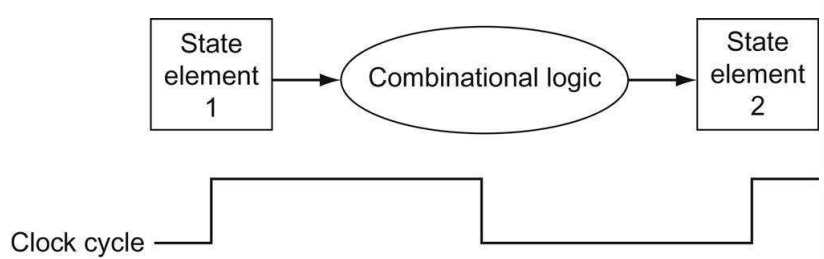
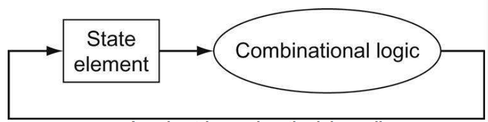

# Logic Design Conventions

在RISC-V的实现当中，数据路径有两种不同的逻辑元素：组合逻辑元素以及状态元素。组合逻辑元素是不能保存状态的逻辑器件，比如与门以及ALU。状态元素是可以保存状态的逻辑器件，比如寄存器或者存储器。状态元素至少有两个输入和一个输出。两个输入包括数据输入以及时钟输入。时钟用于决定逻辑元素什么时候被写入，逻辑元素任何时候都可以被读取。包含存储状态元素的逻辑电路也成为时序逻辑电路，它们的输出依赖于输入以及当前保存的数值。

## 时钟

这一节讨论时钟如何决定数据是否有效以及稳定。

### 定时方法

定时方法（clocking methodology）定义信号什么时候可以被读取以及它们可以被写入。定义读取以及写入的时间是非常重要的，因为如果一个信号被写入的同时也被读取，那么读取的值是未定义的。

### 时钟沿触发定时

简单的定时方法就是使用时钟沿来触发，也就是说，状态元素状态的改变发生在时钟沿（一般是时钟上升沿）。

如上图所示，在一个上升沿触发之前，组合逻辑电路的输出是上一个时钟沿时输入所得到的输出内容，当上升沿触发后，组合逻辑电路的输出写入到状态元素2中，而状态元素1也更新了存储的值，从而驱动组合逻辑电路得出新的输出值（一般来说需要一定延迟）。需要注意的一点是，定时中一个时钟周期也需要考虑到输入到状态元素中的值必须是稳定的，也就是说这个值在下一个时钟沿到来前都不会发生改变。根据上图来说，一个时钟周期的长度就是信号从第1个状态元素经过组合逻辑传递到第2个状态元素的时间。

### 控制信号

一个用于多路选择器进行选择或者直接控制功能部件的信号就是控制信号。一个状态元素还需要一个写控制的信号作为输入，只有当写控制信号为真以及时钟上升沿触发时才能更新状态元素的值。

使用时钟沿触发的定时机制允许状态元素在一个时钟周期中被读以及被写入，因为只要输入到组合逻辑当中的值不变，那么组合逻辑的输出也不会发生变化。如下图，在时钟沿触发机制下，同样也不会发生反馈回路。当然，时钟周期的长度必须要足够长来保证写入到状态元素中的值已经稳定。

在64位的RISC-V架构当中，基本所有的状态以及逻辑器件的输入以及输出都是64位宽的，因为绝大多数处理器所处理的数据都是64位宽的。有时候，可以把多条总线组合成一条更宽的总线，比如我们可以把两条32位宽的总线组合成一条64位宽的总线。
