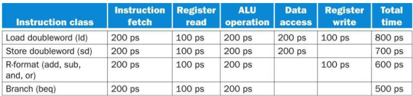
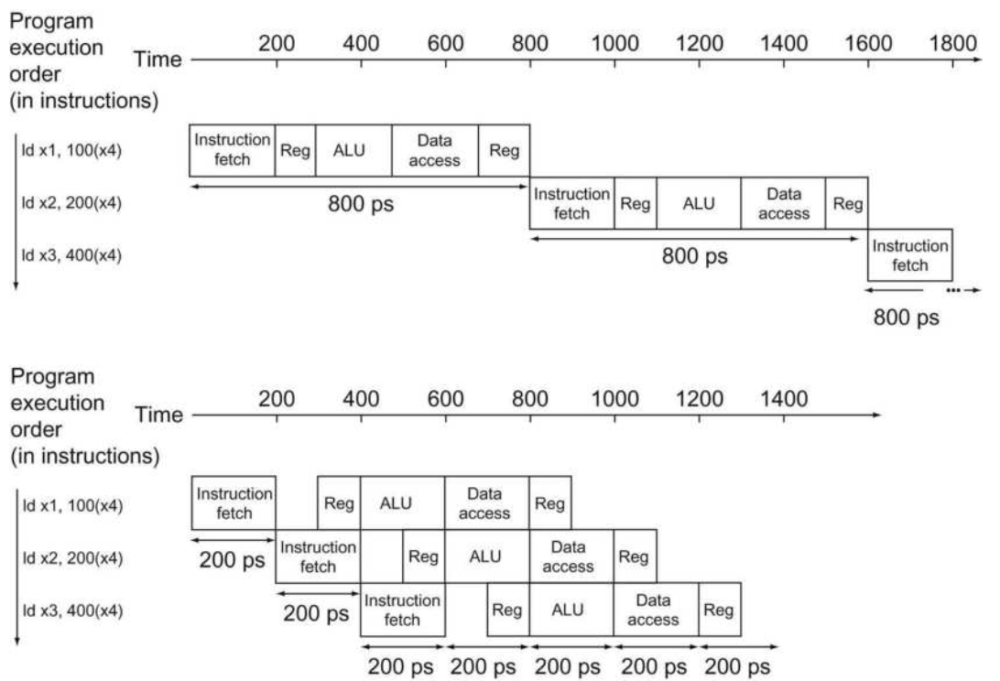
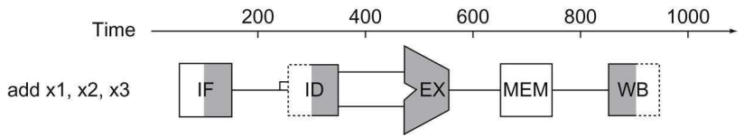
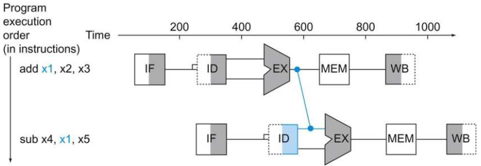
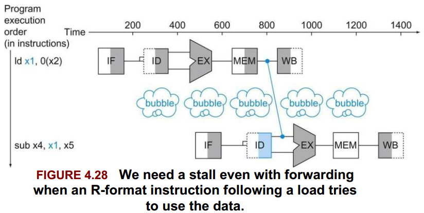
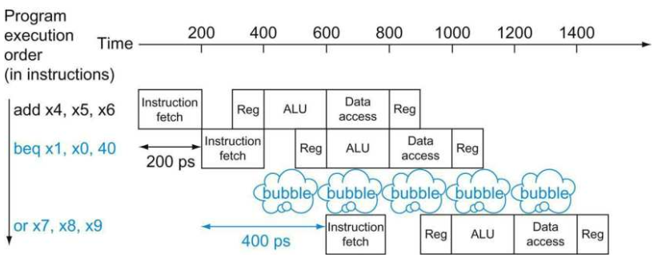

# An Overview of Pipelining

流水线是一种实现的技术，指的是在执行过程中多条指令互相重叠。在当今，流水线技术已经非常普遍。在流水线实现的过程中，指令执行的时间和非流水线的实现是相同的，而流水线比非流水线实现的速度要快的原因在于，流水线中指令的执行是并行的。使用流水线可以提高处理器的吞吐量。

如果流水线中的每一级的时间都相同，并且有足够的指令需要去完成，那么流水线与非流水线处理器的加速比就等于流水线的级数：

在忽略冒险、控制单元延迟等等的情况下，假设流水线处理器每一级的时间都相同，且有p级。对于非流水线处理器来说，执行n条指令所需要的时间为：$pn$，而对于流水线处理器来说，执行n条执行所需要的时间为：$p+n-1$，则有：

$$\lim_{n \to +\infty} \frac{pn}{p+n-1} = \lim_{n \to + \infty} \frac{p}{\frac{p-1}{n} + 1} = p $$

将流水线的理念放在RISC-V处理器当中，可以考虑到在RISC-V指令中一般分5步来执行：

1. 从指令存储器中获取指令。
2. 译码并读取寄存器。
3. 执行指令（算术逻辑指令或者计算地址）。
4. （有必要的话）从数据存储器中读取数据。
5. （有必要的话）将结果写回寄存器。

因此，在RISC-V的流水线实现当中可以设置5级的流水线，对应上述步骤分别为：取指（IF）、译码（ID）、执行（EX）、存储（MEM）、写回（WB）。

## 单指令周期指令实现（非流水线）与流水线性能的比较

### 举例

在这一节当中，我们只将目光着眼在7个指令上：LD、SD、ADD、SUB、AND、OR以及BEQ。

为了比较单周期的非流水线实现以及流水线的实现，假设在主要的功能部件上执行的时间分别为：存储器交互：200ps、ALU操作：200ps、寄存器组读写：100ps。在单周期非流水线的实现当中，为了保证每个时钟周期的时间都是一样的，时钟周期的时间必须要取最长的时间（也就是执行的最慢的指令所需要的时间，也是数据通路最长的指令）。

### 解答

下图是上述7个指令所需要时间的表格。显然，LD指令所需要的时间最长，因此在单周期非流水线的实现当中，一个时钟周期的长度为800ps：



当然，上图还需要注意的一点是，多路选择器、控制单元、PC以及符号扩展单元的延迟忽略不计。

现在，我们考虑流水线的实现。上面已经提到了，我们将RISC-V的流水线分为5级，且每一级的时间必须要相同，因此要取每一级流水线涉及的部件当中的最长时间，显然是200ps。下图展示了连续执行3条LD指令时两种实现的时间对比情况：



注意到上图中，我们假设写寄存器发生在时钟周期的前半部分，而读取寄存器发生在时钟周期的后半部分。

我们可以把流水线加速的讨论放在一个方程当中，如果所有的流水线级都得到了完美的平衡，那么有：

$$ 流水线下相邻指令的时间 = \frac{非流水线下相邻指令的时间}{流水线级数} $$

如上文所述，在理想的状态以及足够多的指令下，流水线的加速比近似等于流水线的级数。显然根据上述的方程，一个5级流水线在理想状态下应该能够有160ps的时钟周期长度，显然我们的流水线级的划分不是完美平衡的（在其中有些100ps执行完毕的器件也需要执行200ps，这意味着有100ps的时间是没有任何操作的）。同时，流水线也会带来一些额外的开销（级与级之间的寄存器延迟、上述的功能单元的延迟等等），因此实际的加速比要比理想当中的来得更小。

在讨论流水线的加速比时，我们一般会假设所执行的指令的数目足够大，因为在小的指令规模下，流水线的加速状况并不是很显著。流水线性能的提升来自于提升指令的吞吐量，而不是降低单个指令的执行时间。指令吞吐量是一个重要的指标，因为对于很多程序来说需要执行大量的指令。

## 设计流水线的指令集

即使是这个简单的流水线的解释，我们已经足以一窥RISC-V指令集的设计了，RISC-V指令集本身已经是一个为流水线执行而设计的指令集。

首先，所有的RISC-V指令都具有相同的长度（32位），并且每个指令都是定长的。这个约束使得取指以及译码的操作相当容易。在x86指令集当中，指令的长度是变长的，从1到15个字节不等，这种情况下使用流水线更具有挑战性。在现代的实现当中x86指令集实际上将x86指令翻译成简单的类RISC指令执行，并且将这些指令上流水而不是将x86指令上流水。

其次，RISC-V只有少数的几种指令格式，且指令中的源寄存器和目标寄存器都位于指令中相同的位置。

最后，在RISC-V中采用的是加载、存储架构，也就是说对存储器的芳文只出现在load和store指令当中。这个约束意味着我们可以在执行阶段计算内存地址并且在下一个周期再访问存储器。如果在如x86的实现当中，操作数可以来自于存储器，那么我们的5级流水线中的第EX以及MEM阶段就要扩展为寻址阶段、存储器阶段以及执行阶段了。

## 流水线冒险

流水线的实现当中会存在冒险的问题。当下一条指令不能在下一个时钟周期中正常执行时，我们将这种情况成为冒险，冒险一共有3种不同类型。

### 结构冒险

当硬件不能支持在同一个时钟周期下运行指令的组合时，这种冒险称为结构冒险。也可以理解为，一个结构冒险发生在处理器的一部分硬件被两个或更多的指令在同一时间使用。一个典型的例子就是单个存储器单元在A指令的IF阶段需要读取指令，而同时进行到MEM阶段的B指令需要读写同一个存储器，此时就发生了结构冒险。结构冒险通常的解决方法是将上述单一的存储器分成指令存储器和数据存储器，或者使用冒泡的技术（NOP）。结构冒险可以使用毛线控制单元来监测。

对于RISC-V指令集来说，它针对流水线优化过的设计使得设计者在设计流水线的过程中能够很容易的避免结构冒险。

### 数据冒险

数据冒险发生在具有数据依赖性的指令修改位于流水线中不同阶段的数据时。忽略潜在的数据冒险可能会导致竞争冒险。有三种情形可能会发生数据冒险：

1. 在写之后读（RAW），是一种真依赖（true dependency）。
2. 在读之后写（WAR），是一种反依赖（anti-dependency）。
3. 在写之后写（WAW），是一种输出依赖（output dependency）。

考虑两个指令i1和i2，其中在程序顺序当中i1先于i2执行。

#### 写后读（RAW）

写后读的数据冒险发生在一个指令所需要的操作数还没有被计算或者写回。假设i2尝试读取i1指令的执行结果时，就会发生数据冒险：

```
i1. R2 <- R1 + R3
i2. R4 <- R2 + R3
```

在流水线当中，当i2指令进入取数阶段的时候，i1指令的写回阶段还没开始。此时一个数据以来出现了，i2指令需要等待i1指令执行完才能正确执行。

#### 读后写（WAR）

在并发计算设计的处理器当中会发生读后写的数据冒险问题。举例：

```
i1. R4 <- R1 + R5
i2. R5 <- R1 + R2
```

在并发计算设计的处理器当中，可能会存在i2比i1更早执行完毕的情况，此时可能会发生数据冒险，因为i1有可能读取了R5在i2中被写入的新的值。

#### 写后写（WAW）

同样，在并发计算设计的处理器当中，一个写后写的操作有可能会造成数据冒险。举例：

```
i1. R2 <- R3 + R7
i2. R2 <- R1 + R3
```

在这种情况下，如果i2比i1早执行完毕，那么就会发生数据冒险，因此i2需要保证比i1晚执行完毕。

虽然我们可以通过依赖编译器来去除数据冒险，一个比较简单但低效的方法就是，编译器监测潜在的数据冒险，然后在可能发生冒险的相邻两条指令之间插入若干个NOP指令（冒泡）。但是这样会浪费很多时钟周期，以至于流水线的吞吐量被进一步的降低。并且实际上这种数据依赖性是经常发生的，如果采用这种做法会造成流水线的效率大大降低。

在这种情况下，主要的解决方法就是，我们不一定需要等待上一条指令执行完毕来解决数据冒险问题。我们可以在ALU计算得到结果后，将结果直接呈递给下一条指令而不是从寄存器中读取出来，这种方法叫做旁路（forwarding/bypassing）。

### 在两条相邻指令间进行旁路

#### 举例

以两条相邻的指令为例：

```
ADD x1, x2, x3
SUB x4, x1, x5
```

来说明流水线的阶段之间如何通过旁路来进行连接。下图展示了流水线的5个数据通路在第一条ADD指令的执行情况：



各个逻辑器件当中的阴影表示这段时间中，该逻辑器件正在被使用。

#### 解答

下图说明了旁路的连接：在ADD指令的EX阶段后，ALU的结果作为SUB指令的第一个操作数输入：



在上图展示的过程当中，旁路的通路是有当目的阶段在源阶段之后才有效。举例来说，第二条指令的EX阶段并不在第一条指令的MEM阶段之后，因此此时MEM到EX阶段的旁路是无效的。

尽管旁路不能解决所有流水线停滞的问题，但是旁路在大多数情况下能够工作的很好。举例来说，考虑第一个指令是将内存单元读取到x1而不是相加指令，那么旁路只在第二条指令的第四个流水线阶段之后才有效，因此，在这种情况下，我们还是需要将流水线停滞一个周期来解决一个**加载数据冲突**（load-use data hazard）：



如上图所述，这种情况称为**流水线停滞**（pipeline stall），当然，另一个更为常用的昵称为**冒泡**（bubble）。

### 记录代码来防止流水线停滞

#### 举例

考虑下面的C代码：

```C
a = b + e;
c = b + f;
```

这是生成的RISC-V代码，假设所有的变量都在内存当中，并且都可以被寻址，使用x31作为存储基址的寄存器：

```
ld x1, 0(x31)   // Load b
ld x2, 8(x31)   // Load e
add x3, x1, x2  // b + e
sd x3, 24(x31)  // Store a
ld x4, 16(x31)  // Load f
add x5, x1, x4  // b + f
sd x5, 32(x31)  // Store c
```

#### 解答

在上述例子中，显然，两个add指令都存在数据冒险。注意到旁路可以消除所有的存储指令的数据冒险。通过将第三条ld指令移动到第二条ld指令可以消除两个add指令的冒险：

```
ld x1, 0(x31)
ld x2, 8(x31)
ld x4, 16(x31)
add x3, x1, x2
sd x3, 24(x31)
add x5, x1, x4
sd x5, 32(x31)
```

通过将指令执行顺序重组消除冒险后，整个处理流程执行速度比旁路要快2个时钟周期。

### 控制冒险

[分支预测]: ../../Predication.md
控制冒险也称为分支冒险，是指在分支指令发生的冒险。在很多指令流水线的微架构当中，处理器不知道分支指令是否会执行（分支指令的下一条指令是顺序执行PC+4，还是分支目标？）。最简单的解决方法就是在清楚分支目标之前往流水线上填NOP指令，当然，这样做会降低流水线的吞吐量。现代采用的方法则是使用[分支预测]。

假设我们增加足够多的扩展硬件，使得我们可以在第二个流水线阶段测试寄存器测试得到的结果来决定跳转的目标是什么。即使我们增加了这样的扩展硬件，包含条件分支的流水线框图如下所示：



#### 分支后进行流水线停滞的性能

在SPECint2006测试集当中，有17%的指令是条件分支指令，因此，假设所有其他的指令的CPI都为1，那么使用流水线停滞的方法来处理控制冒险的性能是1.17CPI，也就是说结果比理想状态下性能要慢17%。

如果我们不能在第二个阶段解决分支的目标，那么流水线的性能会受到更大的影响。

对于现在大多数的计算机系统来说，进行分支预测是更为常用且有效的方法。分支预测不需要在分支指令之后将流水线停滞。当取到分支指令的时候，可以通过预测机制预测是否要执行分支，从而继续执行。如果预测正确，那么流水线的性能不会受到损失。而如果预测失败，则要清空流水线回到正确的状态继续进行，这样会损失流水线的性能。

处理控制冒险的第三种方法是使用分支延迟间隙，这种做法在MIPS上使用。MIPS会在每个条件分支指令后面插入一个分支延迟间隙，这个间隙实际上是一个不会修改分支预测结果的指令。
