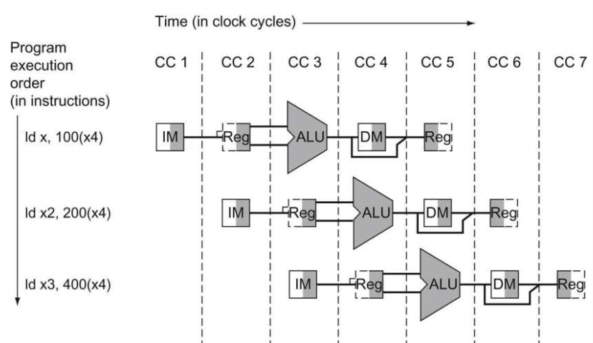

# Pipelined Datapath and Control

前面我们给出了一个单周期非流水线实现的数据通路图。在上一节当中我们说明了将RISC-V的指令执行划分为5步，因此在流水线的实现当中，我们也采用5级流水线的实现方式。因此，我们首先要将流水线的数据通路划分成5块：

1. IF：取指
2. ID：译码以及取寄存器数
3. EX：执行
4. MEM：访问数据存储器
5. WB：写回

下图是对单周期非流水线实现的数据通路图进行划分后的图表：


在上图中，所有的指令的步骤都可以从数据通路的左边进行到右边。但是，存在两个例外并不是从左到右的数据流：

- 写回阶段：将结果（来自ALU或者数据存储器）写回到寄存器组（数据通路的中间）。
- 更新PC：从PC自增或者条件分支跳转来进行更新。

从右到左的数据流不会影响当前指令的执行，它只会影响后面执行的指令。第一种会导致数据冒险而第二种会导致控制冒险。

展示流水线中执行情况的一种方法是，假设每条指令都有自己的数据通路，然后将这些数据通路放在时间轴上来显示它们之间的关系。下图展示了3条load指令执行时数据通路的在时间轴上的分布情况：



可以发现，上图中为了维持正确的时间顺序，这个数据通路图将寄存器组分为两个逻辑部件：在ID阶段读取寄存器组以及在WB阶段写回寄存器组，这两个寄存器组在物理上是同一个寄存器组。注意到，在ID阶段，寄存器组的左半部分是虚线，说明寄存器组当前没有被写入。而在WB阶段，寄存器组的右半部分是虚线，说明寄存器组当前没有被读取。

举例来说，上图中，指令存储器只在流水线的第一个阶段使用，因此在当前指令执行到其它阶段时，可以被接下来的指令所使用。为了保存一个指令的值在接下来的4个阶段中使用，从指令存储器中读取得到的指令要保存在一个寄存器当中。相似的实现在每个流水线阶段中都会使用，因此在每个流水线阶段之间都必须要放置一个寄存器

下图展示了在流水线阶段之间添加寄存器后的数据通路图。所有的指令在每个时钟上升沿沿着数据通路往前前进一个阶段。寄存器的名字由它介于的两个阶段名字来进行命名：


流水线阶段之间的寄存器必须足够大来存放所有经过它的数据通路的数据。比如IF/ID寄存器必须要有96位大小，因为它需要存放从指令寄存器中得到的32位指令，同时还有64位的PC。在之后我们将会讨论这些寄存器，现在只需要知道余下的三个阶段间的寄存器的大小分别为256,193以及128即可。

可以注意到，在上图中，写回阶段的结尾没有寄存器。因为在指令执行结束时，指令必须更新了处理器中的一些状态，包括寄存器组、存储器或者PC。写回阶段更新了寄存器组，而不需要使用一个寄存器来进行保存。如果在之后的指令中需要使用这个数据则可以直接从指定的寄存器中读取即可。

当然，所有的指令都会更新PC，可以是递增或者是分支目标地址。PC也可以被看作是一个流水线的寄存器：它给IF阶段的指令寄存器提供数据。但PC不像其他的流水线寄存器，它在微处理架构的状态中是可见的。它的内容在一个异常发生时需要被保存，因为此时流水线中的寄存器内容会被丢弃。

下面将会展示从时间流逝的角度，流水线中发生的具体变化。在第一个时间段中，首先展示了在IF阶段中数据通路中活动的部分。使用的实例指令是一个LD指令：

### IF阶段

下图展示了指令读取阶段的情况。指令从指令存储器中读取，使用的是PC中的地址，然后将读取的指令保存在IF/ID流水线寄存器当中。PC地址递增4来准备使用。PC同时还会保存在IF/ID寄存器当中，因为它在指令之后还会使用（如BEQ）。


### ID阶段

从IF/ID寄存器中读取数据，将指令中的立即数域提取出来，然后符号扩展到64位。同时从寄存器组中取出两个寄存器数。这三个数据都保存在ID/EX流水线寄存器中，PC同时也保存在其中：


### EX阶段

ALU执行的结果保存在EX/MEM寄存器中，同时PC的分支计算结果、ALU的结果零信号、R2的寄存器数都会保存在EX/MEM寄存器中留给当前指令的余下阶段使用：


### MEM阶段

MEM阶段将需要写入到数据存储器的数据写入或者从数据存储器中读取数据到MEM/WB寄存器中。同时，ALU的结果也要存储在MEM/WB结果中：


### WB阶段

从MEM/WB寄存器中读取要写入到寄存器组中的数据（ALU结果或者存储器读取的数据），写入到寄存器组中：


此外还可以阐述一个和store指令有关的例子，不过store指令和load的数据通路很相似，在这里不再赘述。

load和store还阐述了另外一个关键点：数据通路中的每个逻辑组件：比如指令存储器、寄存器读取端口、ALU、数据存储器、寄存器写入端口，在每个流水线阶段中都只能够被一条指令所使用，因此可能会出现结构冒险的情况。因此，这些逻辑部件以及它们的控制信号，只可以和一个流水线阶段相关。

因此，当流水线继续进行下去的话，流水线阶段之间的寄存器会被往后所要执行的指令的数据所覆盖。实际上，现在我们可以发现在我们的设计上中，load指令已经有一个bug了：写回寄存器阶段时，由于IF/ID寄存器已经被其他指令的数据覆盖，我们无法得知所要写入的是哪一个寄存器。

所以，我们需要将目标寄存器的寄存器号在load指令中进行保存。如同sotre指令将寄存器值从ID/EX寄存器传递到EX/MEM寄存器，然后在MEM阶段使用一样，load指令也必须将所要写入的寄存器号从ID/EX阶段传递到MEM/WB寄存器使其在WB阶段使用。另一种可行的方法是分享流水线的数据通路，我们需要将在IF阶段读取到的指令保留下来，并且传递到下一个流水线阶段寄存器当中给当前指令之后的流水线阶段使用。

下图展示了数据通路的正确版本，将写寄存器号传递到ID/EX寄存器当中，然后到EX/MEM寄存器当中，最后到MEM/WB寄存器当中。这个寄存器号在WB阶段中用于指定要写入的寄存器：


下图展示了load指令在5个流水线阶段中的执行情况：


## 图形化表示流水线

流水线的实现是比较难于掌握的，因为很多指令在每个时钟周期上都同步的在单一的指令通路上执行。为了便于理解，这里有两种基本的流水线图表：多时钟周期流水线图以及单时钟周期流水线图。多时钟周期流水线图如下将会有例子。单周期流水线图如上述各个流水线阶段的执行图。多周期的流水线图要比较简单但是没有包含所有的细节。比方说，考虑下列的5条指令：

```
ld x10, 40(x1)
sub x11, x2, x3
add x12, x3, x4
ld x13, 48(x1)
add x14, x5, x6
```

下图展示了执行这些指令时的多周期流水线图。时间从左到右流逝，而指令的执行顺序从上到下依次执行：


下图展示了更加传统的多周期流水线图：


单时钟周期的流水线图展示了在整个单时钟周期下整个数据通路的情况，如果要表示上面的5个指令，这些指令在流水线中将以它们所在的流水线阶段作为标签。这种类型的图可以用来展示每个时钟周期流水线的具体执行情况，典型的使用包括一组单时钟周期流水线的执行图来展示一系列时钟周期下的流水线的具体执行情况。我们将会使用多时钟周期图来展示流水线状态的概览，而使用单时钟周期图来展示多时钟周期图其中一个时钟周期的流水线状态，展示在当前时钟周期在流水线上的指令对数据通路的使用情况。下图是对上面的多时钟周期流水线中第5个周期流水线执行情况的单周期流水线图：


## 流水线控制

现在我们将会为流水线的数据通路增加控制器件。我们首先从一个简单的设计中来查看一些隐蔽的问题（原文是rose-colored glasses，意指一种快乐或积极向上的态度导致无法注意到负面的事情，导致一种不现实的生活态度、理念）。

第一步是将控制信号/控制线打上标签，我们尽可能的从非流水线的实现中继承下来，包括同样的ALU控制逻辑、分支逻辑以及控制线：


上面的流水线数据通路的控制逻辑从非流水线实现当中继承了PCSrc、MemtoReg以及ALU的控制逻辑。同时我们还要将指令中funct域的特定比特传送给ALU控制单元判别，因此指令中的30、 14 ～ 12位还要存入ID/EX寄存器当中。

如同在非流水线的单周期实现中一样，我们假设PC在每个时钟周期中都会被写入，因此PC不需要一个写入的信号，同样的理由，所有的流水线阶段间寄存器也不需要写入信号（IF/ID，ID/EX，EX/MEM以及MEM/WB）。

为了指定流水线中特定的控制信号，我们需要针对每个流水线阶段设定控制信号的值。因为每个控制信号只和单一一个流水线阶段相关联。

1. IF：读指令存储器以及写PC在这个阶段总是会发生，因此在这个阶段中不需要特别的控制信号。
2. ID/读寄存器组：读寄存器组不需要信号，两个源寄存器号也总是在指令的相同位置，因此这个阶段也不需要特别的控制信号。
3. EX/地址计算：ALUOp以及ALUSrc信号在这个阶段中需要被设定，ALU的操作需要根据主控制单元的ALUOp以及指令中的30、 14 ～ 12位来确定，ALUSrc则决定ALU的第二个操作数的来源，是第二个寄存器数还是立即数。
4. MEM：在这个阶段中设定的控制线包括Branch、MemRead、MemWrite以及PCSrc，若当前指令是BEQ并且ALU的运算结果（SUB）是0，则PC将会被分支目标覆盖（这里存在一个控制冒险，在之后会讨论到）。
5. WB：写回阶段所需要的控制信号为MemtoReg，用来控制写回到寄存器组中的数据来自于存储器（LD）还是ALU的结果（R指令）。

下面两图都是在非流水线实现的单周期实现当中继承的ALU控制逻辑以及控制信号的功能：


因为流水线化的数据通路没有改变控制线的使用方式（意义），因此我们可以使用相同的控制信号值，只不过现在将其根据流水线的阶段进行分类：


实现控制单元，意味着要将这7个控制信号在它们所属的流水线阶段中进行设定。由于控制信号在EX阶段中开始使用，因此我们可以在ID阶段创建控制单元，生成控制信号并传递到接下来的流水线阶段当中。这意味着流水线阶段间寄存器需要扩展：


下图是完整的带控制单元的5级流水线实现图：


