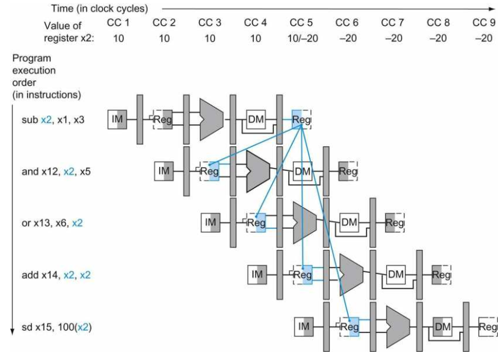
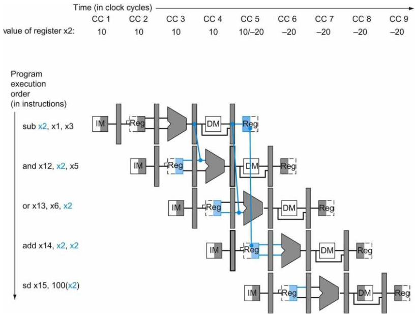
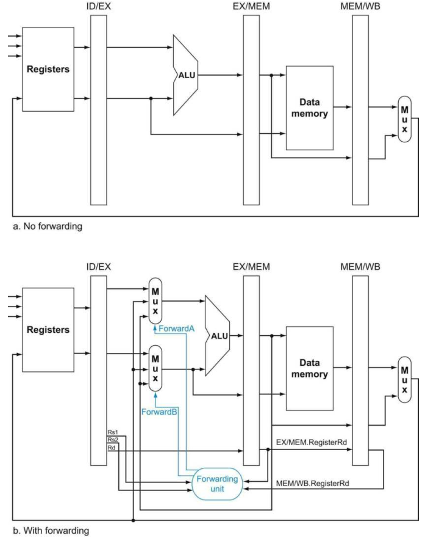
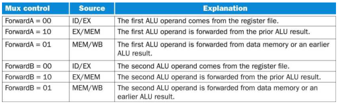
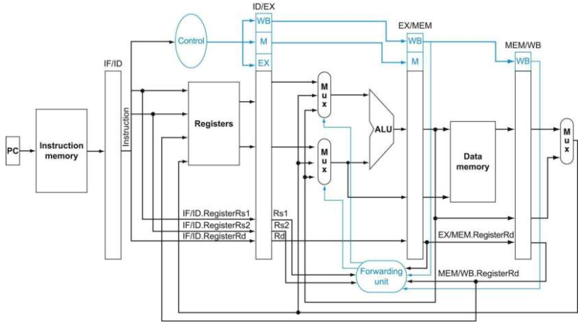
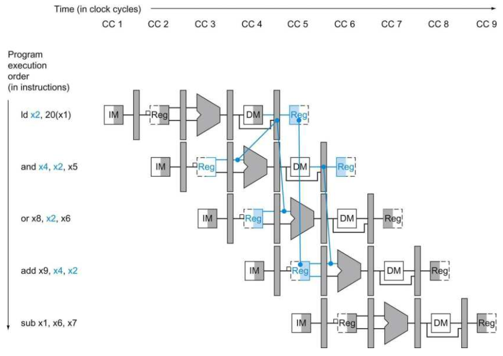
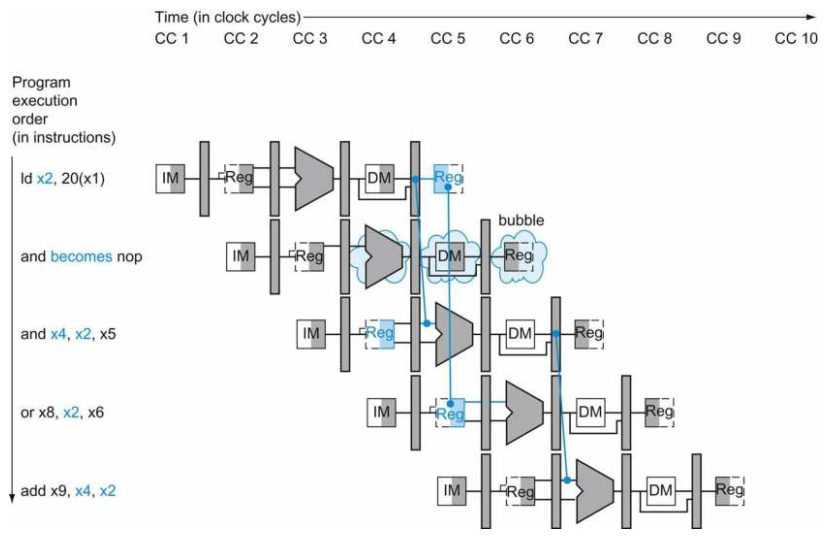
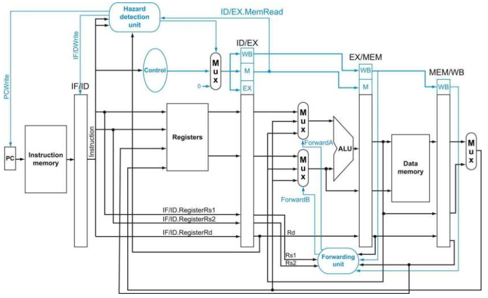

# Data Hazards: Forwarding versus Stalling

在前面的章节当中，我们展示了流水线执行的优点以及硬件的具体实现方法。然而现在我们需要深入到一些隐蔽的问题来探讨其解决方法。首先是在流水线处理器中的第一个重要的问题：数据冒险。在第V节中我们已经说明了，数据冒险在流水线的执行中是一个重要的障碍。

首先来看下面一系列的汇编代码：

```
sub x2, x1, x3      // x2被写入
and x12, x2, x5     // 第一个操作数（x2）依赖于sub
or x13, x6, x2      // 第二个操作数（x2）依赖于sub
add x14, x2, x2     // 第一（x2）和第二（x2）个操作数依赖于sub
sd x15, 100(x2)     // 基址寄存器（x2）依赖于sub
```

在上面的汇编指令序列当中，后面的4条指令都依赖寄存器x2在第一条指令中计算得到的结果。上面指令序列在流水线中的执行如下所示，使用多时钟周期流水线图来进行表示。为了阐述这个指令序列在我们流水线中的具体执行情况，下图的顶端展示了寄存器x2的值，在第5个时钟周期会发生改变，此时sub指令刚好要将结果写入。



所有互相依赖的动作都使用颜色来表示。第一条指令将结果写入到x2，而后面的所有指令都需要读取x2的值。x2在第5个时钟周期才被写入，因此在第5个周期前x2中的值是不可用的。颜色标记的线展示了数据之间的依赖性，那些需要回溯时间的就是流水线当中的数据冒险。

上图中最后一个可能的数据冒险在第4条指令中，如果在同一个时钟周期中读写同一个寄存器会发生什么？在我们的实现当中，对寄存器的写发生在时钟周期的前半周期，而对寄存器的读发生在时钟周期的后半周期。因此数据冒险在这条指令中没有发生。

因此，在上述指令序列当中，add以及sd会得到正确的x2的值，但是and和or不能得到正确的x2的值。

如同在第V节当中的叙述，实际上x2的值在sub指令的EX阶段就已经计算出来了，只是需要等到WB阶段才能写回到x2当中。在and以及or指令当中，需要x2的值的阶段是EX，也就是分别是第4和第5个时钟周期。因此，我们可以使用旁路（forward）来将数据反馈到and和or指令的执行阶段而不需要将流水线停滞（stall）。

那么旁路如何工作？在这节余下的内容中，为了简单起见，我们考虑在EX阶段使用旁路的挑战，可能是一个ALU算术操作或者是地址计算操作。这意味着当一条指令尝试在它的EX阶段使用一个寄存器值，而这个寄存器在先前的指令中会在WB阶段写回，那么我们实际上只需要它在先前指令中的EX阶段中ALU的结果再输入到当前指令的EX阶段中作为ALU的输入。

有一种记号用来命名流水线寄存器域来允许更精确的依赖项表示。比如说，“ID/EX.RegisterRs1”代表一个寄存器的值可以在流水线阶段间寄存器ID/EX中找到，实际上，就是从寄存器组的第一个读端口中读取得到的寄存器值。记号中的第一个部分，是流水线阶段间寄存器的名字，而第二部分是该寄存器的名字。使用这种记号，两对数据冒险可以表示为：

```
1a. EX/MEM.RegisterRd = ID/EX.RegisterRs1
1b. EX/MEM.RegisterRd = ID/EX.RegisterRs2
2a. MEM/WB.RegisterRd = ID/EX.RegisterRs1
2b. MEM/WB.RegisterRd = ID/EX.RegisterRs2
```

第一种冒险发生在上述指令序列的and指令中，当and指令需要x2的值时，其值还在sub指令的EX阶段：

EX/MEM.RegisterRd = ID/EX.RegisterRs1 = x2

### 依赖性检测

#### 举例

将上述指令序列的数据依赖性进行分类：

```
sub x2, x1, x3      // x2被写入
and x12, x2, x5     // 第一个操作数（x2）依赖于sub
or x13, x6, x2      // 第二个操作数（x2）依赖于sub
add x14, x2, x2     // 第一（x2）和第二（x2）个操作数依赖于sub
sd x15, 100(x2)     // 基址寄存器（x2）依赖于sub
```

#### 解答

- 上文已经提到过，sub-and是1a型的冒险。
- sub-or是2b型的冒险：MEM/WB.RegisterRd = ID/EX.RegisterRs2 = x2。
- sub-add以及sub-sd没有数据冒险发生。

因为一些指令不会写寄存器，因此这个规则不够准确；有时候它会旁路但有时候并不会。有一个做法非常简单就是检查RegWrite控制信号是否是真：在EX以及MEM阶段检查WB的控制域查看RegWrite信号是否有效即可。同时，RISC-V的寄存器x0是一个常数寄存器，x0中的值必须是常数0，因此如果一条指令尝试用非0值去写x0，则我们需要阻止旁路来往x0中写非0值。在硬件上如此实现可以使得编译器以及汇编程序来阻止将x0作为指令的目标寄存器。此时可以添加两个条件来进行检测：EX/MEM.RegisterRd != 0以及MEM/WB.RegisterRd != 0。

现在我们可以检测冒险，一半的问题已经得到了解决，但是我们必须要旁路正确的数据。

下图展示了在流水线阶段间寄存器以及ALU的输入之间的依赖关系，所使用的例子仍然是上述的指令序列。与之前不同的是，依赖性是来自于流水线阶段间寄存器，而不是等待WB阶段写回到寄存器组当中。因此，之后的指令所需要的数据在流水线阶段间寄存器当中来进行旁路。



如上图，在流水线的实现当中，更实际的旁路方法是，将流水线阶段间寄存器的数据旁路到ALU的输入当中。上图中，在流水线阶段间寄存器的值被之后所执行的代码所需要，在它们被写回到寄存器组之前就已经有效了。上图中需要注意的一点是，add指令执行不需要旁路也不需要停滞，它是一种寄存器组旁路的做法——在同一个时钟周期中读写同一个寄存器，因此在第5个时钟周期，x2的值有两种状态。

如果ALU的输入不单止是ID/EX寄存器中，也可以来自其他的流水线阶段间寄存器，那么我们可以旁路正确的数据。通过给ALU的输入增加多路选择器，以及合适的控制信号，我们就可以使流水线在上述的数据冒险前全速运作。

现在，我们暂时认为需要旁路的指令只有R类型的指令：add、sub、and以及or。下图展示了ALU以及流水线寄存器之间旁路的数据通路以及控制逻辑结构，以及控制信号的设置表：





旁路的控制逻辑在EX阶段，因为ALU的旁路多路选择器就在这个阶段当中。因此，我们需要将ID阶段的寄存器号码通过ID/EX寄存器传递到EX阶段的旁路控制逻辑，来决定进行旁路。现在我们可以书写检测冒险的条件，以及解决冒险的控制信号：

1. EX阶段的冒险

    ```
    if(EX/MEM.RegWrite && (EX/MEM.RegisterRd != 0) && (EX/MEM.RegisterRd == ID/EX.RegisterRs1))
        ForwardA = 10
    if(EX/MEM.RegWrite && (EX/MEM.RegisterRd != 0) && (EX/MEM.RegisterRd == ID/EX.RegisterRs2))
        ForwardB = 10
    ```

2. MEM阶段的冒险

    ```
    if(MEM/WB.RegWrite && (MEM/WB.RegisterRd != 0) && (MEM/WB.RegisterRd == ID/EX.RegisterRs1))
        ForwardA = 01
    if(MEM/WB.RegWrite && (MEM/WB.RegisterRd != 0) && (MEM/WB.RegisterRd == ID/EX.RegisterRs2))
        ForwardB = 01
    ```

就如同在之前所提到的，在WB阶段没有冒险发生，因为我们假设寄存器组在同一个周期读写是不会发生冲突的。这种情况下寄存器组会表现为另外一种旁路的方式。

一种比较复杂的情况是，潜在的数据冒险在WB阶段写回的结果、MEM阶段读取的结果以及EX阶段中ALU的操作数来源情况之间。举例来说，当将一个向量里的数字求和放在一个寄存器当中时，一个指令序列会读写同一个寄存器：

```
add x1, x1, x2
add x1, x1, x3
add x1, x1, x4
```

可以考虑第三条指令执行到EX阶段的情景，此时EX阶段的冒险以及MEM阶段的冒险条件都会成立，因此在旁路控制逻辑中将会发生不确定的结果。在上述的情景在，正确的做法应该是将EX/MEM阶段的数据旁路给执行到EX阶段的第三条ADD指令。因此，我们需要修改MEM阶段冒险的成立条件：

```
if(MEM/WB.RegWrite && (MEM/WB.RegisterRd != 0) &&
   !(EX/MEM.RegWrite && (EX/MEM.RegisterRd != 0) && 
    (EX/MEM.RegisterRd == ID/EX.RegisterRs1)) && 
    (MEM/WB.RegisterRd == ID/EX.RegisterRs1))
    ForwardA = 01
if(MEM/WB.RegWrite && (MEM/WB.RegisterRd != 0) &&
   !(EX/MEM.RegWrite && (EX/MEM.RegisterRd != 0) && 
    (EX/MEM.RegisterRd == ID/EX.RegisterRs2)) && 
    (MEM/WB.RegisterRd == ID/EX.RegisterRs2))
    ForwardB = 01
```

下图展示了为了给EX阶段的指令实现旁路操作所需要的硬件结构：



旁路同样也可以帮助解决存储指令的数据依赖性问题（数据冒险），因为存储指令只需要在MEM阶段需要数据，因此旁路比较简单。但是，考虑在load指令后紧接着store指令，这种用法在RISC-V进行存储器到存储器的复制时十分常用。由于这种复制操作是十分常用的，因此我们需要增加更多的旁路硬件来使其运行的更快。可以发现，在load指令后跟一个store指令时，load经过MEM阶段后，store指令所需要的数据就存在于MEM/WB流水线阶段间寄存器当中，在这种情况下，我们需要增加一个存储器的旁路结构。

在上图中我们可以发现没有将ALU的第二个操作数的选择逻辑加上去，实际上很容易。只需要将旁路使用的多路选择器的输出与立即数使用一个2:1的多路选择器即可：


### 数据冒险以及流水线停滞

如同在第V节中所提到过的，旁路并不是万能的，有些数据冒险使用旁路是无法解决的，比如在一个load之后后紧跟一个add指令，且add指令的其中一个源寄存器是load指令的目标寄存器。下图展示了这个问题。当and指令需要x2的时候，x2在上一条指令中甚至还没有被读出来。因此在这种情况下，旁路也不能解决数据冒险的问题，只能够通过流水线停滞来避免：



因此，在这种情况下，我们需要的控制部件不是旁路控制单元，而是一个冒险监测单元。它工作在ID阶段，因此可以在load以及下一条有数据依赖性的指令之间插入一条stall指令。而冒险监测单元的控制逻辑则为：

```
if (ID/EX.MemRead && ((ID/EX.RegisterRd == IF/ID.RegisterRs1) || (ID/EX.RegisterRd == IF/ID.RegisterRs2)))
    stall the pipeline
```

回想起之前我们使用的RegisterRd指代的是指令中的第11 ～ 7位，并且在R类型以及load指令中是指代的目标寄存器。首先我们需要检测执行完ID阶段的指令是否需要读存储器（考虑到我们的简单实现当中，读存储器的唯一的指令就是load），然后再检测要写回的目标寄存器和下一条要读取的指令的两个源寄存器是否相同，如果相同的话就要进行流水线停滞一个时钟周期了。停滞一个时钟周期后，旁路单元就可以将从存储器中读取的数据旁路到进入EX阶段的下一条指令，作为ALU的输入（如果没有旁路单元的话，那么流水线还要再停滞一个时钟周期）。

如果在ID中的指令被停滞了，那么在IF阶段的指令也同样要被停滞，如果不增加硬件结构的话，那么在停滞的这一时钟周期，PC以及IF/ID寄存器中的数据会被覆写（前文已经说过了，PC和流水线阶段间寄存器的更新是每个时钟周期都会进行一次）。因此防止这种情况发生最简单的方法就是防止PC以及IF/ID寄存器发生改变。在流水线停滞的那一个周期当中，由于EX阶段还是需要执行指令，只是这个指令不会带来任何的影响，这个指令就叫做NOP指令。NOP指令的指令不会改变处理器当中的任何状态。

我们怎么在流水线当中插入这些空指令（也叫作冒泡）？在这之前，我们曾经给出过流水线的控制信号设置表，那么，我们可以将EX、MEM、WB阶段的所有控制信号置为0，来创造一个“无动作”，也就是NOP指令。通过在ID阶段检测数据冒险，我们可以在流水线中添加一个NOP指令，通过将ID/EX流水线阶段间寄存器的EX、MEM以及WB控制域全部置为0，就可以创造一个流水线冒泡了：因为在这种情况下，不会有寄存器或者存储器会被写入。

下图展示了在具体在硬件上发生了什么：在流水线中本来下一条要执行的指令是AND，但是插入了一条NOP指令，AND指令以及之后的所有指令都被延时了一个时钟周期来执行，这个“泡泡”将会从ID/EX寄存器开始，一直传递到MEM/WB寄存器最后消失为止。在这个例子当中，冒险导致了AND以及OR指令在第四个时钟周期重复了一次在第三个时钟周期做过的工作：AND再次读取寄存器组并且进行译码，OR再次中PC获取指令地址并在指令存储器中读出指令。这样的重复工作也是流水线停滞的一种表现形式：



下图展示了增加了冒险检测单元的数据通路图。像之前一样，ALU的多路选择器受旁路单元的控制。冒险检测单元控制PC以及IF/ID寄存器的写入以及对ID/EX寄存器的控制域的选择（0还是真实的控制值）。当load-use冒险发生时就会触发冒险检测单元：



虽然编译器一般来说都依赖于硬件架构去解决冒险问题来保证正确的执行，但是编译器也必须要明白流水线的架构来确保最佳的性能。从另一方面来说，不期望的流水线停滞会降低已编译代码的性能。
