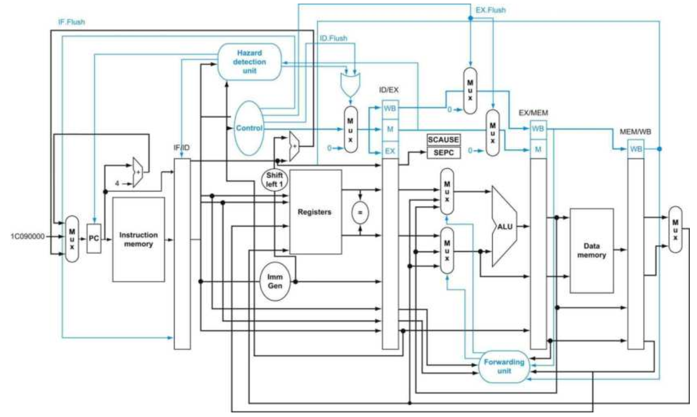
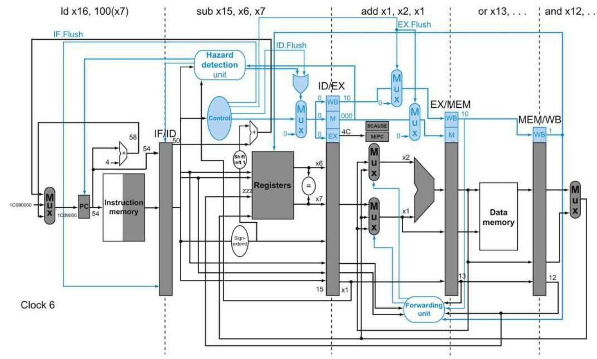
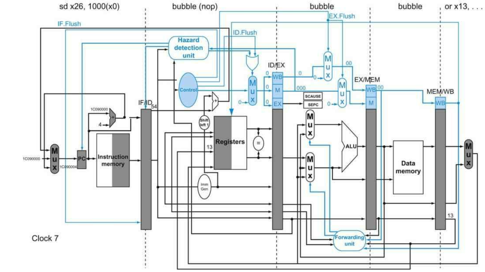

# Exceptions

在处理器的设计当中，控制单元及其信号的设计是最具有挑战性的：它是处理器设计当中最困难的部分，并且要想加快其运行速度需要付出更大的努力。在控制单元的设计当中一个重要且关键的工作就是对异常以及中断处理的实现——不是分支指令，但是同样会改变程序正常的指令执行流。异常用于处理非期望的（不能预料的），如一个未定义的指令。与之相同的基本机制拓展用于IO设备与处理器之间进行交流。这将会在后续的章节中提到。

异常（Exception），也称为中断（Interrupt）。是一种不定期的事件，它会中断当前程序的执行，用于检测未定义的指令。异常和中断有时候可以混用，但是很多时候，中断一般指来自处理器外部的异常事件，如IO。因此，区别异常和中断的是异常事件来自于处理器的内部还是外部。如果异常事件来自于处理器的外部，那么这是一个中断，否则，这是一个异常。

实际上，很多体系架构的设计者并不能很好的分辨中断和异常，因此他们会使用其他的名字来引用这些异常和中断。距离来说，在Intel x86中统一使用的是中断。在RISC-V当中，使用异常来代表所有不能预料的，会对控制流发生改变的事件，且这些事件无法很好的进行分辨是外部的还是内部的事件。只有当这个事件明确是由外部事件引发的，才将其称作中断：

<table>
    <tr>
        <th>事件类型</th>
        <th>来自</th>
        <th>RISC-V术语</th>
    </tr>
    <tr>
        <th>系统重启</th>
        <th>外部</th>
        <th>异常</th>
    </tr>
    <tr>
        <th>IO设备请求</th>
        <th>外部</th>
        <th>中断</th>
    </tr>
    <tr>
        <th>用户程序调用操作系统</th>
        <th>内部</th>
        <th>异常</th>
    </tr>
    <tr>
        <th>使用未定义的指令</th>
        <th>内部</th>
        <th>异常</th>
    </tr>
    <tr>
        <th>硬件故障</th>
        <th>其他</th>
        <th>其他</th>
    </tr>
</table>

在很多特定的情况下，对异常的需求都会导致一个异常事件产生。这方面的话题将在后续说明，届时我们将会更好的去了解异常机制更多的功能。在这一节当中，我们所要解决的是实现对一部分指令集以及实现中所产生的异常类型的检测以及处理。

检测异常以及采取适当的措施通常对处理器的性能以及时序带来很大的影响。如果在设计控制单元中没有给异常足够的重视，在一个错综复杂的实现当中添加异常处理将会显著的降低性能，同时也会使设计难以得到正确的结果。

## RISC-V架构如何处理异常

[SEPC]: ../RISC-V特权级架构概述.md
[SCAUSE]: ../RISC-V特权级架构概述.md

当前我们的实现当中，可能出现的异常只有两种：执行一条未定义的指令以及硬件故障。我们假设硬件故障发生在指令ADD x11, x12, x11当中，接下来的讨论将会基于这个假设。当异常发生时，处理器必须要做的一项基本的工作就是将当前指令的地址保存在[SEPC]（Supervisor Exception Program Counter，特权级异常程序计数器）中，并且将控制权转移给操作系统。操作系统可以采取一些适当的措施，比如执行一些预定义的程序（这些预定义的程序一般放在特定的地址空间当中）来应对这个故障，或者直接停滞程序的执行并且回报一个错误。在执行完必要的操作之后，操作系统会停止或者继续执行先前的程序，取决于SEPC中的信息，来重启程序的执行（SEPC中的地址有可能在操作系统异常处理程序中发生了改变）。

对于操作系统来说，要处理异常，就必须要知道异常发生的原因，还有就是导致异常发生的是什么指令。有两种主要的方法来指示发生异常的原因是什么。在RISC-V体系架构中使用的方法是使用[SCAUSE]（Supervisor Cause Register，特权级异常来源寄存器），用于保存指示当前异常原因的值。

另一种方法就是使用中断向量（vectored interrupt），中断设备根据中断向量将找到中断服务程序执行。中断向量可以认为是中断服务程序的首地址，但在某些实现当中，它作为中断源的识别标志，可用来形成相应的中断服务程序的入口地址。总的来说，中断向量是硬件根据当前中断产生原因生成的硬件码（要与中断向量地址区别开来，中断向量地址是中断向量表的地址）。中断向量一般会与某个基址寄存器中的值相加来指示中断服务程序的地址（意味着在内存空间中存在一个区域专门存放着中断服务程序）。比如，在我们的实现当中，可以定义中断向量表如下：

<table>
    <tr>
        <th>异常类型</th>
        <th>中断向量</th>
    </tr>
    <tr>
        <th>未定义指令</th>
        <th>00 0100 0000</th>
    </tr>
    <tr>
        <th>系统错误（硬件故障）</th>
        <th>01 1000 0000</th>
    </tr>
</table>

其中中断向量与中断向量表基地址寄存器相加可以形成中断服务程序的地址，操作系统通过产生的地址得知异常发生的原因。如果不使用中断向量的方法，如在RISC-V架构当中，一个单一的公共中断服务程序入口会提供给所有的异常，操作系统会将状态寄存器（scause）中的值进行译码来得知造成异常的原因是什么。在使用中断向量的体系架构当中，中断向量之间可能相隔32个字节的空间，因此操作系统需要记录下异常发生的原因，并且在这32个字节空间（8个指令中）执行一些限制的操作。

我们可以为我们的处理器实现添加几个额外的寄存器以及控制信号来支持异常处理。假设我们实现的异常处理系统当中，单一的中断入口地址是${0000 0000 1C09 0000}_{hex}$。并且，我们需要增加两个额外的寄存器：

- SEPC: 64位寄存器来保存发生异常的指令地址。（这个寄存器即使是在使用中断向量的情况下也是必要的）
- SCAUSE： 64位寄存器来记录异常发生的原因，尽管该寄存器中64位有很多位都没有被使用。假设该寄存器上有一个域来编码上述两种可能的异常来源，包括2种编码代表未定义的指令，以及12种编码代表硬件故障。

## 流水线中实现异常处理

在流水线处理器的实现当中，我们将异常看做是另外一种形式的控制冒险。举例来说，假设在执行ADD指令的过程中，发生了硬件故障。如同我们之前的执行分支处理一样，我们必须要将ADD指令之后已经进入流水线的指令进行冲刷，然后从新的地址获取新的指令。因此我们会使用同样的策略来处理异常事件的发生。

前面我们在处理分支预测失败的时候，我们展示了如何冲刷在IF阶段的指令，并将其变为一个NOP指令。为了冲刷在ID阶段的指令，我们需要使用已经在ID阶段使用的停滞信号，并引入一个新的控制信号：ID.Flush，这个信号将会和停滞的信号相或，作为输出控制信号或者0控制信号的多路选择器的选择信号。为了冲刷在EX阶段的指令，我们引入一个新的控制信号：EX.Flush，这个信号将会控制输入到EX/MEM寄存器的控制信号来自ID/EX寄存器的控制信号还是0控制信号。最后，为了从上文定义的异常处理入口地址执行公共的服务例程，我们需要为PC来源的多路选择器增添多一个来源，即${0000 0000 1C09 0000}_{hex}$该地址。下图展示了修改后的实现图：



其中，上图还增添了两个特权级的寄存器：SCAUSE和SEPC。如果我们没有在发生异常的时候在指令执行的中间就停止执行，那么程序员就不能看到x1寄存器原先的值了（参照上述的执行的指令例子），因为在ADD指令当中会把x1作为目标寄存器而覆写了x1的原先的值。如果我们假设异常在EX阶段被检测到，那么我们可以使用EX.Flush信号来放置EX阶段产生的结果在WB阶段当中被写入。实际上，大部分的异常实际上都会让当前指令最终执行完毕，因此最简单的处理方法就是在处理完异常事件之后冲刷流水线，重新执行被异常所中断的指令。最后一步就是要把当前指令的地址存储进SEPC寄存器当中。

### 流水线处理器中的异常处理具体实现

#### 举例

给定下列的指令序列：

```
0x40      sub x11, x2, x4
0x44      and x12, x2, x5
0x48      or x13, x2, x6
0x4C      add x1, x2, x1
0x50      sub x15, x6, x7
0x54      ld x16, 100(x7) 
```

假设异常处理所需要的指令为：

```
0x1C090000      sd x26, 1000(x10)
0x1C090004      sd x27, 1008(x10)
```

下面将会展示当一个硬件故障在ADD指令执行到EX阶段过程中发生时，流水线的执行情况。

#### 解答

当ADD指令执行到EX阶段时，发生了硬件故障的异常。异常被检测后，异常处理入口被选择在下一时钟周期压入PC当中，IF/ID、ID/EX以及EX/MEM下一周期的输入都变为0输入，也就是变为一个气泡（bubble），被冲刷。接着，下一个周期，异常处理程序首地址将会被输出到指令缓存中，异常处理程序的第一个指令进入IF阶段。最后，发生异常的指令地址0x4C被存入SEPC中：





在这里有一个小细节，就是在ADD之前的两条指令：AND和OR，实际上执行完毕了。由于在发生异常的时候，AND和OR指令分别处于WB阶段和MEM阶段，实际上，这两条指令已经执行完毕了（经过了EX阶段），剩下的都是一些写回的工作。因此，处于MEM和WB阶段的指令，发生异常时，是不会影响到的，因此不需要考虑这两个阶段的冲刷情况。

在我们的流水线实现中，几乎任何时刻都会有5条指令在流水线当中活动。在异常处理的过程中，最大的挑战在与将异常与导致该异常发生的指令相关联起来。更困难的事情在于，多个异常可能在同一个时钟周期中同时发生。一个解决的方法是将异常分为多个优先级，这样就可以简单的去决定应该先服务哪个异常。在RISC-V的实现当中，异常由硬件在实现排序，最早发生异常的指令将会被中断。

IO设备请求以及硬件故障不会和一个特定的指令相关联，因此需要一个更加灵活的实现方式，可以处理在任意阶段发生的异常事件。

SEPC寄存器将发生异常事件的指令地址记录下来，而SCAUSE寄存器记录最高优先级的异常（如果多个异常事件在同一个时钟周期发生）。

#### 软硬件接口

硬件一般和操作系统之间是紧密结合，共同工作的，因此异常会表现为“可期望的”。硬件一般来说会在发生异常的指令流中间停止执行，让先前的指令执行完毕，然后冲刷该指令之后已经进入流水线的指令，然后将一个寄存器设置为造成该异常的标志值，保存当前发生异常的指令的地址，然后跳转到异常处理程序。而操作系统将会调查发生异常的原因然后采取适当的操作。如果是一个未定义的指令或者是硬件故障，那么操作系统一般会将程序杀死然后返回一个指示码来说明发生异常的原因。如果是一个IO请求或者是一个操作系统服务调用请求，那么操作系统会保存当前程序的状态，执行所需要的操作，然后在未来将之前程序重新加载执行。对于IO请求来说，一般会选择执行另外一个任务，并且一般来说，都需要等待该任务完成才能返回之前的程序执行（这里取决于处理IO的策略：轮询、中断、DMA等等，以后将会提到）。另外还有一个最常用的异常就是处理页错误的情况，在之后都将会讨论。

### 精确与非精确的中断和异常

将异常将造成异常的指令相联系起来是一件困难的事情，这导致了设计者引入了不精确的中断和异常（imprecise interrupts and exceptions）这一概念。在上述的例子当中，发生异常时PC的值为0x58，即使真正发生异常的指令是0x4C的ADD指令（假设在EX阶段中的某个关键部件出现了故障），但是使用不精确的中断和异常的处理器会将0x58加载进SEPC寄存器当中。现今，包括RISC-V，大多数的架构都使用了精确的中断和异常（precise interrupts and exceptions）。
