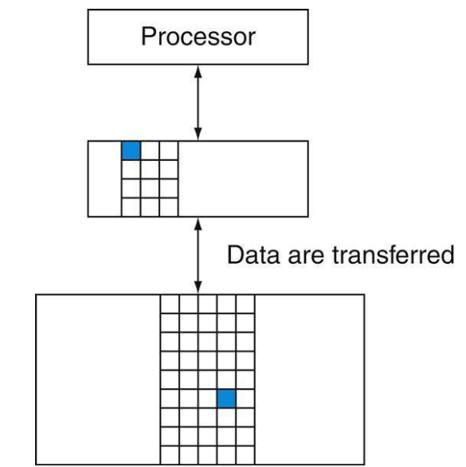
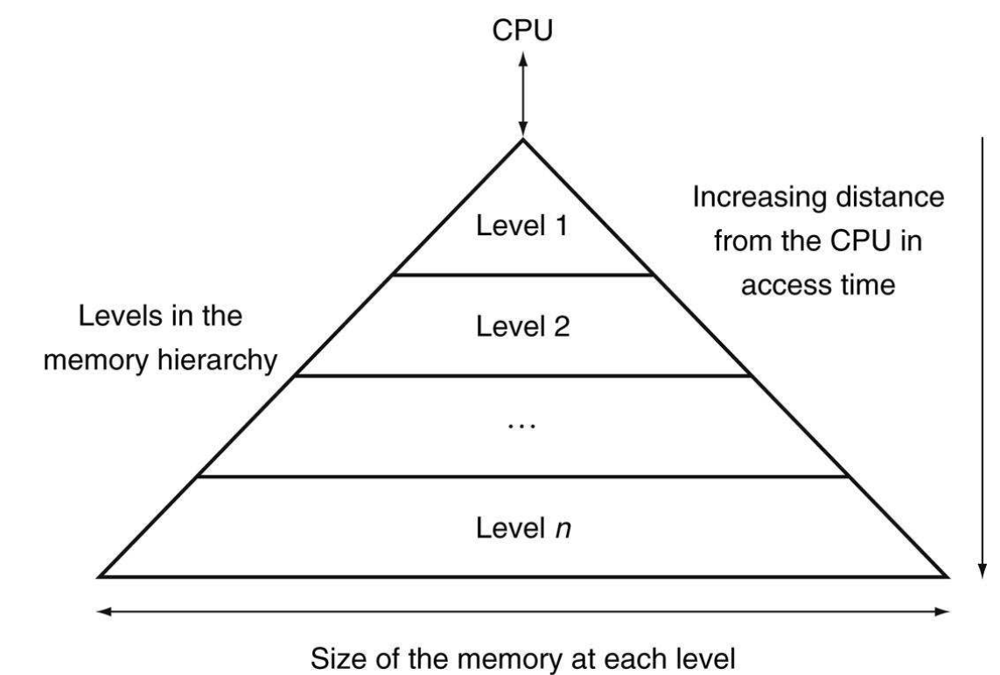

# 概述

在早期的计算机发展当中，程序员理想的内存是这样的：无限大，与访问寄存器组的速度一致。显然，这种理想的内存不可能制造出来，但是，我们可以通过一些策略与机制来造成接近上述内存的假象。

一般来说，一个程序的所有代码或者数据都具有不同的访问频率，例如，一个变量可能会反复访问（迭代下标），一段程序也可能会连续不断访问（循环）。从另一个方面来说，在计算机中，不可能所有的内存访问都是极快的（和访问寄存器组一样快）并且内存具有庞大的容量。

局部性原则（principle of locality）指出了程序在任意时间段内频繁访问的地址空间相对整个地址空间来说是很小的一部分，其中，局部性原则有两种不同的类型：

- 时间局部性（Temporal locality，locality in time）：如果一个数据被引用，那么它将很快会被再次引用。
- 空间局部性（Spatial locality, locality in space）：如果一个数据被引用，那么与它地址相邻的数据也会很快被引用。

实际上，程序当中的局部性就是从简单的程序结构中所浮现的一般特性。举例来说，大多数的程序都带有循环，循环当中的代码和变量一般来说都会重复访问，体现了一种典型的时间局部性原则。同样，循环的程序代码会顺序的存放在一起，也体现了一种典型的空间局部性原则。

利用局部性原则的思想，我们可以对计算机中的内存实现内存层次的架构。一个内存层次的架构包含多个层次的不同容量以及访问速度的内存。更快速的内存要比慢速的内存价格更高，并且容量更小。

典型的存储器层次架构：

<table>
    <tr>
        <th>速度</th>
        <th>与处理器的距离</th>
        <th>大小</th>
        <th>价格</th>
        <th>当前实现技术</th>
        <th>典型代表</th>
    </tr>
    <tr>
        <th>极快</th>
        <th>最接近</th>
        <th>极小(数十个bit)</th>
        <th>很贵</th>
        <th>SRAM</th>
        <th>寄存器</th>
    </tr>
    <tr>
        <th>很快</th>
        <th>很接近(L1~L3片内)/一般(L4片外)</th>
        <th>很小(数十KB~数十MB)</th>
        <th>很贵</th>
        <th>SRAM(L1~L3)/DRAM(L4)</th>
        <th>cache</th>
    </tr>
    <tr>
        <th>一般</th>
        <th>一般</th>
        <th>比较大(4~32+GB)</th>
        <th>比较便宜</th>
        <th>DRAM</th>
        <th>内存</th>
    </tr>
    <tr>
        <th>很慢/比较慢</th>
        <th>比较远</th>
        <th>很大(TB或以上为衡量单位)</th>
        <th>很便宜/比较便宜</th>
        <th>磁质存储/闪存</th>
        <th>磁盘/固态硬盘</th>
    </tr>
</table>

注：
- 与处理器的距离可以是物理的也可以是逻辑的。
- 不同层次存储器的大小日益在改变，以PC为例，21世纪初PC机的内存大小一般不会超过1GB，而在当前（2019年）主流的PC机的内存大小一般在16GB～32GB。上表所示的只是一个参照值。
- 容量庞大的存储现今越来越多使用的是以闪存为基础制成的固态硬盘，它的访问速度比传统的磁质介质存储器——磁盘，要快很多。当然，在大型的服务器当中，磁盘通常会使用RAID技术来加快访问的速度。

在存储器的分级层次下，数据也是具有层次的：一个更接近处理器的存储器层级的数据，一般是上一个层级数据的子集。所有的数据存储在最底下的层次当中。存储器层次可以包含多个层次，但是数据只能一次从两个相邻的层次之间相互复制，因此我们可以分别关注相邻的两个层次。更高层的层次，更接近处理器，并且比低层的层次存储空间更小，访问速度更快，价格也更贵。

在存储器层次的框架当中，信息的最小单位称为块（block）或者行（line）:

相邻存储器层次之间信息传输的基本单位就是块或者行。

当我们关注两个相邻的存储器层次时，一些指标可以体现这个存储器架构的性能。当处理器所需要的块在上级层次中出现时，称为命中（hit）。距离来说，缓存命中指处理器所需要的块在缓存中。如果所需要的块不在上级层次中出现，则称为未命中（miss），此时处理器需要从下级层次中找回所需要的块。命中率（hit rate, hit ratio），是一个存储器层次的重要衡量指标。比如，特定存储器架构当中，缓存-内存层次的命中率。命中时间（hit time）是指从上层层次中获取一个块的时间，包含所需要的块是否在上层层次中的时间。未命中时间延迟（miss penalty）是指当所需要的块不在上层层次时，从下层层次中复制所需要的块并替代上层层次其中一个块所需要的时间，加上将该块传递给处理器的时间。由于上层层次一般来说大小更小，并且使用更快的访问存储单元，因此上层的命中时间要比下层的命中时间更短，而这时间差就是未命中时间延迟的重要组成部分。

在接下来的章节中，构建存储器系统基本概念同样影响着计算器的其他部分，包括操作系统如何管理内存和IO、编译器如何产生汇编代码，甚至是软件应用如何运作。当然，由于所有的程序都会将大部分的程序时间花在对存储器的访问当中，因此存储器系统是整体性能的重要组成部分。依赖于存储器分层架构，意味着程序员需要将之前的认知（存储器是一块线性的、随机访问的存储设备）所摒弃，而接受存储器是分层的这一事实。在这之后将会阐述这一重要的认知，通过矩阵相乘的例子来说明。

由于存储器系统是决定计算机性能的关键，因此计算机的设计者会花费大量的时间在存储器系统的设计当中，包括如何改进存储器系统的性能。

### 大局观

程序通过以下的方式来践行两种局部性的原则：

- 时间局部性：重用最近访问过的数据。
- 空间局部性：引用当前所需要数据的邻近数据。

而存储器分层架构则通过以下的方式来践行这两种原则：

- 时间局部性：将最近访问过的数据置于靠近处理器的存储层级当中。
- 空间局部性：将所需要的数据及其邻近的数据置于高层存储层次当中。

下图展示的就是典型的存储器分层层次架构图。命中最高层次的存储结构将会使得访存速度达到最快。而如果未命中，则需要从下层结构中寻找，因此速度会变慢。然而下层结构的大小会变得更大，命中的概率也会越高。通过实现更好的策略，使命中率足够高，则访问存储器的速度会更接近于访问最高层次的速度。

在这一结构当中，通过使用适当的访存机制，可以使得处理器访存的速度基本由第1层级的性能来决定，并且拥有的存储器大小与第n层级相仿。构建、维护和改进这一思想则是本章的关键。尽管本地的存储器一般来说都是瓶颈，对于某些大型服务器和集群来说，磁带或者通信网络是作为存储器分层架构中的最底一层。

对于大多数的系统来说，存储器分级是物理上的，也就是说，如果一个数据不存在i+1层当中，则它绝对不会出现在第i层中。
