# RISC-V异常与中断机制概述

RISC-V的异常和中断机制相对来说是比较复杂的一个部分，但是它对于完整的处理器设计来说是必不可少的。在这里我对RISC-V的异常与中断的机制做一个简单的阐述，可能会有一定的错漏之处，欢迎批评斧正。

参考文献与资料：

1. The RISC-V Instruction Set Manual Volume II: Privileged Architecture. https://riscv.org/specifications/privileged-isa/
2. FE310G: an open source RISC-V microcontroller – Interrupt System, http://embeddedsystems.io/fe310g-open-source-riscv-microcontroller-interrupt-system/
3. SiFive Proposal for a RISC-V Core-Local Interrupt Controller (CLIC), https://github.com/sifive/clic-spec/blob/master/clic.adoc#background-and-motivation

在此之前，首先要说明遣词用句中的问题。异常与中断实际上是很容易混用的词汇，一般来说，中断也是一种异常（广义上的），中断可以看作是来源于外部的异常。因此下文中所说的异常指的是狭义上的异常，即来源于核内部发生的异常（如：指令错误、ALU执行异常、写回存储器异常、长指令写回异常等）。而中断则是指广义上异常去除狭义上异常除外的所有异常，下文将会提到（包括外部中断、时钟中断以及软件中断）。

文章基于的是V1.9.1的RISC-V特权级架构。

## RISC-V特权级别

在任何时候，一个RISC-V的硬件线程（hardware thread, hart）都会运行在一个特权级别当中，这个特权级别作为一个模式编码在CSRs（control and status registers，控制状态寄存器组）当中。当前一共有三种RISC-V的特权级别：

<table>
    <tr>
        <th>级别</th>
        <th>编码</th>
        <th>名字</th>
        <th>缩写</th>
    </tr>
    <tr>
        <th>0</th>
        <th>00</th>
        <th>用户/应用级</th>
        <th>U</th>
    </tr>
    <tr>
        <th>1</th>
        <th>01</th>
        <th>特权级</th>
        <th>P</th>
    </tr>
    <tr>
        <th>2</th>
        <th>10</th>
        <th>(保留)</th>
        <th></th>
    </tr>
    <tr>
        <th>3</th>
        <th>11</th>
        <th>机器级</th>
        <th>M</th>
    </tr>
</table>

每个特权级别都有属于它的一个指令子集。机器级是最高的特权级别，可以运行任何指令，访问处理器中任何的一个寄存器。

## 不同类型设备对中断的使用方式不尽相同

- 高性能的类Unix系统
    - 中断处理时间只占处理器时间中的很小一部分
        - 快速的处理器核，智能设备
    - 最小化的中断处理设备
    - 软件调度
- 中低端的嵌入式系统
    - 中断处理时间是处理器时间中显著的一部分
        - 缓慢的处理器核
    - 中断处理设备的设计是重要的一部分
    - 中断处理器可以像任务管理器一样运作
- 高性能的实时系统
    - 不能浪费时间在处理中断上
    - 规律心跳计时的方式来处理IO设备请求

## RISC-V中断的设计目标

1. 简洁至上的原则。
2. 支持所有类型的平台，从嵌入式系统中的微控制器到大型的虚拟服务器。
3. 实现性能与实现成本之间的权衡。
4. 灵活的支持特定的需求。

## RISC-V中断类型

RISC-V一共有两大类的中断类型：局部中断（Local Interrupts）以及全局中断（Global Inerrupts）。

局部中断是指直接与hart相连的中断，可以直接通过CSRs当中的xcause（mcause、scause、ucause）中的值得知中断的类型。在局部中断当中，只有两种标准的中断类型：计时中断（timer）以及软件中断（software）。

全局中断实际上就是外部中断（External Interrupts）。它与PLIC相连（Platform-Level Interrupt Controller，平台级中断控制器）。实际上全局中断在多个硬件线程的情况下最为常用。PLIC用于对外部中断进行仲裁，然后再将仲裁的结果送入核内的中断控制器。

## RISC-V异常与中断处理的基本机制

在RISC-V异常与中断处理的基本机制当中，会以简化的模型来进行阐述，也就是说，只考虑在机器级下异常与中断处理的基本机制。

### 有关的CSRs

#### Machine Trap-Vector Base-Address Register (mtvec)

mtvec，即机器模式异常入口基地址寄存器。mtvec是一个XLEN位（字长）的可读写的寄存器，保存异常向量的设置，包括向量的基地址（BASE）以及模式（MODE）。实际上它定义的就是异常入口程序的基地址。

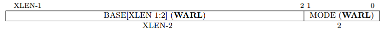

其中WARL指的是Write Any Read Legal。mtvec寄存器是必须实现的，但是可以只包含硬编码的只读值。如果mtvec是可写的，那么寄存器中可以保存的值是可以有很多种的。BASE域中的值必须以4字节对齐，同时在MODE中设定的值可能会给BASE域的值带来额外的限制。

MODE域中的编码：

<table>
    <tr>
        <th>值</th>
        <th>名字</th>
        <th>描述</th>
    </tr>
    <tr>
        <th>0</th>
        <th>直接</th>
        <th>所有的异常都将PC设为BASE</th>
    </tr>
    <tr>
        <th>1</th>
        <th>向量</th>
        <th>异步的中断会将PC设置为BASE+4*cause</th>
    </tr>
    <tr>
        <th>>=2</th>
        <th></th>
        <th>(保留)</th>
    </tr>
</table>

#### Machine Cause Register (mcause)

mcause，即机器模式异常原因寄存器。mcause是一个XLEN位的可读写的寄存器。RISC-V架构规定，所有的异常默认进入机器模式（M-mode），此时mcause被写入一个值表明是什么事件造成了这个异常。此外，mcause在实现中永远不会被写入，尽管它有可能会在软件中被显式要求写入。

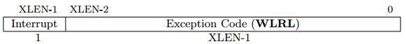

当异常是由一个中断所造成的时候，mcause中的Interrupt位会被置为1。Exception Code域包含着标明最近一个异常发生的原因。下表列出了可能的机器级的异常编码。Exception Code域是WLRL（Write Legal Read Legal）的，因此它需要保证只能包含所支持的异常编码。

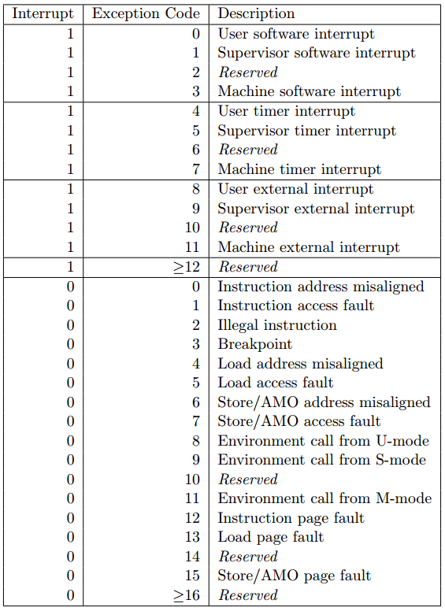

上表中也可以看出一些典型的异常和中断。

#### Machine Trap Value Register (mtval)

mtval，即机器模式异常值寄存器。mtval是一个XLEN位的可读写寄存器。当一个异常发生进入机器模式时，mtval被写入该异常的信息，来帮助服务程序来处理这个异常。此外，mtval在实现中永远不会被写入，尽管它有可能会在软件中显式要求写入。

当一个硬件的断点触发，或者指令的获取，或者加载存储地址未对齐，或者页故障异常发生时，mtval会写入受异常影响的地址。在非法指令的异常当中，mtval会写入故障指令的XLEN位。对于其他的异常来说，mtval会写入为0。在将来可能会扩展更多的内容。

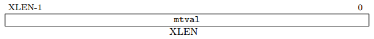

在RISC-V的指令获取异常当中，如果指令是变长的，mtval会包含一个指向该指令一部分的指针。而mepc会指向该指令的起始地址。

mtval还可以在非法指令异常时选择返回异常指令。（mepc指向内存中该异常指令的地址）如果不支持这个特性，那么mtval设置为0。如果支持了这项特性，在一个非法指令异常之后，mtval会包含整个异常指令。如果指令的长度小于XLEN，则mtval的高位使用0来填充。如果指令的长度大于XLEN，那么mtval会包含该异常指令的前XLEN位。

#### Machine Exception Program Counter (mepc)

mepc，即机器模式异常程序计数器。mepc是一个XLEN位的可读写寄存器。mepc的最低位（mepc[0]）恒为0。在不支持16位指令扩展的实现当中，mepc最低的两位（mepc[1:0]）恒为0。

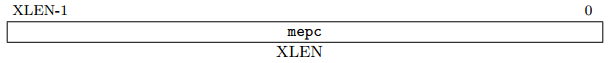

mepc是一个WARL的寄存器，必须能够包含所有合法的物理以及虚拟地址。它不需要支持包含所有可能的不合法的地址，某些实现当中，可能会将一些不合法的地址串转换成其他的不合法的地址来写入mepc当中。

当发生异常进入机器模式时，mepc会写入该异常的虚拟地址（没有实现MMU的就是实际的物理地址）。此外，mepc在实现中永远不会被写入，即使有些软件可能要求显式的写入。

#### Machine Status Register (mstatus)

mstatus，即机器模式状态寄存器。mstatus是一个XLEN位的可读写的寄存器。下面展示的RV32位的格式。mstatus寄存器会追踪以及控制所有hart当前的状态。而在特权级以及用户级指令集架构当中则为sstatus以及ustatus寄存器。

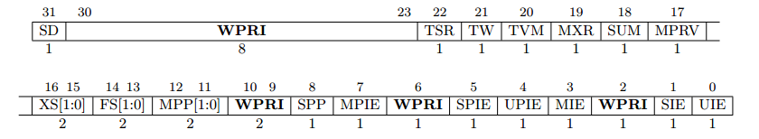

##### mstatus当中不同特权级以及全局的中断使能栈

在mstatus中，提供了不同特权级模式的中断使能位：MIE、SIE以及UIE。这些位用于表明当前特权级的全局中断使能情况。当一个hart在x特权级执行时，若xIE=1，则此特权级下允许中断。

为了支持嵌套中断，每个特权模式x都有一个两级的栈提供给中断使能位以及特权模式。xPIE保存着在异常发生前的中断使能位，xPP保存着异常发生前的特权模式。MPP有2位，SPP只有1位，而UPP是隐式为0的（异常进入用户模式只能是用户模式，异常进入特权模式可以是用户模式也可以是特权模式，异常进入机器模式则可以是所有的模式）。当一个异常发生后，从特权模式y切换到了特权模式x，则xPIE设置为xIE的值，xIE设为0，同时xPP设置为y。

而MRET、SRET以及URET指令用于从机器模式、特权模式以及用户模式下的异常返回。当执行xRET指令时，假设xPP为y。此时xIE从xPIE中恢复，特权模式设置为y，xPIE设置为1，xPP设置为U（或者M，如果用户模式不被支持）。

如果实现中没有用户模式，则UIE和UPIE硬编码为0。

#### Machine Interrupt Registers (mip and mie)

机器模式下的中断寄存器有两个：Machine interrupt-pending register（mip，机器模式中断等待寄存器）以及Machine interrupt-enable register（mie，机器模式中断使能寄存器）。mip和mie都是一个XLEN位的可读写的寄存器，mip包含着与中断等待相关的信息，而mie包含中断使能位。在mip中，只有在低特权级别的位才能够使用CSR来寻址写入，包括：软件中断（USIP、SSIP）、时钟中断（UTIP、STIP）以及外部中断（UEIP、SEIP）。剩下的其他位都是只读的。

mip和mie在其他的特权级别下的寄存器分别为sip/sie以及uip/uie。如果一个中断通过设置在mideleg寄存器中的位，来下放到x特权级别下处理，则它在xip寄存器中是可见的，并且可以在xie寄存器中进行屏蔽。否则，对应的xip以及xie中的位会被硬编码为0。

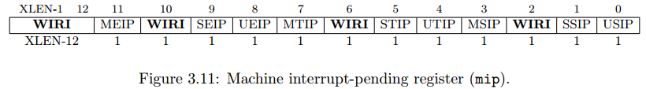

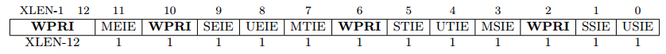

MTIP、STIP、UTIP分别对应机器级、特权级以及用户级下的计时中断等待位。MTIP位是只读的，只能够通过写内存映射的机器模式计时器比较寄存器（machine-code timer compare register，mtimecmp）来清除。UTIP和STIP可以被工作在机器模式下的软件写入，用于传递计时中断给低级的特权级。用户级以及特权级的软件可以通过调用AEE（Application Execution Environment）和SEE（Supervisor Execution Environment）来分别清除UTIP和STIP位。

MTIE、STIE、UTIE分别对应机器级、特权级以及用户级下的计时中断使能位。

每个低级的特权级都有一个软件中断等待位（SSIP、USIP），可以使用在本特权级或者更高的特权级使用CSR指令来进行读写。机器级的MSIP只能通过存储器映射的控制寄存器来进行控制。

MEIP域是只读的，它表示一个机器模式下的外部中断正在等待。MEIP只能通过PLIC（Platform-Level Interrupt Controller）来设置。MEIE在设置后即允许外部中断。

SEIP是可读写的位。SEIP可能会在机器模式下被软件写入来表示在特权模式下有一个外部中断正在等待。此外，也可能是PLIC产生了一个特权级的中断正在等待，因此，特权级的外部中断可以由PLIC产生，也可以由机器模式下的软件来产生。UEIP与SEIP的实现相似。

MEIE、SEIE以及UEIE分别对应机器级、特权级以及用户级下的外部中断使能位。

对于所有的中断类型来说（软件中断、计时中断以及外部中断），如果其特权级没有得到支持，则对应的mip和mie中的位硬编码为0。

一个中断i会在mip以及mie中对应类型的位置为1时得以触发，并且此时全局的中断位也是1。默认情况下，当hart运行在低于机器模式的特权级别下时，或者hart运行在机器模式下且MIE位为1时，机器级的中断都是开放的。如果mideleg中的位i置为1，那么，中断在以下情况中是全局开放的：当前hart的特权级与下放的特权级相等（S或者U），且该模式的全局中断使能为为1（mstatus中的SIE或者UIE）；当前的特权级模式比下放的特权级模式要低。

#### Machine Timer Registers (mtime and mtimecmp)

可以在硬件上提供一个实时的计数器，并通过内存映射的方式进行访问：machine-mode register - mtime，机器模式计时器寄存器。mtime必须运行在不变的频率当中，并且必须提供一个机制来决定mtime的基准时间。

mtime在RV32、RV64以及RV128中是64位的。同样还会提供一个内存映射的机器模式计时器比较寄存器：machine-mode timer compare register - mtimecmp。当mtime中的值比mtimecmp中的值要大的时候，就会产生一个计时中断。

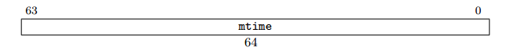

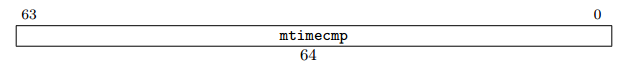

在RV32当中，使用内存映射的方式写入mtimecmp只能是其32位的部分。下面的例程将一个新的比较值写入到mtimecmp当中：

```
# New comparand is in a1:a0
li t0, -1
sw t0, mtimecmp     # 冲刷低32位，保证不会发生计时中断
sw a1, mtimecmp+4   
sw a0, mtimecmp
```

### 异常与中断的处理过程

处理过程基于简化的模型，假设仅仅实现了机器模式的hart。

#### 进入异常

以下均为处理器硬件执行的行为：

1. **更新mepc**。如果出现的是中断，则mepc写入产生中断的指令的下一条指令的地址。如果出现的是异常，则mepc写入当前指令的地址。
2. **更新mcause**。根据产生异常的类型更新mcause，异常类型的编码上文已经提到。
3. **更新mtval**。某些异常需要将异常相关的信息写入到mtval当中。
4. **更新mstatus**。将异常发生前的MIE保存到MPIE当中，将异常发生前所处的特权级保存到MPP中，在本模型下恒为机器模式。将MIE设为0。这意味着在硬件上，RISC-V是不支持嵌套中断的。若要实现嵌套中断，则只能通过软件的方式来实现。具体实现：当一个异常发生后，则MPIE设置为MIE的值，MIE设为0，同时MPP设置为M。
5. **跳转到mtvec中所定义的异常入口地址执行**。如同上面所提到的，mtvec有两种模式，一种是直接模式，直接跳转到mtvec中的基地址执行。另一种是向量模式，根据mcause中的异常类型跳转到对应的异常处理程序首地址中执行。

#### 退出异常

当异常处理程序执行完毕后，在程序最后会调用MRET指令来退出异常处理程序（其他特权级的指令为SRET、URET，本模型不需要）。执行MRET指令后处理器硬件执行的行为如下：

1. **从mepc中定义的地址执行**。恢复到异常发生前的程序流执行。
2. **更新mstatus**。将异常发生前的mstatus的状态恢复，如上文mstatus描述中所述。具体实现：此时MIE从MPIE中恢复，特权模式设置为M，MPIE设置为1，MPP设置为M。

## 总结

RISC-V模式下的异常与中断处理的过程为（仅实现机器模式）：

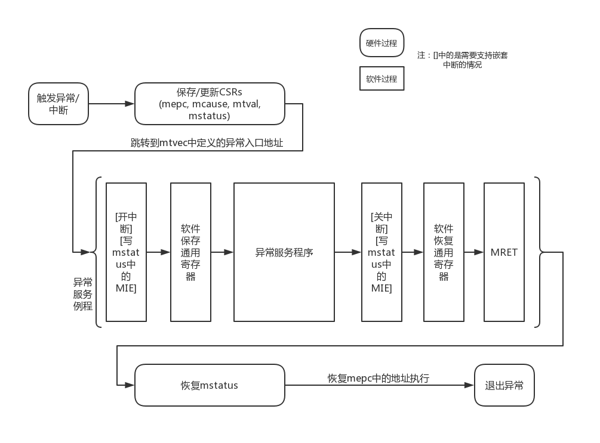
