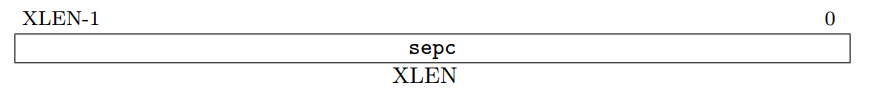
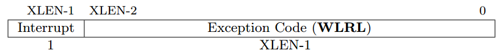
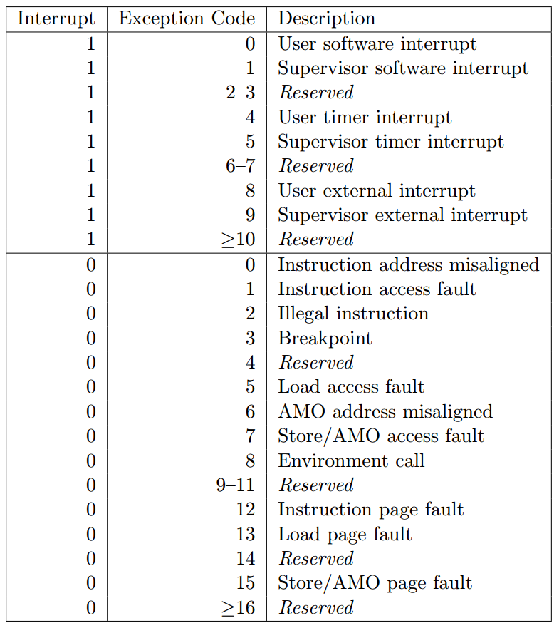

# RISC-V特权级架构概述

对RISC-V特权级体系架构中的一些比较重要的部分进行阐述。基于RISC-V特权级架构1.10版本。

## 特权级ISA概述

### 特权级控制状态寄存器（CSRs）

#### Supervisor Exception Program Counter(sepc)

特权级异常程序计数器。用于保存异常发生时当前执行指令的地址。

sepc是一个字长的可读写的寄存器。spec的最低位恒为0。在不支持16位指令对齐的指令集扩展的架构中，最低的两位恒为0。

sepc是一个WARL（Write Any value and Read Legal value，写任意值读合法值）的寄存器，必须能保存所有有效的物理以及虚拟地址。它不需要能够保存所有可能的不合法的地址。在架构的实现当中，有可能会将某些不合法的地址模式转化成其他先前不合法的地址并将其写入到sepc当中。

当陷阱发生进入特权级模式时，会将当前执行指令的虚拟地址写入sepc。否则，sepc不会在架构中被写入，尽管它有可能会在软件层次显式要求写入。

#### Supervisor Cause Register(scause)

特权级异常来源寄存器。用于指示当前异常发生的原因是什么。

scause是一个字长的可读写的寄存器。当一个陷阱发生进入特权态时，scause会被写入一个值，用于指示是什么原因造成了陷阱。否则，scause不会在架构中被写入，尽管它有可能会在软件层次显式要求被写入。

当异常发生时，scause中的中断位会被置位（如果有），用于指示最近一次的异常的原因。下表列出了当前特权级ISA下所有可能的值。scause中的Exception Code域是WLRL（Write Legal value and Read Legal value，写合法值读合法值）的，因此它只能被写入当前特权级ISA所支持的值：

