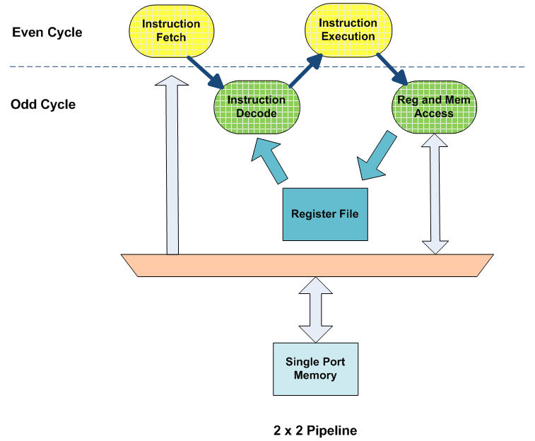

PulseRain Reindeer 是一个软核的冯诺依曼结构的CPU。它支持RISC-V RV32I[M]指令集架构以及一个2x2的流水线结构。它在FPGA平台上是一个比较灵活的选择。

# 2x2流水线结构

Reindeer的流水线有4个阶段：

- 取指（IF）
- 译码（ID）
- 执行（IE/EXE）
- 写回以及存储器访问（MEM）

在2x2的流水线结构设计当中，IF以及IE阶段只在偶数时钟周期中活跃，而ID以及MEM阶段只在奇数时钟周期中活跃。这是为了防止单个端口的存储器在IF以及MEM阶段时发生结构冒险问题（IF以及MEM阶段不会在同一个周期中同时活动）。因为大部分的FPGA平台上的存储器都是SPRAM（singal prot RAM）。

# Hold and Load

引导一个软核CPU代码是一件很麻烦的事情，传统的做法是：

1. 将bootloader用软件代码实现
2. 将bootloader代码存放在ROM当中
3. 在上电或者重启之后，bootloader会先执行，它会将剩余的用户自定义的代码以及数据移动到RAM当中，然后将PC设定为 _start 地址（bootloader中自定的起始地址）开始执行程序。

上述做法有一些缺点：

1. 使用软件的bootloader会占用到存储空间
2. 很多FPGA使用不同的ROM写入策略，有些可以直接在FPGA位流当中定义（Intel Cyclone 或者 Xilinx Artix），有一些需要外部设备写入到ROM当中。并且当实现SoC+FPGA方案的时候，一个硬核的处理器可能会参与引导的步骤，也就是说，这个软核的CPU可能还需要支持在多个平台上工作的兼容性。

