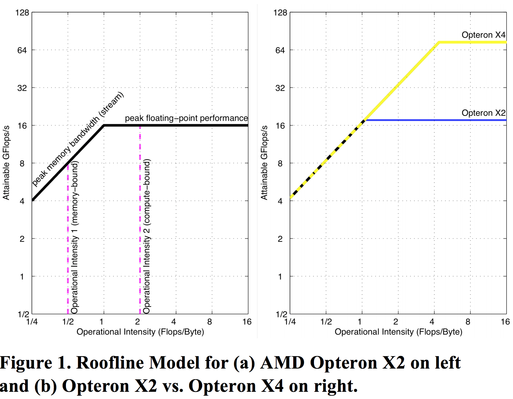

# Roofline model

来自Williams、Waterman和Patterson在2008年的工作： [Roofline: An Insightful Visual Performance Model for Floating-Point Programs and Multicore Architectures](https://dl.acm.org/citation.cfm?id=1498785)。

## 基本概念

计算任务（小到矩阵乘法、大到神经网络的训练）的性能表现，取决于**任务**本身的特性以及**计算平台**的指标。

计算平台的主要指标：
- 算力：每秒峰值浮点运算次数（Peak Flops/sec）
- 带宽：每秒峰值内存数据存取量（Peak Memory Bandwidth），单位是Byte/sec

计算任务的主要指标则是**运算量**（单位：Flops）以及**访存量**（单位：Bytes）。

## Roofline model

在很多的情况下，内存访问会称为瓶颈。定义**运算强度（Operational Intensity）**的概念：运算量和访存量的比值（Flops/byte）。也就是说单位内存访问用于多少次的浮点计算。一个任务的运算强度越高，内存使用效率越高。

```
Attainable Flops/sec = Min(Peak Flops/sec, Peak Memory Bandwidth * Operational Intensity)
```



以运算强度为横轴，每秒浮点运算次数为纵轴画图，所得出来的折线就是roofline。其中算力决定了屋顶的高度，而内存带宽决定了屋檐的斜率。所有在这个平台上运行的计算任务都处于屋顶的下方。

- Memory-bound：任务的性能受限于内存带宽，此时运算强度越大任务性能越好。
- Compute-bound：任务的性能受限于算力，此时平台算力越高任务性能越好。

## 优化手段

### 提高算力

- 指令集并行：循环展开、SIMD
- 平衡不同类型浮点运算的数量，使得编译器可以最大程度利用乘积累加运算指令 （Fused multiply-add）

### 提高带宽

- 循环使用单位步长访问数组，利用硬件Prefetching
- 在NUMA系统里利用内存的Affinity
- 使用软件的Prefetching