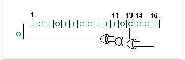

# 线性反馈移位寄存器

线性反馈移位寄存器（Linear feedback shift register，LFSR）是指给定前一状态的输出，将该输出的线性函数再用作输入的移位寄存器。异或运算是最常见的单比特线性函数：对寄存器的某些位进行异或操作后作为输入，再对寄存器中的各比特进行整体移位。

线性反馈移位寄存器的应用包括生成伪随机数，伪随机噪声序列，快速数字计数器，还有扰频器等。线性反馈移位寄存器在硬件和软件方面的应用都非常普遍。循环冗余校验中用于快速检验传输错误的数学原理，就与线性反馈移位寄存器密切相关。

## Fibonacci LFSRs

以一个16位的Fibonacci LFSR作为例子。在LFSR中，影响下一个状态的比特位叫做抽头。LFSR最右端的比特为输出比特。抽头依次与输出比特进行异或运算，然后反馈回最左端的位。最右端位置所生成的序列被称为输出流。

在LFSR中，抽头的设定可以用有限域算数中模2的多项式来表示，这就意味着，多项式中的所有稀疏必须是“1”或者“0”。这个多项式被称作回授多项式或者特征多项式。如上述例子中的抽头相应的特征多项式为：

x^16 + x^14 + x^13 + x^11 + 1
