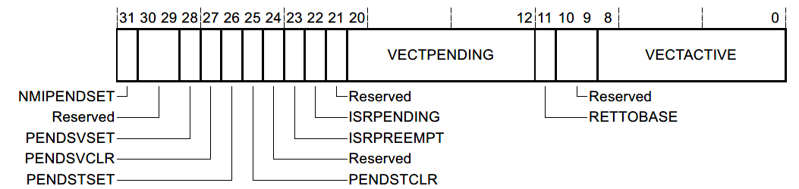

# FreeRTOS任务分析（一）

任务的实现主要位于task.h以及task.c当中，首先对task.h文件进行一定的分析。

## task.h

在task.h中主要是结构体、和宏定义，以及与任务相关函数的声明。与任务相关函数的实现主要在task.c当中。

在头文件中首先定义的就是任务控制块**TaskControlBlock_t**，同时定义的还有任务句柄TaskHandle_t，这个在用户接口当中经常使用：

```C
typedef struct TaskcontrolBlock_t* TaskHandle_t;
```

可以看出，任务句柄实际上就是指向任务控制块的指针。

接下来定义了一个函数指针TaskHookFunction_t，实际上就是定义任务钩子函数的函数指针。函数指针的原型是参数为空指针类型(void *)，返回值为BaseType_t。

**eTaskState**是一个枚举类型，表示任务的状态。结构体的定义中有6种任务状态：eRunning（运行中）、eReady（就绪）、eBlocked（阻塞）、eSuspended（挂起）、eDeleted（删除）以及eInvalid（不存在）。其中用户可见的状态是运行、就绪、阻塞和挂起，后面两个状态是内核代码实现所使用的：

```C
/* Task states returned by eTaskGetState. */
typedef enum
{
	eRunning = 0,	/* A task is querying the state of itself, so must be running. */
	eReady,			/* The task being queried is in a read or pending ready list. */
	eBlocked,		/* The task being queried is in the Blocked state. */
	eSuspended,		/* The task being queried is in the Suspended state, or is in the Blocked state with an infinite time out. */
	eDeleted,		/* The task being queried has been deleted, but its TCB has not yet been freed. */
	eInvalid		/* Used as an 'invalid state' value. */
} eTaskState;
```

**eNotifyAction**也是一个枚举类型，用于任务通知使用。任务通知有几种用法，在任务控制块中有一个专门留给任务通知的变量使用（后续提到），一个任务调用任务通知另一个任务的时候，可以选择如何进行任务通知，包括不做任何处理、将任务通知值置位、递增任务通知值、重写任务通知值以及非重写设定任务通知值等：

```C
/* Actions that can be performed when vTaskNotify() is called. */
typedef enum
{
	eNoAction = 0,				/* Notify the task without updating its notify value. */
	eSetBits,					/* Set bits in the task's notification value. */
	eIncrement,					/* Increment the task's notification value. */
	eSetValueWithOverwrite,		/* Set the task's notification value to a specific value even if the previous value has not yet been read by the task. */
	eSetValueWithoutOverwrite	/* Set the task's notification value if the previous value has been read by the task. */
} eNotifyAction;
```

其他的一些结构仅仅用于内核或者并不常用，若在以后分析到的接口函数中提到，则再做分析。

接下来是一些任务相关的宏定义。

**TskIDLE_PRIORITY**是对空闲任务的任务优先级定义：

```C
#define tskIDLE_PRIORITY			( ( UBaseType_t ) 0U )
```

空闲任务是当启动任务调度器时自动创建的任务，具有最低的任务优先级值（0）。当运行FreeRTOS时，最低优先级的任务已经是可运行任务中的最高优先级时，空闲任务就会执行。空闲任务同时会执行有关内存回收等任务，用户也可以使用空闲任务钩子函数vApplicationIdleHook()来让空闲任务完成一些用户自定义的工作。

接下来是一些和机器有关的宏，这些宏定义需要与底层机器具体实现挂钩，因此不同机器有不同的实现：

**taskYIELD()** 任务主动让步，这个宏定义需要根据不同的机器实现，因此在不同的硬件平台上有不同的实现方式：

```C
#define taskYIELD()					portYIELD()
```

在这里作为一个例子简单阐述，以Cortex-M3中的实现为例子：

```C
/* Scheduler utilities. */
#define portYIELD() 															
{																				
	/* Set a PendSV to request a context switch. */								
	portNVIC_INT_CTRL_REG = portNVIC_PENDSVSET_BIT;								
																				
	/* Barriers are normally not required but do ensure the code is completely	
	within the specified behaviour for the architecture. */						
	__asm volatile( "dsb" ::: "memory" );										
	__asm volatile( "isb" );													
}

#define portNVIC_INT_CTRL_REG		( * ( ( volatile uint32_t * ) 0xe000ed04 ) )
#define portNVIC_PENDSVSET_BIT		( 1UL << 28UL )
```

在Cortex-M3的实现当中，由于要主动进行让步，因此将NVIC（嵌套中断控制器）中的PendSV置位，启动一次PendSV中断来进行一次上下文切换。PendSV是Cortex-M3中级别最低的异常，引入PendSV是为了解决当处理中断的时候Systick来临时请求上下文切换的问题（嵌入式系统中无法忍受中断被延时，特别是在实时系统当中），PendSV是一类可以延时处理的异常。因此在Cortex-M3当中，会把上下文切换放在PendSV异常中进行处理。

为了置位PendSV，我们需要对NVIC进行置位。NVIC中的中断控制和状态寄存器ICSR用于提供NMI、PendSV以及SysTick的软件控制及中断状态信息，这个寄存器位于地址空间中的0xE000ED04位置。在ARM的ARMv7架构文档中获取ICSR有关的信息：



ICSR第28位PENDSVSET即为启动PendSV异常。因此对其进行置位：

```C
#define portNVIC_INT_CTRL_REG		( * ( ( volatile uint32_t * ) 0xe000ed04 ) )
#define portNVIC_PENDSVSET_BIT		( 1UL << 28UL )

portNVIC_INT_CTRL_REG = portNVIC_PENDSVSET_BIT;
```

这样就完成了第一步的工作。在这之后，源码中还执行了一次内存屏障的操作：

```C
__asm volatile("dsb":::"memory");
__asm volatile("isb"); 
```

这是在C中内嵌汇编语言，具体的使用方法在Hardware根目录下的“GCC在C语言中内嵌汇编语言”可以查看，首先在汇编中插入DSB指令，指Data Synchronization Barrier（数据同步屏障指令），是一种指令同步的操作。它要求在它之前的所有明确的内存读写指令以及对SCS（System Control Space）进行读写的指令要执行完毕。memory意味着当前指令"DSB"不要和前面的指令进行重排序（现代处理器为了契合流水线以及多处理器架构，会对指令进行重排执行），以及不要将该指令中用到的变量缓存到寄存器中（和volatile一样）。然后执行ISB指令，指Instruction Synchronization Barrier（指令同步屏障指令），该指令会刷新整个流水线，使得在该指令前的所有指令都执行完毕。该指令在上下文切换中使用的非常频繁。

至此，在Cortex-M3中进行的任务主动让步的操作完成。

宏**taskENTER_CRITICAL()**以及**taskEXIT_CRITICAL()**以及它们的中断处理服务版本是对临界区的划分，在这两个语句之间的代码为临界区。这是任务级的临界区保护，允许临界区的嵌套，在里面会调用portDISABLE_INTERRUPTS()以及portENABLE_INTERRUPTS()。

```C
#define taskENTER_CRITICAL()		portENTER_CRITICAL()
#define taskENTER_CRITICAL_FROM_ISR() portSET_INTERRUPT_MASK_FROM_ISR()

#define taskEXIT_CRITICAL()			portEXIT_CRITICAL()
#define taskEXIT_CRITICAL_FROM_ISR( x ) portCLEAR_INTERRUPT_MASK_FROM_ISR( x )
```

宏**taskDISABLE_INTERRUPTS()**以及**taskENABLE_INTERRUPTS()**是中断级别的临界区保护，用于关闭以及开启所有可屏蔽的中断：

```C
#define taskDISABLE_INTERRUPTS()	portDISABLE_INTERRUPTS()

#define taskENABLE_INTERRUPTS()		portENABLE_INTERRUPTS()
```

该宏定义在CM3中的实现使用汇编语言，将系统允许的最高级别的可屏蔽中断优先级写入到BASEPRI寄存器中，BASEPRI寄存器是一个基准优先级保存的寄存器，高于BASEPRI寄存器中优先级的中断或者异常可以发生（或者抢占）。开启中断则往BASEPRI中写0即可。

最后三个宏定义是和调度器的状态有关的，分别是调度器被挂起、调度器未启动以及调度器运行中：

```C
#define taskSCHEDULER_SUSPENDED		( ( BaseType_t ) 0 )
#define taskSCHEDULER_NOT_STARTED	( ( BaseType_t ) 1 )
#define taskSCHEDULER_RUNNING		( ( BaseType_t ) 2 )
```

接着便是与任务有关的API接口的声明。

对task.h分析完之后，接着对任务进行详细的分析。与任务等特性有关的具体实现在task.c中。

## task.c中的任务分析

task.c中首先定义了用于TCB结构中任务通知状态成员ucNotifyState的状态：

```C
#define taskNOT_WAITING_NOTIFICATION	( ( uint8_t ) 0 )
#define taskWAITING_NOTIFICATION		( ( uint8_t ) 1 )
#define taskNOTIFICATION_RECEIVED		( ( uint8_t ) 2 )
```

接着定义了当创建一个任务的所使用的栈时，填充的数据tskSTACK_FILL_BYTE为0xA5：

```C
#define tskSTACK_FILL_BYTE ( 0xa5U )
```

往后的定义有关是否允许动态或者静态分配内存，以及是否将新创建的任务的栈填充为已知的值。

```C
#define tskSTATIC_AND_DYNAMIC_ALLOCATION_POSSIBLE	( ( configSUPPORT_STATIC_ALLOCATION == 1 ) && ( configSUPPORT_DYNAMIC_ALLOCATION == 1 ) )
#define tskDYNAMICALLY_ALLOCATED_STACK_AND_TCB 		( ( uint8_t ) 0 )
#define tskSTATICALLY_ALLOCATED_STACK_ONLY 			( ( uint8_t ) 1 )
#define tskSTATICALLY_ALLOCATED_STACK_AND_TCB		( ( uint8_t ) 2 )
```

如果目标机器静态分配以及动态分配内存都允许，那么tskSTATIC_AND_DYNAMIC_ALLOCATION_POSSIBLE则为1。如果动态分配任务栈和TCB，则为0x00（tskDYNAMICALLY_ALLOCATED_STACK_AND_TCB），如果静态分配栈，动态分配TCB，则为0x01（tskSTATICALLY_ALLOCATED_STACK_ONLY），如果静态分配任务栈和TCB，则为0x02（tskSTATICALLY_ALLOCATED_STACK_AND_TCB）。这三个量在之后的TCB中用于标识该任务中的TCB以及栈空间是如何分配的。

接下来是一些功能性的宏定义：

如果configUSE_PORT_OPTIMISED_TASK_SELECTION为0的话，那么表明任务选择将会使用一般的方式来进行，不会对任何特别的微处理架构进行优化，下面是对configUSE_PORT_OPTIMISED_TASK_SELECTION的情况下的宏定义taskRECORD_READY_PRIORITY( uxPriority )以及taskSELECT_HIGHEST_PRIORITY_TASK()进行定义。前者用于当处于就绪态的任务的任务优先级高于记录的处于准备态的任务的最高优先级（uxTopReadyPriority）时，对其进行更新。后者用于在处于就绪态的任务列表中选择优先级最高的任务（时间片中断、上下文切换时使用），这个宏定义还是比较重要的：

```C
#define taskSELECT_HIGHEST_PRIORITY_TASK()			
{	
	/* 
		下面会阐述到准备态任务列表的结构，简单来说：
		一个准备态的列表是一个List_t类型的数组，数组下标就是任务的优先级。
	*/				
	UBaseType_t uxTopPriority = uxTopReadyPriority;				
	/* 找到非空的最高优先级的准备态任务列表 */
	while( listLIST_IS_EMPTY( &( pxReadyTasksLists[ uxTopPriority ] ) ) )		
	{		
		configASSERT( uxTopPriority );		// 如果整个准备态列表都是空的则异常退出
		--uxTopPriority;			
	}
	/* 获取最高优先级的准备态任务 */				
	listGET_OWNER_OF_NEXT_ENTRY( pxCurrentTCB, &( pxReadyTasksLists[ uxTopPriority ] ) );
	uxTopReadyPriority = uxTopPriority;	
}
```

如果configUSE_PORT_OPTIMISED_TASK_SELECTION为1，对不同架构的处理器的优化将会启用。例如使用Cortex-M3处理器的时候，portRECORD_READY_PRIORITY( uxPriority, uxReadyPriorities )宏定义为：

```C
/* tasks.c */
#define taskRECORD_READY_PRIORITY( uxPriority )	portRECORD_READY_PRIORITY( uxPriority, uxTopReadyPriority )

/* portmacro.h from ARM_CM3 */
#define portRECORD_READY_PRIORITY( uxPriority, uxReadyPriorities ) ( uxReadyPriorities ) |= ( 1UL << ( uxPriority ) )
```

在上述架构优化的实现中，uxTopReadyPriority是一个32位的无符号整数，每一位代表一个优先级，即能够表示0 ~ 31级的任务优先级。因此如果配置的优先级级数大于32将会出错。

而在宏taskSELECT_HIGHEST_PRIORITY_TASK()的实现中，则有：

```C
#define taskSELECT_HIGHEST_PRIORITY_TASK()
{
	UBaseType_t uxTopPriority;
	portGET_HIGHEST_PRIORITY( uxTopPriority, uxTopReadyPriority );
	configASSERT( listCURRENT_LIST_LENGTH( &( pxReadyTasksLists[ uxTopPriority ] ) ) > 0 );
	listGET_OWNER_OF_NEXT_ENTRY( pxCurrentTCB, &( pxReadyTasksLists[ uxTopPriority ] ) );
} 
```

其中用到了portGET_HIGHEST_PRIORTY这个宏，这个宏是经过针对CM3处理器优化过的：

```C
#define portGET_HIGHEST_PRIORITY( uxTopPriority, uxReadyPriorities ) uxTopPriority = ( 31 - __clz( ( uxReadyPriorities ) ) )
```

在针对CM3优化的版本当中，内嵌了CM3指令集汇编指令CLZ，CLZ指令将得到数值从最高位到左数第一个1出现的0的个数，例如CLZ(0x1FFF)得到的是3。将31减去得到的即为优先级。显然这种实现要比通用的实现方式快得多，CLZ是单指令周期的指令，减法指令SUB也是单指令周期指令。

### 任务控制块

在tasks.c中定义的一个重要结构就是任务控制块TaskControlBlock_t的结构，下面来分析这个数据结构的组成：

```C
typedef struct TaskControlBlock_t
{
	volatile StackType_t	*pxTopOfStack;	/*< 指向任务栈顶端的数据项。该成员必须是任务控制块的第一个成员 */

	#if ( portUSING_MPU_WRAPPERS == 1 )
		xMPU_SETTINGS	xMPUSettings;		/*< MPU相关设置。如果使用的处理器支持MPU则对MPU进行设置。该成员必须是任务控制块的第二个成员 */
	#endif

	ListItem_t			xStateListItem;	/*< 状态列表项成员，用于表示该任务当前处于什么状态。该列表项挂接在哪个状态列表中就表示该任务处于什么状态（准备、阻塞、挂起等） */
	ListItem_t			xEventListItem;		/*< 事件列表项成员，用于处理该任务与事件方面的操作 */
	UBaseType_t			uxPriority;			/*< 该任务的任务优先级 */
	StackType_t			*pxStack;			/*< 指向该任务栈的起始地址 */
	char				pcTaskName[ configMAX_TASK_NAME_LEN ];/*< 创建该任务时为任务命名的名字，仅在调试的时候使用 */

	/* 接下来是一些配置的调配，如果某些宏设置为1则需要 */

	/* 如果栈的增长是向上增长的（向高地址增长），则需要标记栈的结束地址来检验是否有栈溢出 */
	#if ( ( portSTACK_GROWTH > 0 ) || ( configRECORD_STACK_HIGH_ADDRESS == 1 ) )
		StackType_t		*pxEndOfStack;		/*< 指向分配的栈空间的结束地址 */
	#endif

	/* 如果允许临界区嵌套 */
	#if ( portCRITICAL_NESTING_IN_TCB == 1 )
		UBaseType_t		uxCriticalNesting;	/*< 临界区嵌套的深度 */
	#endif

	/* 如果使用trace或者debug时使用 */
	#if ( configUSE_TRACE_FACILITY == 1 )
		UBaseType_t		uxTCBNumber;		/*< 每当一个TCB创建的时候就会递增，用来给调试者使用 */
		UBaseType_t		uxTaskNumber;		/*< 用于第三方trace的代码使用 */
	#endif

	/* 如果使用互斥量 */
	#if ( configUSE_MUTEXES == 1 )
		UBaseType_t		uxBasePriority;		/*< 用来保存任务的基础任务优先级，也就是被创建时赋予的优先级。当执行优先级反转的时候会用到（FreeRTOS任务调度中防止低优先级任务饥饿的一种机制） */
		UBaseType_t		uxMutexesHeld;		/*< 任务块获取到的互斥量的个数  */
	#endif

	#if ( configUSE_APPLICATION_TASK_TAG == 1 )
		TaskHookFunction_t pxTaskTag;
	#endif

	/* 与本地存储有关 */
	#if( configNUM_THREAD_LOCAL_STORAGE_POINTERS > 0 )
		void			*pvThreadLocalStoragePointers[ configNUM_THREAD_LOCAL_STORAGE_POINTERS ];
	#endif

	/* 如果记录运行事件 */
	#if( configGENERATE_RUN_TIME_STATS == 1 )
		uint32_t		ulRunTimeCounter;	/*< 保存任务处于运行态的时间 */
	#endif

	#if ( configUSE_NEWLIB_REENTRANT == 1 )
		struct	_reent xNewLib_reent;
	#endif

	/* 如果启用任务通知的功能 */
	#if( configUSE_TASK_NOTIFICATIONS == 1 )
		volatile uint32_t ulNotifiedValue;	/*< 任务通知值 */
		volatile uint8_t ucNotifyState;		/*< 任务通知的状态 */
	#endif

	/* 如果静态以及动态分配内存被允许 */
	#if( tskSTATIC_AND_DYNAMIC_ALLOCATION_POSSIBLE != 0 ) 
		uint8_t	ucStaticallyAllocated; 		/*< 设置为pdTRUE时，任务内存静态分配 */
	#endif

	#if( INCLUDE_xTaskAbortDelay == 1 )
		uint8_t ucDelayAborted;
	#endif

	#if( configUSE_POSIX_ERRNO == 1 )
		int iTaskErrno;
	#endif

} tskTCB;

typedef tskTCB TCB_t;
```

任务控制块TCB_t在创建任务时将会频繁用到。

在tasks.c中还定义了几个列表，分别是准备态任务的列表、延时任务列表、延时溢出任务列表以及等待准备的列表：

```C
/* Lists for ready and blocked tasks. --------------------*/
PRIVILEGED_DATA static List_t pxReadyTasksLists[ configMAX_PRIORITIES ];/*< Prioritised ready tasks. */
PRIVILEGED_DATA static List_t * volatile pxDelayedTaskList;				/*< Points to the delayed task list currently being used. */
PRIVILEGED_DATA static List_t * volatile pxOverflowDelayedTaskList;		/*< Points to the delayed task list currently being used to hold tasks that have overflowed the current tick count. */
PRIVILEGED_DATA static List_t xPendingReadyList;						/*< Tasks that have been readied while the scheduler was suspended.  They will be moved to the ready list when the scheduler is resumed. */
```

之前提到过，一个任务在被删除的时候，其任务列表项以及TCB的内存空间不会在接口函数的实现中进行释放，而是由空闲函数定时清理其内存的。因此，当任务删除选项开启的时候，还会定义一个待清理的任务列表，已删除但是还没释放内存空间的TCB会挂接到这个列表上：

```C
#if( INCLUDE_vTaskDelete == 1 )

	PRIVILEGED_DATA static List_t xTasksWaitingTermination;				/*< 任务已经被删除，但是它们的内存空间还存在 */
	PRIVILEGED_DATA static volatile UBaseType_t uxDeletedTasksWaitingCleanUp = ( UBaseType_t ) 0U;

#endif
```

如果允许挂起任务，则还会创建一个被挂起的任务列表：

```C
#if ( INCLUDE_vTaskSuspend == 1 )

	PRIVILEGED_DATA static List_t xSuspendedTaskList;					/*< Tasks that are currently suspended. */

#endif
```

接下來是一系列函数声明，用于内核中对任务的各种功能。当在分析一些重要的函数接口实现时，如果调用了这些函数再进行详细分析。

### 任务创建相关API接口函数

在FreeRTOS提供的API接口文档中，提供的创建任务的函数有3个：

xTaskCreate()、xTaskCreateStatic()、xTaskCreateRestricted()

使用xTaskCreate()接口创建的任务，其任务堆栈是由系统内核在系统的堆空间中自动分配的。如果使用的是xTaskCreateStatic()接口创建的任务，那么任务堆栈以及TCB是由用户自己分配的内存空间，当然，当任务被删除后，该任务的栈空间也需要用户自己释放。而xTaskCreateRestricted()则是给熟悉的开发者使用，创建一个受MPU限制的任务。

先来看xTaskCreateStaticd的实现：

```C
TaskHandle_t xTaskCreateStatic(	TaskFunction_t pxTaskCode,
								const char * const pcName,
								const uint32_t ulStackDepth,
								void * const pvParameters,
								UBaseType_t uxPriority,
								StackType_t * const puxStackBuffer,
								StaticTask_t * const pxTaskBuffer )
{
	/* 创建任务使用的TCB以及句柄 */
	TCB_t *pxNewTCB;
	TaskHandle_t xReturn;

	/* 检查提供的参数：任务堆栈内存区域以及TCB内存区域是否为空 */
	configASSERT( puxStackBuffer != NULL );
	configASSERT( pxTaskBuffer != NULL );
	
	#if( configASSERT_DEFINED == 1 )
	{
		/* 检查StaticTas_t的大小是否与TCB_t的大小相同 */
		volatile size_t xSize = sizeof( StaticTask_t );
		configASSERT( xSize == sizeof( TCB_t ) );
		( void ) xSize;
	}
	#endif /* configASSERT_DEFINED */


	if( ( pxTaskBuffer != NULL ) && ( puxStackBuffer != NULL ) )
	{
		/* 将用户自定义的内存空间分配给新创建任务的TCB和栈空间 */
		pxNewTCB = ( TCB_t * ) pxTaskBuffer; 
		pxNewTCB->pxStack = ( StackType_t * ) puxStackBuffer;
		
		/* 如果机器允许动态或者静态分配内存空间 */
		#if( tskSTATIC_AND_DYNAMIC_ALLOCATION_POSSIBLE != 0 )
		{
			/* 标识该任务的TCB以及栈空间是静态分配的 */
			pxNewTCB->ucStaticallyAllocated = tskSTATICALLY_ALLOCATED_STACK_AND_TCB;
		}
		#endif /* configSUPPORT_DYNAMIC_ALLOCATION */
		
		/* 调用函数初始化任务并且添加入准备态的任务列表中 */
		prvInitialiseNewTask( pxTaskCode, pcName, ulStackDepth, pvParameters, uxPriority, &xReturn, pxNewTCB, NULL );
		prvAddNewTaskToReadyList( pxNewTCB );
	}
	else
	{
		xReturn = NULL;
	}

	return xReturn;
}
```

这个函数接口的实现比较简单，因为里面仅仅只是创建了TCB，并且为TCB分配了空间和任务的栈空间而已，初始化任务的工作在prvInitialiseNewTask()里面完成了：

```C
static void prvInitialiseNewTask( 	TaskFunction_t pxTaskCode,
									const char * const pcName,
									const uint32_t ulStackDepth,
									void * const pvParameters,
									UBaseType_t uxPriority,
									TaskHandle_t * const pxCreatedTask,
									TCB_t *pxNewTCB,
									const MemoryRegion_t * const xRegions )
{
	StackType_t *pxTopOfStack;
	UBaseType_t x;

	/* 与MPU有关的设置 */
	#if( portUSING_MPU_WRAPPERS == 1 )
		/* 决定任务是否运行在特权模式 */
		BaseType_t xRunPrivileged;
		/* 与底层处理器设定相关，如在CM3中portPRIVILEGE_BIT = 0x80000000 */
		if( ( uxPriority & portPRIVILEGE_BIT ) != 0U )
		{
			xRunPrivileged = pdTRUE;
		}
		else
		{
			xRunPrivileged = pdFALSE;
		}
		uxPriority &= ~portPRIVILEGE_BIT;
	#endif /* portUSING_MPU_WRAPPERS == 1 */

	configASSERT( pcName );

	/* 如果要将新创建的栈空间填充为已知的数值 */
	#if( tskSET_NEW_STACKS_TO_KNOWN_VALUE == 1 )
	{
		( void ) memset( pxNewTCB->pxStack, ( int ) tskSTACK_FILL_BYTE, ( size_t ) ulStackDepth * sizeof( StackType_t ) );
	}
	#endif /* tskSET_NEW_STACKS_TO_KNOWN_VALUE */

	/* 计算栈顶空间的地址，这取决于栈是往高地址方向增长的还是往低地址(80x86、CM3)方向增长的 */
	#if( portSTACK_GROWTH < 0 )
	{
		/* 栈空间往低地址方向增长，因此初始的栈顶就是最高地址处 */
		pxTopOfStack = &( pxNewTCB->pxStack[ ulStackDepth - ( uint32_t ) 1 ] );
		/* 用于内存对齐操作 */
		pxTopOfStack = ( StackType_t * ) ( ( ( portPOINTER_SIZE_TYPE ) pxTopOfStack ) & ( ~( ( portPOINTER_SIZE_TYPE ) portBYTE_ALIGNMENT_MASK ) ) ); /*lint !e923 !e9033 !e9078 MISRA exception.  Avoiding casts between pointers and integers is not practical.  Size differences accounted for using portPOINTER_SIZE_TYPE type.  Checked by assert(). */

		/* 检查栈顶是否完成了内存对齐 */
		configASSERT( ( ( ( portPOINTER_SIZE_TYPE ) pxTopOfStack & ( portPOINTER_SIZE_TYPE ) portBYTE_ALIGNMENT_MASK ) == 0UL ) );
	
		/* 栈空间往低地址增长，不需要记录栈的高地址，但是可以选择记录以供调试使用 */
		#if( configRECORD_STACK_HIGH_ADDRESS == 1 )
		{
			pxNewTCB->pxEndOfStack = pxTopOfStack;
		}
		#endif /* configRECORD_STACK_HIGH_ADDRESS */
	}
	#else /* 栈空间往高地址的方向增长 */
	{
		pxTopOfStack = pxNewTCB->pxStack;

		/* 检查栈起始地址是否内存对齐 */
		configASSERT( ( ( ( portPOINTER_SIZE_TYPE ) pxNewTCB->pxStack & ( portPOINTER_SIZE_TYPE ) portBYTE_ALIGNMENT_MASK ) == 0UL ) );

		/* 记录栈空间的结束地址 */
		pxNewTCB->pxEndOfStack = pxNewTCB->pxStack + ( ulStackDepth - ( uint32_t ) 1 );
	}
	#endif /* portSTACK_GROWTH */

	/* 记录任务的名字 */
	for( x = ( UBaseType_t ) 0; x < ( UBaseType_t ) configMAX_TASK_NAME_LEN; x++ )
	{
		pxNewTCB->pcTaskName[ x ] = pcName[ x ];

		/* 如果任务的名字比规定的最大长度要短，不再复制 */
		if( pcName[ x ] == ( char ) 0x00 )
		{
			break;
		}
		else
		{
			mtCOVERAGE_TEST_MARKER();
		}
	}

	pxNewTCB->pcTaskName[ configMAX_TASK_NAME_LEN - 1 ] = '\0';

	/* 如果用户设定的优先级比配置文件中设定的最高优先级还要高，则将其下调至比设定的最高优先级低一级 */
	if( uxPriority >= ( UBaseType_t ) configMAX_PRIORITIES )
	{
		uxPriority = ( UBaseType_t ) configMAX_PRIORITIES - ( UBaseType_t ) 1U;
	}
	else
	{
		mtCOVERAGE_TEST_MARKER();
	}

	pxNewTCB->uxPriority = uxPriority;
	#if ( configUSE_MUTEXES == 1 )
	{
		pxNewTCB->uxBasePriority = uxPriority;
		pxNewTCB->uxMutexesHeld = 0;
	}
	#endif /* configUSE_MUTEXES */

	/* 初始化状态列表项以及事件列表项 */
	vListInitialiseItem( &( pxNewTCB->xStateListItem ) );
	vListInitialiseItem( &( pxNewTCB->xEventListItem ) );

	/* 设置TCB到状态列表项所属的任务TCB中 */
	listSET_LIST_ITEM_OWNER( &( pxNewTCB->xStateListItem ), pxNewTCB );

	/* 设置事件列表项的列表项值（优先级），这里是最高优先级与优先级的差，因为在事件列表中，是按照列表项值从低到高来排列的 */
	listSET_LIST_ITEM_VALUE( &( pxNewTCB->xEventListItem ), ( TickType_t ) configMAX_PRIORITIES - ( TickType_t ) uxPriority );
	listSET_LIST_ITEM_OWNER( &( pxNewTCB->xEventListItem ), pxNewTCB );

	/* 宏定义有效时对TCB的一些成员的设置 */
	#if ( portCRITICAL_NESTING_IN_TCB == 1 )
	{
		pxNewTCB->uxCriticalNesting = ( UBaseType_t ) 0U;
	}
	#endif /* portCRITICAL_NESTING_IN_TCB */

	#if ( configUSE_APPLICATION_TASK_TAG == 1 )
	{
		pxNewTCB->pxTaskTag = NULL;
	}
	#endif /* configUSE_APPLICATION_TASK_TAG */

	#if ( configGENERATE_RUN_TIME_STATS == 1 )
	{
		pxNewTCB->ulRunTimeCounter = 0UL;
	}
	#endif /* configGENERATE_RUN_TIME_STATS */

	#if ( portUSING_MPU_WRAPPERS == 1 )
	{
		vPortStoreTaskMPUSettings( &( pxNewTCB->xMPUSettings ), xRegions, pxNewTCB->pxStack, ulStackDepth );
	}
	#else
	{
		/* Avoid compiler warning about unreferenced parameter. */
		( void ) xRegions;
	}
	#endif

	#if( configNUM_THREAD_LOCAL_STORAGE_POINTERS != 0 )
	{
		for( x = 0; x < ( UBaseType_t ) configNUM_THREAD_LOCAL_STORAGE_POINTERS; x++ )
		{
			pxNewTCB->pvThreadLocalStoragePointers[ x ] = NULL;
		}
	}
	#endif

	#if ( configUSE_TASK_NOTIFICATIONS == 1 )
	{
		pxNewTCB->ulNotifiedValue = 0;
		pxNewTCB->ucNotifyState = taskNOT_WAITING_NOTIFICATION;
	}
	#endif

	#if ( configUSE_NEWLIB_REENTRANT == 1 )
	{
		/* Initialise this task's Newlib reent structure. */
		_REENT_INIT_PTR( ( &( pxNewTCB->xNewLib_reent ) ) );
	}
	#endif

	#if( INCLUDE_xTaskAbortDelay == 1 )
	{
		pxNewTCB->ucDelayAborted = pdFALSE;
	}
	#endif

	/* 初始化任务堆栈 */
	#if( portUSING_MPU_WRAPPERS == 1 )
	{
		pxNewTCB->pxTopOfStack = pxPortInitialiseStack( pxTopOfStack, pxTaskCode, pvParameters, xRunPrivileged );
	}
	#else /* portUSING_MPU_WRAPPERS */
	{
		pxNewTCB->pxTopOfStack = pxPortInitialiseStack( pxTopOfStack, pxTaskCode, pvParameters );
	}
	#endif /* portUSING_MPU_WRAPPERS */

	if( pxCreatedTask != NULL )
	{
		*pxCreatedTask = ( TaskHandle_t ) pxNewTCB;
	}
	else
	{
		mtCOVERAGE_TEST_MARKER();
	}
}
```

在prvInitialiseNewTask()中，完成了对TCB的初始化工作，里面也使用了一个对列表项初始化的函数vListInitialiseItem()：

```C
void vListInitialiseItem( ListItem_t * const pxItem )
{
	/* Make sure the list item is not recorded as being on a list. */
	pxItem->pxContainer = NULL;

	/* Write known values into the list item if
	configUSE_LIST_DATA_INTEGRITY_CHECK_BYTES is set to 1. */
	listSET_FIRST_LIST_ITEM_INTEGRITY_CHECK_VALUE( pxItem );
	listSET_SECOND_LIST_ITEM_INTEGRITY_CHECK_VALUE( pxItem );
}
```

实际上这个函数很简单，只是把列表项中所属的列表设置为空。

现在，对任务的创建已经基本完成了。还有一样工作没有完成，那就是需要初始化任务堆栈。初始化任务堆栈的函数为pxPortInitialiseStack()，下面以CM3的例子作为说明：

```C
StackType_t *pxPortInitialiseStack( StackType_t *pxTopOfStack, TaskFunction_t pxCode, void *pvParameters, BaseType_t xRunPrivileged )
{
	/* 与上下文切换时保存寄存器相类似 */
	/*
		Cortex-M3使用的ARMv7架构一共有13个32位的通用寄存器，以及3个特殊用途的寄存器
		13个通用的寄存器为R0 ~ R12，3个特殊用途的寄存器为SP、LR以及PC
		还有一个特殊功能寄存器组xPSR用于存放有关控制位标志位等的信息
	*/
	pxTopOfStack--; /* 偏移量，给MPU提供中断的出入口 */
	*pxTopOfStack = portINITIAL_XPSR;	/* 保存xPSR = 0x01000000，执行Thumb指令 */
	pxTopOfStack--;
	*pxTopOfStack = ( ( StackType_t ) pxCode ) & portSTART_ADDRESS_MASK;	/* 保存PC */
	pxTopOfStack--;
	*pxTopOfStack = 0;	/* 保存LR */
	pxTopOfStack -= 5;	/* 保存R12、R3、R2和R1. */
	*pxTopOfStack = ( StackType_t ) pvParameters;	/* 保存R0 */
	pxTopOfStack -= 9;	/* 保存R11、R10、R9、R8、R7、R6、R5和R4 */
	/*
		不需要保存SP，SP就是保存栈顶指针地址的寄存器
		LR是链接寄存器，在子程序调用或者跳转指令的时候需要，保存返回的程序地址
		R0用来保存任务所需要的参数
	*/

	if( xRunPrivileged == pdTRUE )
	{
		*pxTopOfStack = portINITIAL_CONTROL_IF_PRIVILEGED;
	}
	else
	{
		*pxTopOfStack = portINITIAL_CONTROL_IF_UNPRIVILEGED;
	}

	return pxTopOfStack;
}
```

最后，把新创建的TCB加入到准备态列表中，使用函数prvAddNewTaskToReadyList()实现：

```C
static void prvAddNewTaskToReadyList( TCB_t *pxNewTCB )
{
	/* 进入临界区，屏蔽任何可屏蔽的中断 */
	taskENTER_CRITICAL();
	{
		uxCurrentNumberOfTasks++;
		if( pxCurrentTCB == NULL )
		{
			/* 当前没有其他任务，或者其他任务都处于挂起态 */
			pxCurrentTCB = pxNewTCB;

			if( uxCurrentNumberOfTasks == ( UBaseType_t ) 1 )
			{
				/* 如果这是第一个任务，执行对各个列表的初始化 */
				prvInitialiseTaskLists();
			}
			else
			{
				mtCOVERAGE_TEST_MARKER();
			}
		}
		else
		{
			/* 如果调度器还未开始运行，且新创建的任务的任务优先级是最高的，则将当前任务切换成新创建的任务 */
			if( xSchedulerRunning == pdFALSE )
			{
				if( pxCurrentTCB->uxPriority <= pxNewTCB->uxPriority )
				{
					pxCurrentTCB = pxNewTCB;
				}
				else
				{
					mtCOVERAGE_TEST_MARKER();
				}
			}
			else
			{
				mtCOVERAGE_TEST_MARKER();
			}
		}

		uxTaskNumber++;

		#if ( configUSE_TRACE_FACILITY == 1 )
		{
			pxNewTCB->uxTCBNumber = uxTaskNumber;
		}
		#endif /* configUSE_TRACE_FACILITY */
		
		/* 函数宏未定义，无作用 */
		traceTASK_CREATE( pxNewTCB );
		
		/* 宏定义，将新创建的任务加入准备列表中 */ 
		prvAddTaskToReadyList( pxNewTCB );
		
		/* 函数宏未定义，无作用 */
		portSETUP_TCB( pxNewTCB );
	}
	taskEXIT_CRITICAL();

	if( xSchedulerRunning != pdFALSE )
	{
		/* 如果调度器正在运行，那么新创建的任务立即调度运行 */
		if( pxCurrentTCB->uxPriority < pxNewTCB->uxPriority )
		{
			/* 底层函数实现，主动让步API，将PendSV置位 */
			taskYIELD_IF_USING_PREEMPTION();
		}
		else
		{
			mtCOVERAGE_TEST_MARKER();
		}
	}
	else
	{
		mtCOVERAGE_TEST_MARKER();
	}
}
```
[FreeRTOS任务和列表项]: ./FreeRTOS列表和列表项.md
如果创建该任务的时候，为第一个任务，那么还需要先初始化列表。初始化列表的函数为prvInitialiseTaskLists()，初始化列表的函数参见[FreeRTOS任务和列表项]

```C
static void prvInitialiseTaskLists( void )
{
	UBaseType_t uxPriority;
	PRIVILEGED_DATA static List_t xDelayedTaskList1;	/*< 被延时的任务列表1 */
	PRIVILEGED_DATA static List_t xDelayedTaskList2;	/*< 第2个被延时的任务列表用于已经计时溢出的任务使用 */

	for( uxPriority = ( UBaseType_t ) 0U; uxPriority < ( UBaseType_t ) configMAX_PRIORITIES; uxPriority++ )
	{
		/* 对准备列表组（每个优先级等级的列表）进行初始化 */
		vListInitialise( &( pxReadyTasksLists[ uxPriority ] ) );
	}

	vListInitialise( &xDelayedTaskList1 );
	vListInitialise( &xDelayedTaskList2 );
	vListInitialise( &xPendingReadyList );
	
	/* 如果允许删除任务，初始化等待释放空间的已删除任务列表 */
	#if ( INCLUDE_vTaskDelete == 1 )
	{
		vListInitialise( &xTasksWaitingTermination );
	}
	#endif /* INCLUDE_vTaskDelete */

	/* 如果允许挂起任务，初始化挂起任务列表 */
	#if ( INCLUDE_vTaskSuspend == 1 )
	{
		vListInitialise( &xSuspendedTaskList );
	}
	#endif /* INCLUDE_vTaskSuspend */

	pxDelayedTaskList = &xDelayedTaskList1;
	pxOverflowDelayedTaskList = &xDelayedTaskList2;
}
```

该函数的关键实现在于宏定义prvAddTaskToReadyList( pxNewTCB )，该宏定义由多个函数组成：

```C
#define prvAddTaskToReadyList( pxTCB )																	\
	traceMOVED_TASK_TO_READY_STATE( pxTCB );															\
	taskRECORD_READY_PRIORITY( ( pxTCB )->uxPriority );													\
	vListInsertEnd( &( pxReadyTasksLists[ ( pxTCB )->uxPriority ] ), &( ( pxTCB )->xStateListItem ) ); 	\
	tracePOST_MOVED_TASK_TO_READY_STATE( pxTCB )
```

该函数在前面都有提到，不再赘述。

## 后注

1. mtCOVERAGE_TEST_MARKER()是用于覆盖测试的宏定义，实际上其没有定义，只是用于某些代码结构中，只有if或者#if一个条件分支的情况，为了保证其覆盖测试时的分支完整性而补充的宏定义，实际上在编译后是会忽略掉的：

	```C
	#ifndef mtCOVERAGE_TEST_MARKER
		#define mtCOVERAGE_TEST_MARKER()
	#endif
	```
