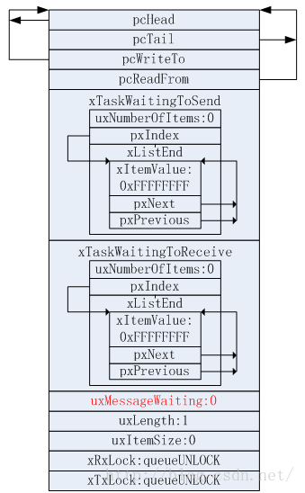

# FreeRTOS信号量分析

在前文提到过，FreeRTOS的信号量包括互斥量、计数信号量、二进制信号量、递归互斥量。而这些信号量的实现则是使用了FreeRTOS队列进行实现。

信号量与互斥量虽然在各个方面比较相似，如实现的基本方法相同，特征类似等，但是使用的方法却不太一样：

- 信号量用于任务的同步，可以用于任务间或者任务与ISR之间的同步；互斥量用于临界区的保护，保护临界区的资源任意时刻有且只有一个任务访问，相当于给任务上锁。
- 信号量用于同步操作时，一个任务给出信号，另一个任务接收信号；互斥量用于互锁时，互斥量的上锁和解锁是同一个任务。
- 互斥量具有优先级继承的性质，信号量没有。
- 互斥量不能用于ISR中，信号量可以。

## FreeRTOS信号量基础

### 二进制信号量

二进制信号量既可以用于互斥功能也可以用于同步功能，二进制信号量和互斥量比较相似，但是存在细微的差别：互斥量包含一个优先级继承机制，二进制信号量没有这个机制。

二进制信号量的实现实际上是一个只有一个队列项的队列，因此这个队列只有两种状态：空和满，任务中断使用作为二进制信号量的队列的时候只需要关注队列是空的还是满的，而不需要关注谁在控制该队列。

二进制信号量一般用于同步操作，比如对外设的维护。如果任务使用轮询的方法来访问外设，则会浪费相当一部分的CPU资源并且妨碍其它任务执行。将该任务的大部分时间处于阻塞的状态，直到外设出发的中断将该任务解除阻塞并运行即可。可以使用二进制信号量，任务等待取信号量，但是信号量无效，于是阻塞等待信号量有效。而外设触发的ISR给出信号量，唤醒阻塞的任务执行。

注意，在中断中必须使用结尾为“FromISR”的函数。在大部分的场合，任务通知可以代替二进制信号量（FreeRTOS V8版本以上支持任务通知）。

### 计数信号量

计数信号量使用的是长度大于1的队列，且信号量的使用者不需要关心队列中的内容。计数信号量的使用场合：

1. 计数事件：当事件发生时，事件处理程序给出一个信号（计数信号量+1）。当处理事件时，处理程序会取走信号量（计数信号量-1）。计数信号量的初始值需要结合考虑信号量所使用的场合和逻辑用途决定（也就是说不一定都是0）。
2. 资源管理：有些资源限制同时使用的任务数量，可以将这些资源绑定在一个信号量上，任务要使用这些资源的时候需要取走信号量才能获取这些资源的使用权，每次有一个任务取走资源的时候信号量的值-1。若取信号量的时候其值为0，该任务将会被阻塞。

### 互斥量

互斥量与二进制信号量很相似，只是互斥量还有一个优先级继承的机制。优先级继承的机制是为了防止优先级反转的情况发生，优先级反转的意思是：一个资源任意时刻有且只能有一个任务使用。一个低优先级的任务占用资源成功并且在使用，而一个高优先级的任务也要占用该资源，由于低优先级的任务已经占用了资源因此高优先级的任务只能等待。

优先级继承的作用是：假设有一个运行系统时的场景，系统中有3个任务为A、B、C，优先级为A>B>C，假设C正在占用一个独占资源，而A此时也想占用该资源。但由于C正在使用该资源因此无法占用该资源而进入阻塞状态。如果此时一个中断到来导致B任务解除阻塞状态运行，那么C任务将会被抢占，导致A任务要等待更长的时间。优先级继承是指低优先级的任务在使用一个互斥量的时候，临时将自己的优先级提升到等待该互斥量的高优先级任务的优先级，尽可能快的使自己执行完。

### 递归互斥量

递归互斥量可以被一个任务重复获取，当然返还时也需要返还获取的次数。递归互斥量可以看成带有优先级继承机制的信号量，获取递归互斥量的任务在用完后必须返还。

## 信号量源代码分析

FreeRTOS中的信号量声明放在semphr.h文件中，而实现由于是基于队列来进行实现的，因此实现的文件是在queue.c中。

### 信号量的创建

信号量的创建对应于上述所说的4中信号量的接口API为：

- xSemaphoreCreateBinary()
- xSemaphoreCreateCounting()
- xSemaphoreCreateMutex()
- xSemaphoreCreateRecursiveMutex()

实际上，这些函数的接口API都是宏定义，在semphr.h中定义有：

```C
#define xSemaphoreCreateBinary() xQueueGenericCreate( ( UBaseType_t ) 1, semSEMAPHORE_QUEUE_ITEM_LENGTH, queueQUEUE_TYPE_BINARY_SEMAPHORE )
#define xSemaphoreCreateCounting( uxMaxCount, uxInitialCount ) xQueueCreateCountingSemaphore( ( uxMaxCount ), ( uxInitialCount ) )
#define xSemaphoreCreateMutex() xQueueCreateMutex( queueQUEUE_TYPE_MUTEX )
#define xSemaphoreCreateRecursiveMutex() xQueueCreateMutex( queueQUEUE_TYPE_RECURSIVE_MUTEX )
```

#### 创建二进制信号量

创建二进制信号量实际上就是使用xQueueGenericCreate()函数。传递的参数是队列的长度为1，semSEMAPHORE_QUEUE_ITEM_LENGTH宏实际上就是0，类型是queueQUEUE_TYPE_BINARY_SEMAPHORE。

在FreeRTOS队列分析中有进行分析的xQueueGenericCreate()函数中有提到当列表项长度为0时的处理方式，就是不再分配内存空间给队列本身，而只分配空间给队列控制块。根据创建队列函数的实现，创建的二进制信号量如下所示：



由于在创建二进制信号量的时候，没有给队列分配存储空间，因此实现二进制信号量的获取和释放是通过uxMessagesWaiting来实现的。经过初始化后，uxMessagesWaiting变为0，说明此时队列为空，信号量处于无效的状态。

#### 创建计数型信号量

创建计数型信号量使用的是以下宏定义：

```C
#define xSemaphoreCreateCounting( uxMaxCount, uxInitialCount ) xQueueCreateCountingSemaphore( ( uxMaxCount ), ( uxInitialCount ) )
```

该宏定义中的两个参数的含义为：uxMaxCount表示计数最大值，uxInitialCount表示初始的计数值。

这是一个新的函数，而不是使用xQueueGenericCreate()：

```C
#define xSemaphoreCreateCounting( uxMaxCount, uxInitialCount ) xQueueCreateCountingSemaphore( ( uxMaxCount ), ( uxInitialCount ) )

QueueHandle_t xQueueCreateCountingSemaphore( const UBaseType_t uxMaxCount, const UBaseType_t uxInitialCount )
{
	QueueHandle_t xHandle;

	configASSERT( uxMaxCount != 0 );
	configASSERT( uxInitialCount <= uxMaxCount );

	/* 
		在函数中还是实际调用了xQueueGenericCreate()
		queueSEMAPHORE_QUEUE_ITEM_LENGTH定义的值为：( ( UBaseType_t ) 0 )
		创建后的计数型信号量依然没有空间分配，因此与二进制信号量的机制相同，决定信号量是否有效的是队列控制块中的uxMessagesWaiting
	*/
	xHandle = xQueueGenericCreate( uxMaxCount, queueSEMAPHORE_QUEUE_ITEM_LENGTH, queueQUEUE_TYPE_COUNTING_SEMAPHORE );

	if( xHandle != NULL )
		( ( Queue_t * ) xHandle )->uxMessagesWaiting = uxInitialCount;

	return xHandle;
}
```

可以看出，在xQueueCreateCoutingSemaphore()的内部实现中，实际上仍然使用了xQueueGenericCreate()来初始化新创建的队列。计数型信号量依然没有分配存储空间给队列使用，而只分配了存储空间给队列控制块。因此在计数型信号量当中，实现信号量作用的仍然是队列控制块中的uxMessagesWating。

#### 创建互斥量

创建互斥量使用的宏定义如下：

```C
#define xSemaphoreCreateMutex() xQueueCreateMutex( queueQUEUE_TYPE_MUTEX )
```

创建互斥量所使用的宏定义实际上调用了函数xQueueCreateMutex()：

```C
QueueHandle_t xQueueCreateMutex( const uint8_t ucQueueType )
{
	QueueHandle_t xNewQueue;
	const UBaseType_t uxMutexLength = ( UBaseType_t ) 1, uxMutexSize = ( UBaseType_t ) 0;

	xNewQueue = xQueueGenericCreate( uxMutexLength, uxMutexSize, ucQueueType );
	prvInitialiseMutex( ( Queue_t * ) xNewQueue );

	return xNewQueue;
}
```

这个函数实际上还是调用的xQueueGenericCreate()来创建一个新的队列，前面已经提到过，互斥量实际上和二进制信号量的特征相符合，只是还有优先级继承的特性存在。因此在创建以及初始化队列原型的实现上和创建二进制信号量没有太大的差距。创建新的作为互斥量的队列后，xNewQueue得到新创建的队列，然后执行prvInitialiseMutex()初始化互斥量：

```C
static void prvInitialiseMutex( Queue_t *pxNewQueue )
{
	if( pxNewQueue != NULL )
	{
		/* 创建队列的函数会将队列控制块的成员设置为一般队列的默认值，但是现在创建的是互斥量，因此需要将某些成员设置为不同的初始值 */
		pxNewQueue->u.xSemaphore.xMutexHolder = NULL;
		pxNewQueue->uxQueueType = queueQUEUE_IS_MUTEX;

		pxNewQueue->u.xSemaphore.uxRecursiveCallCount = 0;

		/* 释放刚刚创建的互斥量，说明互斥量一经创建后是有效的 */
		( void ) xQueueGenericSend( pxNewQueue, NULL, ( TickType_t ) 0U, queueSEND_TO_BACK );
	}
}
```

#### 创建递归互斥量

创建递归互斥量的宏所使用的函数和创建互斥量使用的函数是相同的，只是标识的参数存在区别，这里不再赘述。

### 释放信号量

无论是二进制信号量、计数信号量还是互斥量，都使用同一个释放信号量的函数API接口，释放信号量可以使信号量/互斥量有效或者将其计数值+1。该函数有ISR使用版本

#### xSemaphoreGive()

释放一个二进制信号量、计数型信号量或者一个互斥量，但是递归互斥量不能使用这个函数进行释放。xSemaphoreGive()实际上是一个宏，该宏调用了一个函数：

```C
#define xSemaphoreGive( xSemaphore )		xQueueGenericSend( ( QueueHandle_t ) ( xSemaphore ), NULL, semGIVE_BLOCK_TIME, queueSEND_TO_BACK )
```

因此，释放信号量实际上是一个入队的操作，但该操作实际上并没有将任何队列项入队，同时semGIVE_BLOCK_TIME = ( TickType_t ) 0U，因此阻塞时间为0，不会发生阻塞。

在前文中曾经分析过xQueueGenericSend()函数的实现方式，因此不难总结出二进制信号量和计数信号量的实现方式：首先判断队列是否满，这个通过判断uxMessagesWating值即可，如果队列还没满的话就使uxMessagesWating递增1，然后判断是否有阻塞的任务，有的话就解除阻塞。如果为满则立刻返回错误代码，不会阻塞。

而对于互斥量来说，由于有优先级继承的情况，因此要稍微复杂一些：第一，如果队列未满，除了队列结构体成员uxMessageWaiting加1外，还要判断获取互斥量的任务是否有优先级继承，如果有的话，还要将任务的优先级恢复到原始值。当然，恢复到原来值也是有条件的，就是该任务必须在没有使用其它互斥量的情况下，才能将继承的优先级恢复到原始值。然后判断是否有阻塞的任务，有的话解除阻塞，最后返回成功信息（pdPASS）；第二，如果如果队列满，返回错误代码（err_QUEUE_FULL），表示队列满。
