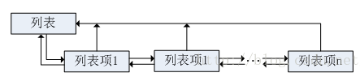
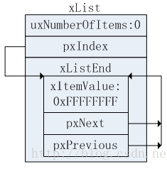
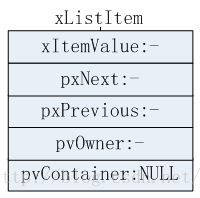
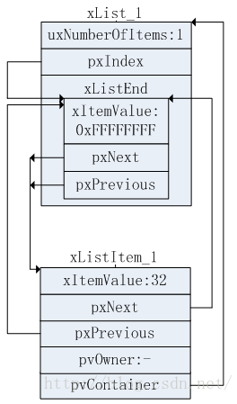
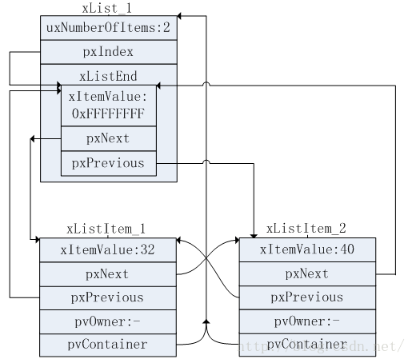

# 前言

资料来源：

1. FreeRTOS高级篇解析：https://blog.csdn.net/column/details/freertos-advanced.html
2. 《FreeRTOS源码详解与应用开发——基于STM32》
3. FreeRTOS Reference Manual V10.0.0
4. Mastering the FreeRTOS Real Time Kernel-A Hands-On Tutorial Guide

## FreeRTOS源码数据类型以及命名习惯

### 数据类型

**TickType_t** 时间戳类型，在FreeRTOS系统中用于指代精确的时间。如一个大小为10的TickType_t类型指10个时钟滴答。TickType_t可以映射为无符号的16位整数(uint16_t)或者无符号32位整数(uint32_t)，具体映射成什么由具体的机器决定。

**BaseType_t** 取决于具体机器的字长。如果机器是16位的，那么该数据类型映射到uint16_t，如果机器是32位的，那么该数据类型映射到uint32_t。

### 命名习惯

变量名字中的开头字母：

如果是有符号的：
- 'c'：char
- 's'：int16_t(short)
- 'l'：int32_t(long)
- 'x'：BaseType_t以及其他非标准类型

如果是无符号的：
- 'u'：无符号整数
- 'p'：指针
- 'uc'：uint8_t
- 'pc'：指向char类型的指针（字符串）

函数名字中的开头字母：
- 'v'：返回值是空
- 'x'：返回值是BaseType_t
- 'pv'：返回值是空的指针(void*)

# FreeRTOS列表和列表项

FreeRTOS内核中的核心以及基础部分就是用于跟踪任务所使用的列表和列表项。列表被用于跟踪任务，处于就绪、挂起、延时的任务，都会被挂接到各自的列表中。内核中部分与列表相关的接口也可以为用户所使用。

FreeRTOS列表使用指针指向列表项。一个列表下面有多个列表项，同时每一个列表下面可能有多个列表项，每个列表项都有一个指针指向列表：



与列表相关的实现在源代码的list.c以及list.h中。

## 列表

列表的实现在list.h中：

```C
typedef struct xLIST
{
	listFIRST_LIST_INTEGRITY_CHECK_VALUE				/*< Set to a known value if configUSE_LIST_DATA_INTEGRITY_CHECK_BYTES is set to 1. */
	volatile UBaseType_t uxNumberOfItems;
	ListItem_t * configLIST_VOLATILE pxIndex;			/*< Used to walk through the list.  Points to the last item returned by a call to listGET_OWNER_OF_NEXT_ENTRY (). */
	MiniListItem_t xListEnd;							/*< List item that contains the maximum possible item value meaning it is always at the end of the list and is therefore                                                           used as a marker. */
	listSECOND_LIST_INTEGRITY_CHECK_VALUE				/*< Set to a known value if configUSE_LIST_DATA_INTEGRITY_CHECK_BYTES is set to 1. */
} List_t;
```

listFIRST_LIST_INTEGRITY_CHECK_VALUE以及listSECOND_LIST_INTEGRITY_CHECK_VALUE是用来检查列表完整性的，需要将宏configUSE_LIST_DATA_INTEGRITY_CHECK_BYTES设置为1，开启之后会在这两个地方分别添加一个变量xListIntegrityValue1和xListIntegrityValue2。这个功能默认不开启，因此往后将不再赘述。

uxNumberOfItems是列表中含有的列表项的个数，使用volatile来修饰来防止编译器对其进行优化。volatile的作用可以在Hardware根目录下找到。

pxIndex用于遍历列表，列表初始化后，这个指针指向&xListEnd。通过宏listGet_OWNER_OF_NEXT_ENTRY()来获取列表的下一个列表项。

xListEnd是列表中最后一个列表项，用来标记列表的结束，类型是MiniListItem_t，稍后将会讲到。

## 列表项

列表项有两种实现，一种是xLIST_ITEM，是完整的实现。另一种是xMINI_LIST_ITEM，是简略的一种实现。列表项的实现在list.h中。

```C
struct xLIST_ITEM
{
	listFIRST_LIST_ITEM_INTEGRITY_CHECK_VALUE			/*< Set to a known value if configUSE_LIST_DATA_INTEGRITY_CHECK_BYTES is set to 1. */
	configLIST_VOLATILE TickType_t xItemValue;			/*< The value being listed.  In most cases this is used to sort the list in descending order. */
	struct xLIST_ITEM * configLIST_VOLATILE pxNext;		/*< Pointer to the next ListItem_t in the list. */
	struct xLIST_ITEM * configLIST_VOLATILE pxPrevious;	/*< Pointer to the previous ListItem_t in the list. */
	void * pvOwner;										/*< Pointer to the object (normally a TCB) that contains the list item.  There is therefore a two way link between the object containing the list item and the list item itself. */
	struct xLIST * configLIST_VOLATILE pxContainer;		/*< Pointer to the list in which this list item is placed (if any). */
	listSECOND_LIST_ITEM_INTEGRITY_CHECK_VALUE			/*< Set to a known value if configUSE_LIST_DATA_INTEGRITY_CHECK_BYTES is set to 1. */
};
typedef struct xLIST_ITEM ListItem_t;					/* For some reason lint wants this as two separate definitions. */
```

全功能的列表项的定义中，头尾两项依然是用于检查列表完整性。

xItemValue是列表项值，使用configLIST_VOLATILE，该宏定义映射到volatile。列表项值通常是一个被跟踪的任务优先级或者是一个调度事件的计数器值。如果任务进入阻塞状态，则任务的事件列表项值保存任务优先级有关信息，状态列表项的列表项值保存阻塞时间有关的信息。

pxNext和pxPrevious分别是指向下一个列表项和上一个列表项的指针，因此列表实现的是双向链表的结构。

pxOwner指向一个TCB，记录此列表项为哪个任务所拥有。

pxContainer指向该列表项所属的列表。要分清楚和pxOwner的区别，在任务控制块TCB_t中，TCB_t中有两个ListItem_t类型的变量xStateListItem以及xEventListItem。以xStateListItem为例，当创建一个任务之后，xStateListItem的pxOwner指向该任务的TCB，当该任务就绪后，xStateListItem的pxContainer将会指向就绪列表。

```C
struct xMINI_LIST_ITEM
{
	listFIRST_LIST_ITEM_INTEGRITY_CHECK_VALUE			/*< Set to a known value if configUSE_LIST_DATA_INTEGRITY_CHECK_BYTES is set to 1. */
	configLIST_VOLATILE TickType_t xItemValue;
	struct xLIST_ITEM * configLIST_VOLATILE pxNext;
	struct xLIST_ITEM * configLIST_VOLATILE pxPrevious;
};
typedef struct xMINI_LIST_ITEM MiniListItem_t;
```

迷你版的列表项当中，其数据成员是完整版的列表项的子集，只保留了列表项值xItemValue以及指向前后列表项的指针pxNext和pxPrevious。列表的最后一个列表项（标识结尾）即为MiniListItem_tl类型。

## 列表和列表项的初始化

列表和列表项的初始化代码在list.c当中实现。

### 列表初始化

列表初始化通过函数vListInitialise()完成，对List_t中的数据成员进行初始化：

```C
void vListInitialise( List_t * const pxList )
{
    /* 初始化列表pxIndex指向列表结尾标记项xListEnd */
	pxList->pxIndex = ( ListItem_t * ) &( pxList->xListEnd );

    /* 设置xListEnd的列表项值为最大值，一般为0xFFFFFFFF或0xFFFF */
	pxList->xListEnd.xItemValue = portMAX_DELAY;    // portMAX_DELAY在portmacro.h中定义，根据使用的MCU不同取不同的值

    /* 结尾列表项的前后指针都指向自己，也表示列表为空 */
	pxList->xListEnd.pxNext = ( ListItem_t * ) &( pxList->xListEnd );	
	pxList->xListEnd.pxPrevious = ( ListItem_t * ) &( pxList->xListEnd );

	pxList->uxNumberOfItems = ( UBaseType_t ) 0U;

    /* 检查列表是否完整，不再赘述 */
	listSET_LIST_INTEGRITY_CHECK_1_VALUE( pxList );
	listSET_LIST_INTEGRITY_CHECK_2_VALUE( pxList );
}
```

对列表的初始化其实一个主要的工作是初始化列表的结尾标记列表项xListEnd。列表初始化完成后状态如下图所示：



### 列表项初始化

列表项初始化用vListInitialiseItem()来完成。列表项初始化比较简单，只需要初始化pxContianer的值即可（NULL），其他的数据成员在任务创建的时候进行初始化。

```C
void vListInitialiseItem( ListItem_t * const pxItem )
{
	/* 将pxContainer初始化为空值 */
	pxItem->pxContainer = NULL;

	listSET_FIRST_LIST_ITEM_INTEGRITY_CHECK_VALUE( pxItem );
	listSET_SECOND_LIST_ITEM_INTEGRITY_CHECK_VALUE( pxItem );
}
```

对列表项初始化后如下图所示：



## 列表项的插入

列表项的插入通过函数vListInsert()来完成，参数有pxList以及pxNewListItem，分别代表要插入的列表中以及待插入的列表项。要插入的位置由待插入的列表项值xItemValue来决定，列表中的列表项按照xItemValue升序来排列。

```C
void vListInsert( List_t * const pxList, ListItem_t * const pxNewListItem )
{
    ListItem_t *pxIterator;     // 定位插入位置临时变量
    const TickType_t xValueOfInsertion = pxNewListItem->xItemValue;

	/* Only effective when configASSERT() is also defined, these tests may catch
	the list data structures being overwritten in memory.  They will not catch
	data errors caused by incorrect configuration or use of FreeRTOS. */
	listTEST_LIST_INTEGRITY( pxList );
	listTEST_LIST_ITEM_INTEGRITY( pxNewListItem );

	/* 如果列表项值和结尾标记列表项的列表项值相同，则置于结尾列表项之前 */
	if( xValueOfInsertion == portMAX_DELAY )
	{
		pxIterator = pxList->xListEnd.pxPrevious;
	}
	else
	{
        /* 如果列表中有相同值的列表项，则置于其后 */
		for( pxIterator = ( ListItem_t * ) &( pxList->xListEnd ); pxIterator->pxNext->xItemValue <= xValueOfInsertion; pxIterator = pxIterator->pxNext );
	}

    /* 典型的列表插入过程 */
	pxNewListItem->pxNext = pxIterator->pxNext;
	pxNewListItem->pxNext->pxPrevious = pxNewListItem;
	pxNewListItem->pxPrevious = pxIterator;
	pxIterator->pxNext = pxNewListItem;

	/* 回填所属列表到成员pxContainer中 */
	pxNewListItem->pxContainer = pxList;

	( pxList->uxNumberOfItems )++;
}
```

假设插入一个列表项值为32的列表项后再插入一个列表项值为40的列表项，过程如下图所示：





## 列表项末尾插入

列表项末尾插入是通过函数vListInsertEnd()来完成：

```C
void vListInsertEnd( List_t * const pxList, ListItem_t * const pxNewListItem )
{
	/* 获取列表遍历指针，指针指向的是列表结尾标记项 */
	ListItem_t * const pxIndex = pxList->pxIndex;

	/* 列表完整性的检查 */
	listTEST_LIST_INTEGRITY( pxList );
	listTEST_LIST_ITEM_INTEGRITY( pxNewListItem );

	/* 直接将新的列表项插入到列表的末尾 */
	pxNewListItem->pxNext = pxIndex;
	pxNewListItem->pxPrevious = pxIndex->pxPrevious;

	/* Only used during decision coverage testing. */
	mtCOVERAGE_TEST_DELAY();

	pxIndex->pxPrevious->pxNext = pxNewListItem;
	pxIndex->pxPrevious = pxNewListItem;

	/* 标记其所属的列表 */
	pxNewListItem->pxContainer = pxList;

	( pxList->uxNumberOfItems )++;
}
```

将列表项插入到列表的末尾，和将列表项插入到列表中的操作差别不大，而且要更为简便，因为不需要按列表项值的顺序插入到列表中，只需要简单的插入到列表的末尾即可。由于列表中的pxIndex指向的是列表的结尾标记项，因此可以快速定位到列表的结尾并插入。

## 删除列表项

列表项的删除是通过uxListRemove()来完成的，这个函数是有返回值的，返回的是删除后列表中剩余的任务项的个数。

```C
UBaseType_t uxListRemove( ListItem_t * const pxItemToRemove )
{
	/* 获取待删除列表项所属的列表 */
	List_t * const pxList = pxItemToRemove->pxContainer;

	/* 将待删除列表项从列表中断开 */
	pxItemToRemove->pxNext->pxPrevious = pxItemToRemove->pxPrevious;
	pxItemToRemove->pxPrevious->pxNext = pxItemToRemove->pxNext;

	mtCOVERAGE_TEST_DELAY();

	/* 若待删除的列表项是列表的index所指的列表项，则将index指向待删除列表项的前一个列表项 */
	if( pxList->pxIndex == pxItemToRemove )
	{
		pxList->pxIndex = pxItemToRemove->pxPrevious;
	}
	else
	{
		mtCOVERAGE_TEST_MARKER();
	}

	/* 将所属的列表置空 */
	pxItemToRemove->pxContainer = NULL;
	( pxList->uxNumberOfItems )--;

	return pxList->uxNumberOfItems;
}
```

值得注意的一点是，在删除列表项的实现当中，列表项的删除只是将列表项从列表中取出，但是并没有释放其内存。

## 遍历列表

在list.h中有一个定义为宏的功能：listGET_OWNER_OF_NEXT_ENTRY( pxTCB, pxList )。它的作用是获取index的下一个列表项的TCB：

```C
#define listGET_OWNER_OF_NEXT_ENTRY( pxTCB, pxList )										\
{																							\
	List_t * const pxConstList = ( pxList );												\
	( pxConstList )->pxIndex = ( pxConstList )->pxIndex->pxNext;							\
	if( ( void * ) ( pxConstList )->pxIndex == ( void * ) &( ( pxConstList )->xListEnd ) )	\
	{																						\
		( pxConstList )->pxIndex = ( pxConstList )->pxIndex->pxNext;						\
	}																						\
	( pxTCB ) = ( pxConstList )->pxIndex->pvOwner;											\
}
```

这个函数常用于获取同优先级的就绪任务中查找下一个任务。

## 其他

在list.h中，还有一些定义为宏的功能，比如设置/获取列表项所属的列表、设置/获取列表项值等等的功能等，这些实现比较简单，将不再赘述。
