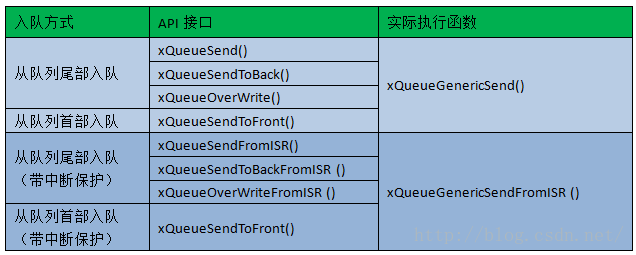
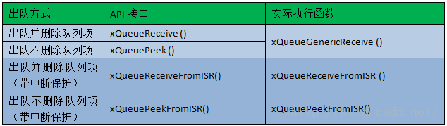

# FreeRTOS队列分析

FreeRTOS中为任务间通信提供了多种通讯方式，有：

- 任务通知
- 队列
- 计数信号量
- 二值信号量（互斥量）
- 二进制信号量
- 递归信号量

其中互斥量、计数信号量、二进制信号量和递归信号量都是使用队列来实现的。

FreeRTOS中对队列的实现位于queue.h以及queue.c当中。FreeRTOS的队列使用的是拷贝型的队列，也就是说队列的结构当中保存的是数据而不是数据的指针。

## 队列结构体的定义

队列的实现文件queue.h以及queue.c中，queue.h中基本上都是对结构体以及队列相关函数的API接口的声明。而将结构体的实现和函数体的实现放在了queue.c中。

队列结构体的定义在queue.c中，如下：

```C
typedef struct QueueDef_t
{
	int8_t *pcHead;					/*< 指向队列存储空间的头 */
	int8_t *pcWriteTo;				/*< 指向队列存储空间中空闲区域的开头 */

	union							/*< 联合union结构，如果队列作为队列使用则使用xQueue，如果作为信号量使用则使用xSemaphore */
	{
		QueuePointers_t xQueue;
		SemaphoreData_t xSemaphore;
	} u;

	List_t xTasksWaitingToSend;		/*< 等待写入到队列中的阻塞任务列表。根据任务优先级排列 */
	List_t xTasksWaitingToReceive;	/*< 等待从队列中读取的阻塞任务列表。根据任务优先级排列 */

	volatile UBaseType_t uxMessagesWaiting;     /*< 队列中的队列项数目 */
	UBaseType_t uxLength;			/*< 队列的大小，由创建队列时决定 */
	UBaseType_t uxItemSize;			/*< 队列中每个队列项的大小，单位是字节 */
	/* 因此队列的总的字节大小=uxLength * uxItemSize */

	volatile int8_t cRxLock;		/*< 当队列被锁定时，存储从队列中发送出去的队列项数目。如果没有被上锁则设为queueUNLOCKED */
	volatile int8_t cTxLock;		/*< 当队列被锁定时，存储从队列中收到的队列项数目。如果没有被上锁则设为queueUNLOCKED */

	#if( ( configSUPPORT_STATIC_ALLOCATION == 1 ) && ( configSUPPORT_DYNAMIC_ALLOCATION == 1 ) )
		uint8_t ucStaticallyAllocated;	/*< 设为pdTRUE时，表明队列使用静态分配的方式分配内存。设为pdFALSE时，表明队列使用动态分配的方式分配内存 */
	#endif

	#if ( configUSE_QUEUE_SETS == 1 )
		struct QueueDef_t *pxQueueSetContainer;
	#endif

	#if ( configUSE_TRACE_FACILITY == 1 )
		UBaseType_t uxQueueNumber;
		uint8_t ucQueueType;
	#endif

} xQUEUE;

typedef xQUEUE Queue_t;
```

其中有一个union结构体：

```C
union
	{
		QueuePointers_t xQueue;
		SemaphoreData_t xSemaphore;
	} u;
```

使用互斥的union结构体，保证union中的成员只能使用一个。这取决于该队列的用途，如果队列是作为队列来使用，那么该联合结构将会使用xQueue，其中xQueue的类型是QueuePointers_t：

```C
typedef struct QueuePointers
{
	int8_t *pcTail;					/*< 指向队列存储区域的尾部 */
	int8_t *pcReadFrom;				/*< 指向队列中最后一个可读取的队列项 */
} QueuePointers_t;
```

如果是作为信号量来使用，那么该联合结构将会使用xSemaphore，其中xSemaphore的类型是SemaphoreData_t:

```C
typedef struct SemaphoreData
{
	TaskHandle_t xMutexHolder;		 /*< 该互斥量所属的任务 */
	UBaseType_t uxRecursiveCallCount;/*< 该互斥量被递归获取的次数（计数值） */
} SemaphoreData_t;
```

队列的结构比较简单，结构体中存放的是队列中队列项所保存的内存区域的头、尾、以及空闲区域的头的指针。与任务相似，有一个指向队列的指针（队列句柄），可以用于对队列进行各种操作：

```C
typedef struct QueueDef_t * QueueHandle_t;
```

## 创建队列

在用户使用的API函数接口中，创建一个队列的接口绝大多数都是使用xQueueCreate()。在源码中，实际上xQueueCreate()是一个宏，实际上调用的函数是xQueueGenericCreate()。

```C
#if( configSUPPORT_DYNAMIC_ALLOCATION == 1 )
	#define xQueueCreate( uxQueueLength, uxItemSize ) xQueueGenericCreate( ( uxQueueLength ), ( uxItemSize ), ( queueQUEUE_TYPE_BASE ) )
#endif
```

queueQUEUE_TYPE_BASE是一个宏，表示该队列的类型。在queue.h中有定义其它类型的宏：

```C
#define queueQUEUE_TYPE_BASE				( ( uint8_t ) 0U )		// 基本队列类型
#define queueQUEUE_TYPE_SET					( ( uint8_t ) 0U )		// 队列集合类型
#define queueQUEUE_TYPE_MUTEX 				( ( uint8_t ) 1U )		// 互斥量类型
#define queueQUEUE_TYPE_COUNTING_SEMAPHORE	( ( uint8_t ) 2U )		// 计数信号量类型
#define queueQUEUE_TYPE_BINARY_SEMAPHORE	( ( uint8_t ) 3U )		// 二进制信号量类型
#define queueQUEUE_TYPE_RECURSIVE_MUTEX		( ( uint8_t ) 4U )		// 递归信号量类型
```

先分析函数xQueueGenericCreate()：

```C
QueueHandle_t xQueueGenericCreate( const UBaseType_t uxQueueLength, const UBaseType_t uxItemSize, const uint8_t ucQueueType )
{
	Queue_t *pxNewQueue;
	size_t xQueueSizeInBytes;
	uint8_t *pucQueueStorage;
	
	/* 如果队列长度不大于零则出错 */
	configASSERT( uxQueueLength > ( UBaseType_t ) 0 );

	if( uxItemSize == ( UBaseType_t ) 0 )
	{
		/* 由于队列项的大小设置为0，因此这将不能成为一个队列 */
		xQueueSizeInBytes = ( size_t ) 0;
	}
	else
	{
		/* 计算队列所需要的内存空间 */
		xQueueSizeInBytes = ( size_t ) ( uxQueueLength * uxItemSize );
	}

	/* 为队列分配内存空间，大小等于队列结构体Queue_t的大小与队列容量之和 */
	pxNewQueue = ( Queue_t * ) pvPortMalloc( sizeof( Queue_t ) + xQueueSizeInBytes );

	if( pxNewQueue != NULL )
	{
		/* 将pucQueueStoreage定位到分配的内存区域开头 */
		pucQueueStorage = ( uint8_t * ) pxNewQueue;
		pucQueueStorage += sizeof( Queue_t );

		#if( configSUPPORT_STATIC_ALLOCATION == 1 )
		{
			/* 由于队列是动态分配内存的，因此设置为pdFALSE */
			pxNewQueue->ucStaticallyAllocated = pdFALSE;
		}
		#endif /* configSUPPORT_STATIC_ALLOCATION */
		
		/* 初始化新的队列 */
		prvInitialiseNewQueue( uxQueueLength, uxItemSize, pucQueueStorage, ucQueueType, pxNewQueue );
	}
	else
	{
		traceQUEUE_CREATE_FAILED( ucQueueType );
		mtCOVERAGE_TEST_MARKER();
	}

	return pxNewQueue;
}
```

该函数所做的工作比较简单，只是计算了队列所需要的内存空间大小并且分配内存空间给该队列以及队列的结构。而初始化队列的工作则是放在了preInitialiseNewQueue()当中来完成：

```C
static void prvInitialiseNewQueue( const UBaseType_t uxQueueLength, const UBaseType_t uxItemSize, uint8_t *pucQueueStorage, const uint8_t ucQueueType, Queue_t *pxNewQueue )
{
	( void ) ucQueueType;

	if( uxItemSize == ( UBaseType_t ) 0 )
	{
		/* 当创建队列时设定的队列项的大小为0的时候，没有内存单元会分配。但是队列结构体中的头部不能设置为空值，因此将其设定为指向自身的一个良性的指针 */
		pxNewQueue->pcHead = ( int8_t * ) pxNewQueue;
	}
	else
	{
		/* 将队列存储区域的头部指向新分配区域的开头 */
		pxNewQueue->pcHead = ( int8_t * ) pucQueueStorage;
	}

	/* 初始化队列结构体的字段 */
	pxNewQueue->uxLength = uxQueueLength;
	pxNewQueue->uxItemSize = uxItemSize;
	/* 初始化剩余的队列结构体成员 */
	( void ) xQueueGenericReset( pxNewQueue, pdTRUE );

	#if ( configUSE_TRACE_FACILITY == 1 )
	{
		pxNewQueue->ucQueueType = ucQueueType;
	}
	#endif /* configUSE_TRACE_FACILITY */

	#if( configUSE_QUEUE_SETS == 1 )
	{
		pxNewQueue->pxQueueSetContainer = NULL;
	}
	#endif /* configUSE_QUEUE_SETS */

	traceQUEUE_CREATE( pxNewQueue );
}
```

至此，用户使用的xQueueCreate()接口所作的工作全部执行完毕。现在新创建的队列可以进行各种各样的操作。

## 入队

将队列创建了之后，就可以对队列进行各种各样的操作了。首先可以进行的时对队列的的入队操作。在FreeRTOS提供的入队操作API当中包含了下列的函数接口：

- xQueueSend()
- xQueueSendToBack()
- xQueueSendTOFront()

其中xQueueSend()等同于xQueueSendToBack()。队列是一个先进先出的数据结构，因此一般来说新入队的队列项应该要放在末尾。以上的3个API同样拥有FromISR版本，使得在ISR中同样能够对队列进行入队操作。上述所举出的入队的API是在FreeRTOS应用过程中常用的几个函数API接口，实际上在FreeRTOS中提供入队操作的API函数非常多：



### xQueueSend()

xQueueSend()在源代码中同样是一个宏定义，实际上它调用的函数是xQueueGenericSend()：

```C
#define xQueueSend( xQueue, pvItemToQueue, xTicksToWait ) xQueueGenericSend( ( xQueue ), ( pvItemToQueue ), ( xTicksToWait ), queueSEND_TO_BACK )
#define xQueueSendToBack( xQueue, pvItemToQueue, xTicksToWait ) xQueueGenericSend( ( xQueue ), ( pvItemToQueue ), ( xTicksToWait ), queueSEND_TO_BACK )
#define xQueueSendToFront( xQueue, pvItemToQueue, xTicksToWait ) xQueueGenericSend( ( xQueue ), ( pvItemToQueue ), ( xTicksToWait ), queueSEND_TO_FRONT )
```

事实上，上述三个API都是宏定义，它们使用的函数就是xQueueGenericSend()，只是参数不太一样。

下面来分析这个入队的核心函数xQueueGenericSend()：

```C
BaseType_t xQueueGenericSend( QueueHandle_t xQueue, const void * const pvItemToQueue, TickType_t xTicksToWait, const BaseType_t xCopyPosition )
```

这个函数是入队操作的核心，参数为需要进行入队操作的队列句柄xQueue，需要入队的队列项pvItemToQueue，等待队列的最长时间xTicksToWait，以及插入队列的位置xCopyPosition。如果将xTicksToWait设置为0，则该函数执行后立刻返回，不会等待，如果将xTicksToWait设置为portMAX_DELAY，则调用该函数阻塞的任务将会无限期等待（但是要注意的是，该队列没有被挂起，仍然处于阻塞态）。xCopyPosition有下列几种情况：

```C
#define	queueSEND_TO_BACK		( ( BaseType_t ) 0 )
#define	queueSEND_TO_FRONT		( ( BaseType_t ) 1 )
#define queueOVERWRITE			( ( BaseType_t ) 2 )
```

xQueueGenericSend()的代码长度比较长，下面是整理后的版本（去除了和调试相关以及与队列集合相关的代码以及整理了注释）：

```C
/*
	整理后的xQueueGenericSend()
	删去了和调试相关的语句以及和队列集合相关的部分，对注释进行了重写
*/
BaseType_t xQueueGenericSend( QueueHandle_t xQueue, const void * const pvItemToQueue, TickType_t xTicksToWait, const BaseType_t xCopyPosition )
{
	BaseType_t xEntryTimeSet = pdFALSE, xYieldRequired;
	TimeOut_t xTimeOut;
	Queue_t * const pxQueue = xQueue;

	#if ( ( INCLUDE_xTaskGetSchedulerState == 1 ) || ( configUSE_TIMERS == 1 ) )
	{
		configASSERT( !( ( xTaskGetSchedulerState() == taskSCHEDULER_SUSPENDED ) && ( xTicksToWait != 0 ) ) );
	}
	#endif

	for( ;; )
	{
		/* 进入临界区 */
		taskENTER_CRITICAL();
		{
			/* 现在队列中是否有空间？当前运行的任务必须是尝试访问队列优先级最高的任务。如果使用覆盖的模式入队就不用关心队列是否是满的 */
			if( ( pxQueue->uxMessagesWaiting < pxQueue->uxLength ) || ( xCopyPosition == queueOVERWRITE ) )
			{
				/* 将队列项复制进入队列当中 */
				xYieldRequired = prvCopyDataToQueue( pxQueue, pvItemToQueue, xCopyPosition );

				/* 如果有任务正在等待从队列中取出数据，则现在将其解除阻塞态，加入就绪态列表 */
				if( listLIST_IS_EMPTY( &( pxQueue->xTasksWaitingToReceive ) ) == pdFALSE )
				{
					if( xTaskRemoveFromEventList( &( pxQueue->xTasksWaitingToReceive ) ) != pdFALSE )
					{
						/* 解除阻塞态的任务比当前运行的任务的优先级要高，因此要进行上下文切换，又因为当前处于临界区，因此要等待退出临界区后再进行切换 */
						queueYIELD_IF_USING_PREEMPTION();
					}
				}
				else if( xYieldRequired != pdFALSE )
				{
					/* 处理特殊情况 */
					queueYIELD_IF_USING_PREEMPTION();
				}

				taskEXIT_CRITICAL();
				return pdPASS;
			}
			else
			{
				/* 当前队列是满的 */
				if( xTicksToWait == ( TickType_t ) 0 )
				{
					/* 任务不会阻塞，退出临界区后立刻返回，返回队列已满的标记值 */
					taskEXIT_CRITICAL();
					return errQUEUE_FULL;
				}
				else if( xEntryTimeSet == pdFALSE )
				{
					/* 队列满并且规定了阻塞时间,因此需要配置超时结构体对象 */
					vTaskInternalSetTimeOutState( &xTimeOut );
					xEntryTimeSet = pdTRUE;
				}
			}
		}
		taskEXIT_CRITICAL();

		/* 退出临界区后，中断以及其它任务可以从这个队列中接收。如果函数执行到这里，说明队列是满的，并且规定了阻塞时间 */
		
		/* 由于任务被阻塞，因此需要进行上下文切换调度其它任务运行。将调度器挂起防止其它任务调度运行，同时将队列上锁防止ISR访问该队列 */
		vTaskSuspendAll();
		prvLockQueue( pxQueue );

		/* 如果还没有超过最大允许的阻塞时间 */
		if( xTaskCheckForTimeOut( &xTimeOut, &xTicksToWait ) == pdFALSE )
		{
			if( prvIsQueueFull( pxQueue ) != pdFALSE )
			{
				/* 队列仍然是满的，任务放在等待发送到队列的任务列表中 */
				vTaskPlaceOnEventList( &( pxQueue->xTasksWaitingToSend ), xTicksToWait );

				/* 解锁队列，如果有任务解除阻塞则移动到挂起就绪列表中。（由于调度器被挂起，因此不能移动到就绪列表中） */
				prvUnlockQueue( pxQueue );

				/* 恢复调度器，将挂起就绪列表中的任务移动到就绪列表中 */
				if( xTaskResumeAll() == pdFALSE )
				{
					portYIELD_WITHIN_API();
				}
			}
			else
			{
				/* 当前队列有空闲，重试 */
				prvUnlockQueue( pxQueue );
				( void ) xTaskResumeAll();
			}
		}
		else
		{
			/* 超过了最大允许阻塞时间，返回错误 */
			prvUnlockQueue( pxQueue );
			( void ) xTaskResumeAll();

			return errQUEUE_FULL;
		}
	}
}
```

对于入队的操作中，也调用了一些函数实现相关的功能，这里就不再一一展开，而针对某一些关键点进行说明。

在对拷贝队列项到队列中的实现函数prvCopyDataToQueue()中，如果队列是用作互斥信号量的话，则会使得调用这个函数的任务不再拥有该互斥量，pxQueue->u.xSemaphore.xMutexHolder将会被设置为NULL。辨别该队列是用作队列使用还是作为互斥信号量使用的方法是检查队列的队列项的大小是否为0。如果为0的话，则说明该队列是作为互斥量来使用的。当作为队列使用的时候，还要分队列项插入位置来讨论：是将队列项插入到队列的尾部还是将队列项插入到队列的头部。

对队列上锁的操作比较简单，实际上就是进入临界区后，将目标队列的队列结构中cRxLock以及cTxLock设置为queueLOCKED_UNMODIFIED，标明该队列处于锁定状态即可。将队列解锁和入队比较类似，因为对队列解锁之后，可能有些任务会解除阻塞的状态，可能会发生上下文切换。

前面提到过，上述的几个函数都有FromISR版本，也就是在中断服务例程中也可以进行调用的版本。xQueueGenericSendFromISR()实现和xQueueGenericSend()差别不大，只是前者当队列满的时候不会阻塞（ISR是无法容忍被阻塞的），而是直接返回一个错误码。

## 出队

出队常用的API函数有xQueueReceive()以及xQueuePeek()，前者会出队并且将该队列项从队列中删除，后者则不会从队列中删除。同样这两个函数也有FromISR实现的版本：



出队的操作与入队比较相似，因为两者实际上是一个相反的操作，但是在很多操作上都是共同的，因此在这里不再赘述。
