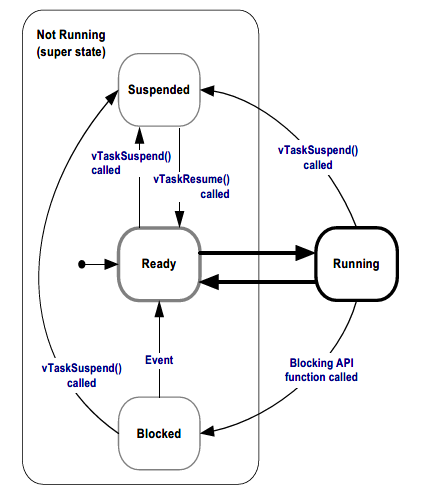

# FreeRTOS任务管理基础

写在前面：

- 下文中的配置文件指的均为所使用板子的FreeRTOSConfig.h文件。

## 任务调用的函数

FreeRTOS中任务执行的函数例子如下所示：

```C++
void ATaskFunction(void *pvParameters)
{
    /*
        Set up some settings
    */
    for(;;)
    {
        // infinite loop
        // execute some functions
    }
    vTaskDelete(NULL);
}
```

如上的例子所示，有一些地方需要注意：
- 执行的函数可以是静态的，即声明为static。
- 函数中一般都有一个无限循环的语句块，但是不一定就是连续执行的task，可以加入一些语句使task进入阻塞态进行调度。
- 在无限循环语句块的最后一般都会加上vTaskDelete()函数，防止当task执行完后没有删除task导致内存泄漏。

## FreeRTOS操作系统任务状态

在FreeRTOS操作系统当中，任务具有两种状态：运行状态（Running）以及非运行状态（Not Running），其中非运行状态还可以细分为3种状态：阻塞态（Block）、准备态（Ready）以及挂起态（Suspend）。



- 运行状态：处于运行状态的任务确实的占用着CPU时间，执行某些工作。如果是单核CPU，那么任何时候都只能有一个任务占用CPU时间。
- 阻塞态：处于阻塞态的任务无法被调度器调度运行，任务进入阻塞态等待两种事件：
    - 暂时性事件：如在无限循环的最后执行语句vTaskDelay()使任务进入阻塞态等待一段时间后跳出阻塞态回到准备态。
    - 同步事件：信号量、队列等等待事件。
- 挂起态：只有当任务显示执行vTaskSuspend()时才会进入挂起态，处于挂起态的任务无法被调度器调度运行。且只有当别的任务执行vTaskResume()指定该任务时，该任务才能跳出挂起态进入准备态。
- 准备态：处于准备态的任务可以运行，但是由于各种原因无法被调度运行（如PPSTS调度下有更高优先级的任务正在运行）。

## 创建任务

### xTaskCreate()

```C++
BaseType_t xTaskCreate( TaskFunction_t pvTaskCode,
                        const char * const pcName,
                        uint16_t usStackDepth,
                        void *pvParameters,
                        UBaseType_t uxPriority,
                        TaskHandle_t *pxCreatedTask );
```

参数：
- pvTaskCode：任务所要执行的函数的函数指针（函数名）。
- pcName：在debug时对该任务的命名，不能超过在配置文件中configMAX_TASK_NAME_LEN规定的长度。在实际使用过程中通常取NULL。
- usStackDepth：内核创建该任务时，在内存中分配给该任务的空间大小。对于空闲任务来说一般取configMINIMAL_STACK_SIZE，一些比较典型的大小为128或者1000。注意，这里的单位是字。
- pvParameters：传入所要执行函数的参数，要显式强制转换为void*类型。传多参数时使用结构体。
- uxPriority：该任务的初始优先级。优先级的范围是0 ~ (configMAX_PRIORITIES - 1)。数字大小越大优先级越大。空闲任务的优先级最低为0。
- pxCreatedTask：任务句柄。创建任务时可以将一个TaskHandle_t类型的变量作为参数，创建后该变量指向任务控制块（？这个是个人假设）。任务句柄可以用在诸如删除任务、挂起任务、恢复任务等的API函数当中。

在FreeRTOS Arduino当中，创建任务可以在setup()函数中进行，也可以创建一个startTask作为初始任务，继而创建其他任务，也可以在一个任务中创建其他任务。注意的是，在上了FreeRTOS系统的Arduino当中，loop()函数是不使用的。

### vTaskStartScheduler()

```C++
void vTaskStartScheduler();
```

FreeRTOS必要的函数。在setup()函数中，创建任务后，需要使用该函数启动调度器开始调度任务执行。

## 任务优先级与时间片中断

由于FreeRTOS是一个实时操作系统。FreeRTOS默认的调度方式是抢占式优先级时间片调度，具有以下的特点：

- 占先式优先级调度。占用CPU时间的任务永远是具有最高优先级的任务。
- 时间片调度。FreeRTOS调度器维护着一个软件定时器，用于时间片中断使用。每个任务使用的时间使用一个定长的时间片，每个时间片结束时都会触发一次中断，调度器开始运行，决定下一个进入运行态的任务是什么。优先级相同的任务使用时间片轮转来进行调度。注意的是，这个时间片轮转使用的是轮叫调度（Round Robin Scheduling），这个调度方式只能保证优先级相同的任务都可以分配到CPU时间，但是无法保证分配到的CPU时间绝对公平。

时间片的长度由配置文件的configTICK_RATE_HZ来决定，单位是Hz，典型值是100（时间片长度为10ms）。

在使用了ticks作为参数的函数中，一般来说准确度不是很高。如果要精确确定诸如延时的时间，使用pdMS_TO_TICKS()来将一个时间转换成一个标准的ticks数值。

### 使用延时函数来使特定的任务进入阻塞态

前面提到了，FreeRTOS的默认调度方式使抢占式优先级时间片调度，因此一个最高优先级的任务可以一直占用CPU时间，特别是当它是一个连续型的任务（在无限循环中没有使其阻塞的手段）的时候，优先级比较低的任务将会饥饿。

调度器执行的时机除了在时间片中断的时候，还有就是当当前运行的任务进入阻塞态的时候。一般来说为了使低优先级的任务也能分配到CPU时间，一般会在任务中的插入使该任务暂时性阻塞的调用。最普遍的方式就是使用vTaskDelay()函数。值得注意的是，该函数只有在配置文件中INCLUDE_vTaskDelay设为1时有效。

### vTaskDelay()

```C++
void vTaskDelay(TickType_t xTicksToDelay);
```

该函数使得调用的任务在xTicksToDelay时间内进入阻塞态，调度器执行调度下一个执行的任务。

## 空闲任务与空闲钩子函数

由于在FreeRTOS中，必须有至少一个任务在运行态当中，但是不可避免的一种情况是，用户创建的所有任务都在阻塞态当中，无法调度运行。因此当调用FreeRTOS的任务调度器时（vTaskStartScheduler()），FreeRTOS会自动创建一个空闲任务。

空闲任务具有最低的优先级（0），保证空闲任务绝不会抢占其他的任务。但是需要注意的是，当应用当中使用了vTaskDelete()删除任务的时候，必须要保证空闲任务不会饥饿，因为空闲任务负责在任务被删除之后清理内核的资源。

### 空闲任务钩子函数

空闲钩子函数是用于由用户指定空闲任务在执行时要做的具体工作，也就是指定空闲任务所要执行的函数。一般来说空闲任务钩子函数的用途有：

- 执行低优先级的、后台的或者连续的处理任务。
- 测量处理容量的大小（处理容量的大小与空闲任务执行的时间有关）。
- 使处理器进入省电模式（最常用）。

但是空闲任务钩子函数同时也有一定的使用限制：

- 任务钩子函数中不允许调动任何造成阻塞或者被挂起的函数调用（如vTaskDelay()）。
- 如果应用使用了vTaskDelete()，那么空闲任务钩子函数必须可靠的周期的返回它的调用者（也就是说，不能使空闲任务饥饿）。

### 定义空闲任务钩子函数

```C++
void vApplicationTdleHook(void);
```

所有的空闲任务钩子函数的函数原型已经规定，必须按照上述原型声明。

## 更改任务的优先级

### vTaskPrioritySet()

更改任务优先级函数。配置文件中将INCLUDE_vTaskPrioritySet设为1时该API才有效。

```C++
void vTaskPriority(TaskHandle_t pxTask, UBaseType_t uxNewPriority);
```

- pxTask：所要改变优先级的任务的句柄。当参数是NULL时，表示当前所在的任务。
- uxNewPriority：新的任务优先级。

### uxTaskPriorityGet()

该API函数的作用是获取目标任务的优先级。配置文件中将INCLUDE_uxTaskPrioritySet设为1时该API才有效。

```C++
UBaseType_t uxTaskPriorityGet(TaskHandle_t pxTask);
```

- pxTask：目标任务的句柄。当参数时NULL时，表示当前所在任务。
- 返回值：目标任务的优先级。

## 删除任务

### vTaskDelete()

一个任务可以使用vTaskDelete()去删除自身或者其他任务。配置文件中INCLUDE_vTaskDelete()设为1时才能使用该API函数。

删除了的任务将不再存在且不再进入运行态。值得注意的是，只有内核自身分配的给任务的空间才能在删除任务的时候自动释放，但是用户自身分配的空间需要用户显示释放，否则会造成内存泄漏。

```C++
void vTaskDelete(TaskHandle_t pxTaskToDelete);
```

- pxTaskToDelete：所需要删除的任务的句柄。当参数是NULL时表示所要删除的任务是自身。

## 调度算法

FreeRTOS是一个高度定制的系统，用户可以通过对配置文件的设置更改所使用的调度算法。

### 带时间分片的优先级抢占式调度

Prioritized Pre-emptive Scheduling with Time Slicing（PPSTS），是FreeRTOS的默认调度方式。配置文件设置：

```C++
#define configUSE_PREEMPTION    1
#define configUSE_TIME_SLICING  1
```

抢占意味着当更高优先级的任务准备就绪时会自动（被抢占的任务没有资源让步或者阻塞自身）进入运行态。

时间分片意味着定时中断的存在，调度器会周期性的运行。

在这种调度方式下，FreeRTOS调度器会从所有的任务中始终挑选优先级最高的任务调度运行。使调度器发生调度的事件有：

- 当前正在运行的任务进入阻塞态或者挂起态。调度器调度选择准备态中优先级最高的任务调度运行。
- 比当前正在运行的任务更高优先级的任务进入准备态。更高优先级的任务将会抢占当前任务。
- 时间片中断。当多个相同优先级的任务都可以调度运行时，调度器将会进行轮转调度。

### 优先级抢占式调度（不带时间分片）

Prioritized Pre-emptive Scheduling（PPS）调度方式，配置文件设置：

```C++
#define configUSE_PREEMPTION    1
#define configUSE_TIME_SLICING  0
```

由于没有使用时间分片，因此不会有时钟中断。使调度器发生调度的事件只有当当前任务进入阻塞或者挂起态或者有更高优先级的任务进入准备态。

### 合作式调度

Co-operative Scheduling（CS）。配置文件设置：

```C++
#define configUSE_PREEMPTION    0
#define configUSE_TIME_SLICING  Any Value
```

在这种调度方式下，使上下文切换唯一的情况是当前的任务阻塞或者被挂起。
