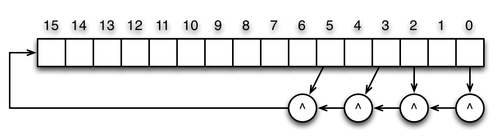

# 基本类型和运算符

## Chisel的赋值运算符以及再赋值运算符

当你在Chisel中定义一个值的时候，使用“=”运算符来告诉chisel在第一时间分配这个值。接下来每次给这个值重新赋值的时候，都必须要使用“:=”运算符。

由于我们构造的是数字电路，再赋值运算符的记号在电路节点间的连接只声明一次的时候没有太多的意义。但是，在某些情况下，我们需要在Chisel中表现出再赋值给一个值并且它们需要编译为顺序执行而不像Verilog那样并行执行。

下面给出一个简单的例子来说明再复制运算符在构建顶层的I/O模块时的必要性，两个输出的值在声明的时候是未知的。

考虑之前的给出的简单的全加器电路FullAdder，它的两个输出：结果sum、进位输出out是由三个输入a、b以及进位输入cin来决定的：

```Scala
class FullAdder extends Module {
    val io = IO(new Bundle {
        val a    = Input(UInt(1.W))
        val b    = Input(UInt(1.W))
        val cin  = Input(UInt(1.W))
        val sum  = Output(UInt(1.W))
        val cout = Output(UInt(1.W))
    })

    // Generate the sum
    val a_xor_b = io.a ^ io.b
    io.sum := a_xor_b ^ io.cin
    // Generate the carry
    val a_and_b = io.a & io.b
    val b_and_cin = io.b & io.cin
    val a_and_cin = io.a & io.cin
    io.cout := a_and_b | b_and_cin | a_and_cin
}
```

在这个例子当中，我们需要明确输出的io.sum以及io.cout要使用再赋值运算符“:=”，因为我们只知道它们的值不是在构造io bundle的时候就知道，而是在往后一段时间才能知道。

一般来说，当一个值要使用“:=”运算符，意味着它已经被“=”运算符赋值过了，否则都应该使用“=”运算符。如果没有正确使用“:=”以及“=”运算符，那么很有可能在编译后的Verilog代码中出现错误。

## Chisel的UInt类

在之前的例子中我们已经使用了UInt类型，一种无符号整数类型，作为我们所有的值的类型来使用。在Chisel中，很多基本的计算使用UInt类是很高效的。下面的这个例子展示在一个简单的ALU中UInt的一些一般用法：（在这个例子中忽略上溢以及下溢的情况）

```Scala
class BasicALU extends Module {
    val io = IO(new Bundle {
        val a = Input(UInt(4.W))
        val b = Input(UInt(4.W))
        val opcode = Input(UInt(4.W))
        val out = Output(UInt(4.W))
    })
    io.out := 0.U //THIS SEEMS LIKE A HACK/BUG
    when (io.opcode === 0.U) {
        io.out := io.a //pass A
    } .elsewhen (io.opcode === 1.U) {
        io.out := io.b //pass B
    } .elsewhen (io.opcode === 2.U) {
        io.out := io.a + 1.U //increment A by 1
    } .elsewhen (io.opcode === 3.U) {
        io.out := io.a - 1.U //increment B by 1
    } .elsewhen (io.opcode === 4.U) {
        io.out := io.a + 4.U //increment A by 4
    } .elsewhen (io.opcode === 5.U) {
        io.out := io.a - 4.U //decrement A by 4
    } .elsewhen (io.opcode === 6.U) {
        io.out := io.a + io.b //add A and B
    } .elsewhen (io.opcode === 7.U) {
        io.out := io.a - io.b //subtract B from A
    } .elsewhen (io.opcode === 8.U) {
        io.out := io.a < io.b //set on A less than B
    } .otherwise {
        io.out :=  (io.a === io.b).asUInt //set on A equal to B
    }
}
```

在上述的例子中，可以发现在when语句块当中有多个再赋值的运算符赋值给io.out，这说明了io.out的值取决于io.opcode的值。同时我们还能发现为了将常数能够与运算对象相加减，需要讲它们也声明为UInt类型，因为UInt类型的操作数不能与其他类型的操作数进行运算：

```Scala
io.output := io.a + 1.U
```

常用的UInt运算符：

<table>
    <tr>
        <th>运算符</th>
        <th>操作</th>
        <th>输出类型</th>
    </tr>
    <tr>
        <th>+</th>
        <th>加</th>
        <th>UInt</th>
    </tr>
    <tr>
        <th>-</th>
        <th>减</th>
        <th>UInt</th>
    </tr>
    <tr>
        <th>*</th>
        <th>乘</th>
        <th>UInt</th>
    </tr>
    <tr>
        <th>/</th>
        <th>无符号整数除法</th>
        <th>UInt</th>
    </tr>
    <tr>
        <th>%</th>
        <th>取模</th>
        <th>UInt</th>
    </tr>
    <tr>
        <th>~</th>
        <th>按位非</th>
        <th>UInt</th>
    </tr>
    <tr>
        <th>^</th>
        <th>按位异或</th>
        <th>UInt</th>
    </tr>
    <tr>
        <th>&</th>
        <th>按位与</th>
        <th>UInt</th>
    </tr>
    <tr>
        <th>|</th>
        <th>按位或</th>
        <th>UInt</th>
    </tr>
    <tr>
        <th>===</th>
        <th>相等</th>
        <th>Bool</th>
    </tr>
    <tr>
        <th>=/=</th>
        <th>不相等</th>
        <th>Bool</th>
    </tr>
    <tr>
        <th>></th>
        <th>大于</th>
        <th>Bool</th>
    </tr>
    <tr>
        <th><</th>
        <th>小于</th>
        <th>Bool</th>
    </tr>
    <tr>
        <th>>=</th>
        <th>大于等于</th>
        <th>Bool</th>
    </tr>
    <tr>
        <th><=</th>
        <th>小于等于</th>
        <th>Bool</th>
    </tr>
</table>

## 位提取

UInt类允许提取一个UInt类型的值的其中一位。给定一个n位的UInt值，我们可以提取它的x位到y位（n>x>y>=0）：

```scala
val x_to_y = value(x, y)
```

可以发现高位的索引是第一个参数。同时由于UInt的索引从0开始，因此可以提取的最高位索引为n-1。

如果只是想提取UInt类型的值中的其中一位，那么可以如此操作：

```scala
val x_of_value = value(x)
```

关于位提取的更具体的例子如下所示。在这个例子当中，基于偏移量的值，我们可以从一个字当中选择一个字节，这在从一个字的内存地址中读取一个字节的情景中是常见的操作：

```scala
class ByteSelector extends Module {
    val io = IO(new Bundle {
        val in     = Input(UInt(32.W))
        val offset = Input(UInt(2.W))
        val out    = Output(UInt(8.W))
    })
    io.out := 0.U(8.W)
    when (io.offset === 0.U(2.W)) {
        io.out := io.in(7,0)
    } .elsewhen (io.offset === 1.U) {
        io.out := io.in(15,8)
    } .elsewhen (io.offset === 2.U) {
        io.out := io.in(23,16)
    } .otherwise {
        io.out := io.in(31,24)
    }
}
```

## 位串连接

Chisel允许两个位串简单的相连，只需要使用Cat操作。假设你有一条数据总线，而你想将它拆分成两个独立的字A和B。将字A和字B连接在一起可以这样操作：

```scala
val A = UInt(32.W)
val B = UInt(32.W)
val bus = Cat(A, B)
```

与之前相同，Cat的第一个参数将会成为连接得到的位串的高位部分（也就是bus的32到63位为A），第二个参数将会成为连接得到的位串的低位部分（也就是bus的0到31位为B）。

**注** - Cat在实现在utility包中，是Chisel内核的扩展。要使用Cat泽需要导入utility包：

```scala
import chisel3.util.Cat
```

或者

```scala
import chisel3.util._
```

来导入所有的utility定义。

## LFSR16

[16位线性反馈的移位寄存器]: ../../线性反馈移位寄存器.md
在这一节的任务中，设计一个[16位线性反馈的移位寄存器]（16-bit Linear Feedback Shift Register，LFSR16）：



## UInt类型数据运算的位大小推断

某些运算比如相加和相乘，运算的结果可能比运算数的位数要更多。考虑下列的例子：我们将两个16位的数A和数B相乘，得到的结果显然最大有32位：

```scala
//A 16*16-bit multiplier with separate high and low product outputs
class HiLoMultiplier() extends Module {
    val io = IO(new Bundle {
        val A  = Input(UInt(16.W))
        val B  = Input(UInt(16.W))
        val Hi = Output(UInt(16.W))
        val Lo = Output(UInt(16.W))
    })
    val mult = io.A * io.B
    io.Lo := mult(15, 0)
    io.Hi := mult(31, 16)
}
```

注意到我们从来没有声明mult的位大小。一般来说如果我们在Verilog中我们必须要对mult的位宽进行声明，但是Chisel可以根据运算数的位宽来推断mult的大小，我们可以在生成的Verilog代码中发现：

```Verilog
module HiLoMultiplier(
    input         clock,
    input         reset,
    input  [15:0] io_A,
    input  [15:0] io_B,
    output [15:0] io_Hi,
    output [15:0] io_Lo
);
    wire [31:0] mult;
    assign mult = io_A * io_B;
    assign io_Hi = mult[31:16];
    assign io_Lo = mult[15:0];
endmodule
```

在生成的Verilog代码中，mult的位宽被正确推断为32位长。当要进行更为复杂的设计的时候，我们会发现位宽大小的推断能力在Chisel中是非常强的，能够是我们更加效率的构建我们所需要的硬件结构。下面是常见的位宽大小推断的清单：

<table>
    <tr>
        <th>运算</th>
        <th>位宽大小的结果</th>
    </tr>
    <tr>
        <th>Z=X+Y</th>
        <th>max(Width(X), Width(Y))</th>
    </tr>
    <tr>
        <th>Z=X-Y</th>
        <th>max(Width(X), Width(Y))</th>
    </tr>
    <tr>
        <th>Z=X|Y</th>
        <th>max(Width(X), Width(Y))</th>
    </tr>
    <tr>
        <th>Z=X^Y</th>
        <th>max(Width(X), Width(Y))</th>
    </tr>
    <tr>
        <th>Z=~X</th>
        <th>Width(X)</th>
    </tr>
    <tr>
        <th>Z=Mux(C, X, Y)</th>
        <th>max(Width(X), Width(Y))</th>
    </tr>
    <tr>
        <th>Z=X*Y</th>
        <th>Width(X)+Width(Y)</th>
    </tr>
    <tr>
        <th>Z=X<< n</th>
        <th>Width(X)+n</th>
    </tr>
    <tr>
        <th>Z=X>>n</th>
        <th>Width(X)-n</th>
    </tr>
    <tr>
        <th>Z=Cat(X, Y)</th>
        <th>Width(X)+Width(Y)</th>
    </tr>
    <tr>
        <th>Z=Fill(n, X)</th>
        <th>Width(X)+n</th>
    </tr>
</table>

## Chisel的Bool类型

Chisel中的Bool类型是用来表示结果的逻辑表达式，Bool类型的值只有两种：true以及false。Bool类型的值一般用作条件表达式比如when语句块：

```scala
val change = io.a === io.b
when (change) {
    // ...
} .otherwise {
    // ...
}
```

你可以实例化一个Bool类型的对象（值）如下所示：

```scala
val true_value = true.B
val false_value = false.B
```

就如同之前的BasicALU例子当中，为了将一个Bool类型的值作为一个UInt类型的值赋值给输出，转换为UInt的类型转换是必须的。

## 类型转换

当给一个值赋值的时候，你需要保证赋的值类型必须相同，否则将会出现错误：

```scala
val io  = IO(new Bundle {
    val in  = Input(UInt(2.W))
    val out = Output(UInt(1.W))
})
// attempted Bool assignment to UInt
io.out := (in === 0.U) 
```

正确的方法是使用显式的类型转换，讲Bool类型的数据转换为UInt类型的数据，使用asUInt转换方法。正确的代码如下：

```scala
val io = IO(new Bundle {
    val in = Input(UInt(2.W))
    val out = Output(UInt(1.W))
})
io.out := (in === 0.U).asUInt   // UInt cast
```

一些常用的转换函数如下：

- asUInt()
- asSInt()
- asBool()
