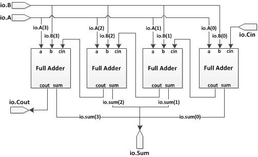

# 模型实例化

## 模型的实例化

就像其他的硬件描述语言一样，Chisel允许直接的模型实例化来使自身模块化以及可继承。在Chisel当中，实例化一个模块类与在Verilog中实例化一个模块一致。为了做到这一点，我们可以简单的使用Scala中的new关键字来代表我们当前正在实例化一个新的模块。通过实例化一个模块，我们可以引用它的输入输出管脚，同时将其相互连接起来。

举例来说，假设我们想通过FullAdder模块来构建一个4位的全加器：



Chisel的源代码如下图所示：

```scala
//A 4-bit adder with carry in and carry out
class Adder4 extends Module {
    val io = IO(new Bundle {
        val A    = Input(UInt(4.W))
        val B    = Input(UInt(4.W))
        val Cin  = Input(UInt(1.W))
        val Sum  = Output(UInt(4.W))
        val Cout = Output(UInt(1.W))
    })
    //Adder for bit 0
    val Adder0 = Module(new FullAdder())
    Adder0.io.a := io.A(0)
    Adder0.io.b := io.B(0)
    Adder0.io.cin := io.Cin
    val s0 = Adder0.io.sum
    //Adder for bit 1
    val Adder1 = Module(new FullAdder())
    Adder1.io.a := io.A(1)
    Adder1.io.b := io.B(1)
    Adder1.io.cin := Adder0.io.cout
    val s1 = Cat(Adder1.io.sum, s0)
    //Adder for bit 2
    val Adder2 = Module(new FullAdder())
    Adder2.io.a := io.A(2)
    Adder2.io.b := io.B(2)
    Adder2.io.cin := Adder1.io.cout
    val s2 = Cat(Adder2.io.sum, s1)
    //Adder for bit 3
    val Adder3 = Module(new FullAdder())
    Adder3.io.a := io.A(3)
    Adder3.io.b := io.B(3)
    Adder3.io.cin := Adder2.io.cout
    io.Sum := Cat(Adder3.io.sum, s2).asUInt
    io.Cout := Adder3.io.cout
}
```

在这个例子当中，展示了实例化一个模块的方法：

```scala
val new_module = Module(new Modulename())
```

注意到，当我们引用每个I/O模块的接口的时候，我们必须将实例化了的模块的I/O与我们定义的模块的io连接起来，使用“:=”运算符。当实例化模块时，要保证模块所有的输入和输出端口都已经连接上了。如果一个端口没有被连接，那么Chisel编译器会抛出错误或者警告。

## Vec类

Chisel中的Vec类允许你创建一个可索引的向量，它可以被任意返回chisel数据类型的表达式填充。一般的Vec声明方式如下：

```scala
val myVec = Vec(Seq.fill( <number of elements> ){ <data type> })
```

其中<number of elements>代表向量的长度，<data type>代表该向量容纳的数据类型。

举例来说，如果我们想要实例化一个10单位长度的向量，其中每个单位容纳的数据类型位5位大小的UInt数值，我们会这样来声明：

```scala
val ufix5_vec10 := Vec(Seq.fill(10) {UInt(5.W)})
```

如果我们想定义一个寄存器组（容纳寄存器的向量）：

```scala
val reg_vec32 = Reg(Vec(Seq.fill(32) {UInt()}))
```

为了给向量的其中一个单元赋值，可以简单的通过索引的方法来将目标值赋给特定的索引。举例来说，如果我们想给上述的寄存器组中的第一个寄存器赋值为0，则需要这样操作：

```scala
reg_vec32(0) = 0.U
```

要获取向量中的其中一个元素，可以指定它在向量中的索引位置。如下所示，将向量reg_vec的弟5个单元提取出来赋值给reg5：

```scala
val reg5 = reg_vec32(5)
```

当定义一个容纳模块的向量的时候，Vec类的定义要稍微有点不同。在实例化一个模块向量的时候，{}中的类型使用的是io bundle。举例来说，为了实例化一个容纳16个模块的Vec类型数据，我们可以这样定义：

```scala
val FullAdders = Vec(Seq.fill(16) { Module(new FullAdder()).io })
```

如何使用模块向量中的io，将在下一节讨论。

### 移位寄存器向量

这一节的任务是构建一个简单的移位寄存器，使用的模板是src/main/scala/problems/VecShiftRegisterSimple.scala

## 参数化

在之前的Adder例子当中，我们显式的实例化了四个不同的FullAdder模块对象，并且将它们的端口相互连接了起来。但是假设我们想要构造一个n位大小的全加器。那么Chisel也可以像Verilog一样，允许传递参数来完善你的设计。为了做到这一点，我们在模块的定义当中添加了参数：

```scala
// A n-bit adder with carry in and carry out
class Adder(n: Int) extends Module {
    val io = IO(new Bundle {
        val A    = Input(UInt(n.W))
        val B    = Input(UInt(n.W))
        val Cin  = Input(UInt(1.W))
        val Sum  = Output(UInt(n.W))
        val Cout = Output(UInt(1.W))
    })
    // create a vector of FullAdders
    val FAs = Vec(Seq.fill(n){ Module(new FullAdder()).io })

    // define carry and sum wires
    val carry = Wire(Vec(n+1, UInt(1.W)))
    val sum   = Wire(Vec(n, Bool()))

    // first carry is the top level carry in
    carry(0) := io.Cin

    // wire up the ports of the full adders
    for(i <- 0 until n) {
        FAs(i).a   := io.A(i)
        FAs(i).b   := io.B(i)
        FAs(i).cin := carry(i)
        carry(i+1) := FAs(i).cout
        sum(i)     := FAs(i).sum.toBool()
    }
    io.Sum  := sum.asUInt
    io.Cout := carry(n)
}
```

在这个例子当中，可以发现，我们的输出是一个布尔型的向量，这是因为Chisel不支持对一个数值的其中一个位进行赋值。因此我们使用了一个布尔型的向量，对其每个元素进行赋值，再在最后将其转换为UInt()。

声明为模块向量，可以允许我们对向量迭代操作，从而对向量中的每个FullAdder模块进行连接。

实例化一个参数化的模块与实例化一个普通的模块基本相同，只是我们需要为参数化的模块实例时提供一个参数。举例来说，如果我们想要实例化一个4位的Adder模块，那么我们需要这样操作：

```scala
val adder4 = Module(new Adder(4))
```

当然，你也可以显式的实例化参数n：

```scala
val adder4 = Module(new Adder(n = 4))
```

显式声明参数对于有多个参数的模块来说很有用，假设你有一个参数化的FIFO模块：

```scala
class FIFO(width: Int, depth: Int) extends Module {...}
```

你可以以任意顺序声明每一个参数：

```scala
val fifo1 = Module(new FIFO(16, 32))
val fifo2 = Module(new FIFO(width = 16, depth = 32))
val fifo3 = Module(new FIFO(depth = 32, width = 16))
```

## 使用预定义的原件来构造

就像其他HDL一样，Chisel提供一些非常基础的原件。这些原件在Chisel库中已经进行了定义，如Reg、UInt和Bundle等这些之前已经提到过的。不像模块的实例化，Chisel的基础原件不需要显式连接它们的端口来进行使用。其他比较有用的原件包括Mem和Vec，这两个原件将在教程之后继续学习。这里来学习Mux这个原件。

### Mux类

Mux类原件是一个具有两个输入的多路选择器。要使用Mux，我们首先要了解Mux类的定义。就像其他的两路输入的多路选择器一样，它总共需要3个输入（select、输入1、输入2）以及1个输出。两个输入为数据类型A和B，另外一个输入是select。如果select为真，那么就将会输出A，否则输出B：

```scala
val out = Mux(select, A, B)
```

### 参数化位宽大小的全加器

这一节的任务是构造一个参数化位宽大小的加法器。模板位于src/main/scala/problems/Adder.scala。
