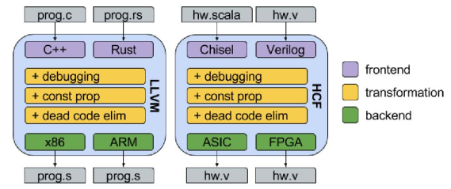
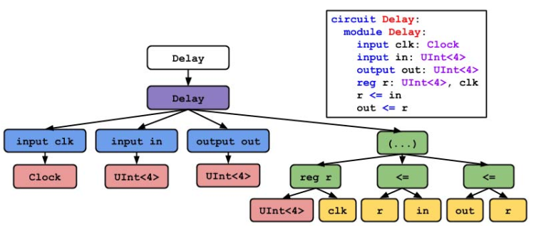

# Chisel3 概述

Chisel是一个开源的硬件构造语言，由加利福利亚大学伯克利分校研发。Chisel支持使用高度参数化的生成器，嵌入在Scala语言当中，是具有面向特定域的分层硬件设计语言。Chisel的主要特性包括：

- 硬件构造语言(Hardware Construction Language, HCL)，而非硬件描述语言(Hardware Description Language, HDL)。非简单的C to Gate构造。
- 嵌入在Scala语言当中，支持抽象的数据类型以及接口。
- 集多态、继承以及函数编程特性为一体。
- 大小可变的Chisel标准库，包括浮点单元库。
- 可生成底层Verilog代码，可以使用标准的ASIC或者FPGA工具进行下载。

Chisel还有其他特性，包括面向github开源，包含BSD许可，完整的文档说明以及日益增长的研发社区等等。

截止日前，Chisel的最新版本为Chisel3，最新释出版本为3.1.3。在最新的Chisel3版本中，Chisel引入了Firrtl作为编译框架的中间描述语言(intermediate hardware representation language)。

# Chisel3

## 概览

Chisel3不单单只是一个硬件构造语言，它还具有一条完整的编译流水线，具有一个完整的编译框架：

- Chisel3(Scala)到Firrtl，Firrtl在框架中相当于编译技术中的中间代码层。
- Firrtl到Verilog，生成的Verilog代码可以传递到FPGA或者ASIC工具进行下载。
- Verilog到C++，使用Verilator进行仿真和测试。

时至今日，Chisel仍然在不断的研发与完善当中，实际上Chisel只是一个包含有特殊的类定义、预先定义对象的Scala库，因此当书写Chisel程序的时候，实际上书写的就是Scala代码。

## Chisel框架

Chisel框架包括：sbt、Firrtl以及Verilator。

- sbt：Scala的build框架，在Chisel中使用。
- Firrtl：作为Chisel的中间代码(IR)，编译至Verilog。
- Verilator：将Verilog编译为C++，用于仿真使用。在进行单元测试的时候使用。

### Chisel3体系结构

Chisel3的编译框架包含以下主要的部件：

- 前端(frontend)：chisel3.*。包含所有公共的可见的Chisel API。
- 生成器(Builder)：chisel3.internal.Builder。维护着一些全局参数设置以及命令、生成器等。
- 中间数据结构(intermediate data structures)：chisel3.firrtl.*。基本语法与Firrtl相似，当整个电路描述完全后，最顶层的模块将会传递到该数据结构中进行描述。
- Firrtl发射器(Firrtl emitter)：chisel3.firrtl.Emitter。将中间数据结构转换成输出为一个Firrtl源代码文件，用于后续的处理。

同时还包括：

- 电路生成器的标准库(The standard libraray of circuit generators)：chisel3.util.*，包含一些公共的接口以及结构，如多路选择器(Mux)等。
- 驱动工具(Driver utilities)：集成了编译以及测试的驱动器，包括标准的Verilog生成器以及仿真测试的基础工具。

# FIRRTL

FIRRTL，Flexible Internal Representation for RTL，是一种专门被设计为书写数字电路级的中间代码，也可以被视作是一个转换的平台，将抽象的高层RTL/目标独立的RTL转换成特定平台的RTL(ASIC or FPGA)。

## 背景

FIRRTL来源于Chisel项目，在Chisel研发初期，Chisel由于以下的原因导致其被接受的程度比较低：

- 书写定制的电路，并将其进行转换为Verilog代码需要对Chisel的编译器有深入的了解。
- Chisel的语义没有严格的标准化，难以面向多种特定的RTL平台。
- 基于上一点，由于语义的非标准化，导致错误检测功能难以实现。
- 学习Scala对于没有高级语言编程经验的RTL工程师来说很困难。
- 基于上一点，对于新的用户来说，将Chisel从其嵌入的宿主语言当中区分开来很困难。
- Chisel的输出Verilog很难阅读并且仿真的速度很慢。

因此Chisel需要重新设计以标准化其语义，并且将其编译的过程模块化，分离成完整的前端、中间表示层以及后端。因此，FIRRTL由此诞生于Chisel编译框架的中间代码层当中。一个简洁定义的中间代码层可以带来诸多的好处，包括允许使用者不需要了解Chisel内部编译的细节就可以书写定制的数字电路等。FIRRTL还能增强Chisel编译框架的鲁棒性和结构性。

## 设计理念

FIRRTL表示从Chisel HDL中产生的标准电路描述，也就是说，FIRRTL在Chisel对电路进行描述后，对其进行简化前生成。因此FIRRTL继承了很多Chisel的高级特性，包括向量(vector)类型、bundle类型、条件语句以及模块对象等。在这后，这些高级的对象会被移除，也就是一种往下层编译的过程，这些对象会被重写为同等的，更为简单的，底层的代码表示。这一层可以更容易转变成特定的输出平台语言(Verilog)，这一层称为LoFIRRTL(Lowered FIRRTL)，是FIRRTL的一个子集。

**因此，宿主语言现在可以变得非常轻量级，且一些以其它语言写成的HDL可以以FIRRTL作为其编译的目标，来重用整个编译的工具链，充分享受原生Chisel框架的各项优点。**(Because the host language is now used solely for its meta-programming facilities, the frontend can be very light-weight, and additional HDLs written in other languages can target FIRRTL and reuse the majority of the compiler toolchain)

# 硬件编译框架概述

Chisel，以及FIRRTL，组成的一个面向硬件的编译框架。如同软件编译器一样，将高级语言编译成特定平台的汇编语言，一个硬件的编译器将高层的RTL代码/独立于目标平台的RTL代码转换成特定平台的RTL代码。将转换成各个平台(ASIC/FPGA)RTL代码的转换器包含在编译框架当中，可以形成一个鲁棒性良好且可重用的编译平台。

整个框架的关键在于作为中间层的中间表示，FIRRTL。在现代的编译框架当中，以LLVM为例子，它具有前端、中间表示层以及后端。前端写成的程序可以是C++、Rust等，LLVM编译成一个内部的中间表示层，这个中间表示层可以转换为各种平台的汇编代码，如ARM或者x86。类似于LLVM，Chisel前端将代码转换成FIRRTL，FIRRTL可以变换成面向ASIC或者FPGA的RTL级Verilog代码:

位于内存中表示的Firrtl的数据结构实际上是一棵抽象的语法树（AST），用于定义数字电路：

其中，circuit是AST的根节点，任何FIRRTL描述的数字电路都只有一个circuit节点，接着是余下的组成电路部分的对象节点，包括module、port、statement、expression以及type等。使用递归的算法遍历AST中所有的expression节点：首先，遍历每一个module的statement节点，对于每个遍历到的statement节点，再往下遍历所有的子statement节点以及expression节点。使用这个算法遍历AST可以生成、修改电路。

# Chisel, FIRRTL现有工具链目录及其他资源

1. Chisel项目模板：https://github.com/freechipsproject/chisel-template
2. 基于Chisel及其编译框架的开源硬件库RocketChip，可以生成大量不同的SMP(symmetric mutil-processor system)：https://github.com/freechipsproject/rocket-chip
3. Chisel Testers：https://github.com/freechipsproject/chisel-testers

Chisel与RISC-V关系密切：
1. "Design of the RISC-V Instruction Set Architecture," A. Waterman, Technical Report No. UCB/EECS-2016-1, EECS Department, University of California, Berkeley, January 2016. http://www.eecs.berkeley.edu/Pubs/TechRpts/2016/EECS-2016-1.html
2. "The RISC-V Instruction Set Manual, Volume I: User-Level ISA Version 2.2," Andrew Waterman, Krste Asanovi´c, SiFive Inc., CS Division, EECS Department, University of California, Berkeley. https://content.riscv.org/wp-content/uploads/2017/05/riscv-spec-v2.2.pdf
3. RISC-V工具链目录：https://github.com/riscv/riscv-tools
4. Simple RISC-V 3-stage Pipeline: https://github.com/ucb-bar/riscv-mini

由RISC-V基金会赞助的SiFive公司利用RocketChip，使得用户可以快速定制自己想要的内核、片上系统的IP，快速生成RTL级的Verilog代码：
- SiFive官网：https://www.sifive.com/
- SiFive Core Designer: https://www.sifive.com/core-designer
- SiFive Soc Designer: https://www.sifive.com/chip-designer

# 参考资料及文献

1. "Chisel: Constructing Hardware in a Scala Embedded Language", Jonathan Bachrach, Huy Vo, Brian Richards, Yunsup Lee, Andrew Waterman, Rimas Avižienis, John Wawrzynek, Krste Asanovic´, EECS Department, UC Berkeley, DAC 2012.
2. "Specification for the FIRRTL language", Patrick S. Li, Adam M. Izraelevitz, Jonathan Bachrach, Jan 24, 2019.
3. "Reusability is FIRRTL Ground: Hardware Construction Languages, Compiler Frameworks, and Transformations", Adam Izraelevitz, Jack Koenig, Patrick Li, Richard Lin, Angie Wang, Albert Magyar, Donggyu Kim, Colin Schmidt, Chick Markley, Jim Lawson, Jonathan Bachrach, Department of Electrical Engineering and Computer Sciences, University of California, Berkeley.
4. "The Rocket Chip Generator", Krste Asanović, Rimas Avizienis, Jonathan Bachrach, Scott Beamer, David Biancolin, Christopher Celio, Henry Cook, Daniel Dabbelt, John Hauser, Adam Izraelevitz, Sagar Karandikar, Ben Keller, Donggyu Kim, John Koenig, Electrical Engineering and Computer Sciences University of California at Berkeley, No. UCB/EECS-2016-17, April 15, 2016.
5. Chisel官方网站：https://chisel.eecs.berkeley.edu/
6. Chisel3 Github主页：https://github.com/freechipsproject/chisel3/
7. Chisel3 Wiki：https://github.com/freechipsproject/chisel3/wiki
8. Chisel3 Scala API：https://chisel.eecs.berkeley.edu/api/latest/index.html
9. FIRRTL Github主页：https://github.com/freechipsproject/firrtl
10. FIRRTL Wiki：https://github.com/freechipsproject/firrtl/wiki
