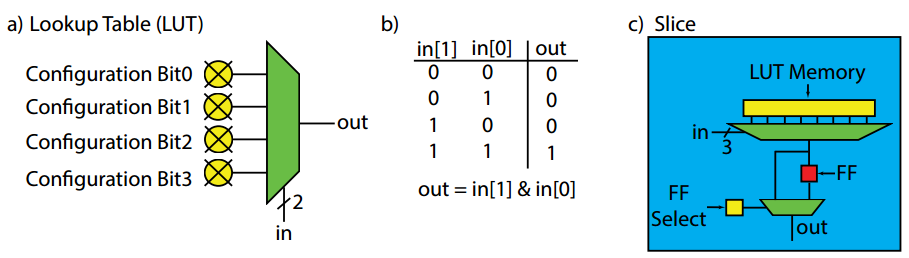
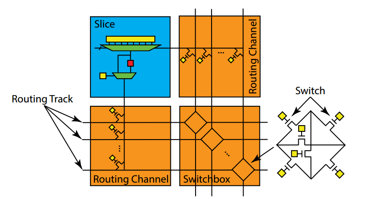
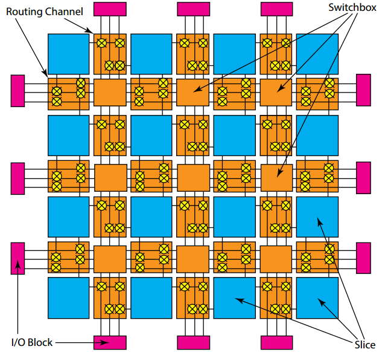
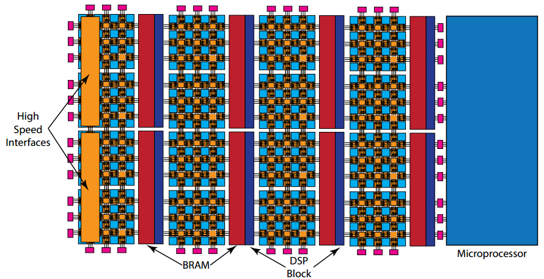
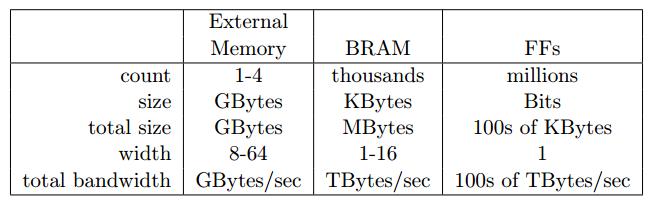

# 简介

这类文章系列是阅读 Parallel Programming for FPGAs 所做的笔记。

# 1.1 High-level Synthesis(HLS)

最早期的芯片设计由于其结构简单的特性，设计人员往往可以直接使用半导体来进行手工设计。随着芯片复杂度的提高，设计人员开始往抽象的设计方式进行过渡。上世纪80年代的Verilog/VHDL语言是抽象化的第一步，由此带来的是芯片硬件复杂度的指数级增长。RTL（register-transfer evel）级的描述则是抽象程度的又一次提高，它使得设计者可以只关注寄存器以及在寄存器上的操作，而不需要关心寄存器是如何实现的。EDA工具（electronic design automation tools）可以先把RTL转化成数电模型，再由模型转换成一个设备上的具体电路实施方案。所谓“方案”其实就是编译出的文件，这些文件可以用于规定某个自定义设备，也可以用于编程一些现有的设备，比如FPGA（field-programmable gate array）。

高层次综合（High-level Synthesis，HLS）是抽象程度的又一次提升，它允许设计者着眼于更大的体系结构性的问题而不是单一的寄存器中每个时钟周期的操作。在HLS设计中，设计者所要关心的行为不包括特定的寄存器或者时钟特性，并且一个HLS工具负责产生RTL级的微结构。早期的HLS工具都是基于行为式的Verilog，并且通过Verilog产生RTL。如今很多商用的HLS工具使用C/C++作为前端的语言。

总的来说，现在HLS可以自动完成以前RTL设计师需要手动完成的工作包括：

- HLS自动分析并利用算法中的潜在并发性。
- HLS自动在需要的路径上插入寄存器，并自动选择最适合的时钟。
- HLS自动产生控制数据在一个路径上出入方向的逻辑。
- HLS实现的接口会自动连接到系统的其他部分。
- HLS将数据映射到储存单元来平衡资源的使用以及带宽。
- HLS自动将程序中计算的部分对应到逻辑单位，在实现等效计算的前提下自动选取最有效的实施方式。

一般来说，HLS的目标就是使得设计者所提供的输入以及一些限制条件来替设计者完成很多的决定。

然而，HLS工具还不能强大到能处理任何的软件代码。很多在软件编程中所使用的概念在硬件设计当中是很难实现的。一般来说，HLS需要设计者在代码中添加一些额外的信息（如#pragmas）来使工具能够生成更为高效的设计。HLS一般来说无法处理动态内存分配，对标准库的支持也很少。系统调用在硬件设计中更是禁止使用来降低设计的复杂性。递归一般来说也禁止使用。另一方面，HLS工具所能处理的范围非常广，包括DMA、流、片上内存访问等等，还能使用更为先进的优化技术如流水线、内存分块、位操作等等。

在Vivado HLS工具中定义了如下的规范：

- 不使用动态内存分配，如malloc()、free()、new、以及delete()。
- 减少使用指针来对指针进行操作。
- 不支持系统调用，如abort()、exit()、printf()。它们可以在测试例程中使用，但是在综合的时候会被忽略（移除）。
- 减少对标准库的使用。一般来说math.h是支持的，但是其他的标准库基本不支持。
- 减少使用函数指针以及C++类中的虚拟函数。（函数调用必须在编译时就由编译器完成）
- 不使用递归函数调用。
- 接口必须准确进行定义。

一个HLS工具的主要输出就是RTL级别的硬件设计。此外，HLS工具还可以输出测试的样例来验证设计。最后，工具还会提供对资源使用以及性能的大致估计。Vivado HLS会生成如下的输出：

- 可综合的Verilog和VHDL代码。
- 基于设计所生成的测试平台，可以进行RTL级别的仿真测试。
- 对性能以及资源使用的静态分析。
- 设计边界上的原数据可以使工具将设计更简单的组合成一个系统。

当一个RTL级别的设计生成之后，大多数的HLS工具则会进行标准的RTL设计流。在Xilinx Vivado的设计套件中，首先进行的是逻辑综合，将RTL级的设计转化成FPGA逻辑部件的连线表（netlist）。连线表（包括逻辑部件以及它们之间的连线）与目标设备中可用的资源相关联，这个过程称作布局以及布线（PAR，place and route）。对FPGA中资源最终的配置被写入一个比特流的文件中，可以上传到FPGA中实现。比特流文件实际上用每个位来代表对每个FPGA资源的配置，包括逻辑部、连线以及片上内存的配置。

# 1.2 FPGA 体系结构

FPGA由一个可编程的逻辑块阵列以及存储部件组成，它们之间的连接使用可编程的内部连接。通常来说这些逻辑块会实现成查找表（lookup table，LUT）的形式——一种存储单元，输入的是地址信号而输出的是存储的内存单元。一个N位查找表可以以一个N位输入真值表的方式来表示。

上图a展示了一个2输入的LUT，也就是一个2-LUT。4个可配置的比特都可以用来编程以改变2-LUT的功能使其成为一个完整的可编程的2输入逻辑门。图b展示如何配置一个2-LUT使其称为一个与门，如上图所示，将Bit0~2配置为0，Bit3配置为1，就可以使得只有在两个输入都是1的时候，输出为1,。图c展示了一个简单的slice，里面含有稍微复杂的3-LUT结构，带有将输出存储到一个触发器（FF）当中的功能。需要配置的一共有9个比特，其中8个比特用于配置3-LUT，另外一个用来决定输出直接来自于3-LUT还是触发器。通常来说，一个slice会定义成一个包含有少量LUT以及触发器，并且在LUT以及触发器带有组合逻辑电路连接。

通过对配置比特的重新编程，FPGA板的功能可以很轻松的改变。大多数的FPGA使用的LUT带有4~6个输入的比特，这些LUT作为它们基本的计算部件。大型的FPGA可以拥有数以百万计的LUT。

触发器是FPGA中基本的存储单元。它们一般会和LUT一起组合成更为复杂的逻辑部件来称为一个可配置的逻辑块（configurable logic block，CLB）或者一个逻辑阵列块（logic array block，LAB）或者slice，这取决于你的设计工具或者供应商。一般来说，一个slice拥有LUT、触发器以及Mux（多路选择器）的数量并不会太多。一个slice也有可能使用更多更为复杂的逻辑功能器件。比如，slice中一般会带有一个全加器，这是因为在设计中全加器的使用太过于广泛，因此将所有的slice都配置有一个全加器带来更好的设计效益。

可重编程的内部互连也是FPGA另一个关键的要素。它提供了slice之间灵活的连接方式。slice的输入输出与连线通道相连。这个连线通道包含一组比特用来配置各个slice的输入输出之间是否相连。而通道本身则与开关盒相连。开关盒由很多传输晶体管充当的开关所组成，它的工作便是连接通道与通道。

上图提供了一个slice与连线通道以及开关盒之间的连线的例子。slice当中的每个输入输出都应该和连线通道的其中一条路线相连。可以将连线通道中的其中一条路线想象成一个单比特的连线。

一个开关盒为相邻的连接通道的连接路线提供了相连的矩阵（以类似矩阵的形式提供）。典型来说，一个FPGA可以看作是一种2D的逻辑表达形式，能够给设计者带来2D的抽象计算模型，这个通常称为岛状结构（island-style），其中slice表示一个“逻辑岛”（logic islands），slice之间通过连线通路以及开关盒来互相连接。

上图是一个2D的FPGA结构。可以看到，输入输出的块会提供一个外部的接口，可以连接到内存、微处理器、传感器等。在一些FPGA结构当中，IO会直接和片上的引脚进行连接。而在其他的一些FPGA当中会使用这些IO口和一些可编程的逻辑构造相连接通到片上的资源（一个微处理器总线或者缓存）。FPGA可编程的逻辑使用IO块来与外部设备进行沟通，可以是一个微控制器（一块片上的使用AXI总线接口的ARM处理器），可以是内存（片上的缓存或者片外的DRAM内存控制器），可以是传感器（AD）或者一个马达等。现今的FPGA片上都会集成有IO控制器，如内存控制器、AD转换、收发器等等。

现代的FPGA一般会在实现效率与灵活性之间做出平衡，并且，变得越来越多异构化，可能拥有大量不同的可编程的逻辑块以及一些预先配置好的体系架构的部件如寄存器组、自定义的数据路径以及高速的内部连接。下图是一个实现了DSP块的FPGA结构（专用于算术逻辑运算，特别是加法与乘法的预定义块）：

一个BRAM（block RAM）也是另一种预先配置好的资源的例子。BRAM是可配置的随机访问存储器模块，支持不同的内存形式以及接口。它们可以存储字节、半字、字或者双字。BRAM还可以把这些数据传输到连接到片上的总线接口（与可编程逻辑交流）或者处理器的总线（与片上处理器交流）上。一般来说，BRAM的作用是在片上资源之间传输数据（FPGA可编程逻辑以及片上微处理器）以及存放大的数据集。也可以在slice上对这些数据进行配置来存储（通过触发器），但是这样会带来额外的性能以及资源利用的开销。

典型的BRAM拥有大概32 Kbit的存储资源。它们可以配置成32K x 1bit，16K x 2bits，8K x 4bits等等。它们也可以相互级联来组成更大的存储。BRAM一般会和DSP48放置在一起。对于HLS来说，将BRAM看作是可配置的寄存器组更有益处。这些BRAM可以直接输出到自定义的数据路径（DSP48），并与片上的微处理器交流，传输数据给实现了可编程逻辑的自定义数据路径。下图是外部内存、BRAM以及触发器之间的比较：

随着片上的半导体变得越来越多，越来越多复杂，目前FPGA上集成的预先配置好的资源也越来越多复杂。现代的高端FPGA上可以集成多个微处理器核。一般来说，现在的小型的FPGA核也会继承一个微处理器核，这使得可以在片上运行操作系统，因此可以带来更多的功能，包括与外设交流、跑大型的软件程序如OpenCV，使用高级变成语言来设置系统以及快速运行相关的程序。微处理器一般会作为系统的控制器。它会控制从片外的内存、传感器到BRAM之间的数据流。并且微处理器还能协调各种IP核，包括HLS自带的IP核以及第三方的IP核与片上资源之间的关系。
