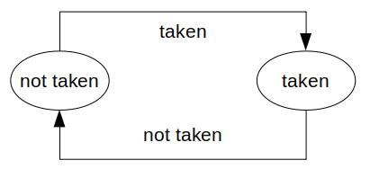
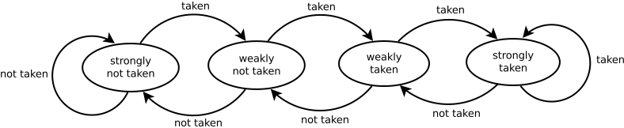

# Predication

Predication，在计算机科学/计算机体系结构中的断言，指的是处理器架构中对条件分支的一种处理方法。条件分支的断言通过执行条件分支产生的所有路径的指令，并且最后只有被选择的分支的指令能够改变架构状态来实现。被选择的路径分支的指令被允许修改架构状态，因为这些指令被一个布尔值联系在一起，这个布尔值被用作控制该指令是否允许修改寄存器的状态。

## 概览

在大多数的计算机程序当中都包含有条件代码，这些条件代码的条件依赖于执行时才会被确定的参数，比如用户的输入。在顺序执行的非流水线架构当中，处理分支条件很简单，只需要在分支条件处插入一条分支指令即可，分支指令可以判断是继续顺序执行指令还是跳转到另一条分支对应的其他部分的代码。但是对于现代的流水线处理器来说，条件分支会显著的降低流水线的效率（例如填充NOP指令使流水线占空直到条件明确或者进行分支预测，分支预测若成功则流水线基本没有影响，但是若预测失败则要清流水线恢复到应该执行的指令处）。一种流行的解决方法是使用分支预测器。

### Branch predictor

在计算机体系架构中，分支预测器（Branch predictor）是一种数字电路来尝试猜测所要执行的条件分支的路径。分支预测器的目的就是为了提高流水线的效率。分支预测器在现代流水线处理器中扮演着非常关键的角色，在许多微处理器架构中有使用如x86。

两路的条件分支一般实现为一个条件跳转的指令。一个条件跳转可以选择不执行跳转而继续执行接下来的代码，或者跳转到其他程序空间中执行。在条件跳转指令执行到“执行”（execution）阶段之前，所要跳转到的路径是未知的。

如果没有分支预测器，那么处理器会在条件跳转指令到达“执行”阶段前等待。而分支预测器就是为了避免这段时间的浪费，通过预测条件跳转所要选择的路径。分支预测器通过猜测最有可能的路径来进行推测执行，如果在之后检测到猜测的路径是错误的，则需要抛弃这部分的指令并且从正确的分支重新开始，导致了延迟。

在分支预测错误招致的时间浪费上与流水线从取指到执行阶段之间的流水线阶段数。在现代处理器来说一般是10到20个时钟周期。换句话说，流水线级数越深，分支预测失败带来的时间浪费越严重，也越需要更先进的分支预测器。

在遇到第一次的条件跳转分支的时候，分支预测器用来进行预测的信息很少或没有，但是随着预测器对每次分支执行与否进行纪录，在下次遇到同样的条件时就可以根据前若干次的跳转选择来进行预测。

需要注意的是，分支预测和分支目标预测是不同的。分支预测是猜测分支跳转是否会执行，而分支目标预测是猜测执行条件分支或者无条件跳转在其指令译码执行前的跳转目标。一般来说这两个功能会集合在同一个电路中。

#### 分支预测常用的算法实现

##### 静态分支预测 Static branch prediction

静态的分支预测是最简单的分支预测技术，因为它不依赖于任何动态的代码执行过程中的分支历史。相反，它只依赖于分支指令本身来进行预测。

在SPARC和MIPS的早期实现当中（第一代商业化的RISC架构），使用了单方向的静态条件预测：它总是预测条件跳转不会被执行。由于这两种CPU都是在译码阶段评价分支指令，因此分支目标需要两个周期（取指、译码）才能确定。这两种处理器都会在分支指令进入流水线的执行阶段时，插入一个分支延迟间隙。

一种更为先进的分支预测方法为：后向分支总是会被执行而前向分支总是不会执行。后向分支指的是跳转的目标地址是在分支指令之前，实际上这个技术是为了增加对循环指令预测的精确度。

一些处理器允许分支预测提示出现在代码当中，如Intel Pentium 4。但是其之后的Intel处理器不再支持。

静态分支预测也会作为一些处理器没有任何可用信息时最后的方法，如Motorola MPC7450(G4e)和Intel Pentium 4。

##### 动态分支预测 Dynamic branch prediction

动态分支预测使用在运行当中搜集到的结果来决定是否执行分支。

##### 下一行预测 Next line prediction

在一些超标量处理器（MIPS R8000、Alpha 21264等）中使用。

##### 一级分支预测器

**饱和计数器**

一个1位的饱和计数器纪录上一次分支的结果。这是动态分支预测最简单的实现，尽管它不是十分的精确。

一个2位的饱和计数器使用状态机，一共有4种状态：

- 强不执行
- 弱不执行
- 弱执行
- 强执行

其状态机如下所示：

当每次对分支执行后，状态机都会更新。这种方法的好处在与只有两次不执行或者执行才能改变处于强状态的状态机的状态。

在不支持MMX的Intel Pentium处理器中使用了一个饱和计数器，虽然实现的不够完美。

在SPEC'89测试当中，饱和预测得到了93.5%的准确率，若每个条件分支都映射了自己的计数器。

##### 两级自适应分支预测器

如果在一种跳转模式当中，每两次分支选择进行一次反转，那么上文提到的饱和计数器就无法有效的进行预测。一种两级自适应的分支预测器可以更有效的解决上述问题。一个两级自适应分支预测器可以纪录前$2^n$次的历史纪录，也就是说历史表中一共有$2^n$个位模式。假设n=2，那么历史表中一共有4中模式：00，01，10和11。每个模式对应一个2位饱和计数器。

举例来说，当一个条件跳转以3次为一个周期，每个周期的前2次都不会发生跳转而最后一次会发生跳转，即：001001001001……，那么通过几个周期后自适应分支预测器的历史表中，00对应的是强执行（跳转），而01对应的是强不执行（跳转），10对应的也是强不执行（跳转）。

二级自适应分支预测器的有点是可以快速学习预测任意重复的模式，在1991年被提出。

##### 局部分支预测

局部分支预测器中每个条件跳转指令具有分离的历史记录缓存。它们可能使用两级自适应分支预测器。这些模式历史表可以是专用的，也可以是所有条件分支共享的。

Intel Pentium MMX，Pentium II以及Pentium III使用局部分支预测，纪录局部4位长度的历史以及一个本地的模式历史表（16种模式）来纪录每一种条件跳转指令。

在SPEC'89测试中，使用非常大的局部饱和分支预测器的准确率达到了97.1%。

##### 全局分支预测

全局分支预测保持一份所有条件跳转指令的共享的历史纪录，优点是能够识别出不同的跳转指令之间的相关性，缺点是历史记录被不相关的不同的条件跳转指令的执行情况稀释了。

这种方法只有在历史缓冲区足够长的情况下才能发挥出性能。

AMD的CPU以及Intel的Pentium M，Core，Core 2使用这种方法。

上述所描述的是使用分支预测器的情况来解决分支指令对流水线的影响。而本文所提到的Predication则是允许分支从代码中去除，通过并行的执行不同路径的代码，来去除预测错误分支导致的问题。在Intel IA-64架构中，一个指令可以被编译器附加上一个断言标签（predicate），当且仅当该标签为真时才能允许其写入其结果。

尾注：**架构状态**：

架构状态是CPU在处理过程中保存的状态。典型的架构状态被保存在处理器的寄存器当中，包括：

- 控制寄存器
    - 指令标志寄存器
    - 中断标志寄存器
    - MMU寄存器
    - 状态寄存器
- 通用寄存器
    - 累加器
    - 地址寄存器
    - 计数寄存器（PC）
    - 索引寄存器
    - 栈顶寄存器（SP）
    - 字符串寄存器

架构状态不包含实际上的运算单元如ALU。
