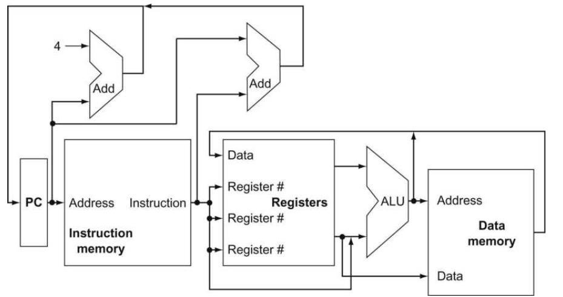
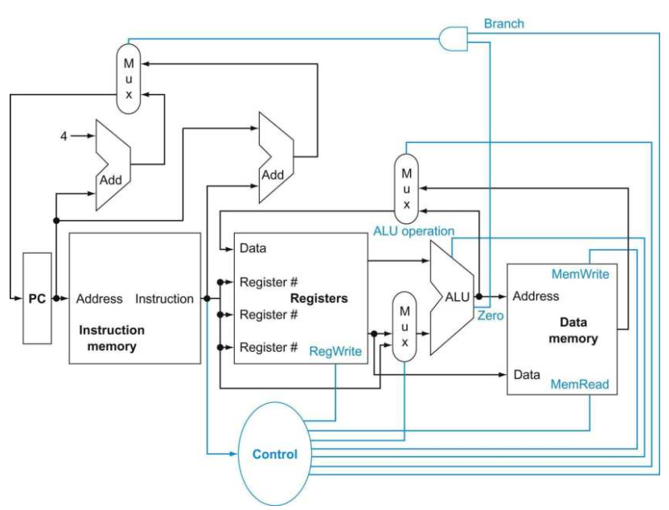

# An abstract view

首先，我想展示一个高层次上RISC-V实现的全貌，只专注于功能部件以及它们之间的连接。虽然下面这个图只展示了处理器中数据流的流动，但是它还是表现出了2个指令执行当中重要的方面：

图1 RISC-V实现的抽象概览图

所有的指令都必须先由PC中的指令地址决定，PC中的指令地址传递给指令存储器，读取指令后进行指令译码，并且根据指令中的寄存器号从寄存器组中取出相应寄存器的操作数。操作数可以被用作计算内存地址（存储器加载、存储指令，地址由指令中的11位立即数与寄存器中的基准地址相加得到）、可以被用作计算算术结果（整型算术逻辑运算）或者是做是否一致性的检查（分支指令）。对于分支指令来说，分支指令的目标地址是由指令中的立即数和PC中的基准地址相加（条件跳转系指令如BEQ、BNE等等），或者是由指令中的立即数和寄存器中的基准地址相加得到的（JALR）。

在上面的途中有两个比较重要的忽略点。第一个是，可以发现，在很多逻辑器件的输入来源上是有多种的，在这种情况下我们需要加入一个逻辑器件来从多个输入源中选择一个，这个逻辑器件就是多路选择器（multiplexor）。驱动多路选择器的选择信号来自于执行的指令当中。

第二个是逻辑器件也需要当前执行的指令驱动控制信号来控制器件的运行，如数据存储器读使能只发生在当前执行的指令的opcode是读指令时，而寄存器组的写使能也只发生在算术指令或者加载指令。

图2 RISC-V实现的抽象概览图，包括必须的多路选择器、控制单元和控制线

上图是在图1的基础上把必须的多路选择器、控制单元和控制线添加后所得到的。控制单元可以看作是把译码器作为输入，判断当前指令动作，以相应信号驱动来作为输出的逻辑器件（可以是微程序或者是硬布线版本的控制逻辑单元）。其中有两个多路选择器的控制信号由控制单元来提供，分别是ALU的第二个操作数来源的MUX以及写回寄存器组的结果来源的MUX。控制PC来源的MUX是由ALU的Zero（判断两个操作数是否相等或不相等）以及控制单元一起来判断。在对逻辑器件的控制当中，控制单元控制了包括ALU的算术操作、是否写寄存器以及数据存储器读或写等。
