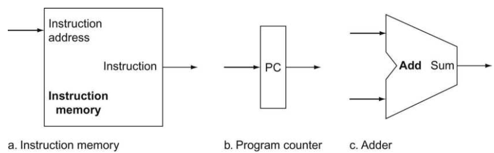
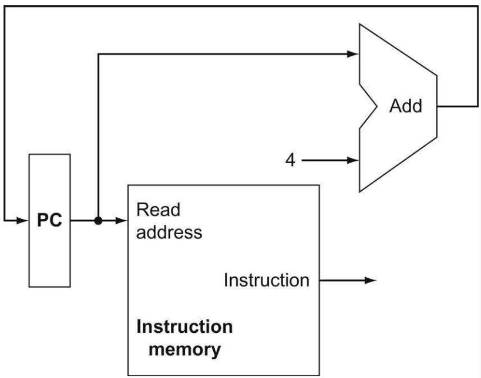
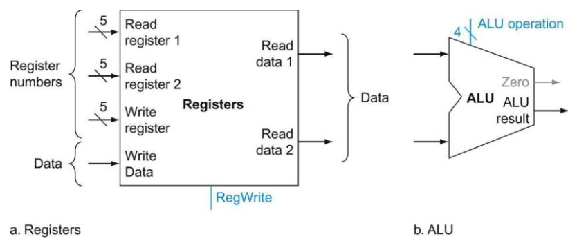
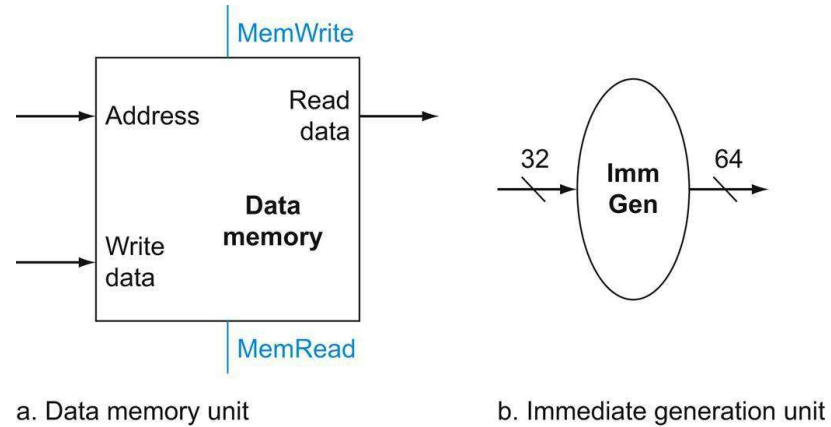
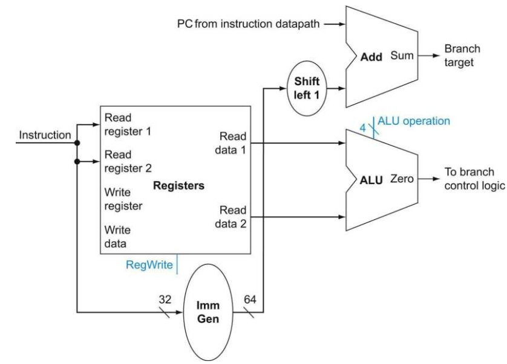
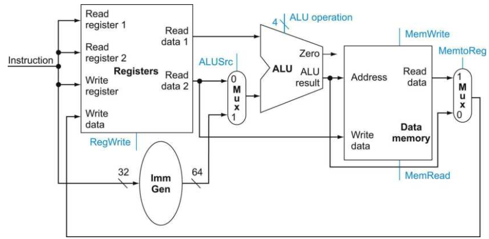
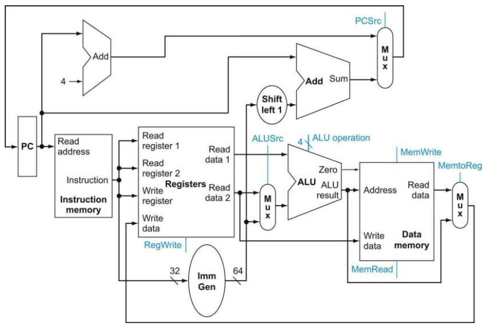

# Building a Datapath

在这一节当中，我们将会深入到了解每种指令所需要的数据通路元素（datapath elements），也就是一个用于操作或者保存数据的功能单位。在RISC-V的实现当中，数据通路的元素包括指令以及数据存储器、寄存器组、ALU以及加法器。

## PC

第一个需要的器件是一个存储当前所要执行指令的地址的存储元件，也就是程序计数器（Program Counter，PC），它保存有当前所要执行指令在指令存储器当中的地址。在前面抽象的概述当中，我们知道PC更新的方式有两种：一种是简单递增4来进行更新（RISC-V 32位版本指令长度为32位，且地址对齐）。另一种是从分支指令中计算得到的地址。这两种方式都需要一个加法器，它可以使用一个控制信号固定为ADD的ALU来实现。

如上图，存储以及获取指令需要两个状态元素：指令存储器以及PC，一个加法器用于结算下一条指令的地址。在RISC-V数据通路的实现当中，指令存储器是不需要写入的，因此我们可以把它看作是一个组合逻辑器件：它的输出只取决于输入的地址，并且不需要读取的控制信号。PC是一个64位（RV32I则是32位）的寄存器，它在每个时钟周期的结束时更新。加法器则是一个控制信号被固定为是加法的ALU，永远将它的两个64位的输入相加输出64位的结果。下面是将上图中的3个器件组合起来表现取指以及递增PC的数据通路图：

## 寄存器组

现在考虑R类型的指令，这些指令都读取两个源寄存器，进行ALU操作，然后将结果写入到一个目标寄存器当中。这种类型称为R类型指令或者算术-逻辑指令，包括ADD、SUB、AND以及OR。因此需要引入另一个状态元素：寄存器组。寄存器组是包含一组寄存器的器件，可以提供一个寄存器名字来进行读取或者写入。处理器中的通用寄存器都存储在寄存器组当中。

R类型的指令有3个寄存器操作数，因此我们需要从两个源寄存器中读取两个数据字，然后将计算得到的结果数据字写入到目标寄存器当中。考虑寄存器组所需要的控制信号：读取两个源寄存器，需要两个输入，标明两个源寄存器的寄存器号输入，Read register 1以及Read register 2。写入目标寄存器需要两个输入，标明目标寄存器的寄存器号输入以及要写入的数据：Write register以及Write Data。寄存器组的读取不需要信号，只要对应读取寄存器号有效，对应的输出端就会输出相应寄存器的数据字。但寄存器组的写入需要信号，RegWrite。只有当时钟上升沿到来并且RegWrite为真的时候才能写入寄存器组。

上图a就是上文描述的寄存器组模型，其中输入寄存器号的3个输入的位宽为5，因为通用寄存器一共有32个。需要注意的一点是，所有的输入信号：3个寄存器号输入和1个写入数据字都是在上升沿的时候才有效。同时，在这个实现当中允许同时读写同一个寄存器，这样读取的寄存器的值是上一个时钟沿的值，然后当前时钟沿写入新的值。图b是ALU的实现，ALU的控制信号是ALU所要执行的操作信号，为4位宽。ALU输入的值是两个64位（RV32I为32位）的操作数，输出的是一个64位（RV32I为32位）的计算结果，以及一个1位的信号，用于判断计算结果是否为0。

## 数据存储器以及立即数生成器

接下来，考虑加载和存储指令，如LW和SW，它们的指令格式是：

- LW x1, (offset)x2
- SW x1, (offset)x2

需要计算加载或者存储的内存地址（offset + x2）的值，因此需要ALU。同时还需要读取或者写入寄存器，因此还需要寄存器组。此外，我们还需要一个器件来将指令中的12位偏移量符号扩展（RISC-V中的有符号整数才用补码表示，符号扩展使用最高位符号位填充高位）到64位，以及一个用来读写的数据存储器。数据存储器需要两个控制信号：MemRead以及MemWrite，分别控制数据存储器的读取和写入。数据存储器有2个输入：读写地址Address以及写入数据Write data，以及1个输出：读取数据Read data。

数据存储器和寄存器组不同，它需要一个读的控制信号。和寄存器组不同的是，如果读取一个不合法的地址，那么会出现问题。立即数生成器接受一个32位的指令作为输入，然后从中提取加载、存储或者分支指令所需要的立即数偏移量，然后将其符号扩展到64位进行输出。数据存储器的读取和写入都发生在上升沿。

## 分支指令相关

考虑分支指令BEQ，它有3个操作数，2个是源寄存器中的数据，判断这两个寄存器中的数是否相等。如果相等则跳转到分支目标地址。分支目标地址是由指令中的立即数（第3个操作数）和当前PC相加得到的。在此之前，有两个关于分支指令的细节需要注意：

- 分支指令地址计算的基地址是当前分支指令的地址（当前PC）。
- 指令中的偏移量立即数在与PC相加前左移1位。因此我们需要在实现当中先把它左移1位（需要一个移位的器件）。

同时，我们也需要考虑下一条指令的来源：是顺序执行的下一条指令（PC+4）还是分支指令的目标地址中的指令，控制的信号来自于分支是否执行（The branch is taken or not）。

因此，分支的数据通路需要做两个操作：计算分支目标地址以及测试寄存器值（分支指令也会影响到指令的获取，在之后会解决这个问题）。下图是分支指令的数据通路。

为了计算分支目标地址，分支指令的数据通道包括立即数生成器以及加法器。使用ALU来进行比较操作，比较从寄存器组中读取的两个源寄存器数是否相等。在该ALU实现当中，因为该ALU有一个0输出来判断运算的结果是否为0，因此可以将ALU的操作控制信号设为执行减法，如果0输出为真，则两个寄存器数相等，否则不相等。

## 创建单一的数据通路

上文中我们已经讨论了所有3中类型指令的数据通路的设计问题，现在我们可以考虑把它们组合起来变成一条单一的数据通路，并且还可以将控制信号添加上去来完成我们的实现。这条最简单的数据通路会在一个比较长的时钟周期内完成所有的指令。因此，这条数据通路中的所有可用的资源都只能在一个指令中使用一次，如果一条指令需要使用多次的话只能通过重复来实现。尽管一些功能部件可能需要对不同的指令重复使用，实际上可以使用多路选择器以及控制信号来允许输入、输出信号的多个来源。

### 构建数据通路

#### 举例

算术逻辑（R指令）指令和内存指令的数据通路很相似。它们之间的关键不同点在于：

- 算术逻辑指令使用ALU时，输入的操作数来自于两个寄存器。而内存指令使用ALU时，第二个输入的操作数是12位的立即数。
- 算术逻辑指令写入到寄存器组中的值来自于ALU的输出，内存指令使用ALU时，写入寄存器组中的值来自于存储器。

因此，上面的两种情况都可以只是用一个ALU和一个寄存器组来解决，只需要增加若干个多路选择器和控制信号即可。

#### 解决

为了解决上述提到的问题，我们需要提供两个不同的输入给ALU的第二个操作数输入，以及两个不同的输入给寄存器的写数据输入。因此，需要引入两个多路选择器：

参照上述的例子，现在可以将上面所提到的所有数据通路合并为一条，，则构成了RISC-V指令集的数据通路简图。

上图所描述的简单数据通路可以执行基本的指令，包括加载存储指令、ALU操作以及分支，并且都能在一个时钟周期内完成。完成了数据通路之后，我们还需要添加控制单元以及提供具体的控制信号。控制单元需要接受若干输入并且生成所有逻辑部件的写有效信号，以及所有多路选择器的选择信号和ALU控制信号。
