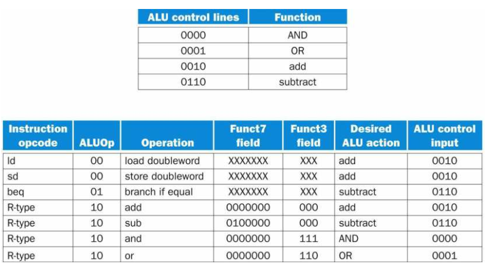
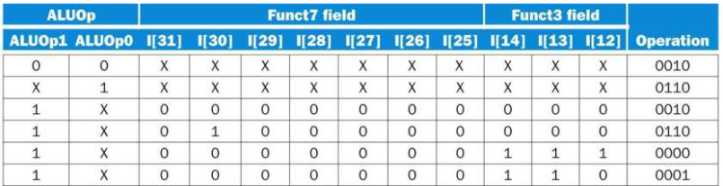
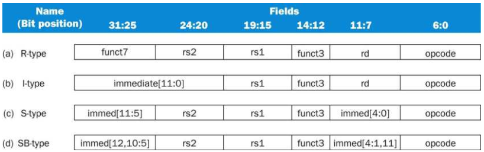
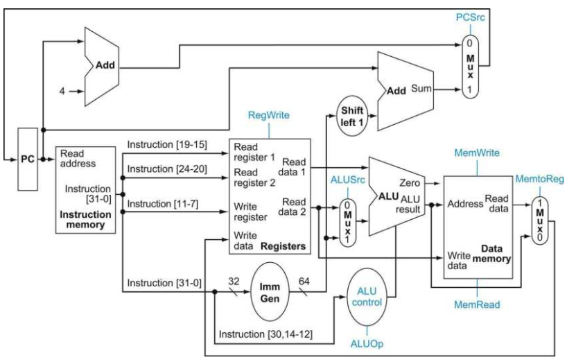
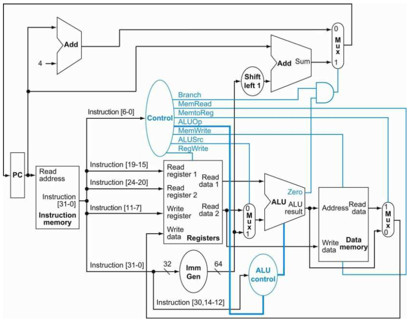
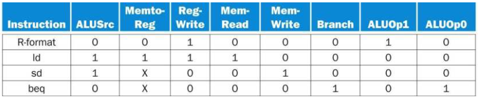
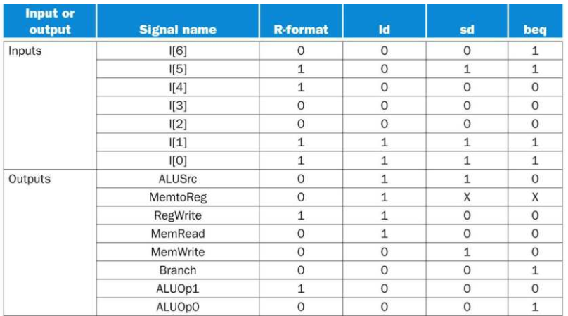

# A Simple Implementation Sceheme

在这一节当中，我们将会讨论如何创建一个简单的RISC-V架构的实现。我们使用上一节中构建的数据通路来进行实现，通过增加简单的控制功能。这个简单的实现包括LD（Load Double Word）、SD（Store a Double Word）、BEQ（相等则跳转）以及四个算术逻辑指令ADD、SBU、AND以及OR。

## ALU控制信号

在我们的RISC-V ALU实现当中，上述4个算术逻辑指令的控制信号编码如下：

<table>
    <tr>
        <th>0000</th>
        <th>AND</th>
    </tr>
    <tr>
        <th>0001</th>
        <th>OR</th>
    </tr>
    <tr>
        <th>0010</th>
        <th>add</th>
    </tr>
    <tr>
        <th>0110</th>
        <th>subtract</th>
    </tr>
</table>

每种指令对应所需要ALU所执行的操作都不尽相同：

1. 对于加载以及存储指令来说，ALU用于计算内存地址，因此控制ALU的控制信号使用加法。
2. 对于R类型指令来说，ALU用于指定的运算：AND、OR、add、subtract，这四个指令取决于7位的funct7块[31:25]以及3位的funct3块[14:12]。
3. 对于条件分支指令来说，ALU用于比较两个寄存器数，因此控制ALU的控制信号使用减法，判断两个寄存器数相减是否为0。

我们可以构造一个输出4位ALU控制信号的控制单元，该单元接受funct7和funct3的指令域输入以及2位的控制字（ALUOp）输入。ALUOp标明该操作是用于加载和存储指令的相加：00（ADD）、用于BEQ指令的相减:01还是用于算术逻辑指令使用的10，在这种情况下还需要结合funct7以及funct3域来进行判断。ALU控制单元的输出是4位的信号，直接连接到ALU的控制信号端。

下图展现了如何根据2位的ALUOp控制端、funct7以及funct3域来生成4位的ALUOp控制端输入。

实际上，ALUOp来自于主控制单元所生成的编码。也就是说，主控制逻辑生成ALUOp，然后ALU控制逻辑根据ALUOp来判断是内存指令、分支指令还是R类型指令。如果是R类型指令，则还需要参照funct7以及funct3域来进行判断。这种多级译码的方式是一种方式是常见的实现技术，可以显著的减少控制逻辑单元的大小，使用多个更小的控制单元还可以降低控制逻辑的延迟，这是很重要的一点，因为控制逻辑的延时在决定时钟周期长度时是一个相当重要的参数。

在设计ALU控制单元的逻辑过程中，可以使用真值表的方式来构造：

可以注意到，真值表中的一些不关心的表项被整合在了一起。比如，ALUOp不会使用11来进行编码，因此可以使用1X以及X1来代表10和01。考虑到在funct域当中不同的位只出现在第30、14 ～ 12位，因此在ALUOp为10的时候只需要将上述4位作为输入即可。

## 设计主控制逻辑单元

首先将在数据通路以及控制线中所需要的指令域进行标记。RISC-V基本指令集中所用到的有4中指令类型，分别对应算术逻辑指令、加载指令、存储指令以及条件分支指令：

1. R类型的算术指令（opcode=0110011）有3个寄存器操作数：rs1，rs2以及rd。rs1和rs2是源寄存器，rd是目标寄存器。ALU的操作在funct3（Inst.[14:12]）以及funct7（Inst.[31:25]）域当中进行定义。我们将会实现ADD、SUB、AND以及OR指令。
2. I类型的load指令（opcode=0000011）。rs1是基址寄存器，将rs1中的操作数和指令中的12位立即数相加得到所要加载的内存地址。rd是目标寄存器。
3. S类型的store指令（opcode=0100011）。rs1是基址寄存器，将rs1中的操作数和指令中的12位立即数相加得到所要存储的内存地址。rs2是要存储的数据所在的源寄存器。
4. SB类型的分支指令（opcode=1100011）。将rs1和rs2中的寄存器数相比较。12位的立即数地址将其进行符号扩展，左移一位后和PC中的地址相加得到分支目标地址。

对于这些指令的格式，我们有几个主要的着眼点：

- 操作码域。操作码位于指令的低7位，Inst.[6:0]。基于操作码，funct3以及funct7域可以作为扩展的操作码域。
- 第一个寄存器操作数位于Inst.[19:15]。
- 第二个寄存器操作数位于Inst.[24:20]。
- 第三个操作数还可以是12位的偏移量，用于分支以及加载、存储指令。
- 目标寄存器位于Inst.[11:7]。

利用这几个信息，可以在上一节中的数据通路中加入指令标签：

从图上可以发现，我们已经定义了6个单比特的控制信号以及一个2位的ALUOp控制信号。在上文中我们已经定义了ALUOp控制信号如何产生，现在可以来讨论如何定义这6个单比特的控制信号。

1. RegWrite：使能有效为真时，将Write data输入端的数据写入到指定的寄存器当中。
2. ALUSrc：为假时，ALU的第二个操作数来自于rs2。为真时，ALU的第二个操作数来自于立即数。
3. PCSrc：为假时，PC被顺序的下一个指令地址（PC+4）覆写。为真时，PC被计算得到的分支目标地址覆写。
4. MemRead：使能有效为真时，将指定地址的内存内容输出。
5. MemWrite：使能有效为真时，将输入的Write data写入到指定地址中。
6. MemtoReg：为假时，写入到寄存器组中的数据来自于ALU的结果。为真时，写入到寄存器组中的数据来自于数据存储器。

需要注意的是，对于所有的状态元素来说，都有一个显式的输入是时钟输入，并且这个时钟输入用于控制写操作。

控制单元可以基于指令中的opcode以及funct域来设定控制信号。PCSrc是例外，它为真的条件是当前指令是BEQ指令以及ALU的0输出为真。这8个控制信号（6个单比特的控制信号以及2位ALUOp）现在可以进行相应的设置了，它基于操作码（Inst.[6:0]）：

主控制单元的输入为7位的opcode，定义控制线的输出有3种：0,1以及X（don't care）。下面对4种类型指令设置控制信号：

## 完成主控制单元的编码

下图是主控制单元的真值表，输入的是7位的操作码，输出的是控制信号：

## 为何单指令周期的实现已经不再使用

尽管我们实现的单指令周期的设计能够正确的运行，但是它对于现代的处理器设计来说已经相当的落后了。因为在单指令周期的设计当中每个指令执行的时钟周期都必须是相等的，那么时钟周期的长度则由处理器中最长的数据通路来决定。在这种实现当中，虽然CPI为1，但是由于单个时钟周期的长度太长，因此这个实现并不效率。
