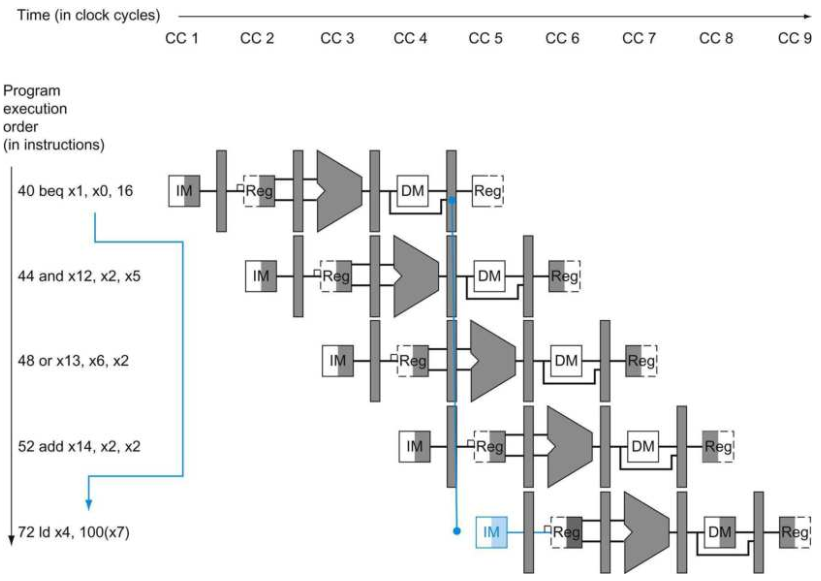
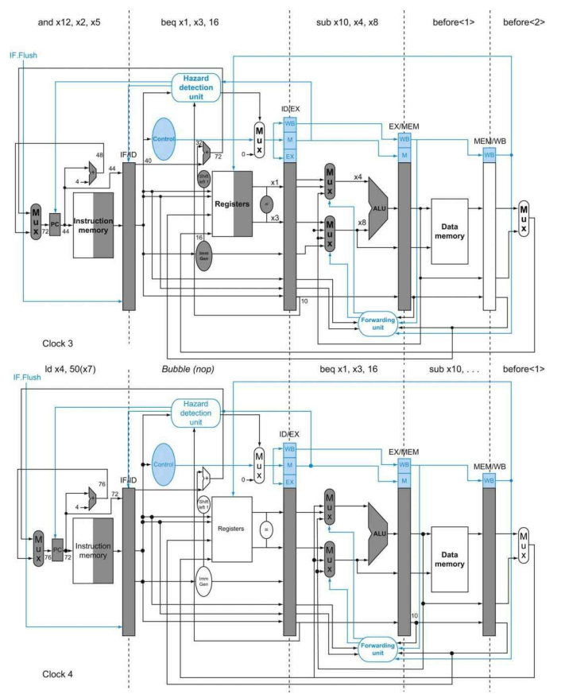
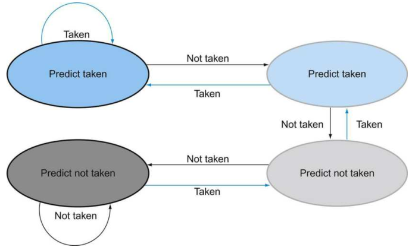
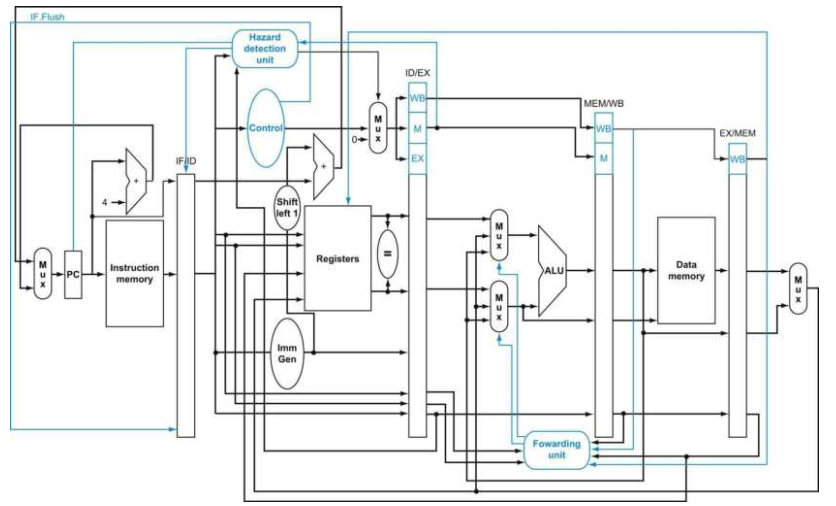

# Control Hazards

在这之前，我们将冒险可能发生的范围限制在算术操作和数据传送操作。然而，就如同我们在第V节所讨论过的一样，条件分支同样会导致流水线冒险，也就是控制冒险。下图展示了一些列的指令以及分支会在流水线的那个地方发生。指令必须要在每个时钟周期都进行取指来维持流水线的进行。在我们的设计当中，是否进行分支要进行到MEM阶段才能决定。



上图中，左侧的数字代表指令的地址。因为分支指令在MEM阶段才能确定是否进行分支，上图为第4个时钟周期。在此之前，指令依然会在每个时钟周期进行取指并继续执行下去。如果硬件上没有进行介入，那么在beq分支到ld指令前，这三条指令会继续进行下去。如果使用了第V节中的控制硬件，当读取到分支指令后都进行一次冒泡，那么可以避免控制冒险。

这一节对控制冒险的解决比上一节数据冒险的解决要稍微简单一点，因为控制冒险比较容易理解，并且比数据冒险出现的几率要低。因此，我们将会使用简单的策略来解决控制冒险的问题。我们会讨论两种解决控制冒险的策略，以及一种优化这些策略的方法。

### 假设分支永远不执行

如同我们在第V节中所提到的，将流水线停滞到分支结果计算出来的效率是非常低的。一种提升效率的方法是一直预测条件分支不会执行，并且继续执行顺序后的指令。如果条件分支指令执行了分支，那么之前进入流水线当中的指令会被丢弃，然后取分支目标地址的指令继续执行。如果条件分支有一半的情况不会执行分支，并且丢弃指令的开销很小，那么这个优化的方法减少了一般的控制冒险的开销。

为了丢弃指令，我们需要将原始的控制值设置为0，和我们在load-use数据冒险中给流水线进行停滞中的操作相似。区别是我们需要改变运行到3个阶段中的3条指令，分别为IF、ID以及EX。在load-use中使用的停滞手段，我们只在ID阶段将ID/EX寄存器中的3个控制域都设为0，并且让它们传播下去。为了丢弃处于这三个阶段的指令，我们需要将IF、ID以及EX阶段中的指令进行冲刷（flush）。

### 降低分支导致的延时

一种提高条件分支的性能的方法是，降低执行分支的开销。意思是说，我们假设分支导致下一个PC的值在条件分支指令的MEM阶段得到，但如果我们将条件分支的执行在流水线当中提前，那么更少的指令需要被冲刷掉。将分支决定往前推需要执行两个动作提前执行：计算分支目标地址以及衡量分支决策是否执行。提前分支目标地址的执行是比较容易的。我们在IF/ID寄存器中已经拥有PC的值以及立即数域，因此我们只需要将条件分支的加法器从EX阶段移动到ID阶段。当然，条件分支目标地址的计算会在所有指令上都执行，只是只在它们需要的时候再使用。

比较困难的部分是决定是否执行分支。如果是BEQ指令，我们需要判断两个在ID阶段读取的寄存器的值是否相等。实际上，可以使用一个XOR器件来对它们进行判断（对两个寄存器数进行位XOR操作，如果结果为0则相等），可以使用一个器件对它们的每个对应的位进行异或操作，然后对结果进行或操作即可。将分支测试移动到ID阶段则需要添加额外的旁路以及冒险检测单元，因为分支依赖于的结果还在流水线当中，并且必须在这个优化操作中正常工作。举例来说，为了实现BEQ，我们需要将结果旁路到ID阶段中的相等测试单元。这里有两个复杂的因素：

1. 在ID阶段，我们必须将指令进行译码，来决定是否需要给相等测试单元一个旁路，并且完成相等测试来决定是否进行指令分支，来将PC设定位分支目标地址。在ALU中对寄存器数进行测试可以使用之前的旁路单元来进行复用，但是在ID阶段使用了相等性测试单元之后，旁路的操作数可以来自EX/MEM或者MEM/WB流水线阶段间寄存器了。

2. 因为在ID阶段使用的分支比较数值有可能在之后的时间才会产生，因此有可能会产生一个数据冒险，一个流水线停滞可能是需要的。举例来说，如果一个ALU的指令之后紧跟一个分支指令，分支判断的其中一个寄存器来自于ALU指令所要写入的寄存器，那么就需要使流水线停止一个周期。此外，如果一个加载指令后面紧跟一个分支指令，并且分支判断的其中一个寄存器来自于load指令写入的寄存器，那么则需要使流水线停止两个周期。

虽然存在有这些困难之处，但是将分支指令的判断放在ID阶段确实是一个提升之处，因为它减少了分支预测错误的开销（抛弃的指令数减少）。

为了冲刷在IF阶段的指令，我们增加了一条控制线：IF.Flush，它将IF/ID寄存器中的指令域清零，将其从原先的指令转变为一条NOP指令。

#### 流水线分支

##### 举例

为了展示当分支发生时在下列的指令序列中发生了什么，假设流水线没有为分支指令做优化，然后我们将分支的决定移动到ID阶段：

```
36 sub x10, x4, x8
40 beq x1, x3, 16 // PC-relative branch to 40+16*2=72
44 and x12, x2, x5
48 or x13, x2, x6
52 add x14, x4, x2
56 sub x15, x6, x7
......
72 ld x4, 50(x7)
```

##### 解答

下图展示了当分支指令执行分支后的情况，不像之前，这里只需要一个流水线冒泡：



在第3个时钟周期处于ID阶段的beq指令，计算得到条件分支需要执行，因此需要将在IF阶段的AND指令清空，而只需要引入一个流水线冒泡。在第4个时钟周期，load指令就已经取指进入了IF阶段，而和beq相隔了一个阶段，在这个时钟周期，ID中的是一个NOP指令。

### 动态分支预测

假设条件分支总是不执行是一种简单的分支预测形式。在这种情况下，我们假设条件分支总是不执行，当预测错误时就冲刷流水线。在简单的5级流水线实现当中，分支预测一般也会和基于编译器的预测一起进行。在更深的流水线当中，分支错误所带来的惩罚要更严重。同样，在超标量流水线中，分支错误带来的惩罚同样严重（丢弃更多的指令）。因此在一个更复杂的流水线当中，简单的静态预测方法会导致很糟糕的性能。在第V节中我们已经提到了，越来越多的硬件架构尝试根据以往的分支历史来预测分支是否指执行。这种方法就叫做动态预测。

分支预测缓冲（branch prediction buffer）也称为分支历史表（branch history table），是一段位于低地址的小的存储空间，里面记录有分支指令以及其对应的一个或者多个比特位来指示该条件分支指令是否执行。将分支指令的数位低地址作为索引放在存储器的低地址中。

预测使用缓冲中最简单的形式，虽然我们不知道这个预测结果是不是正确的，因为有可能有别的分支指令的低地址相同而覆写了相同地址的历史结果。但是这并不影响准确率。我们只在乎预测是否正确，并且照着预测的方向取指。如果预测没有命中，那么不正确的指令会被丢弃掉，并且将分支执行的结果记录下来，然后载入正确的指令序列继续执行。

一位的动态预测形式可以使用饱和计数器来实现。这个简单的1位预测具有一个明显的性能缺陷：即使一个条件分支几乎都会进行分支，如果有一次没有进行分支，那么将会预测错误两次。

更理想化的动态分支预测的策略，是使用2位的饱和计数器：



2位的饱和计数器是现代分支预测策略的基础，如两级自适应的分支预测策略。

一个分支预测缓冲可以实现为一个小的特别的缓冲空间，在IF阶段中使用指令地址进行读取（低地址）。如果分支预测显示要进行分支，那么分支将会尽早在分支目标已知后进行。最早可以在ID阶段就已知。如果预测错误则冲刷流水线，重新取回正确的顺序执行指令，并且改变分支预测缓冲中的预测位。

即使是有分支预测器的情况下，分支预测的地址还是需要计算得到，在5级的流水线实现当中，也是需要1个时钟周期来进行计算的。其中有一种解决方法是使用一个缓存来保存目标PC或者目标指令地址，这个缓存叫做分支目标缓存。

2位的动态预测策略只使用了特定的分支的信息。如果使用特定分支以及全局分支的情况来进行预测会得到更好的准确性。这种方法叫做关联性预测。一个典型的关联性预测器可能会分配两个2位的饱和计数器给每种分支。通过特定分支以及全局分支的分支历史情况综合考虑决定是否进行分支。

另外一种方法是使用竞争分支。一个竞争分支预测器使用多种分支预测器，对于每个分支，预测器从中选出最优的一个。一个典型的竞争预测分支器可能对每个分支包含两个预测：一个基于本地的信息，另一个基于全局的信息。一个选择器会从中选择哪个预测器作为预测结果。这个选择器也可以用2位饱和计数器来进行实现，来决定哪个预测器更加准确。一些最近的微处理器就使用了上述的预测策略。

一种减少条件分支的方法是增加条件移动的指令。不使用条件分支来改变PC的值，而是条件性改变移动的目标寄存器。举例来说，ARMv8指令集架构有一个条件选择指令为CSEL x8, x11, x4, NE。如果条件码寄存器NE中非零（上一条运算的结果非零）则将x11的值复制进x8，否则将x4的值复制进x8。

最后，给出完整的流水线实现的数据通路图，包括控制逻辑：


