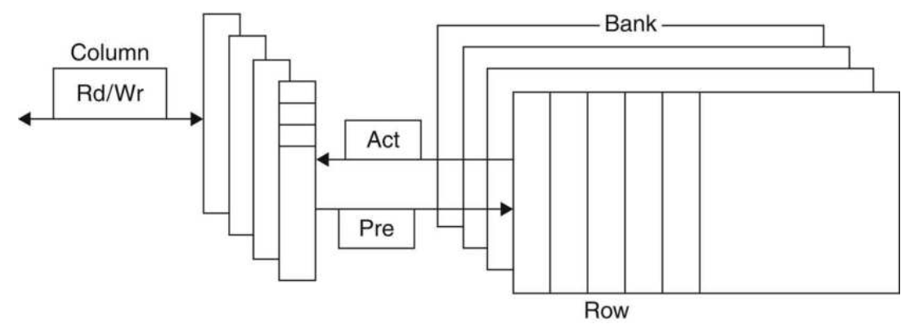
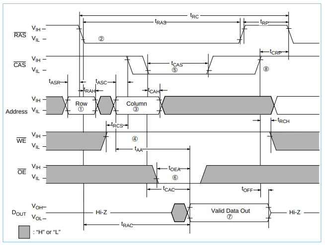

# Memory Technologies

现在有4种主要的技术用在存储器分级系统当中。内存使用的是DRAM（dynamic random access memory，动态随机存取存储器），缓存使用的是SRAM（static random access memory，静态随机存取存储器）。DRAM每一个比特位的价格要比SRAM便宜，但是它的速度要比SRAM慢。价格上的区别来源于DRAM每一位所使用的空间比SRAM要小，因此DRAM与SRAM在同样面积的硅片上能够放置更多的位单元。而速度上的差异则来源于两者使用位的基本单元的不同。DRAM使用的是电容，而SRAM使用的是CMOS，电容需要不断的刷新，造成了DRAM速度的下降。第3种技术是闪存，主要用在USB存储器以及固态硬盘当中。第4种技术则是磁介质存储器，如磁盘和磁带，一般作为最低层次的存储器。

<table>
    <tr>
        <th>存储器技术</th>
        <th>典型的访存时间</th>
        <th>每GiB价格（2012）</th>
    </tr>
    <tr>
        <th>SRAM半导体存储</th>
        <th>0.5~2.5ns</th>
        <th>$500~$1000</th>
    </tr>
    <tr>
        <th>DRAM半导体存储</th>
        <th>50~70ns</th>
        <th>$10~$20</th>
    </tr>
    <tr>
        <th>闪存半导体存储</th>
        <th>5~50us</th>
        <th>$0.75~$1</th>
    </tr>
    <tr>
        <th>磁介质存储</th>
        <th>5~20ms</th>
        <th>$0.05~$0.1</th>
    </tr>
</table>

## SRAM半导体存储技术

SRAM，静态随机存取存储器。所谓的“静态”，是指这种存储器只要保持通电，里面存储的数据就可以保持。但是当电力供应停止时，SRAM存储的数据还是会消失。

包含6个晶体管的CMOS SRAM基本单元：

SRAM由两个反相器相互连接锁存（第一个反相器的输出连接第二个反相器的输入，第二个反相器的输出连接第一个反相器的输入），使得基本单元能够稳定储存1个位元的状态。可以注意到SRAM的基本单元具有两条相反的位线，这虽然是非必须的，但是在噪声容限方面有很大的改进，相比DRAM可以显著提高带宽。

相较与DRAM，SRAM不需要进行刷新操作，因此它的存取时间非常接近于时钟周期。

在计算机发展的早期，大多数的PC和服务器使用分离的SRAM芯片作为各个层次的cache。现在所有的cache都已经集成到了处理器的芯片当中（L4级除外），因此现在市场上独立的SRAM芯片已经很难找到了。

## DRAM半导体存储技术

DRAM，动态随机存取存速器。所谓的“动态”，是指这种存储器由于需要不断的充电刷新，才能保持存储数据的稳定不易失。当电力供应停止时，DRAM存储的数据也会消失。

在SRAM当中，只要电源持续供应，那么SRAM中的数据可以稳定保持。DRAM由于其作用原理是利用电容内存储的电荷多寡来代表1个二进制比特是1还是0，而在现实中晶体管会有漏电电流的现象，导致DRAM需要周期性的充电。当然，DRAM的优势在于结构的简单，只需要1个电容与1个晶体管就可以表示1个位的数据，相比之下SRAM需要至少6个晶体管，因此DRAM具有很高的密度，相反的，DRAM也有访问速度较慢，耗电量大的缺点。

DRAM一般会以矩阵的形式来进行组织，读取DRAM需要两个地址：行地址和列地址（DRAM的容量很大）。

刷新DRAM的方式是，仅仅只需要读取存储在电容中的信息然后再写回。一次充电可以保持信息长达数毫秒。为了解决充电以及存取DRAM的问题，DRAM使用的是两级的译码结构，因此允许一次刷新可以刷新一整行。

下图展示了DRAM的内部组成结构：

一般DRAM由数个块组成，一个Byte的8个位可以分部在各个块的同一个位置，则给出行地址、列地址片选出一个Byte，甚至于，块的数量可以更多。DRAM还含有一个缓冲区，这个缓冲区的工作方式与SRAM相似。片选的行地址可以将该行读取到缓冲区中，然后再根据列地址进行片选。

早期的DRAM使用的是异步存取的技术，现代的DRAM使用的是同步存取的技术，通过在DRAM中增加时钟。同步存取的DRAM称为SDRAM（同步动态随机存取存储器），通过增加内存自己的时钟，不需要处理器与内存之间进行同步操作。SDRAM的速度优势体现在，可以集中传送数据而不需要制定额外的地址位数。而现今广泛使用的SDRAM是DDR SDRAM（双倍数据率同步动态随机存取存储器），通过在时钟的上升沿和下降沿都传输数据，使得数据的传输速率翻倍。最新的DDR SDRAM技术版本是DDR4，一块DDR4-3200 DRAM可以在每秒完成3.2x10^9次数据传输，意味着其拥有1600MHz的内存时钟。

为了达到上述庞大的带宽要求，DRAM内部需要更加精细的组织结构。上述DRAM可以同时从多个块当中读取和写入，并且每个块都有自己的缓冲区。

在一些服务器当中，使用的是DIMM（dual inline memory modules），这种片上拥有4~16块DRAM芯片。一块含有8个DDR4-3200的DIMM芯片可以在每秒传输25600MB。

DRAM的控制信号有RAS，CAS，WE以及OE：

- RAS：Row Address Select，行地址片选信号。同时也是启动内存周期的信号。
- CAS：Coloum Address Select，列地址片选信号。同时也是启动内存读或者写的信号。
- WE：Write Enable，写有效信号。
- OE：Output Enable，输出有效信号。

一个典型的内存读取时序：

DRAM基本的刷新方法有两种：集中式刷新和分布式刷新。集中式刷新是在一段周期内将DRAM中所有的行都刷新，这种方式会造成巨大的内存存取延迟，因此现代计算机已经基本不会使用，而是使用分布式刷新。分布式刷新是指在一段规定的时间内，将对DRAM所有行的刷新时间均匀分布。现代计算机内存常用的刷新方式是CBR（Using CAS before RAS Reflash），指使用片内的计数器来决定所要刷新的行，而不是外部的计数器来决定。通过使CAS先于RAS有效，可以使得内存忽略外部地址而是使用内部计时器地址（刷新实际上就是读取一行的过程）。这样的好处是可以节省片外的地址总线带宽。

## 闪存

闪存实际上就是指EEPROM（电可擦除可编程只读存储器），其只需要特定的电压，就可以抹除芯片上的信息，写入新的数据。大多数的闪存存储器都有一个控制器将写入的块进行重定位，防止一些块被重复写入影响其寿命，这种技术称为wear leveling，虽然这种技术会降低闪存的性能。

## 磁介质存储器（硬盘）

硬盘是极大容量的存储器，但是其存取的速度也是极慢的。磁盘由盘片、磁头、电动机、主控芯片及排线等部件组成。其中盘片组有如下的结构：磁道、柱面以及扇区。

硬盘存取时间主要取决于一下的参数：平均寻道时间、平均旋转时间以及内部传输速度。
