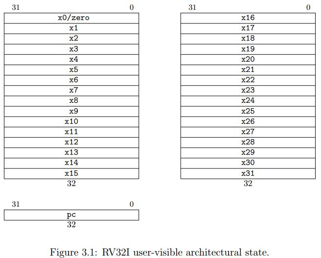
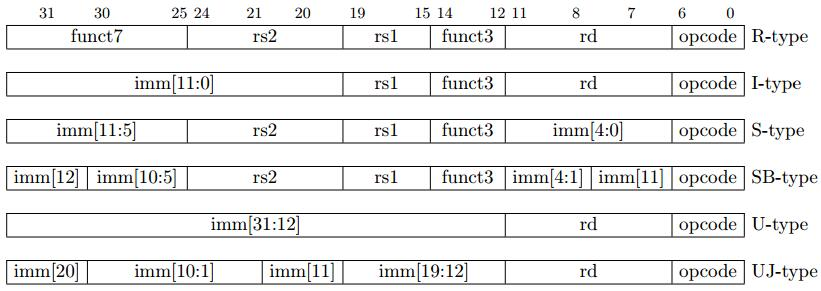
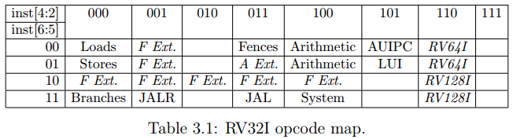
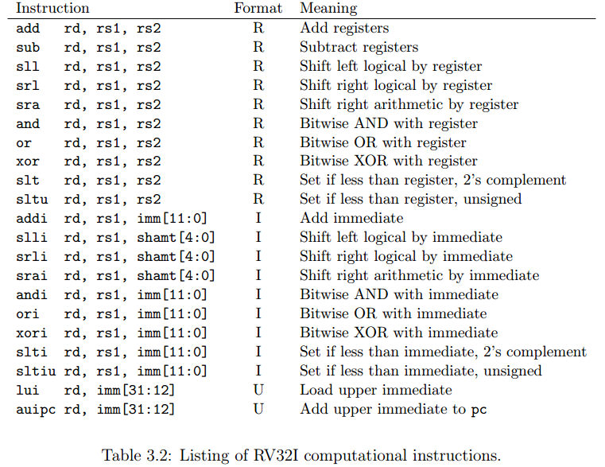
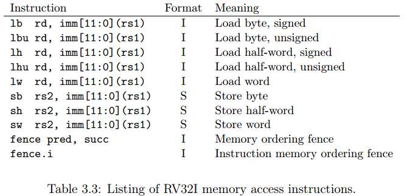
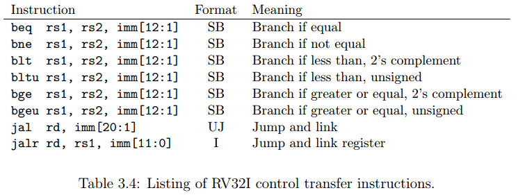
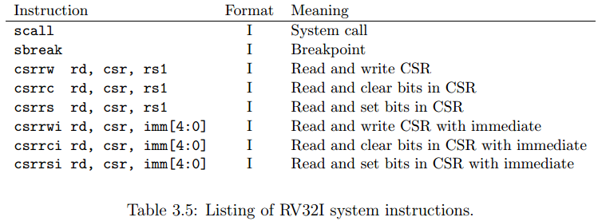
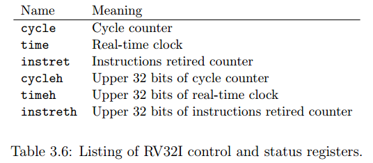

# RISC-V基本指令集概述

RISC-V的主要技术特性：

- 将ISA分离为一个小的基本ISA以及可选的扩展。
- 支持32位和64位地址空间。
- 使ISA扩展更为容易，包括紧密耦合以及松弛耦合的协处理器。
- 支持可变长的指令扩展。
- 提供有效率的现代标准的硬件支持，包括IEEE-754 2008浮点数标准以及C11和C++11语言标准。
- 用户ISA以及特权架构相互分离。

RISC-V包括三种基本的ISA：RV32I，RV32E以及RV64I。RV64I是64位地址空间标准的ISA，RV32I是32位地址空间标准的ISA，RV32E是RV32I的变种，寄存器的数量更少，面向一些深度定制的简单嵌入式系统。

## RV32I基本ISA

RV32I是基本的32位整数ISA，只有47种指令。RV32I足以提供给现代操作系统足够的基本支持以及作为编译器的编译目标。指令集中有8个指令用于系统指令，可以被实现为单一的陷阱指令。剩下的指令可以分为三种：运算指令、控制指令以及内存交互指令。

RISC-V基于加载-存储结构，算术指令只能在寄存器上操作，内存中的数据只能读取和加载。

RV32I有31个通用整型寄存器，命名为x1 ~ x31，每个的位宽为32位。x0被命名为常数0，它也可以被作为目标寄存器来舍弃指令执行的结果。PC是寄存器x32。整个寄存器的组织如下：

RV32I的指令长度为32位，并且需要在内存中对齐存储，并且是小端存储。一共有6种指令格式：R、I、S、U以及变种SB、UJ，如下所示：

可以发现SB、UJ与S、U格式的不同在与立即数编码方式的不同。

在这些指令格式当中，源寄存器最多可以有2个，命名为rs1以及rs2，目标寄存器最多有1个，命名为rd。一个重要的特性在于，这些寄存器标志的在指令中得位置都是一致的，这使得取寄存器的操作可以在指令译码的时候并行执行，从而优化了很多实现中的关键路径。

在立即数的实现当中也为了节省译码所需要的硬件电路复杂度而精心排布过。
比如，立即数的第0位只有可能来自于指令的第7位（S类型）、第20位（I类型）或者常数0。立即数5只有可能来自于指令的第25位或者常数0，如此推断。

下面展示了RV32I的主要操作码表，可以发现RV32I的主要操作码的位数为5，而主操作码的长度为7位，但是在基础的ISA当中，最低两位被设置恒为11，保留这两位来作为ISA的扩展：

### 运算指令

RV32I包含有21条运算相关的指令，包括算术运算、逻辑运算以及比较运算。这些指令在整型寄存器上进行操作，一些指令需要立即数操作数。运算指令在有符号和无符号整数上都进行操作。有符号整数使用补码表示法来表示。所有的立即数操作数都是符号扩展的，即使是在立即数表示为无符号数的上下文当中。这个特性可以降低ISA的描述复杂度，在某些情况下也确实获得了更好的性能。

算术指令：

1. ADD  - [rd] <- [rs1] + [rs2]
2. SUB  - [rd] <- [rs1] - [rs2]
3. SLL  - [rd] <- [rs1] L<< ([rs2] & 0x1F)
4. SRL  - [rd] <- [rs1] L>> ([rs2] & 0x1F)
5. SRA  - [rd] <- [rs1] R>> ([rs2] & 0x1F)
6. ADDI - [rd] <- [rs1] + imm[11:0]
7. SLLI - [rd] <- [rs1] L<< shamt[4:0]
8. SRLI - [rd] <- [rs1] L>> shamt[4:0]
9. SRAL - [rd] <- [rs1] R>> shamt[4:0]

算术指令中的立即数都是有符号的。

逻辑指令：

1. AND  - [rd] <- [rs1] & [rs2]
2. OR   - [rd] <- [rs1] | [rs2]
3. XOR  - [rd] <- [rs1] ^ [rs2]
4. ANDI - [rd] <- [rs1] & imm[11:0]
5. ORI  - [rd] <- [rs1] | imm[11:0]
6. XORI - [rd] <- [rs1] ^ imm[11:0]

注意到，上面的逻辑指令中没有NOT指令，实际上，在RISC-V当中，实现NOT指令的方法是使用XORI将立即数设为-1，即可。这里就注意到了使用符号扩展的立即数（或者说将立即数都看作是补码表示的有符号数）的好处。在MIPS指令集当中，由于使用的是零扩展，因此需要额外增加一个指令NOR来实现这一功能。

比较指令：

1. SLT   - [rd] <- ([rs2] > [rs1]? 1 : 0), [rs1] and [rs2] are signed
2. SLTU  - [rd] <- ([rs2] > [rs1]? 1 : 0), [rs1] and [rs2] are unsigned
3. SLTI  - [rd] <- (imm[11:0] > [rs1]? 1: 0), [rs1] and imm[11:0] are signed
4. SLTIU - [rd] <- (imm[11:0] > [rs1]? 1: 0), [rs1] and imm[11:0] are unsigned

上述指令有两个常用的习惯：使用SLTIU指令与立即数1来判断rs1是否等于0；使用SLTU，rs1设为x0来判断rs2是否不等于0。

最后，运算指令当中有两个比较特殊的指令，这两个指令使用的都是U类型的指令格式。

1. LUI   - load upper immediate - 将寄存器rd的高20位设为指令中的20位立即数，而寄存器的低12位设为0。这个指令通常会和ADDI指令放在一起使用，用来将任意的32位常数拷贝到寄存器当中。它也可以和load以及store指令一起使用来加载或者存储32位静态地址的存储空间。
2. AUIPC - add upper immediate to PC - 将立即数中的高20位（也就是指令中的20位）加进PC当中，然后将结果写到寄存器rd中。AUIPC是RISC-V基址寻址机制的基础，以PC作为基址寄存器来进行寻址。

### 内存交互指令

RV32I提供5种从内存中读取一个整数到一个整型寄存器的指令，以及3种存储数据到内存当中的指令。所有的这些指令都使用字节地址的方式来定位内存中存储单元。指令中组成存储地址的方式是，将立即数地址的值（12位）与寄存器rs1中的值（32位）相加，实际上，很多时候寄存器rs1中的值的低12位都是0，因此实际上是两个地址的拼接而成为了一个32位的地址。

未对齐的加载和存储指令是显式支持的，但是不能保证它们能够自动执行或者高效地执行。

加载的指令全部使用I类型的指令格式。LW、LH、LB分别代表将32位字、16位半字、8位字节的数据拷贝到指定的寄存器当中：

1. LW - [rd] <- Mem(imm[11:0] + rs1)
2. LH - [rd] <- Mem(imm[11:0] + rs1) & 0xFFFF
3. LB - [rd] <- Mem(imm[11:0] + rs1) & 0xFF

LH、LB会将rd的高位部分以符号位进行补全。而LHU、LBU这是用0来补全。

存储的指令全部使用S类型的指令格式。SW、SH、SB分别代表将32位字、16位半字、8位自己的数据存储到指定的内存单元中去：

1. SW - Mem(imm[11:0] + rs1) <- [rs2]
2. SH - Mem(imm[11:0] + rs1) <- [rs2] & 0xFFFF
3. SB - Mem(imm[11:0] + rs1) <- [rs2] & 0xFF

#### 内存交互顺序

RISC-V对于自身所要执行的对内存的加载和存储是可感知的，但是在多线程的环境当中，不能保证一个线程能够感知其他线程的内存交互操作。这种设计也称为松弛的内存模型。

在RV32I中，施加强制的内存访问顺序是显式提供的。RV32I提供FENCE指令来保证在FENCE指令之前和之后执行的内存访问指令是有序的。FENCE指令的格式如下：

FENCE pred, succ

pred和succ指的是在FENCE指令之前和之后的内存交互类型，包括R：内存加载、W：内存存储、I：设备输入、O：设备输出。举例：

FENCE rw, w

上述指令表示，所有在FENCE指令之前的加载和存储指令一定在所有在FENCE指令之后的存储指令之前执行完毕。

RV32I同样还提供一个指令来同步指令流与内存访问：FENCE.I。使用该指令可以保证对指令内存的存储必定比FENCE.I之后的对指令内存取指令的操作先完成。

### 程序流控制指令

RV32I一共提供有6种指令来有条件的控制程序流。这些分支指令都是使用SB类型的指令格式，能够提供两个寄存器之间算术的比较且可以在1KB的地址范围内实现跳转。新地址由指令中符号扩展的12位立即数与当前的pc相加得到。

1. BEQ  - jump to Addr(imm[12:1] + pc) if (rs1 == rs2)
2. BNE  - jump to Addr(imm[12:1] + pc) if (rs1 != rs2)
3. BLT  - jump to Addr(imm[12:1] + pc) if (rs1 < rs2)
4. BLTU - jump to Addr(imm[12:1] + pc) if (rs1 < rs2) rs1 and rs2 are unsigned
5. BGT  - jump to Addr(imm[12:1] + pc) if (rs1 >= rs2)
6. BGTU - jump to Addr(imm[12:1] + pc) if (rs1 >= rs2) rs1 and rs2 are unsigned

在RISC-V中，可以发现与其它RISC架构不同的地方是，很多其他的RISC架构在分支指令之后使用了分支延迟间隙。在Alpha和SPARC架构当中，为了使分支的结果尽可能早的计算得出，只允许使用简单的分支指令。在RISC-V的实现当中，将比较整合在了分支指令当中，这对于流水线的实现来说会造成分支的结果在流水线比较后的阶段才能计算出来。不过现代的处理器一般都有分支预测以及分支目标预测的功能，因此在这方面的平衡上，分支预测失败所造成的延迟开销与指令集合大小相比要小很多。

同样。RISC-V中也没有使用条件移动以及断言（predication）等技术。

RISC-V还提供了两种无条件跳转的控制语句：UJ型指令格式的JAL，jump-and-link指令，这个指令将pc设置为256KB地址空间范围中的任一地址，同时将原地址中的下一条指令地址（pc+4）写入寄存器rd中。因此这条指令可以用在函数返回当中。如果不需要rd，则可以使用x0作为rd来抛弃结果，这样的后果是指令变为了单纯的跳转指令JMP。

最后还有一个I类型指令格式的JALR指令，它提供了一个间接跳转的方式，跳转的目标为指令中的立即数作为低12位与rs1相加。这个指令被设计成与AUIPC一起使用来实现基于PC的基址寻址，地址范围为整个32位地址空间。

### 系统指令

RV32I中有8条系统指令。在简单的实现当中，可能会选择不实现（不使用）这些指令，并且在自身的系统软件中实现它们的功能，但是高性能的实现需要将它们在硬件中实现。

SCALL指令用于调用操作系统来实现系统调用。SBREAK指令用于调用调试器。

余下的6条指令用于提供对CSR寄存器组的读写。CSRs即control and status registers（控制状态寄存器组），提供一系列通用的工具给系统控制以及I/O使用:

1. CSRRW  - 从CSRs中拷贝其中一个CSR寄存器到一个通用寄存器当中，然后将rs1中的值覆盖给指定的CSR寄存器。
2. CSRRC  - 从CSRs中拷贝其中一个CSR寄存器到一个通用寄存器当中，然后根据rs1的位模式对指定的CSR寄存器进行清零（如果rs1的某一位为1，则CSR寄存器中该位置为0。如果rs1的某一位为0，则CSR寄存器中该位不变）。
3. CSRRS  - 从CSRs中拷贝其中一个CSR寄存器到一个通用寄存器当中，然后根据rs1的位模式对指定的CSR寄存器进行置位（如果rs1的某一位为1，则CSR寄存器中该位置为1。如果rs1的某一位为0，则CSR寄存器中该位不变）。

需要注意的是，在上述的CSR寄存器中，将数据拷贝到通用寄存器的过程中需要对数据进行零扩展。

CSRRWI、CSRRCI、CSRRSI的功能与CSRRW、CSRRC、CSRRS一致，只是将rs1替换成了5位的零扩展的立即数。

如果使用CSRRS指令，并且将rs1设为x0，那么功能相当于仅仅将CSR中的内容读取出来而不会改变rs1中的内容。如果使用CSRRW指令，并且将rd设置为x0，那么功能相当于写CSR。

在大多数的系统当中，CSRs只有在特权模式下才能访问，但RV32I提供了一些用户层次使用的基本CSR寄存器，这些CSR寄存器都是只读的并且只能够通过CSRR类指令来使用，这些CSR寄存器如下所示：

1. cycle：用于记录从任意参照的时间流逝的时钟周期数。
2. time：用于记录流逝的系统时间。
3. instret：实时时钟。

从理想情况下来说，cycle、instret以及time这三个寄存器应该要有64位的位宽大小，因为32位的位宽会导致这三个寄存器迅速溢出。为了在32位的ISA中实现这一点，在CSRs中提供了三个高位寄存器cycleh，instreth以及timeh，这三个寄存器用于保存其对应的低位寄存器的高32位数据。在读取这64位数据的时候需要使用两个通用寄存器如x3:x2。
