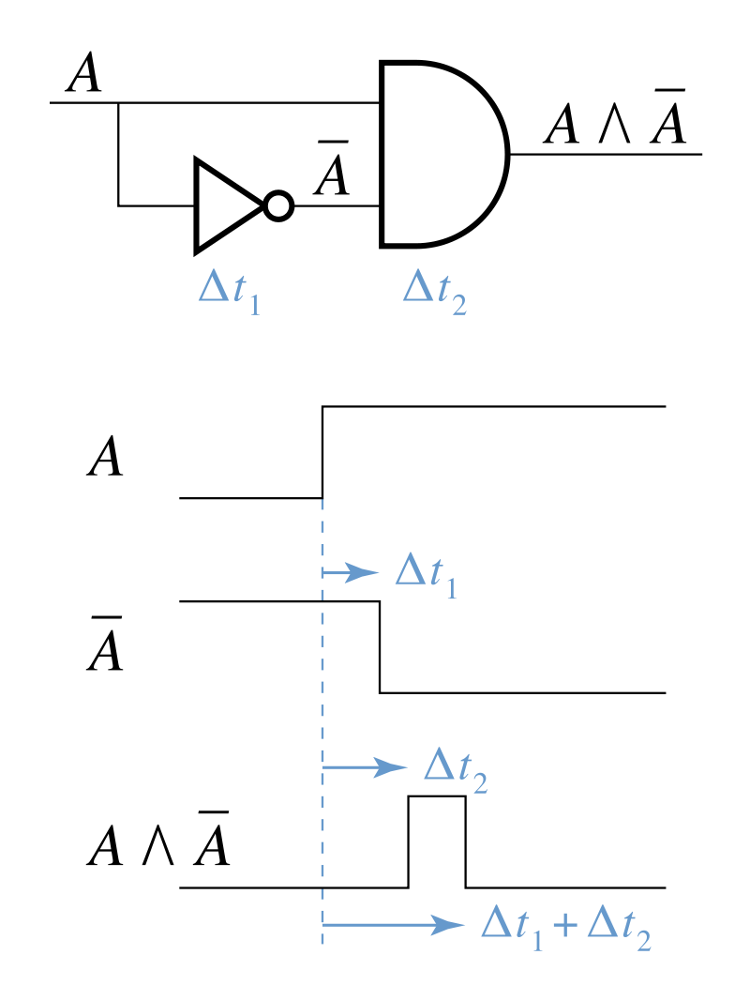

# Race condition

竞争条件（Race condition）又称为竞争冒险（Race hazard），是电路、软件或者其他系统中出现的输出依赖于一系列无法控制的事件。在1954年，竞争条件这个名词已经被提到了，例如在赫夫曼（David A. Huffman，赫夫曼编码树的发明者）的博士论文“The sunthesis of sequential switching circuits”中就使用了这个称呼。

竞争条件会出现在逻辑电路、多线程以及分布式的软件程序中。

下图是一个逻辑电路中的竞争条件。与门的输入A以及非A来自于同一条线路，当A从低电平变为高电平的时候，由于非门存在一定的延迟，因此~A的输入从高电平变为低电平的时间会存在延迟（$\Delta t_1$），与门输出同样存在一定的延迟（$\Delta t_2$），与门的输出因此会出现一小段时间的高电平冒险（时间长度为$\Delta t_1$）。

典型的竞争条件出现在：如果一个逻辑门组成的组合逻辑电路当中，从同一个源当中出发不同的信号（如上图，与门的输入A和~A来自同一个源）。

竞争冒险可以通过卡诺图来进行消除，如果两个相邻的逻辑1出现了则可能造成竞争冒险，此时可以通过增加冗余项来消除：

F = ~AB~C + AB~C，若B~C = 1，则存在竞争冒险，通过增加冗余项来消除：

F = ~AB~C + AB~C + B~C
