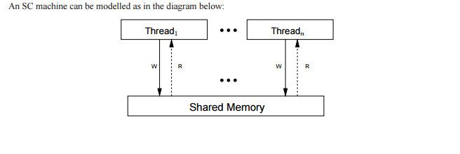
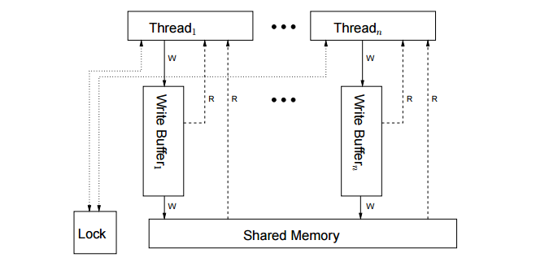

# Relaxed memory model

内存模型在考虑指令执行的顺序当中非常重要，下面列举几种常用的内存模型及其对应的架构：

## Sequentially consistent(SC)

顺序一致的模型，特点：

- 所有线程对共享内存的写都是对所有线程可见的。
- 指令执行的顺序按照程序给定精确执行。

## Total store ordering (x86 and SPARC)

- 每个线程都有一个写共享内存的缓冲区，缓冲区是一个队列，FIFO。线程要写共享内存首先要写缓冲区。如果一个读取的目标恰好在缓冲区中等待则直接从缓冲区中读，否则从内存中读取。
- 处在写缓冲区中的写只能对自身线程可见。
- 当写缓冲区中的更改写入共享内存时，则对所有线程可见。

## ARM和POWER使用的内存模型

一个线程的写可以以任何顺序传播到其他线程，同时写执行的顺序也可以是乱序的，除非使用屏障或者coherence（凝聚？）。
