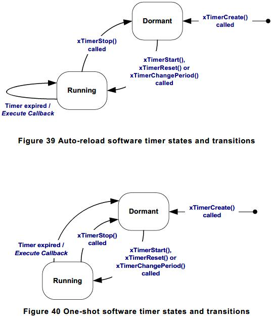

# 软件定时器管理

软件定时器是用于某些函数需要定时执行或者周期性执行的情况当中。软件定时器的运行和维护由FreeRTOS内核负责，它不需要硬件的支持，也不依赖于硬件的定时器或者计数器。

在FreeRTOS中使用软件定时器，需要配置下列两点：

- 需要包含文件timers.h
- 将配置文件中的configUSE_TIMERS设为1

## 软件定时器回调函数

定时器的回调函数是指在软件定时器触发溢出中断后执行的函数，是用户自定义的。函数的原型如下：

```C++
void ATimerCallback(TimerHandle_t xTimer);
```

其中函数的名字是自定义的，但是函数返回值必须为空，参数只能有一个TimerHandle_t类型的参数。

## 软件定时器的属性和状态

### 软件定时器周期

软件定时器的周期是指软件定时器启动到软件定时器回调函数开始执行的时间。

### 单次与自重启定时器

- 单次定时器：启动后，到执行完回调函数，定时器不会自动重启。需要用户手动重启。
- 自重启定时器：当执行完回调函数后定时器会自动重启，周期性的执行回调函数。

### 软件定时器状态

- 休眠态：定时器可以通过指针引用，但是不在运行当中，所以它的回调函数不会执行。
- 运行态：定时器会执行并且在定时器溢出后执行回调函数。



## 软件定时器的上下文

### RTOS定时器后台任务（RTOS Daemon Task）

所有软件定时器的回调函数都在RTOS的定时器后台任务的上下文中执行。这个任务的优先级以及堆栈深度可以在配置文件中设置configTIMER_TASK_PRIORITY以及configTIMER_TASK_STACK_DEPTH来实现。

需要注意的是，在回调函数中不能使用任何令任务进入阻塞态的API。

### 定时器指令队列

与定时器有关的API通过往定时器的指令队列中写入命令，RTOS后台任务接收相应命令执行。

### 后台任务的调度

后台任务的调度与其他的FreeRTOS任务一致。可以通过在配置文件中设置其优先级：configTIMER_TASK_PRIORITY。

## 创建以及启动软件定时器

### xTimerCreate()

软件定时器使用一个TimerHandle_t类型的指针来引用。上述函数返回一个TimerHandle_t类型的指针指向该定时器控制块。

```C++
TimerHandle_t xTimerCreate( const char * const pcTimerName,
                            TickType_t xTimerPeriodInTicks,
                            UBaseType_t uxAutoReload,
                            void * pvTimerID,
                            TimerCallbackFunction_t pxCallbackFunction );
```

- pcTimerName：用于调试使用的定时器名字，在系统中没有使用。
- xTimerPeriodInTicks：定时器的周期。
- uxAutoReload：决定是否是自启动的定时器
    - pdTRUE：自启动
    - pdFALSE：单次
- pvTimerID：空指针，用户可以用作区分同一个函数中使用不同定时器的ID。
- pxCallbackFunction：软件定时器回调函数。
- 返回值：如果为NULL则是因为堆空间不足，否则返回TimerHandle_t类型的指针指向该定时器。

### xTimerStart()与xTimerStop()

xTimerStart()用于启动一个处于休眠态的软件定时器或者重置一个软件定时器。

xTimerStop()用于停止一个处于运行态的定时器，将其变为休眠态。

```C++
BaseType_t xTimerStart( TimerHandle_t xTimer, TickType_t xTicksToWait );
BaseType_t xTimerStop( TimerHandle_t xTimer, TickType_t xTicksToWait );
```

- xTimer：目标定时器指针。
- xTicksToWait：由于控制后台任务的是一个指令队列，当指令队列满了后，可能需要一定的时间才能相应。该参数定义了执行该API的任务能阻塞的最长时间。当配置文件中的INCLUDE_vTaskSuspend设置为1时，使用portMAX_DELAY为参数会导致阻塞时间未定义（模糊）。
- 返回值：通常的pdTRUE以及pdFALSE含义（可以在以前的文档中参考，之后一般情况将不再赘述）。

## 定时器ID

定时器ID可以用在一下场景中：两种不同的定时器使用同一个定时器回调函数，通过定时器ID来进行区分。

### vTimerSetTimerID()

```C++
void vTimerSetTimerID( const TimerHandle_t xTimer, void *pvNewID );
```

- xTimer：目标定时器。
- pvNewID：目标定时器新的ID的值。

### pvTimerGetTimerID()

```C++
void *pvTimerGetTimerID( TimerHandle_t xTimer );
```

- xTimer：目标定时器。
- 返回值：目标定时器的ID的值。

## 改变一个定时器的周期

### xTimerChangePeriod()

当执行该API时，会导致运行中的定时器重置。(?)

```C++
BaseType_t xTimerChangePeriod( TimerHandle_t xTimer,
                               TickType_t xNewTimerPeriodInTicks,
                               TickType_t xTicksToWait );
```

- xTimer：目标定时器。
- xNewTimerPeriodInTicks：新的定时器周期。
- xTicksToWait：超时时间。（与上述定义相同，后文若无特殊情况不再赘述）
- 返回值：pdPASS与pdFALSE。

## 重置软件定时器

重置一个定时器将会使其计数器重新计数。

### xTimerReset()

```C++
BaseType_t xTimerReset( TimerHandle_t xTimer, TickType_t xTicksToWait );
```

- xTimer：目标定时器。
- xTicksToWait：超时时间。
- 返回值：pdPASS与pdFALSE。
