# 信息的表示和处理

**无符号编码** -> 基于传统的二进制编码表示大于等于零的数字。

**补码编码** -> 表示有符号整数。

**浮点数编码** -> 表示实数的科学计数法，以2为基数。

## 2.1 信息存储
机器级程序将内存视为一个非常大的字节数组，称为**虚拟内存**。内存的每个字节都由一个唯一的数字来标识，称为它的地址，所有可能的地址的集合称为**虚拟地址空间**。

### 2.1.1 十六进制表示法

### 2.1.2 字数据的大小
字长指明指针数据的标称大小。字长决定虚拟地址空间的最大大小。对于一个字长为w的机器而言，虚拟地址的范围为0-2w-1，程序最多访问2w个字节。

##### 注1：因此，32位机器限制的虚拟地址空间为4GB。“32位程序“”64位程序“是指该程序的编译方式，而不是其运行的机器类型。

数据类型long在32位程序中为4字节，在64位程序中为8字节。数据类型int32_t（4字节）和int64_t（8字节）的数据大小是固定的，不随编译器和机器设置的变化。

C标准不保证char一定视为有符号数，因此，如果要保证其为有符号数，需要声明类型为signed char。

### 寻址和字节顺序

在几乎所有的机器上，多字节对象都被存储为连续的字节序列，对象的地址为所使用字节中最小的地址。

排列表示一个对象的字节有两个通用的原则。一种规则是按照最低有效字节在最前面的方式，称为小端法（little endian），另一种规则是按照最高有效字节在最前面的方式，称为大端法（big endian）。

##### 注：字0x01234567中，高位字节的十六进制值为0x01低位字节的十六进制值为0x67。

可以用下面的例程来查看在不同的机器上运行所得到的不同结果：
```C
#include <stdio.h>

typedef unsigned char * byte_pointer;

void show_byte(byte_pointer x,size_t len)
{
	size_t i;
	for(i=0;i<len;i++)
		printf(" %.2x",x[i]);
	printf("\n");
}

void show_int(int x)
{
	show_byte((byte_pointer)&x,sizeof(int));
}

void show_double(double x)
{
	show_byte((byte_pointer)&x,sizeof(double));
}

int main()
{
	show_int(12345);
	show_double(12345.0);
	return 0;
}
```
以此可以来判断该机器使用的处理器是小端法还是大端法。

###  表示字符串
C语言中字符串被编码为一个以null字符结尾的字符数组。每个字符都由某个标准编码来表示，最常见的是ASCII编码。在使用ASCII码作为字符码的任何系统上都将得到相同的结果，与字节顺序和字的大小规则无关，因而文本数据比二进制数据具有更强的平台独立性。

### 表示代码
二进制代码在不同的机器类型使用不同的且不兼容的指令和编码方式，二进制代码是不兼容的。

### 布尔代数简介
最简单的布尔代数是在二元集合{0,1}基础上的定义。C语言位级运算使用的符号：

<table>
	<tr>
		<th>~ -> NOT</th>
		<th>& -> AND</th>
		<th>| -> OR</th>
		<th>^ -> XOR</th>
	<tr>
</table>

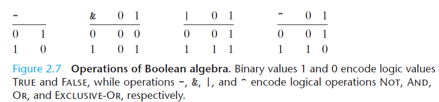

将上述4个布尔运算扩展到位向量的运算，位向量就是固定长度为w、由0和1组成的串。位向量的运算可以定义成参数的每个对应元素之间的运算。也就是说，对于两个固定长度相同的位向量，对这两个向量做布尔运算就是对其每一个对应位上的位进行布尔运算。

##### 注：异或的逆元就是自己本身：a ^ a=0，利用这个性质可以有：(a ^ b) ^ a=b。

位向量可以用来表示有限集合。可以用位向量$[a_{w-1}, a_{w-2}, … ,a_0]$来编码任何子集{0, 1, … , w-1}。而布尔运算&和|对应集合的交和并，~对应于集合的补。

### 2.1.7 C语言中的位级运算
布尔运算中所使用的符号就是C语言所使用的位级运算符号。

### 2.1.8 C语言中的逻辑运算
逻辑运算符：

<table>
	<tr>
		<th>&& -> AND</th>
		<th>|| -> OR</th>
		<th>! -> NOT</th>
	<tr>
</table>

但是它与位级运算有本质区别，逻辑运算将非零的数都看做是TRUE，而0看作FALSE。并且，如果对第一个参数求值就能确定表达式的结果，那么逻辑运算符不会对第二个参数求值。

### C语言中的移位运算
移位运算是从左到右结合的：x<<j<<k等价于(x<<j)<<k。

<table>
	<tr>
		<th>x << k</th>
		<th>x左移k位，丢弃最高的k位，在右端补k个0。</th>
	</tr>
	<tr>
		<th>x >> k</th>
		<th>逻辑右移：在左端补k个0；算术右移：在左端补k个最高有效位的值。</th>
	</tr>
</table>

实际上，几乎所有的编译器/机器组合都对有符号的数使用算术右移。对于无符号数，右移必须是逻辑的。

##### 注：C标准中位移的量实际上是计算k mod w的值，其中数据类型是w位组成的。

## 整数表示
### 整型数据类型
32位以及64位程序上C语言整型数据类型的典型取值范围：


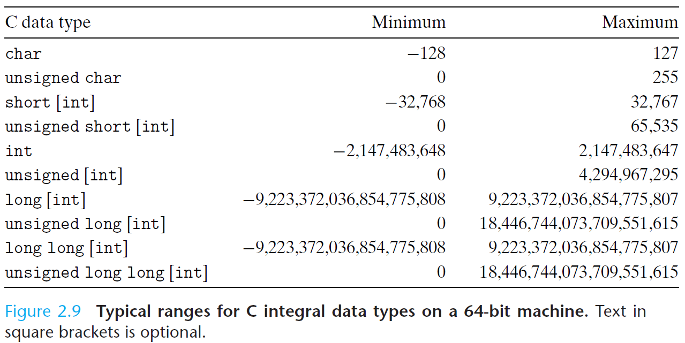

显然，负数的范围比整数的范围大1，负数与正数的范围存在不对称性。

### 无符号数的编码
假设一个整数数据类型有w位，可以将其写成位向量的形式。把它看作一个二进制表示的数，就获得了该位向量的无符号表示。用函数$B2U_w$表示（Binary to Unsigned，长度为w）：

原理：**无符号数编码的定义**：对向量$\vec{x} = [x_{w-1}, x_{w-2}, ..., x_{0}]$

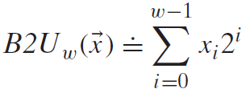

上述类等于的符号表示左边被定义为等于右边。函数B2Uw将一个长度为w的0、1串映射到非负整数：

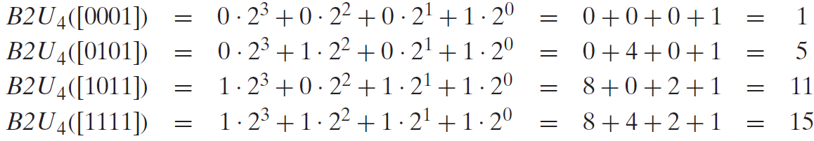

函数B2Uw能够被定义为一个映射$B2U_w: {0, 1}^w \to {0, ..., 2^w - 1}$。它的表示范围是$0 - 2^{w-1}$，并且每个在这个范围中的数都有唯一一个w位的值编码。

原理：**无符号数编码的唯一性**

函数B2Uw是一个双射。

由于一个函数存在反函数的充要条件是该函数是双射。存在B2Uw的反函数U2Bw，将0 ~ 2w-1范围内的无符号数映射为一个唯一的长度为w的位模式。

###  补码编码
最常见的有符号数的计算机表示方式是补码（two's-complement）形式。在这个定义中，将字的最高有效位解释为负权。用函数$B2T_w$表示（binary to Two's-complement，长度为w）：

原理：**补码编码的定义**：对向量$\vec{x} = [x_{w-1}, x_{w-2}, ..., x_0]$

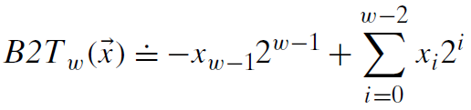

最高有效位$x_{w-1}$也称为符号位，它的“权重”为$-2^{w-1}$，是无符号表示中权重的负数。当符号位为1时，表示值为负。w位补码所能表示的最小值是[10…0]，$TMin_w=-2^{w-1}$。最大值是[01…1]，$TMax_w=2^{w-1}-1$。
函数$B2T_w$能够被定义为一个映射$B2U_w: {\lbrace 0, 1 \rbrace}^w \to \lbrace TMin_w, ...,TMax_w \rbrace$。它表示的范围是$-2^{w-1}$ ~ $2^{w-1}-1$，并且每个在这个范围中的数都有唯一一个w位的值编码。

原理：**补码编码的唯一性**

函数$B2T_w$是一个双射。

存在$B2T_w$的反函数$T2B_w$，将$TMin_w$ ~ $TMax_w$范围内的有符号数映射为一个唯一的长度为w的位模式。

注：
1. 补码的范围是不对称的。TMin没有相对应的正数。
2. 最大的无符号数值刚好比补码的最大值的两倍大1。$UMax_w=2*TMax_w+1$

### 有符号数和无符号数之间的转换
将负数转换成无符号数可能会得到0。如果转换的无符号数太大以至于超出了补码能够表示的范围，可能会得到TMax。

对于大多数C语言的实现，处理同样字长的有符号数和无符号数之间相互转换的一般规则是：数值可能会改变，但是位模式不变：

$$T2U_w(x) = B2U_w(T2B_w(x))$$

$$U2T_w(x)=B2T_w(U2B_w(x))$$

推广：$U2T_w(x)+T2U_w(x)=2^w$，当补码以及无符号表示异号时成立。

原理：**补码转换为无符号数**

对满足$TMin_w≤x≤TMax_w$的x有：

$$
	T2U_w(x) = 
	\begin{cases}
		x + 2^w, & \text{$x < 0$} \\
		x, & \text{$x \geq 0$}
	\end{cases}
$$

因此，当一个有符号数映射为它对应的无符号数时，负数就被转换成了大的正数，而非负数会保持不变。

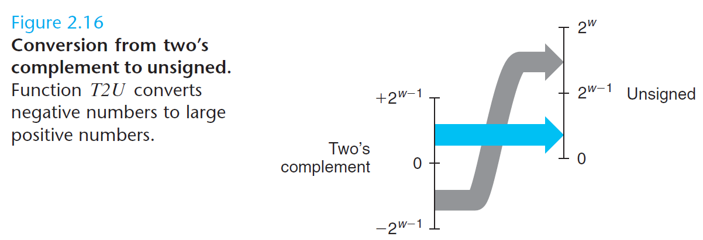

原理：**无符号数转换为补码**

对满足$0≤x≤UMax_w$的u有：

$$
	U2T_w(x) = 
	\begin{cases}
		u - 2^w, & \text{$u > TMax_w$} \\
		u, & \text{$u \leq TMax_w$}
	\end{cases}
$$

因此，当一个小的数，从无符号到有符号的转换将保留数字的值。对于大的数，数字将被转换为一个负数值。分界线为$TMax_w$。

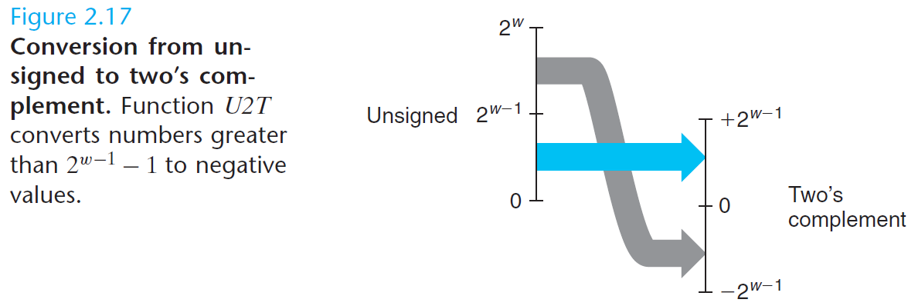

### C语言中的有符号数与无符号数
C语言支持所有整型数据类型的有符号和无符号及其运算。大多数数字都默认认为是有符号的，要创建一个无符号常量，必须加上后缀字符'U'或者'u'。

C语言允许无符号数和有符号数之间的转换，大多数的系统遵循上述的规则。当一种类型的表达式被赋值给另外一种类型的变量时，转换是隐式发生的：
```C
int tx,ty;
unsigned ux,uy;
tx=ux;            /* Cast to signed */
uy=ty;            /* Cast to unsigned */
```
用printf输出数值的时候，分别用指示符%d、%u和%x以有符号十进制、无符号十进制和十六进制格式输出一个数字。在实际输出的时候，如果对一个有符号数指定使用%u输出，那么会以无符号数的形式输出。

当执行一个运算时，如果它的一个运算数是有符号的而另一个是无符号的，那么C语言会隐式地将有符号参数强制类型转换为无符号数，并假设这两个数都是非负的，来执行这个运算。

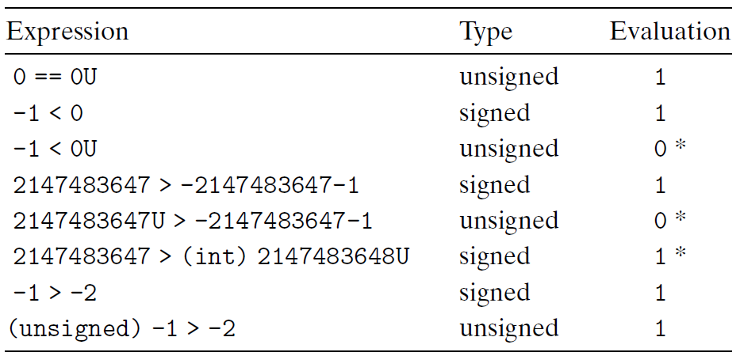

注：在C标准头文件limit.h中有下列说明：
```C
/* Minimum and maximum values a `signed int' can hold.  */
#  define INT_MIN	(-INT_MAX - 1)
#  define INT_MAX	2147483647
```
因此对于$TMin_w$要写做-2147483647-1。

### 扩展一个数字的位表示
要将一个无符号数转换为一个更大的数据类型，只需要简单地在表示的开头添加0，这种运算被称为零扩展（zero extension）。

原理：**无符号数的零扩展**

定义宽度为w的位向量$\vec{u} = [u_{w-1}, u_{w-2}, ..., u_0]$和宽度为w'的位向量$\vec{u} = [0, ..., 0, u_{w-1}, u_{w-2}, ..., u_0]$，其中w'>w。则$B2U_w(\vec{u}) = B2U_{w'}(\vec{u})$。

要将一个补码数字转换为一个更大的数据类型，可以执行一个符号扩展（sign extension）。

原理：**补码数的符号扩展**
定义宽度为w的位向量$\vec{x} = [x_{w-1}, x_{w-2}, ..., x_0]$和宽度为w'的位向量$\vec{x} = [x_{w-1}, ..., x_{w-1}, x_{w-1}, x_{w-2}, ..., x_0]$，其中w'>w。则$B2T_w(\vec{u}) = B2T_{w'}(\vec{u})$。这样扩展后最高位权重（所有扩展位和原最高位）与原最高位权重相同。

一个数据大小到另一个数据大小的转换先于无符号和有符号数字之间的转换。如short转unsigned，先改变大小，再完成从有符号到无符号的转换。

### 截断数字
截断一个数字可能会改变它的值——溢出的一种形式。

原理：**截断无符号数**

令$\vec{x} = [x_{w-1}, x_{w-2}, ..., x_0]$，而$\vec{x'} = [x_{k-1}, x_{k-2}, ..., x_0]$。令$x = B2U_w(\vec{x})$, $x' = B2U_w(\vec{x'})$。则$x' = x \space mod \space 2^k$ 。

补码截断也具有相似性，不过要将最高位转换为符号位。

原理：**截断补码数值**

令$\vec{x} = [x_{w-1}, x_{w-2}, ..., x_0]$，而$\vec{x'} = [x_{k-1}, x_{k-2}, ..., x_0]$。令$x = B2U_w(\vec{x})$, $x' = B2U_w(\vec{x'})$。则$x' = U2T_k(x \space mod \space 2^k)$ 。

### 关于有符号数与无符号数的建议
size_t是unsigned int类型，它是strlen函数的返回类型。使用它的时候注意相减的后果。无符号数相减是不会出现负数的。有可能会出现意想不到的情况。有符号数与无符号数之间的隐式转换有可能会带来意想不到的后果。

## 2.3 整数运算
### 2.3.1 无符号加法
原理：**无符号数加法**

对满足0≤x，y<2w的x和y有：


该操作是把整数和x+y截断为w位得到的结果，再把这个结果看做是一个无符号数，这也可以被视为一种形式的取模运算。正常情况下x+y的值保持不变，而溢出的情况则是该数和数减去$2^w$的结果。

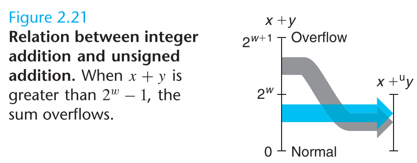

算术运算**溢出**，是指完整的整数结果不能放到数据类型的字长限制中去。当两个运算数的和为2w或者更大时，就发生了溢出。

原理：**检测无符号数加法中的溢出**

对在范围$0≤x, y≤UMax_w$中的x和y，令$s ≐ x + {^u_w}y$。则对计算s，当且仅当s<x（或者等价的s<y）时，发生了溢出。

模数加法形成了一种数学结构，称为阿贝尔群，它是可交换的和可结合的。它有一个单位元0，并且每个元素都有一个加法逆元。

原理：**无符号数求反**

对满足$0≤x<2^w$的任意x，其w位的无符号逆元$- {^u_w}x$由下式给出：

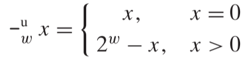

### 2.3.2 补码加法
原理：**补码加法**

对满足$-2^{w-1}≤x, y≤2^{w-1}-1$的整数x和y，有：

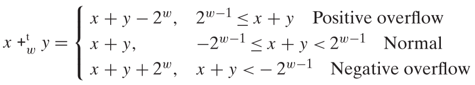

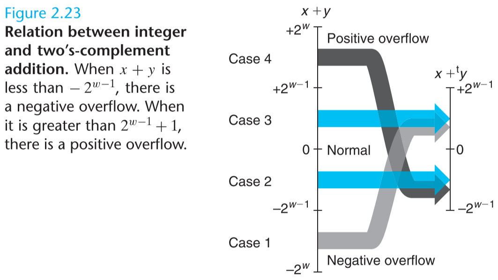

两个数的w位补码之和与无符号之和有完全相同的位级表示。实际上，大多数计算机使用同样的机器指令来执行无符号或者有符号的加法。

原理：**检测补码加法中的溢出**

对满足$TMin_w≤x, y≤TMax_w$的x和y，令$s ≐ x+ {_w^t}y$。当且仅当x>0，y>0，但s≤0时，计算发生了正溢出。当且仅当x<0，y<0，但s≥0时，计算s发生了负溢出。

##### 旁注：实际上，判断补码加法中的溢出有一个简单的方法：首先异号相加不可能发生溢出。同号相加，当得到的数的符号和加数不同的时候就发生了溢出，也可以通过二进制最高位的符号位进行判断。

### 2.3.3 补码的非
原理：**补码的非**

对满足$TMin_w≤x≤TMax_w$的x，其补码的非$-{_w^t} x$由下式给出：

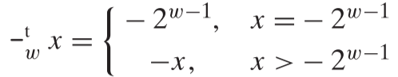

### 2.3.4 无符号乘法
原理：**无符号数乘法**

对满足$0≤x, y≤UMax_w$的x和y有：

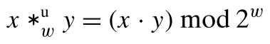

### 2.3.5 补码乘法
原理：**补码乘法**
对满足$TMin_w≤x, y≤TMax_w$的x和y有：

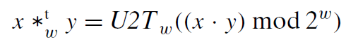

因此，对于无符号和补码乘法来说，乘法运算的位级表示都是一样的。

原理：**无符号和补码乘法的位级等价性**

给定长度为w的位向量$\vec{x}$和$\vec{y}$，用补码形式的位向量表示类定义整数x和y：$x = B2T_w(\vec{x}), y = B2T_w(\vec{y})$用无符号形式的位向量表示来定义非负整数x'和y'：$x' = B2U_w(\vec{x'}), y' = B2U_w(\vec{y'})$。则：

$$ T2B_w(x * {^t_w}y) = U2B_w(x' * {^u_w}y') $$

### 2.3.6乘以常数
在大多数的机器上，整数乘法指令比较慢，即使在Intel Core i7 Haswell上，整数乘法也需要3个时钟周期。

原理：**乘以2的幂**

设x为位模式$[x_{w-1}, x_{w-2}, …, x_0]$表示的无符号整数。那么，对于任何k≥0，我们都认为$[x_{w-1}, x_{w-2}, …, x_0, 0, …, 0]$给出了$x2^k的w+k位的无符号表示，这里右边增加了k个0。

原理：**与2的幂相乘的无符号乘法**
C变量x和k有无符号数值x和k，且0≤k＜w，则C表达式x<<k产生数值$x * {^u_w}2^k$。

原理：**与2的幂相乘的补码乘法**
C变量x和k有补码数值x和无符号数值k，且0≤k＜w，则C表达式x<<k产生数值$x * {^t_w}2^k$。

无论是无符号运算还是补码运算，乘以2的幂都有可能会导致溢出。但是即使是在溢出的时候，通过移位得到的结果都是一样的。

### 2.3.7 除以2的幂
在大多数的机器上，整数除法比整数乘法还要慢。除以2的幂也可以用移位运算来实现。无符号和不码数分别使用逻辑移位和算术移位来达到目的。

对于x≥0，y>0，得到的结果向下取整。对于x≤0，y>0，得到的结果向上取整。

原理：**除以2的幂的无符号除法**
C变量x和k有无符号数值x和k，且0≤k＜w，则C表达式x>>k产生数值⌊x/2^k⌋。

对于除以2的幂的补码运算来说，为了保证负数仍然位负，以为要执行的是算数右移。

原理：**除以2的幂的补码除法，向下舍入**
C变量x和k分别有补码值x和无符号数值k，且0≤k＜w，则当执行算术移位时，C表达式x>>k产生数值⌊x/2^k⌋。

可以通过在移位之前”偏置“这个值。

原理：**除以2的幂的补码除法，向上舍入**
C变量x和k分别有补码值x和无符号数值k，且0≤k<w，则当执行算术移位时，C表达式(x+(1<<k)-1)>>k产生数值⌊x/2^k⌋。

偏置技术利用如下的属性：⌈x/y⌉=⌊(x+y−1)/y⌋。

### 2.3.8 关于整数运算的最后思考
计算机执行的“整数”运算实际上是一种模运算形式。表示数字的有限字长限制了可能的值的取值范围，结果运算可能溢出。

## 2.4 浮点数
浮点表示对形如$V=x*2^y$的有理数进行编码。它对涉及非常大的数字、非常接近于0的数字，以及更普遍地作为实数运算的近似值的计算十分有用。

### 2.4.1 二进制小数
仅考虑有限长度的编码，小数的二进制表示法只能表示那些能够被写成$x*2^y$的数，其他值只能够被近似地表示。

### 2.4.2 IEEE浮点数表示
IEEE浮点标准用$V=(-1)^s×M×2^E$的形式来表示一个数：
- 符号（sign）：s决定这个数是负数（s=1）还是正数（s=0），而对于数值是0的符号位解释作为特殊情况处理。
- 尾数（significand）：M是一个二进制小数，它的范围是1 ~ 2-ε，或者是0 ~ 1-ε。
- 阶码（exponent）：E的作用是对浮点数加权，这个权重是2的E次幂（可能是负数）。将浮点数的位表示划分为三个字段，分别对这些值进行编码：
- 一个单独的符号位s直接编码符号s。
- k位的阶码字段$exp=e_{k-1}…e_1e_0$编码阶码E。
- n位小数字段$frac=f_{n-1}…f_1f_0$编码尾数M，但是编码出来的值也依赖于阶码字段的值是否等于0。
单精度：s=1, k=8,  n=23
双精度：s=1, k=11, n=52

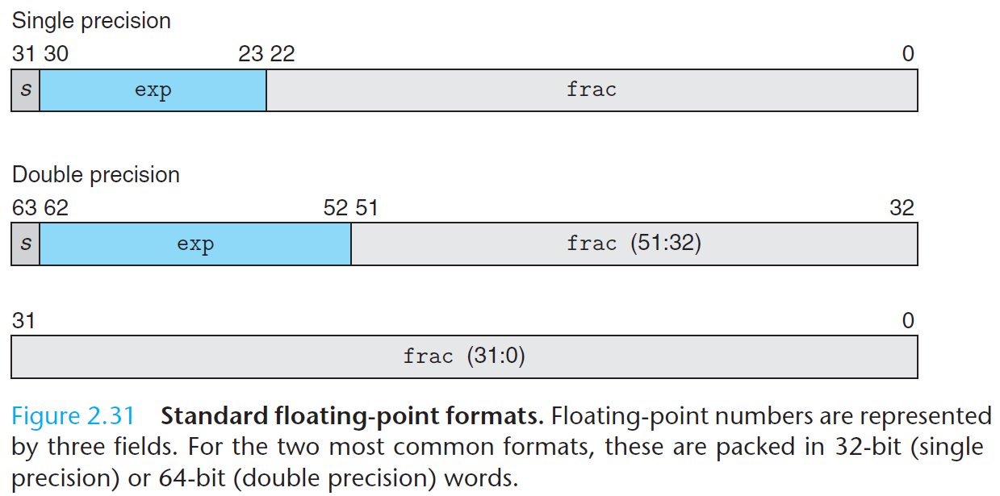

给定位表示，根据exp的值，被编码的值可以分成三种不同的情况（最后一种情况有两个变种）：

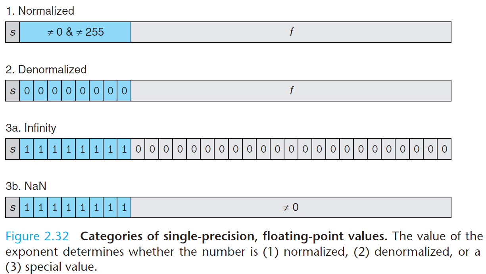

情况1：规格化的值

当exp的位模式既不全为0，也不全为1时，都属于这类情况。在这种情况中，阶码字段被解释为以偏置形式表示的有符号整数，即E=e-Bias，其中e是无符号数，其位表示为$e_{k-1}…e_1e_0$，而Bias是一个等于$2^{k-1}-1$的偏置值。因此产生指数的取值范围为：
- 单精度：-126~+127
- 双精度：-1022~+1023

小数字段frac被解释为表述小数值f，其中0≤f<1，其二进制表示为$f_{n-1}…f_1f_0$，也就是二进制小数点在最高有效位的左边。尾数定义为M=1+f。有时，这种方式也叫做隐含的以1开头的表示。

情况2：非规格化的值

当阶码域全为0时，所表示的数是非规格化形式。在这种情况下，阶码值是E=1-Bias，而尾数的值是M=f，不包含隐含的开头的1。

非规格化数有两个用途，一种是提供了表示数值0的方法：
- +0.0：所有字段都为0；
- -0.0：符号位为1，其他字段都为0。

另一种用途是表示那些非常接近于0的数。它们提供了一种属性，称为逐渐溢出，其中，可能的数值分布均匀地接近于0.0；

情况3：特殊值

当阶码全为1时出现这种情况。当小数域全为0的时候，得到的值表示无穷。当s=0时表示正无穷，当s=1时表示负无穷。无穷能够表示溢出的结果。当小数域非零时，结果值被称为"NaN"，即“不是一个数（Not a Number）”。一些运算的结果不能是实数或者无穷，就会返回这样的NaN值，比如计算√-1。表示未初始化的数据也有用处。

### 2.4.3 数字示例

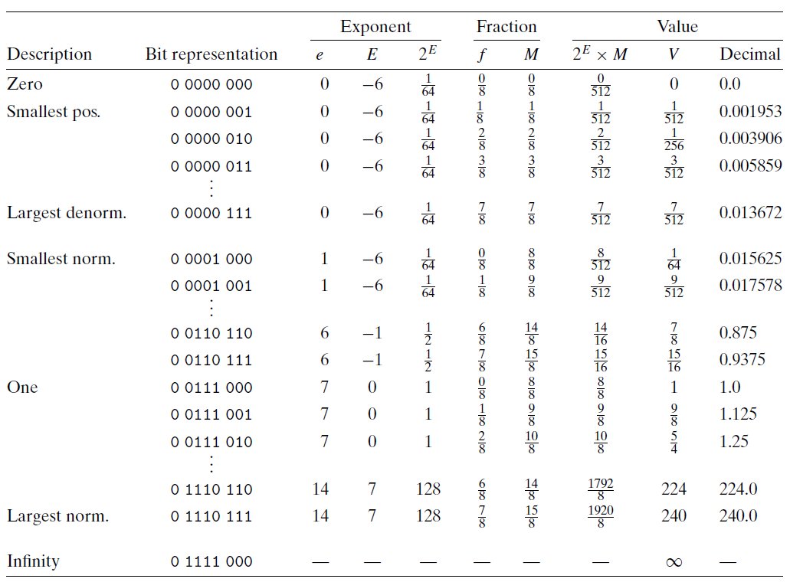

假定的8位浮点格式的示例，其中有k=4的阶码位和n=3的小数位。

可以观察到最大非规格化数和最小规格化数之间是平滑过渡的（从7/512 -> 8/512），因为非规格化数使用了1-Bias的特性。

一些重要的单精度和双精度浮点数的表示和数字值：

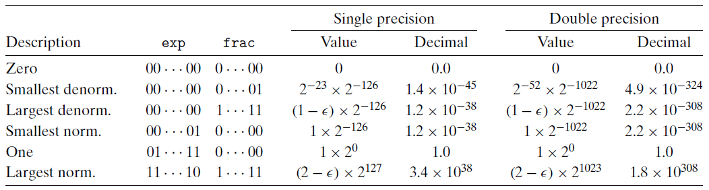

- 值+0.0总有一个全为0的位表示。
- 最小的正非规格化值：$V=2^{-n-2^{k-1}+2}$。
- 最大的正非规格化值：$V=(1-2^{-n})×2^{-2^{k-1}+2}$。
- 最小的正规格化值：$V=2^{-2^{k-1}+2}$。
- 最大的规格化值：$V=(1-2^{-n-2})×2^{2^{k-1}}$。

eg：将整数12345转化为单精度浮点数12345.0：

12345的二进制表示：[‭11000000111001‬]，左移13位有：‭1.1000000111001‬x213。单精度浮点数n=23，去掉开头的1，后面补10个零得到尾数：[10000001110010000000000]。阶码值e= E+Bias=13+28-1=13+127=140，二进制表示为[‭10001100‬]，再加上符号位0，于是12345.0的单精度浮点数的二进制表示为：[11000110010000001110010000000000‬]。

### 2.4.4 舍入
因为表示方法限制了浮点数的范围和精度，所以浮点运算只能近似地表示实数运算。因此，对于值x，我们希望能够使用一种系统的方法来找到“最接近的“匹配值x'。IEEE浮点格式定义了四种不同的舍入方式。默认的方法是找到最接近的匹配，其他三种可用于计算上界和下界。

向偶数舍入：向最接近的值舍入，中间值向偶数舍入。

向零舍入：负数向上舍入，正数向下舍入。

向偶数舍入是默认的方式，这种方式可以在大多数现实的情况中避免了统计偏差（向上舍入偏高，向下舍入偏低）。

### 2.4.5 浮点运算
实数上的加法也形成了阿贝尔群。但是实数上的运算是可交换而不可结合的。如(3.14+1e10)-1e10与3.14+(1e10-1e10)所得到的值是不同的。对于任何的x有：$NaN+{^f}x=NaN$。大多数的值在浮点加法下有逆元，除了NaN以及无穷。

另一方面，浮点加法满足了单调性。如果a≥b，那么对于然和的a、b以及x的值，除了NaN都有x+a≥x+b。无符号数和补码加法都不具有这个属性。

浮点乘法运算是封闭的，并且使可交换的，它的乘法单位元是1。相似的，由于可能会发生溢出，或者由于舍入而失去精度，它不具有结合性。另外，浮点乘法在加法上不具有分配性。

另一方面，对于任何的a、b和c，并且a、b和c都不等于NaN，浮点乘法满足下列单调性：

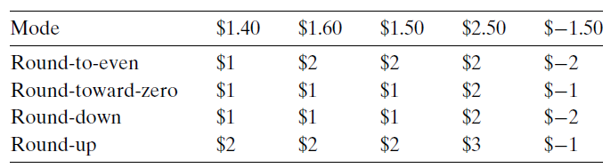

此外，只要a≠NaN，就有$a*{^f}a≥0$。

### 2.4.6 C语言中的浮点数
所有的C语言版本提供了两种不同的浮点数据类型：float和double，对应于单精度和双精度浮点，使用向偶数舍入的舍入方式。

当在int、float和double格式之间进行强制类型转换时，程序改变数值和位模式的原则如下（32位）：
- 从int转换为float，数字不会溢出，但是可能被舍入。
- 从int或float转换为double，由于double有更大的范围和更高的精度，因此能够保留精确的数值。
- 从double转换为float，可能溢出，还可能被舍入。
- 从float或者double转换为int，值会向0舍入。值也可能会溢出，但是C语言标准没有对这种情况制定固定的结果。与Intel兼容的微处理器指定[100…00]（字长为w时的TMinw）为整数不确定值。一个从浮点数到整数的转换，如果不能为该浮点数找到一个合理的整数近似值，就会产生这样一个值。
