# 计算机系统漫游

分析下面这个最经典的例程在系统上是如何运行的：
```C
#include <stdio.h>

int main()
{
	printf("Hello, world\n");
	return 0;
}
```

## 1.1 信息就是位+上下文
上述hello的程序的生命周期的开始是从一个源程序开始的，就是通过编辑器编辑后得到的文本文件（假设上述程序保存在hello.c中）。该文本文件实际上就是由0和1组成的位的序列，每8个位一个字节。ASCII码使用一个字节来表示文本字符，也就是使用单字节大小的整型来表示每个字符。

hello.c这样只由ASCII字符组成的文件称为文本文件，所有其他文件称为二进制文件。

系统中的所有信息都是由一串比特表示的，区分不同数据的唯一方法就是读到这些数据对象时的上下文。

## 1.2 程序被其他程序翻译成不同的格式
编写上述hello程序的是高级C语言，为了在系统上运行hello.c程序，每条C语句必须被其他程序转化为一系列的低级机器语言指令。这些指令按照可执行目标程序的格式打包，并以二进制磁盘文件的形式存放起来。目标程序就是可执行目标文件。

在Unix系统上，从源文件到目标文件的转化是由编译器驱动程序完成的：
```bash
linux> gcc -o hello hello.c
```
这个翻译过程分四个阶段完成，执行这四个阶段的程序（预处理器、编译器、汇编器和链接器）构成了编译系统：

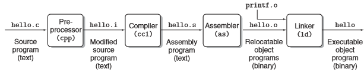

- 预处理阶段。预处理器根据#开头的命令读取系统头文件的内容，并直接把它插入到程序文本中，得到修改了的源程序hello.i。
- 编译阶段。编译器将文本文件hello.i翻译成文本文件hello.s，里面包含有汇编语言程序。不同高级语言的不同编译器所得到的汇编语言都是相同的。
- 汇编阶段。汇编器将hello.s翻译成机器语言指令并打包成可重定位目标程序的格式，保存在目标文件hello.o中，它是一个二进制文件，包含的是函数main的指令编码。
- 链接阶段。由于hello程序调用了printf函数，它是标准C库中的函数，printf函数存在于一个printf.o单独的预编译好的目标文件中。链接器负责处理上述文件的合并，得到hello文件，一个可执行目标文件（可执行文件），可以被加载到内存中，由系统执行。

## 编译系统如何工作
- 优化程序性能。编译器如何将不同的C语言结构翻译成汇编语言，如何优化程序代码以提高性能，存储器系统的层次结构特性。
- 理解链接时出现的错误。静态变量和全局变量，静态库和动态库。
- 避免安全漏洞。

## 处理器读并解释存储在内存中的指令
在Unix系统上运行hello可执行文件：
```bash
linux> ./hello
Hello, world
linux>
```

### 系统的硬件组成

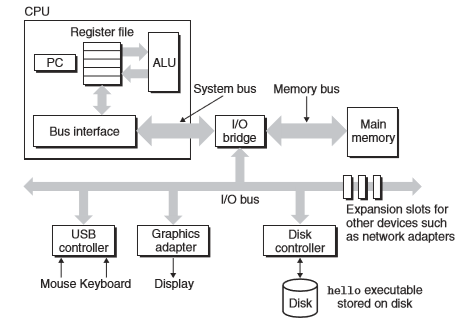

1. 总线（bus）
	贯穿整个系统的电子管道，携带信息字节并负责在各个部件间传递。总线被设计成传送定长的字节块：字，是系统的一个基本参数（先进一般为4字节或者8字节）。
2. I/O设备（I/O Devices）
	系统与外部世界的联系通道。每个I/O设备都通过一个控制器或适配器与I/O总线相连。控制器和适配器的主要区别在于它们的封装方式。控制器是I/O设备本身或者系统主印制电路板（主板）上的芯片组，而适配器是一块插在主板插槽上的卡。
3. 主存（Main Memory）
	临时存储设备，用来存放程序和程序处理的数据。从物理上来说，主存是由一组动态随机存取存储器(DRAM)芯片组成的。从逻辑上来说，存储器是一个线性的字节数组，每个字节都有其唯一的地址（数组索引），这些地址从零开始。与C程序变量相对应的数据项的大小是根据类型变化的。
4. 处理器（Processor）
	中央处理单元（CPU），是解释（或执行）存储在主存中指令的引擎。处理器的核心是一个大小为一个字的存储设备（或寄存器），称为程序计数器（PC）。在任何时刻，PC都指向主存中的某条机器语言指令（含有该条指令的地址）。处理器从PC指向的内存处赌出指令，解释指令中的位，执行该指令指示的简单操作，然后更新PC，使其指向下一条指令。简单操作围绕着主存、寄存器文件（Register File）和算术逻辑单元（ALU）进行。寄存器文件是一个小的存储设备，由一些单个字长的寄存器组成，每个寄存器有唯一的名字。ALU计算新的数据和地址值。CPU在指令的要求下可能会执行这些操作：
	- 加载：从主存复制一个字节或一个字到寄存器，覆盖寄存器原来的内容。
	- 存储：从寄存器复制一个字节或者一个字到主存的某个位置，覆盖主存原来的内容。
	- 操作：把两个寄存器的内容复制到ALU，对这两个字做算术运算，并将结果存放到一个寄存器中，以覆盖该寄存器中原来的内容。
	- 跳转：从指令本身中抽取一个字，并将这个字复制到PC中， 以覆盖PC中原来的值。

### 运行hello程序
1. 在键盘上输入字符串"./hello"后，shell程序将字符逐一读入寄存器，再存放到主存中：
	
	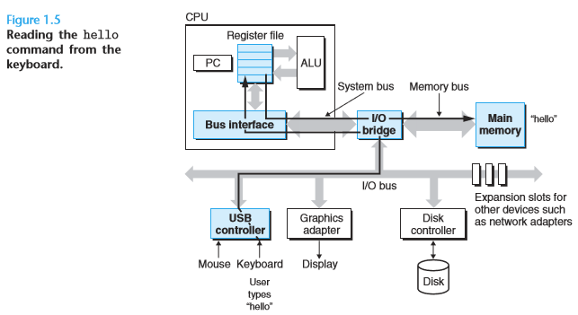

2. 结束命令输入后，shell执行一系列指令加载hello文件，将hello目标文件中的代码和数据从磁盘复制到主存，包括最终被输出的字符串"Hello, world\n"。

	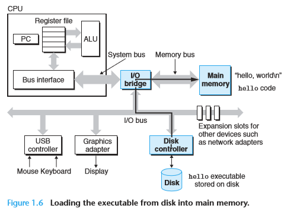
	
3. 当目标文件hello中的代码和数据被加载到主存后，处理器开始执行hello程序main程序中的机器语言指令，将"Hello, world\n"字符串中的字节从主存复制到寄存器文件，再从寄存器文件中复制到显示设备，最终显示在屏幕上。

	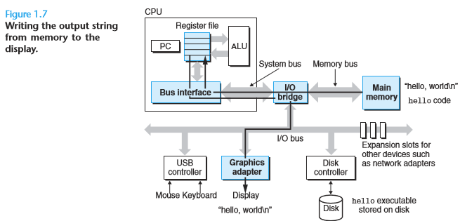
	
## 高速缓存至关重要
较大的存储设备比较小的存储设备运行的慢。处理器从寄存器文件中读取数据比从主存中读取要快得多，而从主存上读取数据比从磁盘存储器中读取数据也要快得多。而在程序当中，涉及到十分多的不同存储器之间的读取操作。

针对这种处理器和主存之间的差异，系统设计者采用了一种更小更快的存储设备：高速缓存存储器（cache memory），也就是高速缓存。

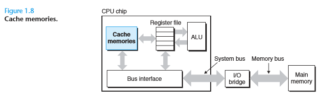

L1高速缓存位于处理器上，访问速度和寄存器文件相当。L2高速缓存通过特殊的总线连接到处理器，访问速度也比主存快。L2比L1容量要大一些。高速缓存采用静态随机访问存储器（SRAM）实现。

## 存储设备形成层次结构
每个计算机系统中的存储设备都被组织成一个存储器层次结构。在这个层次结构中，从上至下，设备的访问速度越来越慢、容量越来越大。

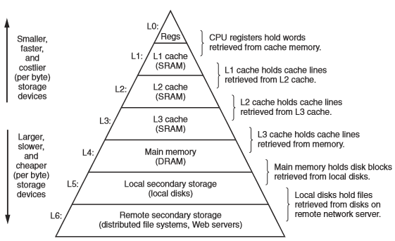


## 操作系统管理硬件
操作系统是应用程序和硬件之间的一层软件，所有应用程序对硬件的操作尝试都必须通过操作系统。

操作系统有两个基本功能：
1. 防止硬件被失控的应用程序滥用；
2. 向应用程序提供简单一致的机制来控制复杂而又通常大不相同的低级硬件设备。

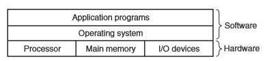

操作系统通过进程、虚拟内存和文件这三个基本的抽象概念来实现这两个功能。

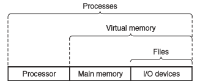

### 进程
进程是操作系统对一个正在运行的程序的一种抽象。在一个系统上可以同时运行多个进程，而每个进程好像都在独占地使用硬件。并发运行是一个进程的指令和另一个进程的指令交错执行。无论是在单核系统还是多核系统中，一个CPU并发地执行多个进程，是通过处理器在进程间切换来实现的。操作系统实现这种交错执行的机制称为上下文切换。

操作系统保持跟踪进程运行所需的所有状态信息。这种状态就是上下文。在任何一个时刻，单处理器系统都只能执行一个进程的代码，当操作系统决定要把控制权从当前进程转移到某个新进程时，就会进行上下文切换：保存当前进程的上下文，恢复新进程的上下文，然后将控制权传递给新进程，从上次停止的地方开始。

从一个进程到另一个进程的转换是由操作系统内核（kernel）管理的。内核是操作系统代码常驻主存的部分。当应用程序需要操作系统的某些操作时，它就执行一条特殊的系统调用指令，将控制权递给内核，然后内核执行被请求的操作并返回应用程序。内核是系统管理全部进程所用代码和数据的集合。

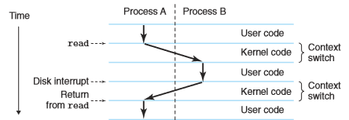

### 线程
一个进程可以由多个线程组成，每个线程都运行在进程的上下文当中，共享同样的代码和全局数据。

### 虚拟内存
虚拟内存为每个进程提供了一个假象，每个进程都在独占地使用主存。每个进程看到的内存都是一致的，称为虚拟地址空间。在Linux中，地址空间最上面的区域是保留给操作系统中的代码和数据的，而底部区域存放用户进程定义的代码和数据：进程的虚拟地址空间：

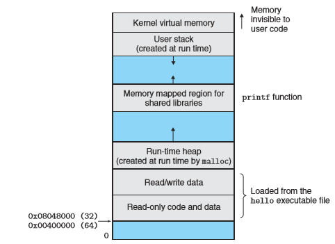

- 程序代码和数据。对所有的进程来说，代码是从同一固定地址开始，紧接着的是和C全局变量相对应的数据位置。代码数据区是直接按照可执行目标文件的内容初始化的。
- 堆。当调用像malloc和free这样的C标准函数时，堆可以在运行时动态地扩展和收缩。
- 共享库。用来存放C标准库和数学库这类共享库的代码和数据的区域。
- 栈。位于用户虚拟地址空间的顶部，编译器用来实现函数的调用。用户栈在程序执行期间可以动态地扩展和收缩。当调用一个函数时，栈会增长；从一个函数返回时，栈会收缩。
- 内核虚拟内存。

基本思想：把一个进程虚拟内存的内容存储在磁盘上，然后用主存作为硬盘的高速缓存。

### 文件
文件就是字节序列。每个I/O设备，包括磁盘、键盘、显示器甚至网络都可以看成文件。

## 系统之间利用网络通信
网络可以视为一个I/O设备。

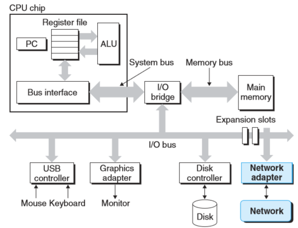

客户端和服务器利用telnet进行交互：

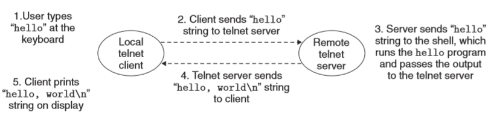

## 重要主题

### Amdahl定律
当对系统某个部分加速时，其对系统整体性能的影响取决于该部分的重要性和加速程度：

若某系统执行某应用程序需要时间为T_old 。假设系统某部分所需执行时间与该时间的比例是α，而该部分性能提升比例为k。则总的执行时间应为：

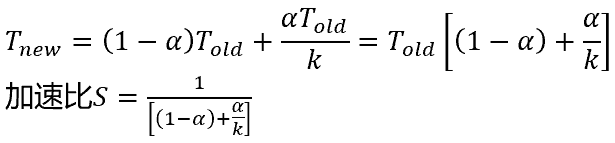

主要观点：要想显著的加速整个系统，必须提升全系统中相当大的部分的速度。

### 并发和并行
1. 线程级并发

	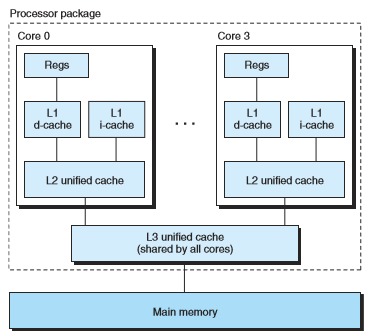

	多处理器系统：构建一个由单操作系统内核控制的多处理器组成的系统。多核处理器是将多个CPU集成到一个集成电路芯片上：
	
	超线程（同时多线程）：允许一个CPU执行多个控制流。

2. 指令级并行

	处理器可以同时执行多条指令的属性。->流水线的使用。在流水线中，将执行一条指令所需要的活动划分成不同的步骤，将处理器的硬件组织成一系列的阶段，每个阶段执行一个步骤。

	处理器可以达到比一个周期一条指令更快的执行速率：超标量处理器。

3. 单指令、多数据并行

	允许一条指令产生多个可以并行执行的操作：SIMD并行。

### 计算机系统中抽象的重要性
指令集架构提供了对实际处理器硬件的抽象。
进程、虚拟内存和文件对于操作系统的抽象：

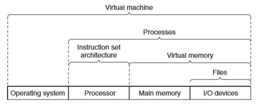