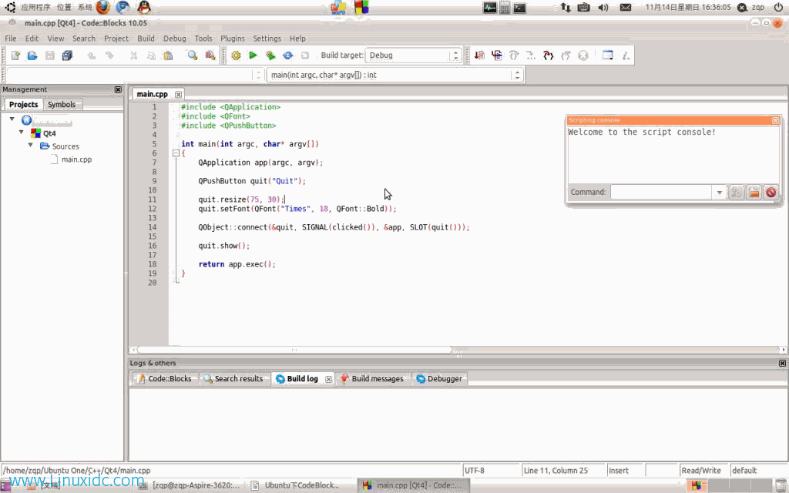

# Ubuntu下codeblock运行环境设置

## 安装过程：
1. 安装基本编译环境
    ```bash
    sudo apt-get install build-essential
    sudo apt-get install gdb
    ```

2. 安装codeblock
    ```bash
    sudo apt-get install codeblocks
    sudo apt-get install codeblocks-dbg
    sudo apt-get install wxformbuilder
    ```
    还有个codeblocks-contrib其实安装的是wxSmith，我还是喜欢wxfb，所以就没有安装。

3. 安装wxWidgets
    ```bash
    sudo apt-get install libwxbase2.8
    sudo apt-get install libwxbase2.8-dev
    sudo apt-get install libwxgtk2.8-0
    sudo apt-get install libwxgtk2.8-dev
    sudo apt-get install libwxgtk2.8-dbg
    sudo apt-get install wx-common
    sudo apt-get install wx2.8-headers
    sudo apt-get install wx2.8-i18n
    ```
    还有wx2.8-examples和wx2.8-doc想看文档的可以装上

## CodeBlocks的配置
这里笔者先以Qt4的开发配置为例，Qt是一个跨平台的C++应用程序框架，具有少编程、多创造、尽使用的特点，个人感觉功能比较强大，API使用比MFC简单，对Linux编程感兴趣的不妨试试（当然Linux下编程选择还是比较广泛的，OpenGL、wxWidgets、GTK等）。Qt4的安装过程如下：
```bash
sudo apt-get install libqt4-dev libqt4-debug libqt4-gui libqt4-sql
qt4-dev-tools qt4-doc qt4-designer qt4-qtconfig
```
启动CodeBlock，接下来，新建一个Qt4的工程（这里不作演示），如下：



当然，如果不作任何配置，此工程编译当然是通不过（找不到头文件等，有兴趣可以自己试试），下面进行全局的编译、链接环境配置，Settings->Compile and Debugger settings，在Search directories选项夹Compile子选项夹里添加路径/usr/include，这样程序编译的时候就可以遍历搜索该文件夹，一般情况下头文件都在这个文件夹下（Qt4也不例外），同理，Linker里添加/usr/lib。这时编译运行该工程便会通过，出现Demo程序的运行结果（一个只包含“Quit”按钮的窗口）。
