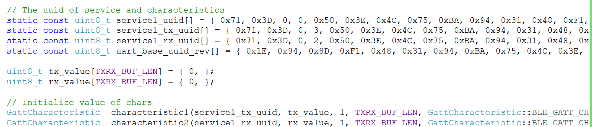

# 微信小程序 蓝牙连接流程

## 蓝牙4.0 BLE
1. profile

    profile可以理解为一种规范，一个标准的通信协议，它存在于从机中。蓝牙组织规定了一些标准的profile，例如 HID OVER GATT ，防丢器 ，心率计等。每个profile中会包含多个service，每个service代表从机的一种能力。

2. service

    ervice可以理解为一个服务，在ble从机中，通过有多个服务，例如电量信息服务、系统信息服务等，每个service中又包含多个characteristic特征值。每个具体的characteristic特征值才是ble通信的主题。比如当前的电量是80%，所以会通过电量的characteristic特征值存在从机的profile里，这样主机就可以通过这个characteristic来读取80%这个数据。

3. characteristic

    characteristic特征值，ble主从机的通信均是通过characteristic来实现，可以理解为一个标签，通过这个标签可以获取或者写入想要的内容。

4. UUID

    UUID，统一识别码，我们刚才提到的service和characteristic，都需要一个唯一的uuid来标识。

整理一下，每个从机都会有一个叫做profile的东西存在，不管是上面的自定义的simpleprofile，还是标准的防丢器profile，他们都是由一些列service组成，然后每个service又包含了多个characteristic，主机和从机之间的通信，均是通过characteristic来实现。

## 读写操作的概述
在烧写nRF51822的程序中定义：



在调试过程中从相应的service ID中获取相应的信息：write - 可写的characteristic，read - 可读的characteristic。


## 初始化蓝牙适配器

### wx.openBluetoothAdapter()
初始化小程序蓝牙模块，生效周期为调用wx.openBluetoothAdapter至调用wx.closeBluetoothAdapter或小程序被销毁为止。 在小程序蓝牙适配器模块生效期间，开发者可以正常调用下面的小程序API，并会收到蓝牙模块相关的on回调。
在调用openBluetoothAdapter后，可以随时使用wx.onBluetoothAdapterStateChange()来监听关于蓝牙适配器状态变化相关的时间，监视相关的状态，如适配器是否可用、是否在搜索等：
```Javascript
wx.onBluetoothAdapterStateChange(function (res) {
                    that.setData({
                        sousuo: res.discovering ? "在搜索。" : "未搜索。",
                        status: res.available ? "可用。" : "不可用。",
                    })
                })
```

## 获取本机蓝牙适配器状态

### wx.getBluetoothAdapterState()

## 搜索周边设备

### wx.startBluetoothDevicesDiscovery()
开始搜寻附近的蓝牙外围设备。注意，该操作比较耗费系统资源，请在搜索并连接到设备后调用 stop 方法停止搜索。

## 获取设备后在列表中连接

### wx.getBluetoothDevices()
获取在小程序蓝牙模块生效期间所有已发现的蓝牙设备，包括已经和本机处于连接状态的设备。

### wx.getConnectedBluetoothDevices()
根据 uuid 获取处于已连接状态的设备。

## 连接设备

### wx.createBLEConnection()
连接低功耗蓝牙设备。
```Javascript
wx.createBLEConnection({
            deviceId: e.currentTarget.id,
            success: function (res) {
                console.log(res.errMsg);
                that.setData({
                    connectedDeviceId: e.currentTarget.id,
                    msg: "已连接" + e.currentTarget.id,
                    msg1: "",
                })
            },
            fail: function () {
                console.log("调用失败");
            },
            complete: function () {
                console.log("调用结束");
            }

        })
```

## 停止搜索设备

### wx.stopBluetoothDevicesDiscovery()
停止搜寻附近的蓝牙外围设备。若已经找到需要的蓝牙设备并不需要继续搜索时，建议调用该接口停止蓝牙搜索。

## 断开连接

### wx.closeBLEConnection()
断开与低功耗蓝牙设备的连接。
